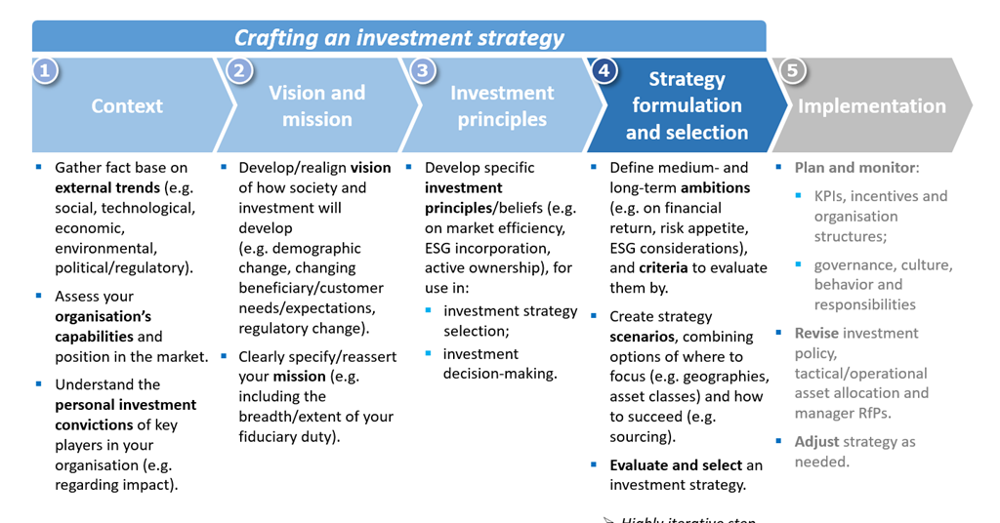

## Table of Contents

## What is an investment selection strategy?

An investment selection strategy is a plan that helps people decide which investments to choose. It's like a roadmap for picking stocks, bonds, or other types of investments. The goal is to make choices that will grow your money over time while managing risks. People use different strategies based on their goals, how much risk they can handle, and how long they plan to invest.

There are many types of investment selection strategies. Some people might focus on buying stocks that they think will grow a lot in the future. Others might choose to invest in a mix of stocks and bonds to balance risk and reward. Some strategies involve looking at past performance and trends, while others might focus on the overall economy or specific industries. The key is to find a strategy that fits your personal financial goals and comfort with risk.

## Why is it important to have an investment selection strategy?

Having an investment selection strategy is important because it helps you make smart choices with your money. Without a strategy, you might pick investments randomly, which can be risky and might not help you reach your financial goals. A good strategy guides you to choose investments that match what you want to achieve, whether it's saving for retirement, buying a house, or just growing your wealth. It also helps you understand how much risk you're comfortable with, so you can sleep better at night knowing your money is in the right places.

Another reason a strategy is crucial is that it keeps you disciplined. Investing can be emotional, especially when the market goes up and down. A strategy helps you stick to your plan and not make hasty decisions based on fear or excitement. Over time, this discipline can lead to better results because you're not chasing quick wins or panicking during downturns. Instead, you're following a thoughtful approach that's designed to work for you in the long run.

## What are the basic types of investment selection strategies for beginners?

For beginners, there are a few basic types of investment selection strategies that can help them start investing. One common strategy is called "dollar-cost averaging." This means you invest a fixed amount of money at regular times, like every month. This helps you buy more shares when prices are low and fewer when prices are high, which can reduce the risk of investing all your money at the wrong time. Another strategy is "buy and hold," where you pick good investments and keep them for a long time, even if the market goes up and down. This can be a good way to grow your money over many years.

Another simple strategy for beginners is "diversification." This means spreading your money across different types of investments, like stocks, bonds, and maybe even real estate. By not putting all your eggs in one basket, you can lower your risk because if one investment does badly, others might do well. Lastly, there's the "index fund investing" strategy. This involves buying funds that track a broad market index, like the S&P 500. It's a way to own a little bit of many companies, which can be less risky than [picking](/wiki/asset-class-picking) individual stocks and can still give you good returns over time.

## How do risk tolerance and investment goals influence strategy selection?

Risk tolerance and investment goals are very important when picking an investment strategy. Risk tolerance is about how much you can handle if your investments go down in value. If you don't like risk, you might choose safer investments like bonds or index funds. But if you're okay with more risk, you might pick stocks that could grow a lot but also might lose value. Your investment goals also matter a lot. If you want to buy a house in a few years, you might pick a strategy that's safer and more predictable. But if you're saving for retirement that's many years away, you might go for investments that could grow more over time, even if they're riskier.

Both risk tolerance and investment goals help you decide which strategy will work best for you. For example, if you're young and saving for retirement, you might be okay with taking more risk because you have time to recover from any losses. You might choose a strategy that focuses on growth, like investing in stocks or stock funds. But if you're older and closer to needing your money, you might want to protect what you have and choose a strategy that's more about keeping your money safe, like investing in bonds or a mix of stocks and bonds. By thinking about your risk tolerance and goals, you can pick a strategy that fits your needs and helps you feel more confident about your investments.

## What are the key differences between active and passive investment strategies?

Active and passive investment strategies are two different ways to manage your investments. An active strategy means you or a professional manager are always looking for the best investments. You might buy and sell stocks often, trying to beat the market by picking winners. This can be exciting but also risky and might cost more because of fees for buying and selling or paying a manager. People who like to be hands-on with their investments and think they can do better than the market often choose active strategies.

On the other hand, a passive strategy is more about setting it and forgetting it. Instead of trying to beat the market, you aim to match it. You might invest in index funds or ETFs that track a broad market like the S&P 500. This usually means less buying and selling, which can save you money on fees. Passive strategies are often easier to manage and can be less stressful because you're not trying to outsmart the market. People who prefer a simpler, lower-cost approach to investing often go with passive strategies.

## How can diversification be incorporated into an investment selection strategy?

Diversification is a way to spread your money across different kinds of investments so you're not putting all your eggs in one basket. You can do this by picking a mix of stocks, bonds, and maybe even real estate or commodities. If you're investing in stocks, you might choose some from different industries, like technology, healthcare, and energy. This way, if one industry has a bad year, your other investments might still do well. You can also diversify by investing in different countries, which can help protect your money if the economy in one country isn't doing well.

To incorporate diversification into your investment selection strategy, start by thinking about your goals and how much risk you're okay with. If you want to keep things simple, you might choose a few mutual funds or ETFs that already have a mix of different investments. For example, you could pick a stock fund, a bond fund, and an international fund. This can help you get diversified without having to pick a lot of individual stocks and bonds. Over time, as you learn more about investing, you might decide to add more types of investments to your mix, but the key is to always keep your portfolio spread out to lower your risk.

## What role does market analysis play in advanced investment selection strategies?

Market analysis is a big part of advanced investment selection strategies. It's like doing homework on the market to make smarter choices about where to put your money. People who use advanced strategies look at things like how the economy is doing, what's happening in different industries, and even what other investors are thinking. They might use charts and numbers to spot trends or patterns that could help them pick investments that will do well. This kind of analysis can help them find opportunities that others might miss and make decisions based on more than just a gut feeling.

For example, someone using market analysis might look at how a company's stock price has been moving and compare it to what's happening in the whole market. They might also read reports about the company's earnings and future plans. By putting all this information together, they can decide if the stock is a good buy or if they should look elsewhere. Advanced investors often use this detailed analysis to adjust their strategies, maybe buying more of something that looks promising or selling something that doesn't seem to be doing well. This can help them stay ahead of the game and make the most of their investments.

## How can one evaluate the performance of different investment selection strategies?

Evaluating the performance of different investment selection strategies is important to see if they are helping you reach your financial goals. One way to do this is by looking at the returns, or how much money you've made or lost. You can compare the returns of your investments to a benchmark, like the S&P 500, to see if your strategy is doing better or worse than the market. It's also good to check the risk-adjusted returns, which show how much return you're getting for the amount of risk you're taking. If one strategy gives you higher returns but also higher risk, you need to decide if that's worth it for you.

Another thing to consider is how well your strategy fits with your goals and how comfortable you feel with it. If you're always worried about your investments, maybe your strategy is too risky for you. On the other hand, if you're not seeing the growth you want, maybe you need to take on a bit more risk. It's also helpful to look at the costs of your strategy, like fees for buying and selling or paying a manager. Lower costs can mean more money in your pocket over time. By looking at all these things—returns, risk, how it fits your goals, and costs—you can figure out if your investment selection strategy is working well or if you need to make some changes.

## What are some common pitfalls to avoid when selecting investments?

One common pitfall to avoid when selecting investments is letting emotions guide your decisions. It's easy to get excited about a hot stock or scared when the market drops, but making choices based on feelings can lead to buying high and selling low, which is the opposite of what you want. Instead, stick to your investment strategy and don't let short-term ups and downs make you change your plans. Another mistake is not diversifying enough. If you put all your money into one stock or one type of investment, you're taking a big risk. If that investment does badly, you could lose a lot. Spreading your money across different kinds of investments can help protect you from big losses.

Another pitfall is ignoring fees and costs. Every time you buy or sell an investment, there might be fees, and if you're using a professional manager, they'll charge you too. These costs can add up and eat into your returns over time. It's important to look at the fees and try to keep them as low as possible. Lastly, not doing enough research is a big mistake. You need to understand what you're investing in and why. Just because someone else says an investment is good doesn't mean it's right for you. Take the time to learn about the companies or funds you're thinking about investing in, and make sure they fit with your goals and how much risk you're okay with.

## How do macroeconomic factors affect investment selection strategies?

Macroeconomic factors are big things like the economy, interest rates, and inflation that can change how you pick your investments. When the economy is doing well, you might feel more confident and choose to invest in stocks because they could grow a lot. But if the economy is struggling, you might want to be safer and pick bonds or other investments that are less risky. Interest rates are also important. When they go up, borrowing money costs more, which can slow down the economy and affect how well companies do. This might make you think twice about investing in stocks and look at other options.

Inflation is another big [factor](/wiki/factor-investing). If prices are going up a lot, the money you have might not buy as much in the future. You might want to pick investments that can grow faster than inflation, like stocks or real estate. But if inflation is low, you might feel okay with safer investments like bonds. All these macroeconomic factors can make you change your investment strategy to fit what's happening in the world around you. By keeping an eye on them, you can make smarter choices and try to protect your money while still growing it over time.

## What advanced tools and techniques can be used to enhance investment selection?

Advanced tools and techniques can really help you pick better investments. One tool is technical analysis, which looks at charts and patterns to see where a stock's price might go next. People using this might look for things like moving averages or support and resistance levels to decide when to buy or sell. Another tool is [fundamental analysis](/wiki/fundamental-analysis), which digs into a company's financial health by looking at its earnings, debts, and how it's growing. This can help you figure out if a company is a good investment based on its numbers. There are also computer programs and algorithms that can analyze a lot of data quickly, helping you spot trends or opportunities that you might miss otherwise.

Another technique is using quantitative models, which use math to help pick investments. These models can look at a lot of different factors, like how a stock has done in the past or what's happening in the economy, to predict how it might do in the future. Some investors also use risk management tools, like stop-loss orders, which automatically sell a stock if it drops to a certain price. This can help limit your losses if an investment doesn't go as planned. By using these advanced tools and techniques, you can make more informed decisions and hopefully do better with your investments.

## How can one adapt investment selection strategies to changing market conditions?

Adapting your investment selection strategy to changing market conditions is important to keep your money safe and growing. One way to do this is by staying informed about what's happening in the economy and the world. If you hear that interest rates are going up, you might want to move some of your money from stocks to bonds because stocks might not do as well when borrowing costs are higher. Or if there's a lot of uncertainty, like during a big election or a global crisis, you might want to put more money into safer investments like cash or gold until things calm down. By keeping an eye on the news and understanding how it might affect your investments, you can make changes to your strategy that help you stay on track.

Another way to adapt is by regularly checking and adjusting your portfolio. This means looking at how your investments are doing and making sure they still fit with your goals and how much risk you're okay with. If one type of investment is doing really well, you might want to sell some of it and buy other things to keep your money spread out. This is called rebalancing, and it can help you stay diversified and manage risk. Also, as you get closer to needing your money, like for retirement, you might want to move more of it into safer investments. By being flexible and willing to make changes, you can keep your investment strategy working well no matter what the market is doing.

## References & Further Reading

[1]: Bergstra, J., Bardenet, R., Bengio, Y., & Kégl, B. (2011). ["Algorithms for Hyper-Parameter Optimization."](https://dl.acm.org/doi/10.5555/2986459.2986743) Advances in Neural Information Processing Systems 24.

[2]: ["Advances in Financial Machine Learning"](https://www.amazon.com/Advances-Financial-Machine-Learning-Marcos/dp/1119482089) by Marcos Lopez de Prado

[3]: ["Evidence-Based Technical Analysis: Applying the Scientific Method and Statistical Inference to Trading Signals"](https://www.amazon.com/Evidence-Based-Technical-Analysis-Scientific-Statistical/dp/0470008741) by David Aronson

[4]: ["Machine Learning for Algorithmic Trading"](https://github.com/stefan-jansen/machine-learning-for-trading) by Stefan Jansen

[5]: ["Quantitative Trading: How to Build Your Own Algorithmic Trading Business"](https://github.com/LucindaYa/quant-resources/blob/master/Quantitative%20Trading%20How%20to%20Build%20Your%20Own%20Algorithmic%20Trading%20Business.pdf) by Ernest P. Chan