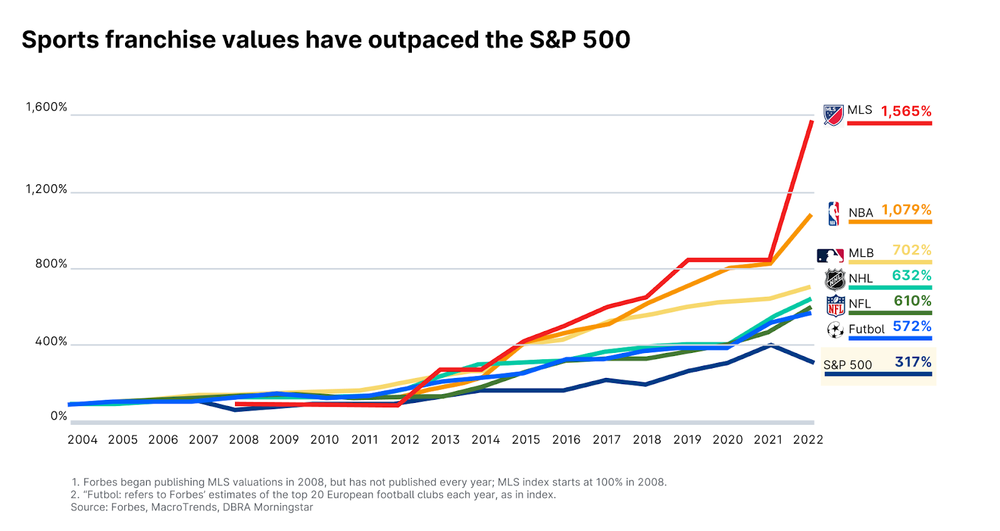

## Table of Contents

## What are the basic types of investments one can make in sports teams and organizations?

Investing in sports teams and organizations can be an exciting opportunity. There are a few basic ways to do this. One way is to buy shares in a publicly traded sports team or company. Some professional sports teams are part of larger companies that are listed on stock exchanges. By buying shares, you become a part-owner of the team or organization. Another way is to invest directly in a sports team or league as a private investor. This usually involves buying a stake in the team or becoming a limited partner. It can be more expensive and exclusive, but it gives you a closer connection to the team.

Another type of investment in sports is through sports-related businesses. This can include companies that make sports equipment, run sports facilities, or provide services to athletes and teams. These businesses can be publicly traded or privately owned. Investing in them can be a way to benefit from the growth of the sports industry without directly owning a team. Finally, you can also invest in sports through funds or investment vehicles that focus on the sports sector. These funds pool money from many investors to buy stakes in various sports-related companies or assets. This can be a good way to diversify your investment and reduce risk.

## How does one begin the process of investing in a sports team?

To start investing in a sports team, you first need to decide which team or league you are interested in. Some professional sports teams are part of bigger companies that you can buy shares in, like on the stock market. These shares are easier to buy and sell. But if you want to invest directly in a team, you might need to become a private investor. This means you buy a part of the team or become a limited partner. This can be more expensive and harder to do, but it gives you a closer connection to the team.

Once you know which team you want to invest in, you need to find out how to buy into it. If the team is publicly traded, you can buy shares through a broker or an online trading platform. If it's a private investment, you might need to talk to the team's owners or a sports investment firm. They can tell you how much it costs and what the process is like. Remember, investing in sports teams can be risky, so it's a good idea to do a lot of research and maybe talk to a financial advisor before you start.

## What are the potential financial returns from investing in sports teams?

Investing in sports teams can lead to big financial returns, but it's not always guaranteed. If the team does well, the value of the team can go up a lot. This means if you sell your part of the team later, you could make a lot more money than what you paid. Also, successful teams can make a lot of money from things like ticket sales, merchandise, and TV deals. As an owner, you might get a share of these profits, which can be a good source of income.

However, there are risks too. If the team doesn't do well, the value of the team might go down, and you could lose money. Also, running a sports team can cost a lot of money, and sometimes the team might not make enough to cover these costs. This means you might need to put more money into the team to keep it going. So, while the potential for big returns is there, it's important to be ready for the ups and downs that come with owning part of a sports team.

## What are the risks associated with investing in sports teams and organizations?

Investing in sports teams and organizations can be risky. One big risk is that the team might not do well. If the team loses a lot, fans might stop coming to games, and the team's value could go down. This means if you want to sell your part of the team later, you might get less money than you paid. Also, sports teams can be expensive to run. There are costs for things like player salaries, stadium upkeep, and travel. If the team doesn't make enough money from tickets, merchandise, and TV deals, you might need to put more money into the team just to keep it going.

Another risk is that sports can be unpredictable. Injuries to key players, changes in coaching staff, or even scandals can hurt a team's performance and reputation. These things can make the team less valuable and less profitable. Also, the sports industry can be affected by things like changes in TV contracts or new leagues starting up. These changes can impact how much money the team makes and how much it's worth. So, while investing in sports teams can be exciting, it's important to understand these risks and be ready for them.

## How do ownership structures vary among different sports leagues?

Ownership structures in sports leagues can be very different from one league to another. In some leagues, like the National Football League (NFL) in the United States, teams are mostly owned by private individuals or groups. These owners have a lot of control over their teams, but they also have to follow rules set by the league. For example, the NFL has strict rules about who can own a team and how much they have to pay to buy one. In other leagues, like Major League Soccer (MLS), the league itself owns part of each team. This means that the league has more say in how teams are run and can help teams that are struggling.

In Europe, many soccer clubs are publicly traded companies. This means that anyone can buy shares in the club and become a part-owner. Clubs like Manchester United and Juventus are examples of this. The fans and investors who own shares can vote on some decisions, but the day-to-day running of the club is usually handled by a board of directors. In contrast, some European clubs are still owned by wealthy individuals or families, like Paris Saint-Germain, which is owned by a Qatari investment group. Each type of ownership structure has its own benefits and challenges, and it can affect how the team is managed and how successful it is.

## What role does fan engagement play in the valuation of sports teams?

Fan engagement is really important for how much a sports team is worth. When a lot of fans come to games, buy team stuff, and watch on TV, the team makes more money. This makes the team more valuable because people see it as a good investment. Also, when fans are excited and involved, it can make the team more popular. This can help the team get better deals with TV networks and sponsors, which adds to the team's value.

But, if fans are not engaged, it can hurt the team's value. If fewer people come to games or buy things, the team makes less money. This can make the team less attractive to investors. Also, if fans are unhappy or not interested, it can be hard for the team to get good deals with TV networks and sponsors. So, keeping fans happy and involved is key to keeping the team's value high.

## How can investments in sports teams contribute to local economic development?

Investing in sports teams can help the local economy grow. When a team does well, more people come to games. This means more money is spent on things like tickets, food, and team merchandise. This money helps local businesses like restaurants and hotels because more people visit the area. Also, the team might need to build or fix up a stadium, which creates jobs for construction workers and others. All this spending and job creation can make the local economy stronger.

Another way sports teams help the local economy is by making the area more popular. When a team is successful, it can attract tourists and new residents who want to be part of the excitement. This can lead to more money being spent in the area and more people moving there, which can help local businesses and increase property values. So, investing in a sports team can be a good way to boost the local economy and make the community a better place to live.

## What are the tax implications of owning a stake in a sports team?

Owning a stake in a sports team can have different tax implications depending on how you own it and where the team is located. If the team is a publicly traded company, you might have to pay capital gains tax when you sell your shares. This tax is based on how much money you made from selling the shares compared to what you paid for them. If the team is privately owned, you might get income from the team's profits, and you would have to pay income tax on that money. Also, if you are part of the team's management, you might have to pay self-employment taxes.

In some places, there are special tax rules for sports teams. For example, some cities or states offer tax breaks to attract sports teams because they think it will help the local economy. These tax breaks can lower the amount of taxes you have to pay on the team's income or on the money you make from selling your stake. But, tax laws can be complicated and change a lot, so it's a good idea to talk to a tax advisor who knows about sports team investments. They can help you understand all the tax rules and make sure you are following them correctly.

## How do international investments in sports teams affect league dynamics?

International investments in sports teams can change how a league works. When investors from other countries buy into a team, they might bring new ideas and money. This can help the team do better and make the league more exciting. But it can also cause problems. Sometimes, fans and other team owners might not like it if a team is owned by someone from another country. They might worry that the new owner doesn't care about the team or the league as much as they do.

These investments can also affect how teams are run. International investors might want to change things to fit their own goals, like making the team more popular in their home country. This can lead to more games being played overseas or more focus on international marketing. While this can help the team make more money, it might also make some fans feel left out. So, while international investments can bring new energy and resources to a league, they can also create tension and change the way things have always been done.

## What advanced financial strategies can be used to maximize returns from sports team investments?

One advanced financial strategy to maximize returns from sports team investments is leveraging. This means borrowing money to buy a bigger stake in the team. If the team does well and its value goes up, you can make more money when you sell your stake. But, this can be risky because if the team doesn't do well, you might lose more money than you put in. Another strategy is to invest in the team's brand and marketing. By making the team more popular, you can increase ticket sales, merchandise sales, and sponsorship deals. This can lead to higher profits and a higher team value.

Another strategy is to diversify your investments within the sports industry. Instead of just owning part of one team, you can invest in different teams, leagues, or sports-related businesses. This can help spread out the risk and increase your chances of making money. For example, you might own a stake in a soccer team, a basketball team, and a company that makes sports equipment. If one investment doesn't do well, the others might make up for it. Finally, using data analytics can help you make smarter decisions about which players to buy, how to price tickets, and how to market the team. By understanding what fans want and how the team can make more money, you can improve the team's performance and increase its value.

## How do emerging technologies like data analytics influence investment decisions in sports?

Emerging technologies like data analytics are changing how people make investment decisions in sports. Data analytics means using computers and math to look at a lot of information about a team, its players, and its fans. This helps investors see which teams are doing well and which ones might do better in the future. For example, by looking at data, investors can see if a team has good players who are likely to win more games. They can also see if fans are happy and likely to buy more tickets and merchandise. This makes it easier to decide which teams are good investments.

Data analytics also helps teams make better decisions, which can make them more valuable. Teams can use data to pick the best players, set ticket prices, and plan their marketing. When a team does all these things well, it can make more money and win more games. This makes the team more attractive to investors because they see it as a good way to make money. So, data analytics is a big part of how people decide to invest in sports teams today.

## What are the long-term trends and future outlook for investments in sports teams and organizations?

The long-term trends for investments in sports teams and organizations show that they are becoming more popular and valuable. More and more people are interested in owning part of a sports team because they see it as a good way to make money. The value of sports teams has been going up over the years, and this trend is likely to continue. This is because sports are getting more popular around the world, and teams are finding new ways to make money, like through TV deals, sponsorships, and selling merchandise. Also, new technologies like data analytics are helping teams make better decisions, which can make them more successful and valuable.

Looking into the future, the outlook for investments in sports teams and organizations looks bright. As more people around the world get interested in sports, the demand for sports content and experiences will keep growing. This means teams will have more chances to make money and become more valuable. However, there are also challenges to think about. Things like changes in TV contracts, new leagues starting up, and the need to keep fans happy can affect how well a team does. But overall, if you are thinking about investing in sports teams, it could be a good idea because the industry is growing and changing in exciting ways.

## References & Further Reading

[1]: Bergstra, J., Bardenet, R., Bengio, Y., & Kégl, B. (2011). ["Algorithms for Hyper-Parameter Optimization."](https://proceedings.neurips.cc/paper/2011/file/86e8f7ab32cfd12577bc2619bc635690-Paper.pdf) Advances in Neural Information Processing Systems 24.

[2]: ["Advances in Financial Machine Learning"](https://www.amazon.com/Advances-Financial-Machine-Learning-Marcos/dp/1119482089) by Marcos Lopez de Prado

[3]: ["Evidence-Based Technical Analysis: Applying the Scientific Method and Statistical Inference to Trading Signals"](https://www.amazon.com/Evidence-Based-Technical-Analysis-Scientific-Statistical/dp/0470008741) by David Aronson

[4]: ["Machine Learning for Algorithmic Trading"](https://github.com/PacktPublishing/Machine-Learning-for-Algorithmic-Trading-Second-Edition) by Stefan Jansen

[5]: ["Quantitative Trading: How to Build Your Own Algorithmic Trading Business"](https://books.google.com/books/about/Quantitative_Trading.html?id=j70yEAAAQBAJ) by Ernest P. Chan