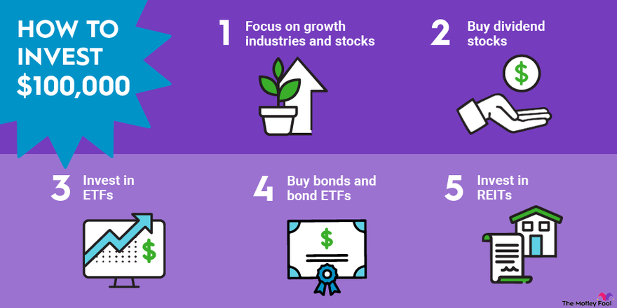

Investment strategies play a pivotal role in the effective management of personal and institutional finances. The landscape of investment management comprises various components, with cash investments, financial planning, and algorithmic trading being key elements that collectively contribute to maximizing financial growth and stability. This article examines these facets to provide a comprehensive understanding of effective investment management.

Cash investments are fundamental to ensuring liquidity and security within a financial portfolio. These investments typically include savings accounts, money market accounts, and certificates of deposit (CDs), offering a reliable, albeit modest, source of returns while maintaining access to funds when needed. Though they generally yield lower returns compared to equities and bonds, their safety makes them an integral part of a diversified investment strategy.



Financial planning is another critical component, providing a structured framework for individuals and organizations to set and achieve financial goals. This involves establishing short-term and long-term objectives, creating an emergency fund, planning for retirement, and balancing debt. Effective financial planning ensures that cash investments are seamlessly integrated into broader financial strategies, optimizing both security and growth.

Algorithmic trading represents the intersection of finance and technology, where algorithms are employed to make trading decisions at speeds and frequencies impossible for humans. This method has revolutionized the way trading is conducted by enhancing efficiency, reducing trading costs, and eliminating emotional biases. Algorithmic trading strategies range from basic moving averages and volume-weighted average price (VWAP) approaches to complex high-frequency trading and statistical arbitrage models. Its role in modern investment strategies cannot be understated, allowing for rapid adaptation to market changes.

Balancing risk and returns is crucial for successful investment management. By strategically employing cash investments, robust financial planning, and sophisticated algorithmic trading, investors can tailor their strategies to align with individual goals and risk tolerances. This blend allows for both the stability and dynamism needed to navigate the ever-evolving financial markets effectively.

## Table of Contents

## Understanding Cash Investments

Cash investments play a pivotal role in the composition of a diversified investment portfolio. Characterized by their high liquidity and low risk, these investment options allow investors to maintain security while achieving predictable returns. Common forms of cash investments include savings accounts, money market accounts, and certificates of deposit (CDs), each offering distinct advantages and limitations that cater to varying financial needs.

Savings accounts are one of the most accessible forms of cash investments, provided by banks and credit unions. They offer [liquidity](/wiki/liquidity-risk-premium) and safety as they are insured by institutions such as the Federal Deposit Insurance Corporation (FDIC) in the United States. However, interest rates are typically quite low, resulting in modest returns.

Money market accounts offer a slightly higher return compared to traditional savings accounts. They combine the features of savings and checking accounts, allowing limited check-writing abilities while still offering a degree of liquidity. Like savings accounts, they are also insured, providing a secure place to park funds with a bit more [earning](/wiki/earning-announcement) potential.

Certificates of Deposit (CDs) require the investor to lock in funds for a specified period, ranging from a few months to several years. In exchange for this commitment, CDs generally offer higher interest rates than savings or money market accounts. The trade-off for these potentially higher returns is reduced liquidity, as early withdrawal usually incurs penalties.

Cash investments inherently come with the advantage of predictability and capital preservation, given their design to maintain nominal value. Investors often utilize these assets to manage short-term spending needs, reserve funds for emergencies, or provide a liquidity component within a broader portfolio. This safety is crucial for risk-averse investors or those nearing retirement who prioritize the preservation of capital over growth.

However, the major drawback of cash investments lies in their relatively low yield, especially when compared to other investment vehicles like stocks or bonds. The returns from cash investments may not always keep up with inflation, potentially leading to a decrease in purchasing power over time. Therefore, it's vital for investors to regularly assess the proportion of cash investments in their portfolio to ensure it aligns with their financial objectives and risk tolerance.

Best practices for incorporating cash investments into an investment strategy involve striking a balance between maintaining sufficient liquidity and optimizing returns. Investors should first establish an emergency fund covering three to six months of living expenses using highly liquid instruments like savings accounts or money market accounts. Beyond this safety net, a laddering strategy with CDs can optimize the balance between liquidity and higher returns by staggering maturity dates, thereby allowing periodic access to capital.

In summary, while cash investments may not be the primary driver of portfolio growth, their role in providing stability and liquidity is indispensable. They function as a financial anchor, offering security and meeting interim financial commitments without significant exposure to market [volatility](/wiki/volatility-trading-strategies).

## Financial Planning Basics

Effective financial planning is a structured process that helps individuals and organizations manage their financial resources to meet specific goals. It involves setting both short-term and long-term financial objectives, which serve as the compass for all financial decisions. Short-term goals might include saving for a vacation or purchasing a vehicle, while long-term goals typically focus on retirement, buying a home, or funding higher education. Establishing clear goals is crucial as they provide direction and prioritize resource allocation.

An essential element of financial planning is establishing an emergency fund, a safety net designed to cover unexpected expenses, such as medical emergencies or sudden job loss. Experts often recommend saving three to six months’ worth of living expenses as an emergency fund to ensure financial stability during unforeseen circumstances. This fund prevents individuals from disrupting their long-term investments or incurring debt to cover unexpected costs.

Retirement planning is another critical component, addressing the need to secure a stable income post-retirement. Financial planners often suggest utilizing retirement accounts like 401(k)s and IRAs, which offer tax advantages and compounding growth over time. Early planning and consistent contributions are vital to maximizing the benefits of compound interest, ensuring that one's retirement years are financially secure.

Balancing debt management with investment strategies is necessary for optimal financial health. Proper debt management involves understanding the cost of debt (interest rates) and prioritizing repayment of high-interest obligations. Concurrently, investing in diversified portfolios can generate returns that exceed the cost of debt, promoting wealth accumulation. A balanced approach ensures that debt does not overshadow investment opportunities, allowing for growth without financial strain.

Cash investments form a cornerstone of financial planning due to their liquidity and safety. They act as a buffer within a diversified portfolio, providing stability and quick access to funds. Integrating cash investments ensures that while aiming for higher returns with equities or other asset classes, individuals maintain a portion of their assets in low-risk, readily accessible forms. This strategy provides financial flexibility and mitigates risk, ensuring that long-term investment plans do not compromise immediate financial security.

 to Algorithmic Trading

Algorithmic trading, often termed algo trading, refers to the use of computer algorithms to manage the trading process in financial markets. This approach automates the decision-making process by utilizing pre-programmed trading instructions, which can consider variables such as timing, price, and [volume](/wiki/volume-trading-strategy). The evolution of [algorithmic trading](/wiki/algorithmic-trading) has transformed financial markets, offering precision, speed, and cost efficiency beyond human capabilities.

**Key Components of Algorithmic Trading**

Algorithmic trading comprises several crucial components: signal generation, risk management, and execution. Signal generation involves identifying potential trading opportunities by analyzing market data. This analysis is often based on quantitative models which incorporate historical price patterns, technical indicators, or fundamental data. 

Risk management is integral to algorithmic trading strategies, ensuring that trades adhere to predefined risk thresholds. This involves setting stop-loss limits, position sizing, and managing exposure to market volatility to mitigate potential losses. Execution refers to the actual placement of trades within the market, where algorithms determine the optimal timing and method for order fulfillment, often utilizing sophisticated techniques such as slicing orders to minimize market impact.

**Benefits of Algorithmic Trading**

The primary benefits of algorithmic trading include speed, efficiency, and the removal of emotional bias. Algorithms can process and react to market changes far faster than a human trader could, executing orders at lightning speed, which is critical in markets where prices can change in milliseconds. Efficiency is enhanced as algorithms can handle high volumes of trades without fatigue or human error. Furthermore, by eliminating the emotional component of trading, algorithms ensure consistency in strategy execution and reduce the potential for decisions driven by fear or greed.

**Common Strategies**

Several strategies dominate algorithmic trading. Trend-following strategies aim to capitalize on market [momentum](/wiki/momentum) by identifying and following existing market trends. These strategies are often based on technical indicators such as moving averages. Arbitrage strategies exploit price discrepancies between related securities across different markets or exchanges, striving for risk-free profit. Statistical models, including mean reversion or market-making strategies, use quantitative methods to predict price changes based on historical data and statistical patterns.

**Advancements in Technology and Algorithm Design**

Recent technological advancements have significantly evolved the landscape of algorithmic trading. High-frequency trading ([HFT](/wiki/high-frequency-trading-strategies)) is a cutting-edge method involving the execution of a large number of trades at extremely high speeds, often leveraging complex algorithms running on powerful computing systems. Developments in [machine learning](/wiki/machine-learning) and [artificial intelligence](/wiki/ai-artificial-intelligence) are enabling more sophisticated model designs, allowing for adaptive algorithms that can improve their decision-making processes based on new data. Additionally, the implementation of low-latency trading infrastructure has become crucial, providing faster data transfer and reducing the time taken to execute trades.

These innovations have paved the way for more complex and efficient trading algorithms, continually reshaping the dynamics of financial markets.

## Algorithmic Trading Strategies

Algorithmic trading strategies have become a cornerstone of modern financial markets, employing predefined rules to execute trades rapidly and proficiently. This section examines various algorithmic trading strategies, starting from basic to advanced, highlighting their implementation methods, benefits, challenges, and real-world applications.

**Basic Strategies:**

1. **Moving Averages:**
   Moving averages, such as the Simple Moving Average (SMA) and the Exponential Moving Average (EMA), are popular tools for identifying trends in price movement. A common approach involves using two moving averages: a short-term and a long-term average. A buy signal is generated when the short-term average crosses above the long-term average, and a sell signal is produced when the opposite occurs. This method is conducive to momentum trading by capturing the trend direction.
$$
   \text{SMA} = \frac{\sum_{i=1}^{n} P_i}{n}

$$

   Where $P_i$ is the price at time $i$ and $n$ is the number of periods.

2. **Volume Weighted Average Price (VWAP):**
   VWAP aims to provide an average price that reflects the volume of transactions, helping traders execute large orders with minimal market impact. VWAP is computed by multiplying the price by the volume and dividing by the total volume over a specific period.
$$
   \text{VWAP} = \frac{\sum_{i=1}^{n} P_i \times V_i}{\sum_{i=1}^{n} V_i}

$$

   Where $V_i$ is the volume at time $i$.

3. **Momentum Trading:**
   Momentum trading leverages the notion that securities maintaining an upward trend will continue to rise and vice versa. Algorithms using momentum strategies typically employ indicators like the Relative Strength Index (RSI) to gauge the rate and change of price movements.

**Intermediate Strategies:**

1. **Pairs Trading:**
   Pairs trading is a market-neutral strategy that involves matching a long position with a short position in two statistically correlated stocks. The strategy relies on the convergence of prices, anticipating that any temporary divergence between the pair will revert to the mean.

2. **Risk Arbitrage:**
   Risk [arbitrage](/wiki/arbitrage), or merger arbitrage, exploits perceived mispricings of stocks involved in mergers or acquisitions. Traders speculate on the successful completion of the deal, aiming to profit from price discrepancies between the target company's current market price and the proposed acquisition price.

**Advanced Strategies:**

1. **High-Frequency Trading (HFT):**
   High-frequency trading uses powerful computers to execute orders at extremely high speeds, typically capitalizing on minute price discrepancies. HFT strategies include market-making, [statistical arbitrage](/wiki/statistical-arbitrage), and event arbitrage, demanding significant technological infrastructure for success.

2. **Statistical Arbitrage:**
   Statistical arbitrage involves complex modeling and computational techniques to identify price inefficiencies across securities. It is heavily reliant on quantitative models and requires extensive data analysis to uncover patterns and correlations.

**Challenges:**

Algorithmic trading faces challenges such as overfitting, where models perform well on historical data but poorly in live environments. Additionally, technological failures—such as latency issues—and market impact, which refers to the price changes caused by large transactions, pose significant risks.

**Case Studies:**

Real-world examples of successful algorithmic strategies include Renaissance Technologies' Medallion Fund, renowned for leveraging advanced mathematical models and computer-based trading algorithms to achieve consistently high returns. Another case is Two Sigma Investments, which uses statistical techniques and technology innovation to guide investment decisions.

These algorithmic trading strategies illustrate the integration of mathematical models, computational tools, and market insights, positioning them as pivotal components for achieving efficiency and precision in financial markets.

## Balancing Investment Portfolios

Diversification across different asset classes is a cornerstone of effective portfolio management, aimed at mitigating risk while enhancing potential returns. By spreading investments across various asset categories—such as equities, bonds, real estate, and cash—investors can reduce the impact of a poor performance in one area while benefiting from gains in others. The principle behind diversification is that different asset classes often have varying responses to the same economic events, thus balancing the overall risk.

Cash investments play a critical role in this strategy by providing liquidity and stability. In times of market volatility, cash reserves can cushion portfolio fluctuations and allow investors to capitalize on opportunities without the need to liquidate other assets at a loss. Although the returns on cash investments are typically lower, their safety and predictable nature make them an ideal choice for risk-averse portions of a portfolio.

The integration of algorithmic trading with traditional investment strategies offers a sophisticated mechanism to enhance portfolio management. Algorithmic trading uses mathematical models and statistical analyses to make trading decisions, often executing them at speeds and frequencies impractical for human traders. This can be particularly advantageous when used alongside traditional methods, as algorithms can quickly adapt to market changes, identify arbitrage opportunities, and execute trades with precision.

Dynamically adjusting portfolio allocations is essential to maintaining alignment with an investor’s goals and risk tolerance. Market conditions, interest rates, and individual investment performance are factors necessitating regular review and rebalancing of a portfolio. Algorithms can assist in this process by constantly analyzing market data to provide actionable insights. They can be programmed to automatically rebalance a portfolio when certain thresholds are met, ensuring that it stays within the desired asset allocation.

Utilizing data analytics and financial modeling further refines portfolio optimization. Data analytics can process vast amounts of information to identify trends and inform investment strategies. Financial modeling, on the other hand, can simulate various scenarios to predict potential future behaviors of assets under different conditions. This quantitative approach supports decision-making by providing a clearer picture of risk and return scenarios.

Python is often the go-to language for implementing such quantitative strategies due to its extensive libraries and frameworks:

```python
import numpy as np
import pandas as pd
from scipy.optimize import minimize

# Sample function to optimize portfolio allocation
def optimize_portfolio(returns, cov_matrix, risk_free_rate=0.01):
    num_assets = len(returns)
    initial_guess = np.ones(num_assets) / num_assets

    def portfolio_performance(weights):
        return np.dot(weights, returns), np.sqrt(np.dot(weights.T, np.dot(cov_matrix, weights)))

    def negative_sharpe_ratio(weights):
        p_return, p_volatility = portfolio_performance(weights)
        return -(p_return - risk_free_rate) / p_volatility

    constraints = ({'type': 'eq', 'fun': lambda x: np.sum(x) - 1})
    bounds = tuple((0, 1) for _ in range(num_assets))

    result = minimize(negative_sharpe_ratio, initial_guess, bounds=bounds, constraints=constraints)

    return result.x

# Example usage
expected_returns = np.array([0.1, 0.12, 0.13])
covariance_matrix = np.array([[0.005, -0.002, 0.004], 
                              [-0.002, 0.010, -0.002], 
                              [0.004, -0.002, 0.006]])

optimal_weights = optimize_portfolio(expected_returns, covariance_matrix)
print("Optimal Portfolio Weights:", optimal_weights)
```

This Python script demonstrates how to optimize a portfolio's allocation using data analytics and mathematical optimization, maximizing the Sharpe ratio to find an efficient balance between risk and reward. Employing such techniques helps investors to systematically improve portfolio performance in the face of complex and dynamic market conditions.

## Conclusion

Investment planning in today’s dynamic financial landscape requires a harmonious blend of conventional and advanced strategies. Cash investments, which include tools such as savings accounts and certificates of deposit (CDs), play a vital role in offering financial safety and liquidity. These options provide stable and predictable returns, making them a favored choice for risk-averse investors or those in need of a safety net within their portfolios.

On the other hand, algorithmic trading introduces a sophisticated layer to investing by leveraging technology for efficiency and precision. It automates trading decisions based on predefined strategies, facilitating high-speed and emotion-free execution of trades. This advanced form of trading can significantly enhance a portfolio's returns by exploiting market inefficiencies swiftly.

Investors must tailor their strategies to align with their specific financial goals and risk tolerance. This personalized approach ensures that the investment plan remains relevant and effective in achieving desired outcomes, whether it’s growing wealth, preserving capital, or generating income. For example, young investors with a higher risk tolerance might focus more on algorithmic trading or high-growth equities, whereas retirees could prioritize cash investments and income-generating assets such as bonds.

Moreover, the investment environment is perpetually evolving due to factors such as technological advancements, regulatory changes, and economic fluctuations. Hence, continuous learning and adaptation to market changes are essential. Investors should stay informed about the latest trends and refine their strategies accordingly to maintain a competitive edge.

Lastly, the complexity of financial decisions often necessitates the guidance of a professional. Engaging with experienced financial advisors can provide invaluable insights and mitigate the risks associated with investment decisions. These professionals can help navigate through intricate financial landscapes, ensuring that the investment strategies are well-structured and aligned with the investor's specific circumstances and objectives.

In conclusion, a well-rounded investment strategy that balances traditional safety nets with advanced trading techniques can optimize both risk and return, tailor-fit to personal financial aspirations and market conditions.

## Additional Resources

For investors and traders seeking to expand their knowledge and refine their strategies, there are numerous resources available. Recommended readings on financial planning and investment strategies include "The Intelligent Investor" by Benjamin Graham, which offers valuable insights into value investing, and "A Random Walk Down Wall Street" by Burton G. Malkiel, which discusses the efficient market hypothesis and investment strategies. For a more technical approach, "Quantitative Momentum" by Wesley R. Gray and "Algorithmic Trading: Winning Strategies and Their Rationale" by Ernest P. Chan provide comprehensive guides on quantitative and algorithmic trading.

Online courses can offer a structured learning path for individuals interested in algorithmic trading. Platforms such as Coursera, edX, and Udacity provide courses ranging from beginner to advanced levels, covering topics like Python programming for finance, quantitative analysis, and machine learning. Notable courses include "Algorithmic Trading and Finance Models with Python, R, and Stata Essential Training" on LinkedIn Learning and "Introduction to Quantitative Finance" by the Massachusetts Institute of Technology (MIT) on edX.

Developing and testing algorithmic strategies can be significantly enhanced using specialized tools. Backtesting platforms such as QuantConnect and [Interactive Brokers](/wiki/interactive-brokers-api)’ Trader Workstation provide robust environments for testing trading algorithms against historical data. These platforms support multiple programming languages, including Python and C++, which are ideal for developing and refining strategies.

Communities such as Quantitative Finance on Reddit and Algorithmic Traders' Association offer platforms for networking with like-minded individuals, discussing strategies, and staying updated on the latest industry trends. Engaging in these communities can provide peer support and collaborative opportunities, essential for both novice and experienced traders.

Lastly, consulting with financial planners can offer personalized guidance tailored to individual financial goals and risk tolerance. Financial planners can provide insights into the intricacies of personal finance, including estate planning, tax-efficient investing, and retirement strategies, ensuring a well-rounded approach to investment management.

## References & Further Reading

[1]: Bergstra, J., Bardenet, R., Bengio, Y., & Kégl, B. (2011). ["Algorithms for Hyper-Parameter Optimization."](https://dl.acm.org/doi/10.5555/2986459.2986743) Advances in Neural Information Processing Systems 24.

[2]: ["Advances in Financial Machine Learning"](https://www.amazon.com/Advances-Financial-Machine-Learning-Marcos/dp/1119482089) by Marcos Lopez de Prado

[3]: ["Evidence-Based Technical Analysis: Applying the Scientific Method and Statistical Inference to Trading Signals"](https://www.amazon.com/Evidence-Based-Technical-Analysis-Scientific-Statistical/dp/0470008741) by David Aronson

[4]: ["Machine Learning for Algorithmic Trading"](https://github.com/PacktPublishing/Machine-Learning-for-Algorithmic-Trading-Second-Edition) by Stefan Jansen

[5]: ["Quantitative Trading: How to Build Your Own Algorithmic Trading Business"](https://books.google.com/books/about/Quantitative_Trading.html?id=j70yEAAAQBAJ) by Ernest P. Chan