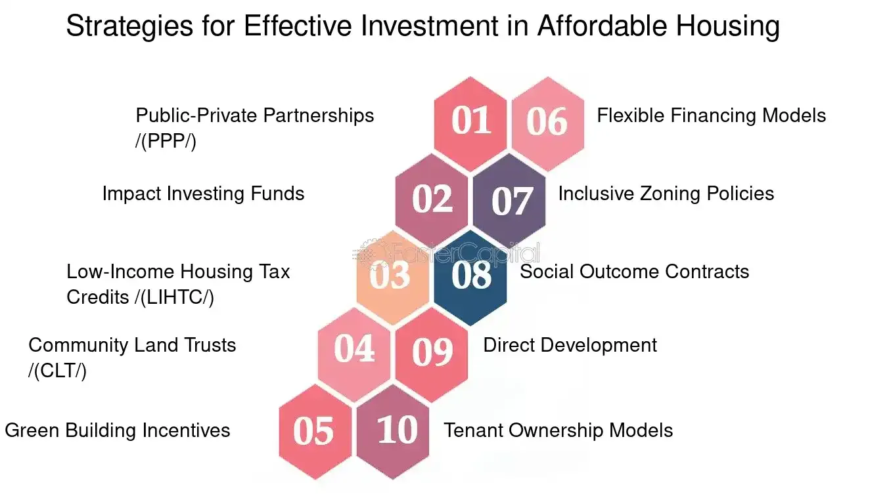

## Table of Contents

## What is affordable housing and why is it important?

Affordable housing is housing that people with low to moderate incomes can afford. It is important because it helps people have a safe and stable place to live without spending too much of their money on rent or a mortgage. When people can afford their homes, they have more money left over for other important things like food, healthcare, and education.

Having affordable housing is also important for communities. When people can afford to live in a community, it helps the community grow and stay strong. It means more people can live and work in the area, which can help local businesses and schools. Affordable housing can also help reduce homelessness and make sure that everyone has a chance to live in a good home.

## How can investing in affordable housing benefit both investors and communities?

Investing in affordable housing can be good for investors because it can make them money over time. When investors build or buy affordable homes, they can rent them out to people who need a place to live. This gives the investors a steady income from rent payments. Plus, if the area around the affordable housing gets better over time, the value of the homes can go up. This means the investors can sell the homes for more money later on.

Affordable housing is also good for communities. When people can afford to live in a neighborhood, it helps the whole area. More people living there means more customers for local stores and more kids for schools. This can make the community stronger and more lively. Also, when people have a stable home, they are more likely to take care of their neighborhood and get involved in community activities. This can make the whole area a better place to live for everyone.

## What are the basic steps to start investing in affordable housing?

To start investing in affordable housing, first, you need to do some research. Look for areas where there is a need for affordable homes. You can check government websites or talk to local housing authorities to find out where the demand is high. It's also important to understand the rules and regulations about affordable housing in those areas. Some places have special programs or tax breaks for investors who build or buy affordable homes.

Once you know where to invest, you need to find the right property. You can buy an existing building and turn it into affordable housing, or you can build new homes from scratch. It's a good idea to work with a real estate agent who knows about affordable housing. They can help you find the best deals and guide you through the buying or building process. After you have the property, you can start renting it out to people who need affordable places to live.

Investing in affordable housing can be a big project, so it's important to plan carefully. You might need to get a loan to help pay for the property or the construction. Make sure you have a good business plan that shows how you will make money from the investment. Also, think about working with community groups or non-profits that support affordable housing. They can give you advice and help you connect with people who need a place to live.

## What are the different types of investment vehicles available for affordable housing?

There are several ways to invest in affordable housing, each with its own benefits. One common way is to invest in real estate investment trusts (REITs) that focus on affordable housing. REITs are companies that own and manage properties, and they pay out most of their income as dividends to investors. This can be a good way to get involved in affordable housing without having to buy and manage properties yourself. Another option is to invest in a private equity fund that specializes in affordable housing. These funds pool money from many investors to buy and develop affordable housing projects. They can offer higher returns, but they also come with more risk.

Another type of investment vehicle is a housing bond. These are bonds issued by government agencies or non-profit organizations to raise money for affordable housing projects. When you buy a housing bond, you are lending money to the issuer, and they pay you back with interest over time. Housing bonds can be a safe way to invest in affordable housing because they are often backed by the government. Finally, you can invest directly in affordable housing by buying or building properties yourself. This can be more hands-on and requires more work, but it gives you more control over your investment and the chance to make a direct impact on your community.

## How do government policies and incentives affect affordable housing investments?

Government policies and incentives can make a big difference in affordable housing investments. They can help make it easier and more attractive for investors to put money into affordable homes. For example, some governments offer tax breaks or subsidies to investors who build or buy affordable housing. These incentives can lower the costs for investors and make their projects more profitable. Governments might also have special programs that provide low-interest loans or grants to help with the costs of building or buying affordable homes. These policies can encourage more people to invest in affordable housing and help meet the need for affordable places to live.

In addition to financial incentives, government policies can also set rules and regulations that affect affordable housing investments. For example, some places have laws that require a certain percentage of new housing developments to be affordable. These rules can create more opportunities for investors to get involved in affordable housing. Governments can also work with non-profit organizations and community groups to support affordable housing projects. By working together, they can make it easier for investors to find good projects and connect with people who need affordable homes. Overall, government policies and incentives play a big role in shaping the affordable housing market and can help make it a more attractive place for investors.

## What are the key financial metrics to consider when evaluating an affordable housing investment?

When you are thinking about investing in affordable housing, there are some important numbers to look at. One key metric is the return on investment (ROI). This tells you how much money you might make from your investment. You want to see if the money you make from rent will be more than what you spend on the property and any loans you take out. Another important number is the cash flow. This is the money you have left over after you pay all your costs like the mortgage, taxes, and maintenance. Good cash flow means your investment is making money each month.

Another thing to consider is the capitalization rate, or cap rate. This is a way to see how much money your property is making compared to how much it costs. A higher cap rate can mean a better investment, but it also might mean more risk. You should also look at the vacancy rate, which is how often your units are empty. A low vacancy rate means more people want to live in your property, which is good for your income. Finally, think about the debt service coverage ratio (DSCR). This shows if you have enough money coming in to pay back any loans you took out. A higher DSCR means you are in a better position to pay your debts.

## How can risk be managed in affordable housing investments?

Managing risk in affordable housing investments is important to make sure your money is safe. One way to do this is by spreading out your investments. Instead of putting all your money into one project, you can invest in different properties in different areas. This way, if one project doesn't do well, you won't lose all your money. Another way to manage risk is by doing a lot of research before you invest. Look at the area where the property is, see if there is a need for affordable housing there, and check the financial numbers like the return on investment and cash flow. The more you know, the better you can decide if an investment is worth the risk.

It's also a good idea to work with experts who know about affordable housing. They can help you find good projects and give you advice on how to manage them. Sometimes, you can also get insurance to protect your investment from things like damage or people not paying rent. Finally, keep an eye on your investments and be ready to make changes if things aren't going well. If you see that a project is not making money, you might need to lower the rent or find new ways to save money. By being careful and planning ahead, you can manage the risks and make your affordable housing investments successful.

## What role does location play in the success of an affordable housing investment?

Location is very important for the success of an affordable housing investment. A good location means there are a lot of people who need affordable places to live. This can help keep your units full and your income steady. Also, if the area is growing and getting better, the value of your property can go up. This means you might be able to sell it for more money later. Being close to jobs, schools, and public transportation can make your property more attractive to people who need affordable homes.

On the other hand, a bad location can make your investment risky. If the area doesn't have many jobs or good schools, it might be hard to find people who want to live there. This can lead to empty units and less money coming in. Also, if the neighborhood is not safe or is getting worse, the value of your property might go down. So, it's really important to pick a location carefully and do a lot of research to make sure it's a good place for an affordable housing investment.

## How can investors ensure the sustainability and long-term viability of their affordable housing projects?

To make sure affordable housing projects stay successful and last a long time, investors need to focus on good management and planning. This means keeping the buildings in good shape by fixing things quickly and making sure they are safe and comfortable for people to live in. It's also important to keep the rent at a level that people can afford, but still makes enough money to cover costs and make a profit. Working with local groups and listening to what the people who live there need can help keep the community strong and happy. By doing these things, investors can make sure their projects keep going strong for many years.

Another way to keep affordable housing projects going strong is by thinking about the future. This means [picking](/wiki/asset-class-picking) a good location where there will always be a need for affordable homes. It also means being ready to change with the times. For example, if the area gets better and property values go up, investors might need to find new ways to keep the homes affordable. They can do this by using government programs or working with non-profits. By planning ahead and being flexible, investors can make sure their affordable housing projects stay successful and help the community for a long time.

## What advanced strategies can be used to maximize returns in affordable housing investments?

One advanced strategy to maximize returns in affordable housing investments is to use tax credits and government incentives. Many governments offer special tax breaks for investors who build or buy affordable homes. These can lower the costs of the project and make it more profitable. For example, in the United States, the Low-Income Housing Tax Credit (LIHTC) program gives investors tax credits for building affordable housing. By using these programs, investors can save money on taxes and make more money from their investments.

Another strategy is to mix affordable housing with other types of real estate. This is called mixed-use development. Investors can build a property that has affordable homes, but also has stores, offices, or other businesses. This can bring in more money from different sources and make the whole project more successful. It can also make the area more attractive to people who want to live there, which can help keep the units full and the property value high. By thinking creatively and using these advanced strategies, investors can make the most out of their affordable housing investments.

## How can technology and data analytics be leveraged to enhance investment decisions in affordable housing?

Technology and data analytics can really help investors make better choices about affordable housing. By using special software and tools, investors can look at a lot of information about different areas. They can see things like how many people need affordable homes, how much people earn, and how much they can afford to pay for rent. This helps investors pick the best places to build or buy affordable housing. They can also use data to keep track of how well their projects are doing. For example, they can see if their buildings are full or empty, how much money they are making, and if they need to make any changes to keep their projects successful.

Another way technology helps is by making it easier to manage affordable housing projects. There are apps and programs that can help with things like collecting rent, fixing problems quickly, and talking to the people who live there. This makes everything run smoother and can save investors time and money. Also, data analytics can show investors new chances to make more money. For example, they might see that adding more units or starting a new project in a different area could be a good idea. By using technology and data, investors can make smarter choices and make their affordable housing investments even better.

## What are the emerging trends and future outlook for investing in affordable housing?

One big trend in affordable housing investments is the use of technology and data. More and more investors are using special tools to look at information about different areas. They can see where people need affordable homes the most and how much they can afford to pay. This helps them pick the best places to invest. Also, technology makes it easier to manage properties. Apps and programs can help with collecting rent, fixing problems, and talking to the people who live there. This makes everything run smoother and can save investors time and money.

Another trend is the focus on sustainability and long-term success. Investors are thinking more about how to keep their projects going strong for many years. They are using green building techniques to make homes that use less energy and are better for the environment. They are also working with local groups and listening to what the people who live there need. This helps keep the community happy and strong. In the future, affordable housing investments will likely keep growing as more people see the benefits. Governments might offer more incentives and programs to help, and investors will keep finding new ways to make their projects successful and help more people find a good place to live.

## References & Further Reading

[1]: ["The Importance of Affordable Housing"](https://www.habitat.org/stories/reinforcing-importance-of-our-work) - United Nations Sustainable Development Goals.

[2]: ["Low-Income Housing Tax Credit (LIHTC)"](https://taxpolicycenter.org/briefing-book/what-low-income-housing-tax-credit-and-how-does-it-work) - U.S. Department of Housing and Urban Development.

[3]: Arnott, R. D., & Chaves, D. B. (2012). ["Demographic Changes, Financial Markets, and the Economy."](https://papers.ssrn.com/sol3/papers.cfm?abstract_id=1810985) Financial Analysts Journal, 68(1), 23-46.

[4]: Lopez de Prado, M. (2018). ["Advances in Financial Machine Learning"](https://www.amazon.com/Advances-Financial-Machine-Learning-Marcos/dp/1119482089) - Wiley.

[5]: Jansen, S. (2020). ["Machine Learning for Algorithmic Trading"](https://github.com/stefan-jansen/machine-learning-for-trading) - Packt Publishing.

[6]: Chan, E. P. (2009). ["Quantitative Trading: How to Build Your Own Algorithmic Trading Business"](https://github.com/ftvision/quant_trading_echan_book) - Wiley.

[7]: Aronson, D. (2007). ["Evidence-Based Technical Analysis: Applying the Scientific Method and Statistical Inference to Trading Signals"](https://onlinelibrary.wiley.com/doi/book/10.1002/9781118268315) - Wiley.