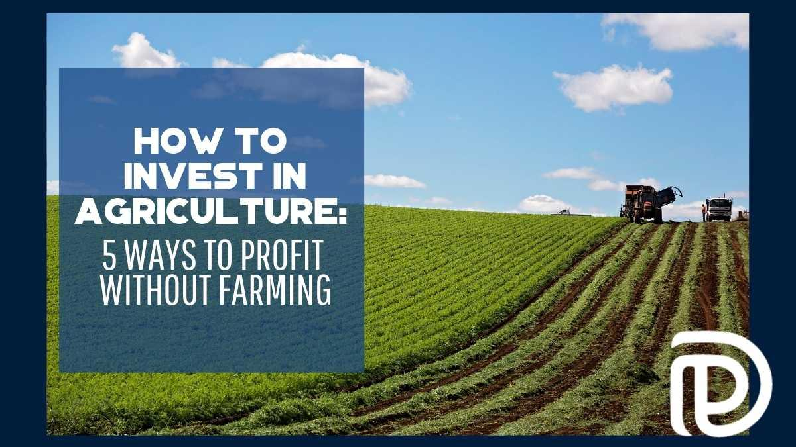

## Table of Contents

## What are the basic investment options available in agriculture without owning a farm?

Investing in agriculture without owning a farm can be done through various financial instruments. One common option is investing in agricultural stocks. These are shares in companies that are involved in farming, food production, or agricultural equipment. By buying stocks in these companies, you can benefit from their growth and profits without having to manage a farm yourself. Another option is to invest in agricultural mutual funds or exchange-traded funds (ETFs). These funds pool money from many investors to buy a diversified portfolio of agricultural assets, reducing the risk compared to investing in a single stock.

Another way to invest in agriculture is through commodity trading. This involves buying and selling futures contracts for agricultural products like wheat, corn, or soybeans. Commodity trading can be more complex and risky, but it allows you to profit from price movements in these essential goods. Additionally, you can invest in agricultural real estate investment trusts (REITs). These trusts own and manage farmland and lease it to farmers, providing investors with income from rent and potential appreciation in land value. Each of these options offers a different way to gain exposure to the agricultural sector without the need to own or operate a farm.

## How can someone start investing in agricultural commodities?

To start investing in agricultural commodities, you first need to learn about futures contracts. Futures contracts are agreements to buy or sell a specific amount of a commodity, like wheat or corn, at a set price on a future date. You can trade these contracts on exchanges like the Chicago Board of Trade. To start, you'll need to open an account with a brokerage firm that offers futures trading. Make sure to choose a reputable broker and understand their fees and requirements.

Once you have your account set up, you can start trading. It's important to do your research and understand the factors that affect commodity prices, such as weather, global demand, and government policies. You can use market analysis tools and news sources to help you make informed decisions. Remember, trading commodities can be risky, so it's a good idea to start small and only invest money you can afford to lose. As you gain more experience, you can adjust your strategies and potentially increase your investments.

## What are the risks associated with investing in agriculture without direct farm ownership?

Investing in agriculture without owning a farm can be risky because you don't have control over what happens on the farm. When you invest in stocks or funds related to agriculture, the success of your investment depends on how well the companies or farms are doing. If there's a bad harvest because of weather problems, or if the price of crops goes down, the value of your investment can go down too. Also, if the companies you invest in are not managed well, or if they face financial problems, your investment can lose value.

Another risk is that commodity prices can be very unpredictable. When you trade futures contracts for agricultural products, the price can change a lot because of things like weather, global demand, and government policies. If you guess wrong about which way the prices will go, you could lose money. Also, investing in real estate investment trusts (REITs) that own farmland has its own risks. The value of the land can go up or down, and if the farmers who lease the land can't pay their rent, it can affect the income you get from the REIT. So, it's important to understand these risks and be ready for the ups and downs of investing in agriculture without owning a farm.

## Can you explain the concept of agricultural ETFs and how they work?

Agricultural ETFs, or Exchange-Traded Funds, are a way for people to invest in farming and food production without buying a farm. An [ETF](/wiki/etf-trading-strategies) is like a basket that holds a bunch of different things related to agriculture, like stocks in farming companies, food producers, or even futures contracts for crops. When you buy shares in an agricultural ETF, you're basically buying a small piece of everything in that basket. This helps spread out the risk because you're not putting all your money into one company or one type of crop.

These ETFs trade on stock exchanges, just like regular stocks. So, you can buy and sell them during the day whenever the market is open. The price of the ETF can go up or down based on how well the things inside the basket are doing. For example, if the price of corn goes up, and the ETF has corn futures in it, the value of the ETF might go up too. But if there's a bad harvest or if the companies in the ETF aren't doing well, the value of the ETF could go down. That's why it's important to do your homework and understand what's in the ETF before you invest.

## What role do agricultural futures and options play in investment strategies?

Agricultural futures and options are important tools for people who want to invest in farming without owning a farm. Futures are like promises to buy or sell a certain amount of a crop, like wheat or corn, at a set price on a future date. This can help investors make money if they think the price of the crop will go up or down. For example, if you think the price of corn will go up, you can buy a futures contract now and sell it later at a higher price. But if you're wrong and the price goes down, you could lose money. So, futures can be risky, but they also give you a chance to make money from changes in crop prices.

Options are a bit different. They give you the right, but not the obligation, to buy or sell a futures contract at a set price before a certain date. This can be less risky than futures because you don't have to go through with the deal if it's not in your favor. For example, if you buy an option to buy corn at a certain price, and the price goes up, you can use your option to buy the corn at the lower price and then sell it at the higher price. But if the price goes down, you can just let the option expire and only lose the money you paid for the option. So, options can be a safer way to bet on crop prices, but they still come with risks and costs.

## How can investing in agribusiness companies be a part of an agricultural investment portfolio?

Investing in agribusiness companies can be a good way to add agriculture to your investment portfolio without owning a farm. Agribusiness companies are involved in different parts of farming, like making farming equipment, processing food, or selling seeds. When you buy stocks in these companies, you can make money if the companies do well. For example, if a company that makes tractors sells a lot of tractors and makes a big profit, the value of your stock in that company might go up. This way, you can benefit from the growth of the agriculture industry without having to deal with the day-to-day work of farming.

However, investing in agribusiness companies also comes with risks. If the companies you invest in don't do well, like if they have a bad year or if the price of their products goes down, the value of your investment can go down too. Also, things like bad weather or changes in government rules can affect how well these companies do. So, it's important to do your research and understand the companies you're investing in. By including agribusiness stocks in your portfolio, you can spread out your risk and have a chance to make money from the agriculture sector.

## What are the benefits of investing in agricultural technology and innovation?

Investing in agricultural technology and innovation can bring a lot of benefits. One big benefit is that new technology can help farmers grow more food with less work. For example, smart farming tools like drones and sensors can help farmers use water and fertilizers more efficiently. This means they can save money and grow more crops. When you invest in companies that make these technologies, you can make money if the companies do well and more farmers start using their products.

Another benefit is that investing in agricultural innovation can help the environment. New technologies can help reduce the use of harmful chemicals and lower the impact of farming on the land. For example, precision farming can help farmers use just the right amount of resources, which is good for the planet. If you invest in companies that focus on sustainable farming, you're not only helping the environment but also supporting businesses that could grow as more people care about where their food comes from and how it's grown.

## How does farmland REITs function as an investment tool in agriculture?

Farmland real estate investment trusts, or REITs, are a way for people to invest in farmland without actually owning or managing a farm. A farmland REIT owns and manages farmland and then leases it to farmers. When you invest in a farmland REIT, you're buying shares in the trust. The money you make from your investment comes from the rent that the farmers pay to use the land. This can be a steady source of income because farmers need land to grow crops, and they usually sign long leases.

Farmland REITs can also be a good way to spread out your investment risk. Instead of putting all your money into one farm, you're investing in a big piece of land that's divided into many farms. This means if one farm has a bad year, it might not affect your whole investment. Plus, the value of farmland can go up over time, so your investment might grow in value. But remember, like any investment, farmland REITs come with risks. If the farmers can't pay their rent, or if the value of the land goes down, it could affect how much money you make from your investment.

## What advanced strategies can be used to hedge against agricultural market volatility?

One advanced strategy to hedge against agricultural market [volatility](/wiki/volatility-trading-strategies) is using options contracts. Options give you the right, but not the obligation, to buy or sell a futures contract at a set price before a certain date. This can help protect your investment if prices move against you. For example, if you own corn futures and you're worried the price might drop, you can buy a put option. This option lets you sell your corn futures at a set price, even if the market price goes lower. This way, you limit your losses if the market goes down, but you can still make money if the market goes up.

Another strategy is diversification. Instead of putting all your money into one type of crop or one company, you can spread your investments across different agricultural assets. This can include investing in a mix of stocks, ETFs, and commodities. By diversifying, you reduce the risk that a problem in one area will hurt your whole investment. For example, if you invest in both wheat and soybeans, a bad harvest for wheat might be balanced out by a good harvest for soybeans. This way, you're not as affected by the ups and downs of any single market.

A third strategy is using managed futures accounts. These are run by professional traders who use complex strategies to trade futures contracts. They can help you make money in both rising and falling markets by taking positions that benefit from market volatility. Managed futures can be a good way to hedge because the professionals managing the account can quickly adjust to changing market conditions. However, this strategy can be more expensive and might require a higher minimum investment, so it's important to understand the costs and risks before you start.

## How can data analytics and AI be utilized to enhance investment decisions in agriculture?

Data analytics and AI can help people make better investment choices in agriculture by looking at a lot of information and finding patterns that are hard for people to see. For example, AI can look at weather data, crop prices, and how well farms are doing to predict what might happen next. This can help investors decide when to buy or sell agricultural stocks or commodities. By using AI, investors can make smarter choices and maybe make more money because they have a better idea of what's going to happen in the future.

Another way data analytics and AI can help is by making farming more efficient. AI can help farmers use less water and fertilizer, which saves them money and helps the environment. When farms do better, the companies that make farming equipment or sell seeds can do better too. So, if you invest in these companies, you might make more money because they're using AI to help farmers. This means that by understanding how AI is used in farming, you can pick better investments and have a more successful portfolio.

## What are the global market trends affecting agricultural investments, and how can they be leveraged?

Global market trends can have a big impact on agricultural investments. One big trend is the growing world population, which means more people need food. This can make investing in farming and food companies a good idea because there's more demand for what they produce. Another trend is climate change, which can make farming harder in some places but better in others. Investors need to watch where farming is doing well and where it's not, and put their money into the areas that are likely to do better. Also, trade policies between countries can change how much money farmers make, so it's important to know about these rules and how they might affect prices.

To take advantage of these trends, investors can look for companies that are finding new ways to grow food, like using technology to farm better or growing crops that can handle different weather. Investing in companies that help farmers use less water or fewer chemicals can be a good choice because these companies can help farms do better and be kinder to the environment. Also, investors can look at different countries and see which ones are making it easier for farmers to sell their products around the world. By understanding these trends and [picking](/wiki/asset-class-picking) the right investments, people can make smart choices and maybe make more money from agriculture.

## How can an investor assess the sustainability and ethical impact of their agricultural investments?

An investor can assess the sustainability and ethical impact of their agricultural investments by looking at how the companies they invest in treat the environment and the people involved in farming. One way to do this is to check if the company follows sustainable farming practices, like using less water and fewer chemicals. Investors can also look at reports and ratings from organizations that focus on sustainability. These reports can tell you if a company is doing a good job at protecting the environment and treating workers fairly. Another important thing to look at is if the company is involved in any projects that help local communities or support fair trade practices.

By doing research and asking questions, investors can make sure their money is going to companies that care about the planet and the people. For example, if a company is working on new technologies to reduce waste or improve soil health, that's a good sign they are thinking about sustainability. Also, talking to other investors or joining groups that focus on ethical investing can give you more information and help you make better choices. By choosing to invest in companies that are good for the environment and fair to people, investors can feel good about where their money is going and help make a positive impact on the world.

## References & Further Reading

[1]: Bergstra, J., Bardenet, R., Bengio, Y., & Kégl, B. (2011). ["Algorithms for Hyper-Parameter Optimization."](https://dl.acm.org/doi/10.5555/2986459.2986743) Advances in Neural Information Processing Systems 24.

[2]: ["Advances in Financial Machine Learning"](https://www.amazon.com/Advances-Financial-Machine-Learning-Marcos/dp/1119482089) by Marcos Lopez de Prado

[3]: ["Evidence-Based Technical Analysis: Applying the Scientific Method and Statistical Inference to Trading Signals"](https://www.amazon.com/Evidence-Based-Technical-Analysis-Scientific-Statistical/dp/0470008741) by David Aronson

[4]: ["Machine Learning for Algorithmic Trading"](https://github.com/stefan-jansen/machine-learning-for-trading) by Stefan Jansen

[5]: ["Quantitative Trading: How to Build Your Own Algorithmic Trading Business"](https://github.com/LucindaYa/quant-resources/blob/master/Quantitative%20Trading%20How%20to%20Build%20Your%20Own%20Algorithmic%20Trading%20Business.pdf) by Ernest P. Chan