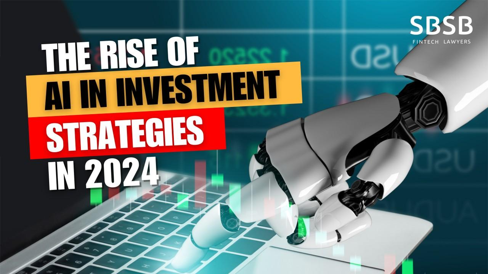

The landscape of investment is experiencing a monumental shift with the integration of artificial intelligence (AI), as innovative technologies redefine how capital is deployed and managed. The surge in AI investments underscores the growing recognition among investors of AI’s potential to deliver substantial returns and bolster portfolio resilience. This trend is largely driven by AI's capability to rapidly process and analyze vast amounts of data, allowing for superior decision-making compared to traditional methods.

One of the most distinguished applications of AI in the investment world is algorithmic trading. This approach harnesses the power of machine learning and data analysis to optimize trading strategies, executing trades with high speed and precision. By drawing insights from enormous datasets, AI algorithms identify patterns and predict market movements, thus providing a competitive edge to investors.

This article aims to equip investors with a comprehensive understanding of AI investment strategies, specifically focusing on stocks, exchange-traded funds (ETFs), and algorithmic trading. By exploring these avenues, investors can better navigate the complexities of the AI investment universe and make informed decisions that align with their financial goals. The advent of AI in investments not only opens up new opportunities but also introduces challenges that require a proactive and well-informed approach.

## Table of Contents

## Understanding AI in Investments

Artificial Intelligence (AI) has become a crucial element in the investment landscape, primarily due to its ability to mimic human intelligence with superior speed and precision. This capability allows AI to process and analyze vast amounts of data, enabling investors to make informed decisions quickly and efficiently.

AI's application in investments is multifaceted. One key area is its use in predicting market trends. By analyzing historical data and identifying patterns, AI can forecast future market movements more accurately than traditional methods. This predictive capability helps investors anticipate changes and react proactively, potentially enhancing returns and mitigating risks.

Risk management, another critical investment function, benefits significantly from AI. The technology can continuously monitor market conditions, assessing volatilities and correlations that may affect portfolio performance. This real-time risk analysis allows adjustments to be made dynamically, protecting investments against adverse market shifts.

Personalized investment advice is a further realm where AI has proven transformative. By employing technologies such as [machine learning](/wiki/machine-learning) and natural language processing, AI can analyze investor behavior and preferences to tailor recommendations. This personalization ensures that advice is relevant and aligned with individual investment goals.

The underlying technologies driving AI's impact in investments include machine learning, natural language processing, and robotics. Machine learning algorithms, for instance, enable systems to learn from data inputs and improve their predictions without manual intervention. Natural language processing allows AI to interpret and respond to human language, facilitating better communication between investors and their tools. Robotics can automate processes that traditionally required manual oversight, increasing efficiency and reducing errors.

Importantly, AI is reshaping traditional investment approaches. Its integration into investment strategies is not only supplementing human decision-making but also challenging the conventional methods of managing investments. As AI continues to evolve, its role in transforming the investment landscape is likely to grow, offering new opportunities and efficiency in managing financial assets. 

By leveraging AI's capabilities, the investment world is undergoing a significant shift, moving towards a future where technology plays a central role in maximizing returns and managing risk. Investors who understand and adapt to these changes stand to gain substantially in this new era of AI-driven finance.

## Investment Opportunities in AI

AI presents a multitude of investment opportunities across various sectors, significantly enhancing the prospects for investors aiming to capitalize on cutting-edge technological advancements. Corporations such as NVIDIA and Microsoft are at the forefront, leveraging AI to drive innovation and market expansion. NVIDIA, renowned for its graphics processing units (GPUs), plays a crucial role in powering AI technologies, notably in machine learning and high-performance computing. Microsoft, with its extensive software solutions and cloud computing platforms, integrates AI to improve productivity tools and enterprise solutions.

Investors have the option to invest directly in companies that develop AI technologies or indirectly in industries benefiting from AI applications. Direct investments typically involve purchasing stocks of corporations heavily involved in AI research and development. These companies are often leaders in integrating AI into their core business processes, which can yield considerable financial returns as the demand for AI-driven solutions escalates.

AI stocks and exchange-traded funds (ETFs) have consistently demonstrated substantial gains. For instance, ETFs focused on AI and robotics diversify financial risks by pooling investments across a spectrum of companies leading AI innovation. This approach mitigates the [volatility](/wiki/volatility-trading-strategies) often associated with single-stock investments while offering exposure to the growing AI sector.

Assessing the market position and growth potential of AI-driven companies is essential for making well-informed investment decisions. Investors must consider factors such as the company's research capabilities, strategic partnerships, competitive positioning, and financial performance. Analyzing these elements can provide insights into the company's ability to sustain its growth trajectory in the rapidly evolving AI landscape.

Identifying investment opportunities in AI requires an understanding of not only the technology but also market trends and potential disruptions. Investors are encouraged to explore emerging AI startups that exhibit innovative capabilities and potential for market disruption. These high-risk, high-reward investments could significantly outpace traditional market returns if the startups achieve their growth objectives.

In addition to direct stock investments, indirect investments in AI can occur through sectors that benefit from AI advancements, such as healthcare, automotive, and finance. AI's application in these industries enhances efficiency, accuracy, and decision-making processes, potentially increasing the value and profitability of these sectors. Consequently, investing in companies within these AI-enhanced industries can be an effective strategy for capitalizing on the broader impact of AI.

To navigate the complex AI investment landscape, investors should continually seek knowledge on technological advancements and market dynamics. This proactive approach will enable them to harness AI's potential fully, ensuring strategic positioning in a future that promises sustained AI-driven growth.

## Algorithmic Trading: The AI Advantage

Algorithmic trading is a sophisticated method of executing trades that utilizes [artificial intelligence](/wiki/ai-artificial-intelligence) (AI) technologies to enhance speed and efficiency in the financial markets. By leveraging advanced algorithms, AI-based trading systems analyze vast datasets to detect price discrepancies and forecast market movements with remarkable precision. This computational approach significantly reduces human errors and biases that often accompany manual trading decisions.

At the core of [algorithmic trading](/wiki/algorithmic-trading) is the ability to process massive volumes of data in real-time. Machine learning algorithms, a subset of AI, are particularly adept at identifying patterns within historical price data, which they use to predict future price movements. One widely used method in algorithmic trading is the implementation of trading strategies based on statistical [arbitrage](/wiki/arbitrage). This involves exploiting price differentials between securities, taking advantage of temporary market inefficiencies.

The formula often tied to algorithmic trading is the Sharpe ratio, which helps quantify the return of an investment compared to its risk. The Sharpe ratio is calculated as follows:

$$
\text{Sharpe Ratio} = \frac{E[R] - R_f}{\sigma}
$$

Where:
- $E[R]$ is the expected return of the investment.
- $R_f$ is the risk-free rate.
- $\sigma$ is the standard deviation of the investment's excess return.

AI-driven strategies further enhance trading by facilitating high-frequency trading, where trades are executed in fractions of a second. These algorithms can rapidly capitalize on the smallest of price movements, leading to increased profitability. The incorporation of AI also minimizes emotional decision-making, often a downfall of human traders, thereby maintaining a disciplined approach to trading.

To remain competitive, investors must acquire a comprehensive understanding of algorithmic trading strategies and keep pace with technological advancements. An awareness of AI's capabilities and limitations in trading is crucial, as is the understanding of regulatory implications that such trading practices might entail. Investors need to continuously refine their strategies and update algorithms in response to evolving market conditions. Robust [backtesting](/wiki/backtesting) and simulation are essential to evaluate the effectiveness of an AI-driven trading strategy before live deployment.

In essence, algorithmic trading harnesses the power of AI to revolutionize the way trades are executed, offering a competitive edge through enhanced decision-making and superior market prediction capabilities. As AI technology continues to advance, it promises to further transform trading strategies, necessitating that investors adapt and innovate to achieve optimal returns in the financial markets.

## Managing Risks with AI

Artificial Intelligence (AI) significantly enhances risk management by offering advanced analytical tools that continuously scrutinize vast datasets and adjust to market dynamics. This capability is crucial in environments where traditional models struggle to keep pace with the rapid fluctuations and intricacies of global markets.

AI-powered risk management tools excel by providing insights into market volatility and the interdependencies between various asset types within an investment portfolio. These tools utilize machine learning algorithms to identify patterns and correlations that may not be immediately apparent to human analysts. For example, AI can analyze historical and real-time data to predict potential market shifts, assisting investors in mitigating risks before they manifest. 

Moreover, AI aids in setting stop-loss orders, which are essential for protecting investments against substantial losses during downturns. By leveraging predictive analytics, AI can determine optimal stop-loss thresholds that adjust dynamically based on market conditions. This approach helps minimize human error and emotional biases that often lead to poor investment decisions. 

Optimizing asset allocation is another area where AI contributes significantly. Traditional asset allocation models may use fixed strategies based on historical data, but AI provides a more nuanced approach, adjusting allocations as new data emerges. For instance, an AI system might reallocate assets among stocks, bonds, and other securities based on the predicted economic conditions, maximizing returns while minimizing exposure to risk.

Investors seeking to safeguard their portfolios should harness AI's predictive capabilities. By doing so, proactive risk management becomes possible, allowing for real-time strategy adjustments in response to unforeseen market changes. This proactive approach, supported by AI technologies, ensures that investors are better equipped to handle volatility and protect their investments.

In conclusion, the integration of AI into risk management strategies offers significant advantages by enhancing data analysis and facilitating informed decision-making. Investors who effectively utilize AI-driven insights can successfully navigate and mitigate risks, thereby strengthening their portfolio's resilience in a constantly evolving financial landscape.

## AI ETFs and Mutual Funds

AI-focused exchange-traded funds (ETFs) and mutual funds provide investors with diversified exposure to the rapidly evolving artificial intelligence sector. These investment vehicles pool capital from numerous investors to assemble a collection of stocks or other assets under a single portfolio, managed by professional fund managers. This approach allows individual investors to gain access to AI-driven companies without requiring extensive individual stock selection or analysis expertise.

The primary advantage of investing in AI-focused ETFs and mutual funds is the expertise of fund managers. These professionals are adept at selecting the leading AI companies that show significant innovation, growth potential, and market leadership. They balance risk exposures by diversifying investments across a variety of companies that develop and leverage AI technologies, such as machine learning, robotics, and data analytics.

AI ETFs typically represent a lower-risk entry point into the AI market compared to direct stock purchases. They spread risk by holding shares in a multitude of AI companies rather than concentrating investment in a few individual stocks. This diversification helps mitigate the impact of any single company's poor performance on the overall fund.

For investors, choosing the right AI [ETF](/wiki/etf-trading-strategies) or mutual fund involves comparing similar funds based on performance metrics, expense ratios, and holdings. Performance evaluation might include historical returns, which indicate how well the fund has done over time relative to benchmarks, while expense ratios reveal the costs associated with managing the fund. Lower expense ratios are generally preferred as they reduce the drag on investor returns.

$$
\text{Total Return} = \left( \frac{\text{End Value} - \text{Beginning Value} + \text{Dividends}}{\text{Beginning Value}} \right) \times 100\%
$$

Investors should also scrutinize the fund's holdings to ensure alignment with their investment goals. Funds that emphasize large-cap tech companies might offer more stability, while those focusing on innovative startups might present higher growth opportunities but with increased volatility.

In summary, AI-focused ETFs and mutual funds serve as strategic tools for investors aiming to participate in the AI sector's growth while mitigating risks through professional management and diversification. These funds offer a viable path for those seeking balanced investment solutions with the potential for robust financial returns in the AI-driven future.

## Conclusion

AI is an unstoppable force in the investment landscape, offering profound opportunities and challenges. The continuous integration of AI into investment strategies has redefined traditional approaches, introducing efficiencies and capabilities that were previously unattainable. The potential for AI lies in its ability to process large datasets with unmatched speed and accuracy, making real-time analysis and decision-making more effective than ever before.

Investors need to be proactive and well-informed to capitalize on AI's potential through strategic investments. This means staying updated with technological advancements, understanding the intricacies of AI-driven models, and recognizing how these technologies alter market dynamics. Investors should harness educational resources, attend relevant workshops or conferences, and engage with platforms that specialize in AI-driven financial insights.

Continued innovation and adaptation to evolving technologies and market dynamics will dictate the future of AI investments. As AI algorithms become more sophisticated, they promise to unravel complex patterns in financial markets, offering predictive capabilities that can significantly enhance investment outcomes. This evolution necessitates a flexible investment approach, adapting strategies as AI technologies advance and more data becomes available.

By understanding and leveraging AI, investors can enhance portfolio performance and navigate the complexities of modern markets. AI can assist in identifying lucrative opportunities, optimizing asset allocations, and employing robust risk management techniques. Embracing AI doesn't just mean adopting new technologies, but also reshaping investment philosophies to include data-driven decision-making processes. This forward-thinking approach allows investors to stay competitive in a rapidly changing environment, ensuring that they not only react to market changes but also anticipate them effectively.

## References & Further Reading

[1]: ["Advances in Financial Machine Learning"](https://www.amazon.com/Advances-Financial-Machine-Learning-Marcos/dp/1119482089) by Marcos Lopez de Prado

[2]: Bergstra, J., Bardenet, R., Bengio, Y., & Kégl, B. (2011). ["Algorithms for Hyper-Parameter Optimization."](https://dl.acm.org/doi/10.5555/2986459.2986743) Advances in Neural Information Processing Systems 24.

[3]: ["Evidence-Based Technical Analysis: Applying the Scientific Method and Statistical Inference to Trading Signals"](https://www.amazon.com/Evidence-Based-Technical-Analysis-Scientific-Statistical/dp/0470008741) by David Aronson

[4]: ["Machine Learning for Algorithmic Trading"](https://github.com/PacktPublishing/Machine-Learning-for-Algorithmic-Trading-Second-Edition) by Stefan Jansen

[5]: ["Quantitative Trading: How to Build Your Own Algorithmic Trading Business"](https://www.amazon.com/Quantitative-Trading-Build-Algorithmic-Business/dp/1119800064) by Ernest P. Chan