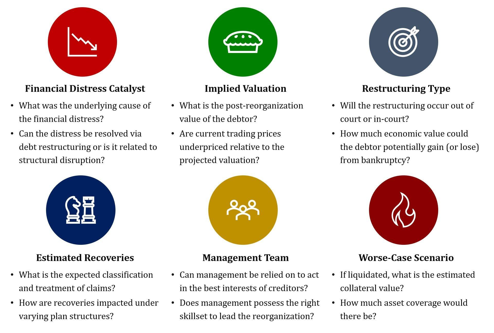

## Table of Contents

## What does it mean for a company to be bankrupt?

When a company is bankrupt, it means the company cannot pay its debts and owes more money than it has. This situation happens when a company's expenses are more than its income for a long time. Being bankrupt is a legal status, and it is decided by a court. The court will look at the company's money situation and decide if it is bankrupt.

Once a company is declared bankrupt, it has to follow certain rules. The company might have to sell its assets, like buildings or equipment, to pay back some of the money it owes. Sometimes, the company can reorganize and try to start over, but other times, it has to close down completely. Being bankrupt is a serious problem for a company and can affect everyone involved, like employees, customers, and investors.

## Why would someone consider investing in a bankrupt company?

Someone might consider investing in a bankrupt company because they believe the company can recover and become successful again. When a company goes bankrupt, it often has to sell its assets at a lower price. An investor might see this as a chance to buy the company or its parts cheaply, hoping that once the company reorganizes, it will be worth more money.

Another reason is that some bankrupt companies can still have valuable parts or products. For example, a company might have a popular brand or a new technology that could be successful if managed differently. Investors might think they can fix the problems that led to the bankruptcy and make the company profitable again. This can be risky, but if it works, the rewards can be big.

## What are the risks associated with investing in bankrupt companies?

Investing in bankrupt companies is risky because the company might not recover. When a company goes bankrupt, it often has big problems like too much debt or not enough customers. Even if an investor buys the company cheaply, fixing these problems can be hard and might cost a lot of money. If the company can't solve its issues, the investor could lose all the money they put in.

Another risk is that the process of bankruptcy can take a long time. During this time, the company's value might keep going down. The longer it takes to reorganize, the more money the investor might lose. Also, other investors or creditors might have claims on the company's assets, which means the investor might not get as much of the company as they hoped. This can make it even harder to turn the company around and make a profit.

## How can an investor identify a potentially profitable bankrupt company?

An investor can identify a potentially profitable bankrupt company by looking at what caused the bankruptcy. If the company went bankrupt because of too much debt but still has a good product or service, it might be a good investment. The investor should check if the company's problems can be fixed easily. For example, if the company just needs better management or less debt, it might be able to recover and become profitable again.

Another way to find a good bankrupt company is to look at its assets. Some companies have valuable things like buildings, equipment, or brands that can be sold or used to make money. If these assets are worth more than the company's debts, the investor might be able to buy the company cheaply and then sell the assets for a profit. It's important for the investor to do a lot of research and understand the company's financial situation before deciding to invest.

## What are the different types of bankruptcy and how do they affect investment strategies?

There are two main types of bankruptcy that affect companies: Chapter 7 and Chapter 11. Chapter 7 bankruptcy means the company has to sell all its assets to pay back its debts. This type of bankruptcy usually leads to the company closing down completely. For an investor, this means there's a high risk of losing money because there might not be anything left of the company to invest in. However, if the investor can buy the company's assets at a low price during the liquidation process, they might make a profit by selling those assets later.

Chapter 11 bankruptcy is different because it allows the company to reorganize and try to keep operating. The company makes a plan to pay back its debts over time and might change how it does business. This type of bankruptcy can be a good opportunity for investors who believe the company can fix its problems and become successful again. They might invest in the company during its reorganization, hoping that once it's back on its feet, the value of their investment will go up. However, this is still risky because the company might not recover, and the investor could lose money.

## What role does the bankruptcy court play in the investment process?

The bankruptcy court is very important in the investment process for a bankrupt company. The court decides if the company is really bankrupt and which type of bankruptcy it should follow, like Chapter 7 or Chapter 11. This decision affects how investors can get involved. If it's Chapter 7, the court will make sure the company's assets are sold fairly to pay back debts. Investors might buy these assets at a low price, hoping to sell them later for a profit.

If it's Chapter 11, the court helps the company make a plan to reorganize and pay back its debts over time. The court looks at this plan to make sure it's fair to everyone involved, like the company's creditors and investors. During this time, investors can buy shares of the company or invest in its new plan, hoping that the company will recover and their investment will grow. The court's role is to make sure everything is done fairly and legally, which can affect how safe or risky an investment in a bankrupt company might be.

## How can investors participate in the restructuring of a bankrupt company?

Investors can participate in the restructuring of a bankrupt company by buying its debt or equity during the bankruptcy process. If the company is going through Chapter 11 bankruptcy, it will create a reorganization plan. Investors can buy into this plan by purchasing the company's new stocks or bonds. This gives them a chance to be part of the company's future and possibly make money if the company becomes successful again. They might also have a say in how the company is run during the reorganization, depending on how much they invest.

Another way investors can participate is by buying the company's assets if it's going through Chapter 7 bankruptcy. In this case, the company has to sell everything it owns to pay back its debts. Investors can buy these assets at a low price, hoping to sell them later for a profit. This is riskier because the company is closing down, but it can still be a good opportunity if the assets are valuable. Either way, investors need to do a lot of research and understand the company's situation before deciding to get involved.

## What are the common strategies for investing in distressed debt?

Investing in distressed debt means buying the debts of companies that are having money problems. Investors hope to buy these debts at a low price and then get more money back when the company pays its debts or sells its assets. One common strategy is called "loan-to-own." This is where investors buy a lot of the company's debt, hoping to take control of the company when it goes bankrupt. They might then turn the company around and make it profitable again, or they might just sell the company's assets for a profit.

Another strategy is called "distressed for control." Here, investors buy enough of the company's debt to have a say in how the company reorganizes during bankruptcy. They might help make a new plan for the company, hoping that their ideas will make the company successful again. Both of these strategies are risky because the company might not recover, and the investor could lose money. But if the company does well, the investor could make a big profit.

## How do liquidation and reorganization impact investment outcomes in bankruptcy?

Liquidation, which happens in Chapter 7 bankruptcy, means the company has to sell all its things to pay back what it owes. For investors, this can be risky because the company will close down and there might not be anything left to invest in. But, if an investor can buy the company's things at a low price during the sale, they might make money by selling those things later for more. The key is to find out if the company's things are worth more than its debts. If they are, the investor might make a profit, but if not, they could lose money.

Reorganization, which happens in Chapter 11 bankruptcy, gives the company a chance to fix its problems and keep going. Investors can buy into the company's new plan by getting its new stocks or bonds. This can be a good opportunity if the investor believes the company can get better and make money again. They might even help decide how the company changes during the reorganization. But, this is still risky because the company might not recover, and the investor could lose their money. If the company does well, though, the investor's investment could grow a lot.

## What are the tax implications of investing in bankrupt companies?

When you invest in a bankrupt company, you need to think about taxes. If you buy the company's debt and it gets paid back, you might have to pay taxes on the money you get. This is because the money you get from the debt is seen as income by the tax people. Also, if you buy the company's things during a liquidation and sell them later for more money, you might have to pay taxes on the profit you make. It's important to know that different kinds of investments can have different tax rules, so you should talk to a tax expert to understand what you might owe.

If you invest in a company that is reorganizing, the tax rules can be a bit different. When the company makes a new plan and you get new stocks or bonds, you might not have to pay taxes right away. But, if you sell those stocks or bonds later and make a profit, you will have to pay taxes on that profit. Sometimes, if the company doesn't do well and you lose money on your investment, you might be able to use that loss to lower your taxes. It's always a good idea to talk to a tax expert to make sure you understand all the tax rules and how they affect your investment in a bankrupt company.

## How can investors use bankruptcy filings to gain insights into a company's financial health?

Investors can use bankruptcy filings to learn a lot about a company's money problems. When a company files for bankruptcy, it has to show all its debts and what it owns in a document called a bankruptcy filing. By looking at this document, investors can see if the company has more debts than things it owns, which is a big sign of financial trouble. They can also see who the company owes money to and how much, which helps them understand how bad the situation is. This information can help investors decide if the company might be able to fix its problems or if it's likely to close down.

Another way investors can use bankruptcy filings is to look at the company's plan to get better. If the company is trying to reorganize, it will have a plan that shows how it wants to pay back its debts and keep going. Investors can read this plan to see if it seems realistic and if the company has a good chance of making money again. If the plan looks good, it might be a sign that the company could recover, and investing in it could be a good idea. But if the plan seems weak or the company's problems look too big to fix, it might be better for investors to stay away.

## What advanced strategies can expert investors use to maximize returns from bankrupt companies?

Expert investors can use a strategy called "distressed debt trading" to make money from bankrupt companies. This means they buy the company's debts at a low price, hoping to sell them later for more money or to take control of the company. They look at the company's financial situation very closely to see if its debts are worth more than what they're paying. If they think the company can get better, they might help make a new plan for it during bankruptcy. This can be risky, but if the company does well, the investor could make a big profit.

Another strategy is called "vulture investing." This is where investors look for companies that are about to go bankrupt or are already in bankruptcy. They buy the company's stocks or assets at a very low price, hoping to sell them later for a lot more money. They might also buy a lot of the company's debt to have a say in how the company reorganizes. This strategy needs a lot of research and understanding of the company's situation, but it can lead to big returns if the investor picks the right companies and the market gets better.

## References & Further Reading

[1]: Bergstra, J., Bardenet, R., Bengio, Y., & Kégl, B. (2011). ["Algorithms for Hyper-Parameter Optimization."](https://dl.acm.org/doi/10.5555/2986459.2986743) Advances in Neural Information Processing Systems 24.

[2]: ["Advances in Financial Machine Learning"](https://www.amazon.com/Advances-Financial-Machine-Learning-Marcos/dp/1119482089) by Marcos Lopez de Prado

[3]: ["Evidence-Based Technical Analysis: Applying the Scientific Method and Statistical Inference to Trading Signals"](https://www.amazon.com/Evidence-Based-Technical-Analysis-Scientific-Statistical/dp/0470008741) by David Aronson

[4]: ["Machine Learning for Algorithmic Trading"](https://github.com/stefan-jansen/machine-learning-for-trading) by Stefan Jansen

[5]: ["Quantitative Trading: How to Build Your Own Algorithmic Trading Business"](https://www.amazon.com/Quantitative-Trading-Build-Algorithmic-Business/dp/1119800064) by Ernest P. Chan