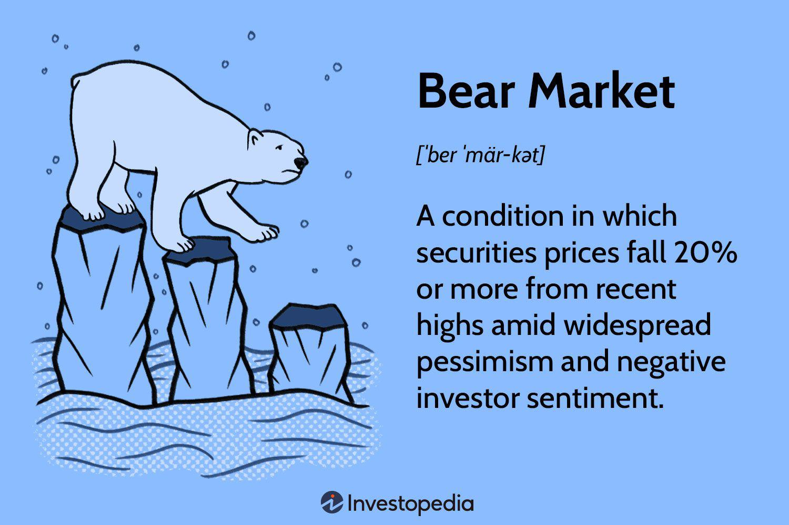

In the world of finance, bear markets present unique challenges and opportunities for investors. These market phases are characterized by a decline in asset prices, often leading to widespread uncertainty among market participants. Consequently, understanding investment strategies specifically suited for bear markets becomes crucial for those focused on long-term financial planning. During these downturns, investors must adapt their strategies to mitigate risks and potentially profit from declining markets.

This article addresses such investment strategies, with a particular emphasis on financial planning and algorithmic trading during bear markets. By employing a thoughtful approach to asset allocation and leveraging advanced trading techniques, investors can navigate these challenging periods more effectively. We will explore a range of methods designed to manage risks and exploit opportunities that arise, including the use of automated trading systems to enhance decision-making in volatile environments.



To succeed in a bear market, investors must maintain a disciplined mindset and stay informed about market trends. Through comprehensive financial planning and the adoption of appropriate trading strategies, it is possible to transform the challenges of a bear market into opportunities for growth.

## Table of Contents

## Understanding Bear Markets

A bear market is defined by a notable decline in asset prices, typically exceeding 20% from recent highs. This phenomenon is part of the broader economic cycle and occurs with some regularity, influenced primarily by economic slowdowns and geopolitical events. Understanding the nature and historical occurrences of bear markets is essential for investors aiming to effectively manage their portfolios during these periods.

Bear markets have been a recurring feature in financial markets for centuries, often following periods of economic expansion. These phases are critical junctures where asset prices adjust to new economic realities, potentially precipitated by reduced consumer spending, tightening monetary policy, or international crises. The effects of such market contractions often span across various asset classes, including stocks, commodities, and currencies.

The historical context of bear markets reveals that while they can originate from different triggers, such as the stock market crash of 1929 or the financial crisis of 2008, their cyclical nature remains consistent. During these times, investor confidence wanes, leading to a self-reinforcing decline in market prices. Understanding the typical phases of a bear market—beginning with the initial shock and leading to capitulation and eventual recovery—can help investors anticipate changes and make informed decisions.

Phases of a bear market often follow a predictable pattern: initial high prices begin to decline, sparking concern among investors. As prices continue to fall, pessimism and panic can take hold, leading to a more precipitous decline. Eventually, prices stabilize, setting the stage for recovery as confidence slowly rebuilds.

By analyzing historical data and recognizing the signs of a bear market, investors can navigate these turbulent periods more effectively. While each bear market is unique in its causes and progression, the underlying dynamics follow established patterns, providing a framework for investors to assess risks and opportunities. This comprehensive understanding equips investors to better withstand the [volatility](/wiki/volatility-trading-strategies) and potentially capitalize on the opportunities that arise during these challenging periods.

## Traditional Investment Strategies for Bear Markets

During bear markets, adhering to traditional investment strategies becomes crucial for maintaining portfolio stability and positioning for future growth. One of the foundational principles is dollar-cost averaging (DCA), which involves investing a fixed amount of money at regular intervals, regardless of market conditions. This strategy mitigates the impact of market volatility by averaging the purchase price over time, reducing the risk of making large investments during market peaks.

Moreover, diversification is essential in cushioning a portfolio against the systemic risks associated with bear markets. Allocating assets across defensive stocks, bonds, and cash allows investors to spread risk and reduce exposure to declines in any one sector. Defensive stocks, often found in sectors such as utilities and consumer staples, tend to have stable earnings and can provide steady dividends even in economic downturns. Bonds add another layer of security, offering fixed income that can balance potential losses from equities. Maintaining a portion of the portfolio in cash enables investors to take advantage of buying opportunities when asset prices are depressed.

Another critical strategy is investing only what one can afford to lose. This approach involves careful assessment and limitation of investments to amounts that will not compromise one's financial stability. By doing so, investors maintain flexibility and reduce the psychological stress associated with market declines.

Implementing these traditional strategies effectively requires discipline and patience. Staying committed to a well-defined investment plan can help navigate the uncertainties of bear markets, ultimately setting a foundation for recovery and long-term financial success once the market rebounds.

## Algorithmic Trading in Bear Markets

Algorithmic trading offers a robust method for managing investments during bear markets, leveraging technology to execute trades with precision and speed. By utilizing pre-programmed rules, these systems can efficiently identify and exploit short-selling opportunities, which are essential in declining markets. Short selling involves borrowing securities with the intention of buying them back at a lower price, profiting from the asset’s decline. Automated systems excel in quickly pinpointing these opportunities, often before human traders can react.

The advantages of [algorithmic trading](/wiki/algorithmic-trading) in bear markets extend beyond speed. Automation significantly reduces human error and emotional bias, which are common pitfalls during periods of market volatility. Emotional decision-making can lead to impulsive trades that deviate from a well-defined strategy, potentially resulting in losses. Algorithmic systems adhere strictly to their programming, ensuring that trades align consistently with predetermined criteria.

Algorithmic strategies often incorporate various technical indicators and signals. These may include moving averages, relative strength index (RSI), or Bollinger Bands, which help determine the optimal times to enter or [exit](/wiki/exit-strategy) trades based on historical price data and market trends. For instance, an algorithm may be programmed to sell a stock when its short-term moving average crosses below its long-term moving average, indicating a potential downturn.

Here is a basic example of a moving average crossover strategy using Python:

```python
import pandas as pd

data = pd.read_csv('market_data.csv')

short_window = 40
long_window = 100

data['Short_MA'] = data['Close'].rolling(window=short_window, min_periods=1).mean()
data['Long_MA'] = data['Close'].rolling(window=long_window, min_periods=1).mean()

data['Signal'] = 0
data['Signal'][short_window:] = np.where(data['Short_MA'][short_window:] > data['Long_MA'][short_window:], 1, 0)
data['Position'] = data['Signal'].diff()

# The 'Position' column will have a 1 when a buy signal occurs, and -1 for a sell signal
```

This code snippet demonstrates how simple moving averages can be computed and used to generate buy or sell signals based on their crossover, a technique often employed in algorithmic strategies. While this example is simplistic, more sophisticated algorithms can integrate [machine learning](/wiki/machine-learning) to refine trade predictions further.

Algorithmic trading systems are essential tools for managing the complexities of bear markets, providing investors with disciplined, data-driven approaches to make informed investment decisions.

## Identifying Opportunities Amidst Declines

Bear markets, typically marked by widespread declines in asset prices, can offer investors unique opportunities to acquire robust stocks at reduced prices. Historically, individuals like Warren Buffett have capitalized on such times, viewing them as favorable for long-term value investments. The rationale is straightforward: when markets are down, fundamentally strong companies become more attractively priced, enabling investors to buy quality assets at a discount. This approach hinges on the belief that markets, over the long term, tend to recover and grow, allowing the investor to realize substantial returns.

To effectively identify these opportunities amidst declining markets, investors should focus on several key criteria. First, financial health and stability of the target company are paramount. Balance sheets, cash flow statements, and income reports provide insight into a company’s robustness. Companies with low debt and strong cash flows are typically more resilient in adverse economic conditions.

Moreover, assessing intrinsic value provides another layer of analysis. This involves determining what a company's shares should be worth based on its fundamentals, rather than its current market price. One common method to calculate intrinsic value is the Discounted Cash Flow (DCF) analysis, which estimates the company's value based on its expected future cash flows, adjusted for the time value of money. A simple formula for DCF is:

$$
\text{DCF} = \sum \frac{CF_t}{(1 + r)^t}
$$

where $CF_t$ is the cash flow in year $t$ and $r$ is the discount rate.

Additionally, understanding the broader market dynamics is crucial. For instance, investing in cyclical stocks or sectors may yield high returns when the economy rebounds. Conversely, focusing on sectors with inelastic demand, such as utilities or consumer staples, can provide stability if the downturn persists. 

A strategic, informed approach allows investors to harness the opportunities presented by bear markets, ultimately leading to significant financial gains as the market recovers. Such gains are not without risk, and it is essential for investors to maintain a diversified portfolio and a long-term perspective to weather further volatility.

## Defensive vs. Offensive Strategies

Defensive strategies are crucial for investors seeking stability during bear markets. These strategies typically involve focusing on non-cyclical sectors, such as utilities and consumer staples, which tend to offer consistent returns regardless of the economic climate. Companies in these sectors provide essential goods and services that remain in demand even during economic downturns, thus offering a hedge against market volatility. For example, investing in stocks from companies that supply electricity, water, or food products can help maintain a steady portfolio value, as these industries are less susceptible to economic fluctuations.

Conversely, offensive strategies aim to capitalize on the declining prices in bear markets. These strategies may include short selling, which allows investors to profit from anticipated price declines by borrowing stocks and selling them with the intention of repurchasing them at a lower price later. Additionally, inverse Exchange-Traded Funds (ETFs) are structured to increase in value when the market index they track decreases. By utilizing these financial instruments, investors can potentially gain from market downturns.

Strategic timing is crucial when deciding between defensive and offensive strategies in bear markets. Defensive strategies are generally better suited for investors seeking capital preservation and lower risk exposure, while offensive strategies might be more appropriate for those willing to accept higher risk for potential returns. Understanding the economic indicators and market trends can aid investors in determining which approach aligns best with their financial goals and risk tolerance, ultimately enhancing investment outcomes during bear markets.

## The Role of Financial Planning

Financial planning plays a crucial role in adequately preparing for and navigating bear markets. The unpredictable nature of market downturns necessitates a structured approach to financial management to mitigate risks and capitalize on potential opportunities.

Regularly reassessing investment goals and risk tolerance is essential to ensure alignment with one's financial objectives during a bear market. This process involves evaluating current investments and determining whether they still align with long-term goals. Adjustments might include reallocating assets to reduce exposure to high-risk investments or increasing holdings in more stable sectors, such as bonds or defensive stocks. This reallocation helps maintain a balance between risk and potential returns, essential for managing portfolio volatility.

Having a well-thought-out financial plan can provide peace of mind during periods of market instability. A comprehensive financial plan outlines strategies for asset allocation, risk management, and long-term financial goals, allowing investors to make informed decisions even when the market is underperforming. It can include [liquidity](/wiki/liquidity-risk-premium) strategies, such as maintaining a cash reserve, which provides flexibility to act on investment opportunities or cover expenses without selling assets at depressed prices.

Moreover, a financial plan often incorporates stress-testing scenarios, which allow investors to model the potential impact of various market downturns on their portfolio. This proactive measure enables investors to prepare for adverse market conditions by identifying weaknesses in their current investment strategy and making necessary adjustments before a downturn occurs.

Staying disciplined and adhering to a well-crafted financial plan can prevent emotional decision-making, which often results in panic selling or market timing mistakes. During bear markets, a consistent and methodical approach, guided by a robust financial plan, helps investors navigate challenging times and positions them for recovery when markets rebound.

## Conclusion

Bear markets are inevitable occurrences within financial markets, signifying periods of declining asset prices, which can induce substantial investor anxiety. However, these downturns possess the unique potential to foster strategic financial growth. While such markets challenge standard investment paradigms, they also offer distinctive opportunities for well-prepared investors. By employing a judicious blend of traditional investment strategies alongside algorithmic trading techniques, investors can navigate these turbulent periods effectively.

Traditional investment tactics, such as diversifying portfolios with defensive assets and practicing dollar-cost averaging, provide a stable foundation during market downturns. These strategies aim to mitigate risk and preserve capital. Meanwhile, algorithmic trading introduces a systematic approach, using complex models and algorithms to identify profitable opportunities amidst volatility. Such methods can, for instance, capitalize on short-selling or deploy inverse ETFs to benefit from declining market prices, enabling investors to maintain discipline by minimizing emotional biases.

Staying informed, continuously evaluating market trends, and maintaining a disciplined investment strategy are vital in transforming market downturn challenges into opportunities. Utilizing insights from historical bear markets and remaining adaptable to evolving conditions further enhance the potential for successful outcomes. Ultimately, the combination of informed traditional strategies and advanced algorithmic approaches equips investors with the tools needed to potentially reap financial gains even during widespread market declines.

## References & Further Reading

[1]: Bergstra, J., Bardenet, R., Bengio, Y., & Kégl, B. (2011). ["Algorithms for Hyper-Parameter Optimization."](https://dl.acm.org/doi/10.5555/2986459.2986743) Advances in Neural Information Processing Systems 24.

[2]: ["Advances in Financial Machine Learning"](https://www.amazon.com/Advances-Financial-Machine-Learning-Marcos/dp/1119482089) by Marcos Lopez de Prado

[3]: ["Evidence-Based Technical Analysis: Applying the Scientific Method and Statistical Inference to Trading Signals"](https://www.amazon.com/Evidence-Based-Technical-Analysis-Scientific-Statistical/dp/0470008741) by David Aronson

[4]: ["Machine Learning for Algorithmic Trading"](https://github.com/stefan-jansen/machine-learning-for-trading) by Stefan Jansen

[5]: ["Quantitative Trading: How to Build Your Own Algorithmic Trading Business"](https://books.google.com/books/about/Quantitative_Trading.html?id=j70yEAAAQBAJ) by Ernest P. Chan