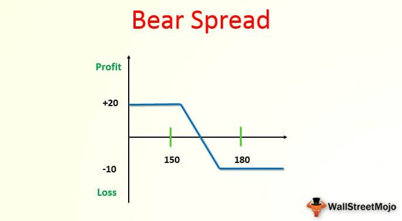

## Table of Contents

## What is a bear market and how is it different from a bull market?

A bear market is a time when the prices of things like stocks go down a lot, usually by 20% or more from their highest point. This makes people feel worried and they might sell their stocks because they think the prices will keep falling. During a bear market, people are often less confident about the economy and might spend less money.

A bull market is the opposite. It's when stock prices go up a lot over time. People feel good about the economy and are more likely to buy stocks because they think the prices will keep going up. In a bull market, there's more confidence and people might spend more money.

So, the main difference between a bear market and a bull market is how people feel about the economy and whether stock prices are going up or down. A bear market is about falling prices and less confidence, while a bull market is about rising prices and more confidence.

## Why is it important to have a strategy during bear markets?

Having a strategy during bear markets is important because it helps you know what to do when stock prices are falling and people are worried. Without a plan, you might make quick decisions that could lose you money. A good strategy can help you stay calm and make smart choices, like not selling all your stocks just because prices are going down. Instead, you might decide to keep some of your investments or even buy more stocks at lower prices, hoping they will go up again later.

A strategy also helps you protect your money. During bear markets, you can use things like diversification, which means spreading your money across different types of investments. This can lower your risk because if one investment goes down a lot, others might not go down as much. Another part of your strategy might be to have some money in safe places, like savings accounts or bonds, so you have cash if you need it. Overall, having a plan makes you ready for tough times and helps you come out stronger when the market gets better.

## What are the common characteristics of a bear market?

A bear market is when stock prices drop a lot, usually by 20% or more from their highest point. This makes people feel worried and unsure about the future. They might start selling their stocks because they think the prices will keep going down. During a bear market, there is less buying and more selling, which can make the prices fall even more. People also become less confident about the economy and might spend less money, which can make things worse.

Another common characteristic of a bear market is that it can last for a while. It's not just a quick drop and then things get better. It can go on for months or even years. This long period of falling prices can make people feel even more worried and make them less likely to invest or spend money. During this time, businesses might have a hard time because people are not buying as much, and this can lead to more job losses and economic slowdown.

Bear markets can also affect different parts of the economy in different ways. Some industries might get hit harder than others. For example, companies that rely a lot on borrowing money might struggle more because it's harder to get loans when people are worried about the economy. On the other hand, some businesses might do okay because they provide things people need no matter what, like food or medicine. Understanding these differences can help people make better choices about where to put their money during a bear market.

## How can a beginner investor identify the start of a bear market?

A beginner investor can identify the start of a bear market by watching the stock market closely. A bear market officially begins when stock prices fall by 20% or more from their highest point. You can check this by looking at stock market indexes like the S&P 500 or the Dow Jones Industrial Average. If these indexes drop by 20% or more, it's a sign that a bear market might be starting. Also, pay attention to the news and what people are saying about the economy. If more people are worried and talking about selling their stocks, it could mean a bear market is coming.

Another way to spot the start of a bear market is by noticing changes in how people feel about the economy. During the early stages of a bear market, you might see more people selling their stocks and less people buying. This can create a cycle where falling prices make people even more worried, leading to more selling and even lower prices. If you see a lot of negative news about the economy, like job losses or businesses struggling, it could be a sign that a bear market is on its way. Keeping an eye on these signs can help a beginner investor be ready for a bear market.

## What are some basic investment strategies for surviving a bear market?

One basic strategy for surviving a bear market is to keep your cool and not make quick decisions. When stock prices are falling, it's easy to get scared and sell everything. But that can be a big mistake. Instead, think about your long-term goals and stick to your plan. If you need money soon, it might be smart to move some of your investments to safer places, like a savings account or bonds. But if you don't need the money right away, you might want to keep your investments where they are. Sometimes, it can even be a good idea to buy more stocks when they're cheap, hoping they'll go up again later.

Another strategy is to spread your money around in different types of investments. This is called diversification. By putting your money in different things, like stocks, bonds, and real estate, you lower the risk that all your money will go down at the same time. If one type of investment does badly, another might do better and help balance things out. Also, having some money in safe places, like a savings account, can give you peace of mind and cash if you need it during tough times. Remember, bear markets don't last forever, so having a plan and sticking to it can help you come out okay on the other side.

## How can diversification help during bear markets?

Diversification means spreading your money across different types of investments, like stocks, bonds, and real estate. This can help during bear markets because if one type of investment goes down a lot, the others might not go down as much. For example, if the stock market is falling, your bonds or real estate might still be doing okay. This can help balance out your losses and make your overall investment less risky.

By having a mix of investments, you're not putting all your eggs in one basket. During a bear market, when stock prices are dropping, having some money in safer places like bonds can give you peace of mind. Bonds usually don't go down as much as stocks during tough times, so they can help protect your money. Diversification doesn't stop bear markets from happening, but it can make them easier to handle and help you keep more of your money safe until things get better.

## What role do defensive stocks play in a bear market strategy?

Defensive stocks are types of stocks that do better than others during a bear market. These are usually companies that make things people need no matter what, like food, medicine, or utilities. When the economy is doing badly and people are worried about money, they still need to buy these things. So, even when stock prices are falling everywhere else, defensive stocks might not go down as much. This makes them a good choice for people who want to protect their money during tough times.

Including defensive stocks in your investment plan can help you feel safer during a bear market. Instead of having all your money in stocks that might lose a lot of value, you can put some of it in defensive stocks. This way, if other parts of your investments are going down, the defensive stocks might stay steady or even go up a little. It's like having a safety net that can help you keep more of your money safe until the market starts to get better.

## How can an investor use dollar-cost averaging in a bear market?

Dollar-cost averaging is a way to invest money little by little over time, instead of all at once. During a bear market, when stock prices are going down, this can be a good strategy. Instead of trying to guess when the market will hit its lowest point, you can put a set amount of money into stocks regularly. This means you'll buy more shares when prices are low and fewer when prices are high. Over time, this can help you pay less on average for your investments.

Using dollar-cost averaging in a bear market can also help you stay calm and stick to your plan. When stock prices are falling, it's easy to get scared and want to stop investing. But if you keep putting money in regularly, you don't have to worry about timing the market perfectly. You just keep going with your plan, buying stocks at different prices. This can make it easier to handle the ups and downs of a bear market and come out stronger when things get better.

## What advanced strategies can be used to profit from bear markets?

One advanced strategy to profit from bear markets is called short selling. This means you borrow stocks from someone else and sell them right away, hoping to buy them back later at a lower price. If the stock price goes down like you thought, you can buy the stocks back cheaper, give them back to the person you borrowed them from, and keep the difference as profit. It's risky because if the stock price goes up instead, you could lose a lot of money. But in a bear market, when prices are falling, short selling can be a way to make money from those falling prices.

Another strategy is to invest in inverse ETFs. These are special funds that go up in value when the market goes down. They're designed to move in the opposite direction of the stock market or a specific index. So, if the market drops by 10%, an inverse ETF might go up by 10%. This can be a way to make money during a bear market without having to short sell individual stocks. But like short selling, inverse ETFs can be risky because they use a lot of borrowing to try to make bigger gains, which can also lead to bigger losses if things don't go as planned.

A third strategy is to use options trading. Options are contracts that give you the right to buy or sell a stock at a certain price before a certain date. In a bear market, you can buy put options, which let you sell a stock at a set price even if the market price drops lower. If the stock price falls below the set price, you can make money by selling the stock at the higher price you locked in with the option. Options trading can be complicated and risky, but it can also be a way to profit from falling stock prices during a bear market.

## How do options and short selling work as strategies during bear markets?

Options trading can be a way to make money during bear markets. With options, you can buy something called a put option. This gives you the right to sell a stock at a certain price before a certain date. If the stock price falls below that price, you can sell the stock at the higher price you locked in with the option and make money from the difference. It's like betting that the stock will go down. But options trading can be tricky and risky because if the stock price doesn't fall like you thought, you could lose the money you spent on the option.

Short selling is another way to profit from a bear market. When you short sell, you borrow stocks from someone else and sell them right away. You hope the stock price will go down so you can buy the stocks back later at a lower price. Then you give the stocks back to the person you borrowed them from and keep the difference as profit. It's like betting against the stock. Short selling can be very risky because if the stock price goes up instead, you could lose a lot of money. But in a bear market, when prices are falling, it can be a way to make money from those falling prices.

## What are the psychological challenges investors face during bear markets and how to overcome them?

During bear markets, investors often face a lot of psychological challenges. One big challenge is fear. When stock prices keep going down, it's easy to get scared and think things will never get better. This fear can make people sell their investments at the wrong time, losing money they could have kept if they had waited. Another challenge is doubt. People might start doubting their investment plan and feel like they made bad choices. This can make them want to change their strategy in a hurry, which can lead to more mistakes. Finally, there's the pressure from others. Friends, family, or the news might be talking about how bad things are, making it hard to stay calm and stick to your plan.

To overcome these challenges, it's important to stay calm and focused on your long-term goals. Remember that bear markets don't last forever, and the market will go up again. One way to stay calm is to not check your investments too often. Looking at them every day can make you feel more worried. Instead, check them less often and remind yourself of your plan. It can also help to talk to someone you trust, like a financial advisor, who can give you good advice and help you feel more confident. Lastly, keep learning about the market. The more you know, the less scary it will seem, and the better you'll be at making smart choices even when things are tough.

## How should an investor adjust their long-term investment strategy in anticipation of and during bear markets?

When an investor sees that a bear market might be coming, they should start by looking at their long-term investment plan. They should think about their goals and how long they plan to keep their money invested. If they don't need the money for a long time, they might decide to keep their investments the same and not sell, even if prices are falling. But if they think they might need the money soon, they might want to move some of their money into safer places, like savings accounts or bonds. This can help protect their money if the market keeps going down. Another good idea is to spread their money around in different types of investments. This is called diversification, and it can help lower the risk that all their money will go down at the same time.

During a bear market, it's important for investors to stay calm and stick to their plan. They shouldn't sell all their investments just because prices are falling. Instead, they might want to keep some of their money in the market, hoping that prices will go up again later. Sometimes, it can even be a good idea to buy more stocks when they're cheap. This can help them make more money when the market gets better. It's also a good time to think about defensive stocks, which are stocks in companies that make things people need no matter what, like food or medicine. These stocks might not go down as much during a bear market, so having some of them can help protect an investor's money.

## How can we identify opportunities amidst declines?

Bear markets, characterized by a significant downturn in stock prices, can present opportunities for astute investors. During such periods, many stocks are often traded below their intrinsic value, providing potential for substantial returns once the market stabilizes.

### Acquiring Strong Stocks at Discounted Prices

During bear markets, investors can capitalize on opportunities to purchase shares in robust companies at notably reduced prices. This approach requires a focus on firms that exhibit strong financial health, stability, and intrinsic value. Key indicators of a company’s financial health include low debt levels, consistent cash flow, and a history of stable earnings. These attributes suggest that a company is well-positioned to withstand economic downturns and recover during market upheavals.

**Example Calculation**: Suppose a company's stock price falls 30% during a bear market, but its intrinsic value remains unchanged. If the intrinsic value is calculated using the Discounted Cash Flow (DCF) model where:

$$
\text{Intrinsic Value} = \frac{CF_1}{(1 + r)^1} + \frac{CF_2}{(1 + r)^2} + \ldots + \frac{CF_n}{(1 + r)^n}
$$

where $CF_n$ represents future cash flows and $r$ is the discount rate. Stocks trading below this calculated intrinsic value may be considered undervalued, presenting a buying opportunity.

### Broader Market Dynamics: Cyclical and Defensive Sectors

A comprehensive understanding of broader market dynamics, including the performance of cyclical and defensive sectors, is critical during bear markets. Cyclical sectors, such as consumer discretionary and industrials, tend to perform poorly during economic downturns due to reduced consumer spending. Conversely, defensive sectors, including utilities and consumer staples, often maintain stable performance as they provide essential products and services regardless of economic conditions.

By analyzing these sectors, investors can make informed decisions on asset allocation that exploit sector-specific opportunities. Defensive stocks may serve as a safer harbor during market declines, whereas cyclical stocks may offer high returns if purchased near the bottom of a bear market.

### Strategic Approach for Substantial Gains

A strategic approach during bear markets involves patience and timing to maximize gains. Investors should employ rigorous research and analysis to select stocks that are not only priced attractively due to the downturn but also possess long-term growth potential. This involves a thorough evaluation of a company's business model, competitive advantages, and market position.

In bear markets, traditional valuation metrics like the price-to-earnings (P/E) ratio can serve as useful tools to identify undervalued stocks. A lower P/E ratio compared to the industry average often signals a potentially undervalued company.

Through systematic analysis and strategic investment decisions, investors can transform market adversity into significant profit opportunities, effectively turning market declines into avenues for financial growth.

## References & Further Reading

[1]: Bergstra, J., Bardenet, R., Bengio, Y., & Kégl, B. (2011). ["Algorithms for Hyper-Parameter Optimization."](https://dl.acm.org/doi/10.5555/2986459.2986743) Advances in Neural Information Processing Systems 24.

[2]: ["Advances in Financial Machine Learning"](https://www.amazon.com/Advances-Financial-Machine-Learning-Marcos/dp/1119482089) by Marcos Lopez de Prado

[3]: ["Evidence-Based Technical Analysis: Applying the Scientific Method and Statistical Inference to Trading Signals"](https://www.amazon.com/Evidence-Based-Technical-Analysis-Scientific-Statistical/dp/0470008741) by David Aronson

[4]: ["Machine Learning for Algorithmic Trading"](https://github.com/stefan-jansen/machine-learning-for-trading) by Stefan Jansen

[5]: ["Quantitative Trading: How to Build Your Own Algorithmic Trading Business"](https://github.com/LucindaYa/quant-resources/blob/master/Quantitative%20Trading%20How%20to%20Build%20Your%20Own%20Algorithmic%20Trading%20Business.pdf) by Ernest P. Chan