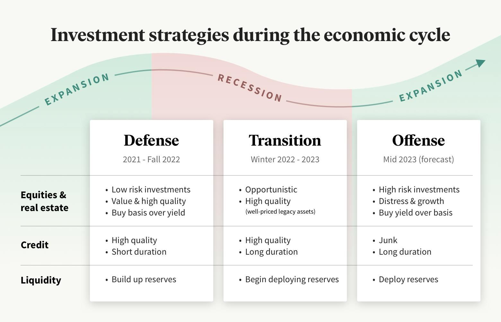

## Table of Contents

## What is an economic recession and how is it defined?

An economic recession is a time when the economy of a country slows down a lot. It means that people are buying less, businesses are making less money, and many people might lose their jobs. A common way to know if there is a recession is if the country's total output of goods and services, called Gross Domestic Product (GDP), goes down for two quarters in a row. That's six months of the economy shrinking.

Recessions can happen for many reasons. Sometimes, it's because people suddenly stop spending as much money, maybe because they're worried about the future. Other times, it can be because of big problems in the world, like a financial crisis or a global health emergency. When a recession happens, governments and central banks often try to help by lowering interest rates or spending more money to boost the economy. But it can take time for these actions to work, and in the meantime, many people can struggle.

## Why is it important to adjust investment strategies during a recession?

It's important to adjust your investment strategies during a recession because the economy is changing a lot. When the economy is shrinking, some investments that did well before might not do well anymore. For example, companies that sell things people don't need, like luxury items, might see their sales drop a lot. If you keep your money in those kinds of investments, you could lose a lot. By changing your strategy, you can move your money into safer places, like bonds or companies that provide essential services, which are more likely to keep doing well even when times are tough.

Also, during a recession, prices of many investments can go down a lot. This can be a good time to buy things that you think will go back up in value when the economy gets better. It's like buying things on sale. But you need to be careful and pick the right investments. If you don't change your strategy, you might miss out on these opportunities to buy low and sell high later. Adjusting your investments can help you protect your money and maybe even make more money when the economy starts to recover.

## What are the common effects of a recession on different types of investments?

During a recession, different types of investments can be affected in different ways. Stocks, which are shares in companies, often go down in value because companies make less money and people are less likely to buy their products. This can be especially true for stocks of companies that sell things people don't really need, like luxury goods. On the other hand, stocks of companies that provide things people always need, like food or medicine, might not go down as much or might even go up a bit.

Bonds, which are loans you give to a government or a company, can be safer during a recession. People often move their money into bonds because they want to keep their money safe. This can make bond prices go up. But if the economy gets really bad, even some bonds can lose value, especially if the company or government that issued them is having a hard time paying back the loan.

Real estate, like houses and buildings, can also be affected. During a recession, fewer people might want to buy houses, so prices can go down. But if you already own a house and don't need to sell it right away, it might not be a big problem for you. Some types of real estate, like apartments that people rent, might still do okay because people always need a place to live.

## How can diversification help in managing risk during economic downturns?

Diversification means spreading your money across different types of investments. It's like not putting all your eggs in one basket. When you diversify, you have a mix of things like stocks, bonds, and maybe even real estate. If one type of investment goes down in value during a recession, the others might not go down as much or might even go up. This can help you lose less money overall because you're not depending on just one thing to do well.

For example, if you only had stocks in companies that sell luxury items, you could lose a lot of money when people stop buying those things during a recession. But if you also had some money in bonds or in stocks of companies that sell things people always need, like food, those parts of your investment might be okay. By having different kinds of investments, you can protect your money better and feel more secure, even when the economy is going through tough times.

## What are some safe investment options during a recession?

During a recession, some safe investment options include government bonds. These are loans you give to the government, and they're usually very safe because the government can almost always pay you back. People often move their money into government bonds during tough times because they want to keep their money safe. This can make the price of bonds go up, which is good for you if you already own them.

Another safe option is investing in companies that provide things people always need, like food, medicine, or utilities. These are called defensive stocks. Even when the economy is bad, people still need to eat, take medicine, and use electricity. So, these companies usually don't lose as much money as others during a recession. This can make their stocks a safer place to put your money.

You might also consider putting some money into cash or a savings account. While you won't make a lot of money this way, your money will be very safe. It's a good idea to have some cash on hand during a recession so you can pay your bills and take care of yourself, even if things get really tough.

## How does the concept of 'buying low' apply to investing in a recession?

The idea of 'buying low' means you buy things when their price is down. During a recession, many investments like stocks go down in price because people are worried and selling their investments. If you think the economy will get better later, this can be a good time to buy. You're getting the investments at a lower price than usual, so when the economy recovers and the prices go back up, you can make more money.

It's like shopping for a sale. Imagine your favorite store has a big sale because not many people are buying things. You can buy things you like at a lower price. If you wait until the sale is over and prices go back up, you'll have to pay more. In a recession, the 'sale' is on investments. By buying low during a recession, you're hoping to sell high later when the economy gets better.

## What role do bonds play in a recessionary investment strategy?

Bonds are like loans you give to a government or a company. They can be a safe place to put your money during a recession. When the economy is doing badly, people often move their money into bonds because they want to keep their money safe. This can make the price of bonds go up, which is good if you already own them. Government bonds, especially, are seen as very safe because the government can almost always pay you back.

In a recession, having some of your money in bonds can help balance out the risk of other investments like stocks. Stocks can go down a lot during a recession, but bonds usually don't lose as much value. By having bonds in your investment mix, you can protect your money better. If you need to sell some investments to pay for things during tough times, you can sell your bonds and still get most of your money back.

## How can investors use dollar-cost averaging to their advantage during economic downturns?

Dollar-cost averaging means you invest a fixed amount of money at regular times, like every month. During a recession, this can help you because prices of investments like stocks often go down. When you keep investing the same amount every month, you end up buying more shares when prices are low. This can be a good thing because when the economy gets better and prices go up again, you'll have more shares to sell at a higher price.

This strategy can also help you not worry so much about when to buy. Trying to guess the best time to buy can be hard and stressful. With dollar-cost averaging, you don't need to guess. You just keep investing the same amount no matter what the market is doing. Over time, this can help you buy investments at a lower average price, which can lead to bigger gains when the economy recovers.

## What are the potential benefits and risks of investing in stocks during a recession?

Investing in stocks during a recession can have some big benefits. One of the main benefits is that you can buy stocks at lower prices. When the economy is bad, many people sell their stocks, which makes the prices go down. If you think the economy will get better later, buying stocks now can be like getting them on sale. When the economy recovers and stock prices go back up, you can make a lot of money. Another benefit is that some companies, like those that sell things people always need, might not go down as much in price. Investing in these kinds of companies can be safer and still give you good returns.

But there are also risks to investing in stocks during a recession. The biggest risk is that the economy might get worse before it gets better. If you buy stocks and the prices keep going down, you could lose a lot of money. It can be hard to know when the economy will start to recover, so you might have to wait a long time before you see any gains. Another risk is that even if you pick good companies, the whole stock market can go down a lot during a recession. This means that even safe stocks might lose value. So, while there's a chance to make money, there's also a chance to lose money if things don't go as planned.

## How should one assess their risk tolerance when adjusting investment strategies in a recession?

When you're thinking about changing your investment strategy during a recession, it's really important to know how much risk you're okay with. Risk tolerance is about how much you can handle your investments going up and down in value without getting too worried. During a recession, things can get pretty bumpy, so you need to think about how much you can handle that. If you're someone who gets really stressed when your money goes down, even for a little while, you might want to stick with safer investments like bonds or cash. But if you're okay with some ups and downs and think you can wait it out until the economy gets better, you might be fine with taking more risks, like investing in stocks.

To figure out your risk tolerance, think about your goals and how long you plan to keep your money invested. If you need your money soon, like in a year or two, you probably can't take big risks because you won't have time to wait for the economy to recover. But if you're investing for the long term, like for retirement that's many years away, you might be able to handle more risk. Also, think about your other money stuff, like if you have a steady job and savings to fall back on. If you do, you might be okay with taking more risks with your investments. But if you're not sure about your job or money situation, you might want to play it safe.

## What advanced strategies can experienced investors use to capitalize on market conditions during a recession?

Experienced investors can use a strategy called short selling to make money during a recession. Short selling means you borrow stocks from someone else and sell them right away, hoping to buy them back later at a lower price. If the stock price goes down like you thought it would, you can buy the stocks back cheaper, give them back to the person you borrowed them from, and keep the difference as profit. This can be a good way to make money when stock prices are falling, but it's risky because if the stock price goes up instead, you could lose a lot of money.

Another strategy is to invest in sectors that do well during a recession, like healthcare or utilities. These are called defensive sectors because people always need medicine, electricity, and water, no matter how the economy is doing. By putting money into these kinds of companies, you can protect your investments better. You might not make as much money as you would in good times, but you're less likely to lose a lot. Experienced investors can also look for undervalued stocks, which are stocks that are selling for less than they're really worth. If you can find these and buy them during a recession, you could make a big profit when the economy gets better and the stock prices go back up.

Lastly, some investors use options trading to take advantage of a recession. Options are contracts that give you the right to buy or sell a stock at a certain price. You can use options to bet on whether a stock will go up or down. If you think a stock will go down, you can buy a put option, which lets you sell the stock at a higher price than it's currently trading at. If the stock does go down, you can make money from the difference. Options can be very powerful tools, but they're also very risky and complicated, so they're usually best for people who really know what they're doing.

## How can investors use economic indicators to predict and prepare for recessions?

Investors can use economic indicators to help them guess when a recession might be coming. One important indicator is the Gross Domestic Product (GDP), which is the total value of all the goods and services a country makes. If GDP goes down for two quarters in a row, it's a sign that a recession might be happening. Another useful indicator is the unemployment rate. When more people are out of work, it can mean the economy is slowing down. Investors also look at things like consumer spending, business investments, and the stock market. If these are going down, it could be a warning that a recession is on the way.

Once investors see these signs, they can start to prepare. They might move their money into safer investments like government bonds or cash to protect it. They could also use strategies like dollar-cost averaging to keep investing a little bit at a time, even when prices are low. This way, they can buy more shares at a lower price and be ready to make money when the economy gets better. By paying attention to economic indicators, investors can make smarter choices and be ready for tough times.

## References & Further Reading

#