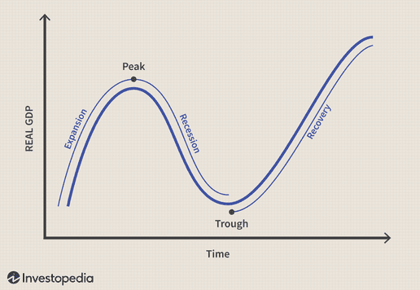

Economic downturns and recessions are inevitable parts of the economic cycle, affecting both market behavior and investor sentiment. These periods, characterized by a decline in economic activity, can evoke uncertainty among investors but also present unique opportunities for astute market participants. Navigating such turbulent times requires a comprehensive understanding of effective investment strategies that mitigate risk while capitalizing on potential gains.

A fundamental aspect of surviving and thriving during recessions is discerning which investment approaches are likely to perform well under adverse conditions. This is where algorithmic trading, or algo trading, becomes highly relevant. Algo trading employs complex algorithms to automate the trading process, enabling rapid, data-driven decisions that exploit market inefficiencies, particularly in volatile environments. This strategic advantage allows investors to adapt swiftly to changing market dynamics, potentially enhancing returns while controlling for risk.



This article aims to explore several investment strategies with a particular emphasis on algorithmic trading during recessions. It will discuss the nature of economic downturns, traditional methods of investment in such climates, and the burgeoning role of technology-driven trading strategies. By examining these diverse approaches, investors can better prepare for market fluctuations, transforming challenges into actionable opportunities, and positioning themselves advantageously in the economic cycle.

## Table of Contents

## Understanding Economic Downturns and Recessions

Economic downturns and recessions are integral phases of the business cycle, characterized by a decline in economic activity across the economy. A recession is typically defined as two consecutive quarters of negative gross domestic product (GDP) growth. These periods are marked by declining output, rising unemployment, and waning consumer confidence, which collectively signal a slowdown in economic function.

Historically, recessions have varied in their causes and impacts. For example, the Great Depression of the 1930s was precipitated by a stock market crash, massive bank failures, and ultimately catastrophic declines in aggregate demand. More recently, the Great Recession of 2007-2009 was triggered by the burst of the housing bubble, leading to a financial crisis and a severe global economic contraction. Each recession left distinctive marks on markets, often leading to shifts in investment strategies, policy reforms, and changes in regulatory frameworks.

Economic indicators play a vital role in identifying and understanding recessions. GDP, a comprehensive measure of an economy’s overall production, is often the principal indicator used to signify economic health. A decline in GDP indicates lower production levels and diminished economic output. Unemployment rates rise during recessions as businesses curtail production and services, leading to layoffs. Rising unemployment further depresses consumer spending, exacerbating economic woes.

Consumer confidence is another crucial indicator. It reflects how optimistic consumers feel about the state of the economy and their expected financial situation. Low consumer confidence can lead to reduced consumer spending, which is a significant component of economic activity. Thus, a decline in consumer confidence often precedes or accompanies recessions.

Despite the presence of these indicators, predicting downturns remains inherently challenging. Economic forecasting relies heavily on complex models and historical data, yet unforeseen variables and abrupt market dynamics can invalidate predictions. Additionally, the timing and severity of downturns can be influenced by a multitude of factors such as global events, policy changes, and technological advancements.

However, early preparedness can offer strategic advantages. Being prepared enables investors and policymakers to implement measures that may mitigate the impacts, such as diversifying investments, strengthening financial regulations, and promoting economic stimulus programs. The lessons learned from past recessions underscore the importance of vigilance and adaptability in navigating economic uncertainties.

## Traditional Investment Strategies During Recessions

Diversification across different asset classes is a fundamental strategy to mitigate risks during recessions. By spreading investments across various asset types, such as stocks, bonds, and commodities, investors can reduce the impact of losses in any single sector. This strategy leverages the principle that not all asset classes will react the same way to economic downturns. For example, when equities suffer, bonds often perform better as investors move to safer assets, thus balancing the overall portfolio performance.

Investing in recession-resistant industries is another effective strategy during economic downturns. Industries such as utilities and consumer staples provide essential services and goods that remain in demand regardless of economic conditions. Companies in the utilities sector, which offers water, electricity, and gas, often enjoy stable revenue due to the necessity of their services. Similarly, consumer staples, which include essential goods like food and household products, maintain steady demand. Investing in these sectors can provide a buffer against the [volatility](/wiki/volatility-trading-strategies) and declines experienced in other industries during a recession.

Bonds and other fixed-income securities play a crucial role in stabilizing portfolios during recessions. These investments generally offer fixed returns and are considered lower-risk compared to equities. Government bonds, in particular, are viewed as a safe haven, as they are backed by the full faith and credit of the government. During periods of economic stress, investors often increase their allocation to bonds to reduce portfolio volatility and secure a predictable income stream.

Maintaining a long-term investment perspective is critical during downturns. While short-term market fluctuations can be unsettling, historical data suggests that markets tend to recover over time. By keeping a long-term view, investors can remain focused on their investment goals without making impulsive decisions based on short-term market trends. This approach allows investors to take advantage of market recoveries and the compounding of returns, ultimately leading to potential long-term gains.

In summary, adopting traditional investment strategies such as diversification, investing in recession-resistant industries, and allocating to bonds can enhance portfolio resilience during economic downturns. Additionally, maintaining a long-term perspective helps investors navigate the challenges of recessions while positioning themselves for future growth.

## The Rise of Algorithmic Trading in Recession Investing

Algorithmic trading, often referred to as algo trading, is a method of executing orders using automated and pre-programmed trading instructions. These instructions account for variables such as time, price, and [volume](/wiki/volume-trading-strategy), and are based on complex mathematical formulas and models. The primary objective of [algorithmic trading](/wiki/algorithmic-trading) is to maximize efficiency by executing trades at the optimal moment with minimal human intervention. This approach is particularly beneficial during economic downturns and recessions due to its ability to swiftly capitalize on market inefficiencies.

During economic downturns, markets tend to become more volatile and inefficient, providing opportunities for algo trading strategies to thrive. One common strategy is [arbitrage](/wiki/arbitrage), which involves exploiting price discrepancies of the same asset in different markets. For example, if a stock is trading at a lower price on one exchange compared to another, an algorithm can be programmed to buy the stock on the cheaper exchange and sell it on the more expensive one almost simultaneously, thereby locking in a risk-free profit.

Another popular strategy is trend-following, which is predicated on the idea that asset prices exhibit trends. During recessions, markets often reflect exaggerated trends due to panic selling or speculative buying. Algorithms can be designed to identify these trends by analyzing historical price data and execute trades that align with the developing trend. This strategy leverages the [momentum](/wiki/momentum) of price movements, identifying potential entry and [exit](/wiki/exit-strategy) points without being swayed by emotional biases.

The proliferation of algorithmic trading has been facilitated by significant technological advancements. High-frequency trading ([HFT](/wiki/high-frequency-trading-strategies)), a subset of algorithmic trading, relies on powerful computers and high-speed internet connections to execute a large number of orders at incredibly fast speeds. This technology allows traders to make quick decisions based on real-time market data, something that traditional human traders might find challenging.

Moreover, improvements in [machine learning](/wiki/machine-learning) and [artificial intelligence](/wiki/ai-artificial-intelligence) have further advanced algo trading. Machine learning algorithms can analyze vast amounts of historical data to detect patterns or anomalies that might indicate a profitable trading opportunity. Such algorithms can also continuously learn and adapt to changing market conditions, thereby enhancing their effectiveness.

Python, a popular programming language among traders, offers numerous libraries and frameworks such as Pandas for data manipulation, NumPy for numerical computations, and TensorFlow for machine learning, making it an ideal choice for developing sophisticated trading algorithms. Below is a simple example of a Python code snippet that uses historical stock data to identify a trend-following opportunity:

```python
import pandas as pd
import numpy as np

# Load historical stock data
data = pd.read_csv('historical_stock_data.csv')

# Calculate moving averages
data['Short_MA'] = data['Close'].rolling(window=40).mean()
data['Long_MA'] = data['Close'].rolling(window=100).mean()

# Identify trading signals
data['Signal'] = np.where(data['Short_MA'] > data['Long_MA'], 1, 0)

# Calculate daily returns
data['Daily_Return'] = data['Close'].pct_change()

# Calculate strategy returns
data['Strategy_Return'] = data['Signal'].shift(1) * data['Daily_Return']

# Total return
total_return = data['Strategy_Return'].sum()

print(f"Total strategy return: {total_return:.2%}")
```

This snippet calculates the short and long moving averages of a stock and generates buy signals when the short moving average crosses above the long moving average, suggesting an upward trend.

In summary, algorithmic trading's ability to exploit market inefficiencies, coupled with technological advancements, makes it an increasingly essential tool for investors during recessions. By incorporating advanced data analysis and execution strategies, it allows investors to navigate volatile markets with enhanced precision and reduced emotional bias.

## Developing an Effective Algo Trading Strategy for Recession Markets

Developing an effective algorithmic trading strategy for recession markets requires a systematic approach that considers asset selection, platform choice, and rigorous [backtesting](/wiki/backtesting). These components are essential for building robust strategies that can withstand the unique challenges of economic downturns.

**Asset Selection**

Choosing the right assets is crucial in algorithmic trading, especially during recessionary periods. Asset selection involves identifying securities that not only align with the trading goals but also tend to perform reliably during market contractions. Common assets include equities, currencies, and commodities that exhibit [liquidity](/wiki/liquidity-risk-premium) and volatility, providing ample opportunities for trading. During recessions, it's prudent to focus on recession-resistant sectors such as consumer staples, healthcare, and utilities, which typically experience steadier demand.

**Platform Choice**

The success of an algorithmic trading strategy greatly depends on the choice of trading platform. Ideal platforms offer robust infrastructure, low latency, and access to a wide range of financial instruments. Popular platforms like MetaTrader, QuantConnect, and [Interactive Brokers](/wiki/interactive-brokers-api) provide traders with sophisticated tools and APIs suitable for developing and executing complex trading algorithms. These platforms offer features such as real-time data feeds, backtesting capabilities, and integration with programming languages like Python and C++, which are essential for designing effective trading strategies.

**Backtesting**

Backtesting is indispensable for validating algorithmic trading strategies against historical data. It enables traders to assess the potential effectiveness of a strategy by simulating its performance in past market conditions. This process can highlight strengths and weaknesses, allowing for refinements before deployment in live markets. A simple Python code snippet for backtesting might include libraries such as Pandas for data manipulation and Backtrader for executing strategy testing:

```python
import backtrader as bt

class MyStrategy(bt.Strategy):
    def __init__(self):
        self.sma = bt.indicators.SMA(self.data.close, period=15)

    def next(self):
        if not self.position:
            if self.data.close[0] > self.sma[0]:
                self.buy()
        elif self.data.close[0] < self.sma[0]:
            self.sell()

data = bt.feeds.YahooFinanceData(dataname='AAPL', fromdate=datetime(2010, 1, 1), todate=datetime(2020, 1, 1))
cerebro = bt.Cerebro()
cerebro.addstrategy(MyStrategy)
cerebro.adddata(data)
cerebro.run()
cerebro.plot()
```

The above code demonstrates a simple strategy using a 15-period simple moving average (SMA) to generate buy/sell signals for Apple (AAPL) stock data from Yahoo Finance.

**Illustrative Codes and Frameworks**

Traders can leverage various frameworks to streamline the development of algorithmic trading models. Libraries such as Zipline, PyAlgoTrade, and Quantlib offer extensive functionalities for strategy development, testing, and execution. These frameworks facilitate the integration of complex statistical and machine learning models into trading strategies, thus enhancing their predictive accuracy and adaptiveness to recessionary market conditions.

**Popular Platforms and Tools**

Algo traders frequently use tools like QuantConnect, which provides a cloud-based algorithmic backtesting environment, and Interactive Brokers' Trader Workstation (TWS) for its comprehensive market access. Additionally, data analysis and visualization tools such as Python's SciPy, NumPy, and Matplotlib are staples for traders looking to refine and optimize their strategies.

Developing an algorithmic trading strategy for recession markets involves careful planning and execution. By selecting the right assets, utilizing advanced trading platforms, and conducting thorough backtesting, traders can better position themselves to capitalize on market opportunities during economic downturns.

## Risks and Considerations in Algorithmic Trading

Algorithmic trading, while offering numerous advantages in handling market volatility, carries inherent risks that must be carefully managed to ensure effective and ethical investment practices. Understanding these risks and implementing necessary safeguards is crucial for sustainable algorithmic trading.

One of the primary risks in algorithmic trading is overfitting, which occurs when a trading algorithm is excessively tailored to historical data, capturing noise rather than valid patterns. Overfitting can lead to models that perform well on past data but fail to generalize to new, unseen market conditions. This risk can be mitigated by employing rigorous backtesting techniques, where the algorithm is tested against out-of-sample data. Cross-validation methods, such as k-fold cross-validation, can provide more reliable performance evaluations by splitting data into training and testing segments.

Technological dependencies introduce another layer of risk. Algo trading systems heavily rely on computational infrastructure and data feeds, making them vulnerable to system failures, latency issues, and data inaccuracies. Ensuring robust and redundant systems, along with real-time monitoring, can alleviate such risks. Moreover, unexpected market events can lead to high-frequency trading exploits, requiring algorithms to be designed with adaptive capabilities to handle various market scenarios.

Risk management frameworks are pivotal in mitigating potential losses. These frameworks incorporate techniques such as stop-loss orders, diversification, and portfolio hedging. Algorithms can be coded to monitor risk exposure continuously and adjust positions accordingly. For instance, a risk management script in Python might look like this:

```python
def manage_risk(portfolio, max_loss_threshold):
    for position in portfolio:
        if position.current_loss >= max_loss_threshold:
            position.sell()

# Example usage
portfolio = get_portfolio()
manage_risk(portfolio, max_loss_threshold=0.05)
```

Continuous monitoring and optimization of trading algorithms are essential for sustained performance. Market conditions can evolve, rendering previously successful strategies obsolete. As a result, algorithms must undergo regular evaluations and refinements. Automated logging systems and performance analytics tools can aid traders in identifying when and how their algorithms need adjustments.

Ethical considerations and compliance are paramount in algorithmic trading to maintain market integrity and investor trust. Algorithms should comply with existing financial regulations and not engage in manipulative practices, such as spoofing or wash trading. Additionally, traders must respect data privacy laws and avoid executing trades based on non-public information. Ensuring compliance requires keeping abreast of regulatory changes and integrating checks into the algorithmic workflow to prevent unethical trades.

Overall, while algorithmic trading offers powerful tools for navigating recessions, a comprehensive understanding of associated risks and proactive management approaches is indispensable for achieving optimal investment outcomes.

## Conclusion

Recessions pose challenges, yet they offer unique opportunities for investors who approach them with informed strategies. Combining traditional investment strategies with algorithmic trading can enhance financial outcomes. Traditional approaches such as diversification, investing in recession-resistant industries, and maintaining a long-term perspective have long provided a solid foundation during economic downturns. However, the rise of technology and algorithmic trading has introduced new dimensions to recession investing. Algo trading can exploit market inefficiencies and execute trades with speed and precision, offering a strategic advantage when markets are volatile.

Success in these turbulent times requires vigilance and adaptability. Market conditions can change rapidly, and staying informed about economic indicators and market trends is crucial. Algorithmic trading systems can be designed to monitor these dynamics in real-time, allowing for quick adjustments to investment strategies.

Preparedness through strategic investment decisions is key to turning challenges into lucrative opportunities during recessions. Traditional and algorithmic strategies, when effectively integrated, can optimize investment portfolios. This integrated approach not only mitigates risks but also positions investors to capitalize on the opportunities that arise even in the most uncertain economic climates. By remaining agile and informed, investors can navigate the complexities of recessions and potentially achieve significant financial gains.

## References & Further Reading

### References & Further Reading

For those seeking to expand their knowledge of economic downturns and algorithmic trading, a broad range of resources is available, including academic research papers, industry analyses, [books](/wiki/algo-trading-books), and online courses.

#### Academic and Industry Research Papers

1. **"Riding the Wave of Decay: Algorithmic Trading Strategies in Financial Markets"** by Srinivasan Vidhyashankar and others. This paper explores how algorithmic trading can exploit temporary inefficiencies in financial markets during periods of economic uncertainty. It provides mathematical models and case studies explaining algo strategies.

2. **"Recessions and the Performance of Financial Markets"** by Michael Greenway. This research details historical recession trends and their impacts on various financial markets, offering a deep understanding of the recessionary phases and potential investment strategies.

3. **"Adaptive Trading Algorithms for Market Prediction"** by Daniel Borovkov and others. This article discusses the principles of adaptive algorithms in volatile markets, providing insights into how these algorithms are crafted to handle economic downturns effectively.

#### Books

1. **"Algorithmic Trading: Winning Strategies and Their Rationale"** by Ernest P. Chan. This book offers readers a comprehensive understanding of algorithmic trading strategies that can be employed during economic downturns. It includes real-world examples and code snippets in Python for practical implementation.

2. **"When Markets Collide: Investment Strategies for the Age of Global Economic Change"** by Mohamed El-Erian. This book provides insights into strategic investment during periods of global economic turmoil, explaining how traditional and modern trading strategies can be integrated effectively.

3. **"The Atlas of Economic Complexity: Mapping Paths to Prosperity"** by Ricardo Hausmann. Although not exclusively about trading, this book offers insightful analysis on economic data patterns and complexities which are critical for understanding macroeconomic downturns.

#### Online Courses

1. **Coursera: "Algorithmic Trading Strategies" by the University of Oxford**. This course is equipped with analytical tools and theories necessary to design and implement algorithmic trading strategies. It includes interactive sessions on how to handle market crises effectively.

2. **edX: "Algorithmic Trading and Finance Models with Python, R, and Stata Essential Training" by UC Irvine**. This course covers programming essentials for creating trading models, focusing on the application of these strategies during economic downturns.

3. **Udemy: "Python for Financial Analysis and Algorithmic Trading"**. A practical course aimed at those with a basic understanding of Python who wish to explore financial analysis and develop trading strategies that are robust in recessionary markets.

These resources offer a robust starting point for further exploration, providing both the theoretical foundation and practical skills necessary to navigate the complexities of recession investing and algorithmic trading.

