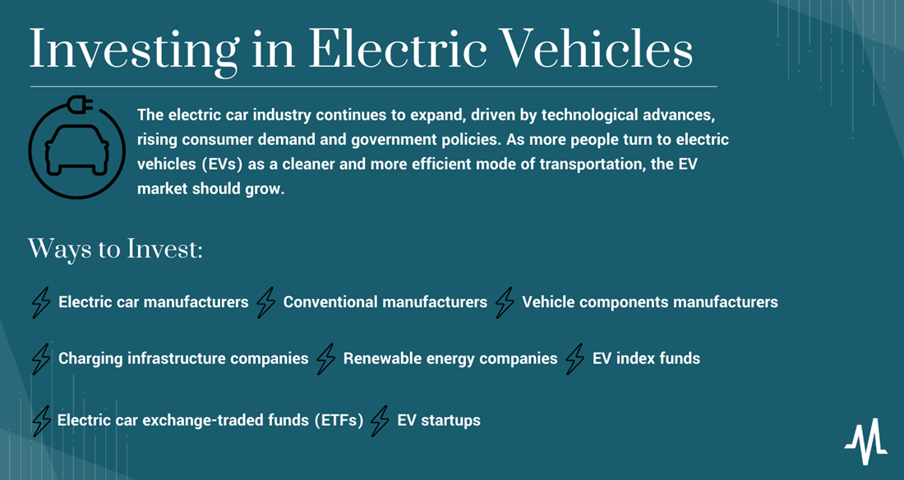

## Table of Contents

## What are electric vehicles and why are they important for investment?

Electric vehicles, or EVs, are cars that run on electricity instead of gasoline. They use batteries to store energy and electric motors to move. EVs are becoming more popular because they are better for the environment. They don't produce harmful gases like regular cars do. Also, they can be cheaper to run because electricity is often less expensive than gas.

EVs are important for investment because they are the future of transportation. Many countries want to use less oil and reduce pollution, so they are encouraging people to buy EVs. This means that companies making EVs and their parts, like batteries, are growing fast. Investing in these companies can be a good idea because the demand for EVs is expected to keep increasing. As more people switch to EVs, the companies that make them could become very successful.

## What are the basic types of investment opportunities in the electric vehicle industry?

There are several basic types of investment opportunities in the electric vehicle industry. One way to invest is by buying stocks in companies that make electric cars, like Tesla or Nissan. These companies are working hard to make better and cheaper EVs, and if they succeed, their stock prices could go up. Another way is to invest in companies that make parts for EVs, like batteries or charging stations. Companies like LG Chem and ChargePoint are examples of this. As more people buy EVs, the need for these parts will grow, which could make these companies more profitable.

Another type of investment is in companies that help with the technology behind EVs. This includes companies working on software for self-driving cars or improving battery life. For example, NVIDIA is known for its work on autonomous driving technology. Investing in these companies can be risky but also rewarding if their technology becomes popular. Finally, you can also invest in funds or ETFs that focus on the EV industry. These funds spread your money across many different companies, which can be safer than [picking](/wiki/asset-class-picking) just one or two stocks. Examples include the Global X Autonomous & Electric Vehicles [ETF](/wiki/etf-trading-strategies).

## How can beginners start investing in electric vehicle companies?

For beginners looking to invest in electric vehicle companies, a good first step is to open a brokerage account. This is like a bank account but for buying and selling stocks. You can choose from many online brokers like Robinhood or E*TRADE. Once your account is set up, you can start researching different electric vehicle companies. Look at big names like Tesla, but also consider smaller companies or those that make parts like batteries. It's important to read about each company to understand what they do and how they are doing financially.

After you've done your research, you can start buying stocks. You don't need a lot of money to begin; even a small amount can get you started. If picking individual stocks seems too hard, you can also invest in an ETF that focuses on electric vehicles. ETFs are like baskets of stocks, so you're investing in many companies at once, which can be less risky. As you learn more and gain confidence, you can slowly add more to your investments. Remember, investing is a long-term game, so be patient and keep learning.

## What are the key factors to consider when evaluating electric vehicle stocks?

When you're thinking about buying stocks in electric vehicle companies, it's important to look at a few key things. First, consider the company's financial health. This means checking if they are making money or losing it. You can find this out by looking at their income statements and balance sheets. Also, think about how much they are growing. Are more people buying their cars? Are they selling more batteries or other parts? Growth is a good sign that the company could do well in the future.

Another thing to think about is the competition. The electric vehicle market is getting crowded, so you need to see if the company you're interested in can keep up. Do they have new technology or special features that others don't? Also, pay attention to what the government is doing. Many countries are offering money or other help to people who buy electric cars, which can be good for these companies. Finally, consider the company's leadership. A good team can make a big difference in how well the company does.

In summary, when picking electric vehicle stocks, look at the company's money situation, how fast they are growing, who they are competing against, what help they are getting from the government, and who is running the company. All these things can help you decide if investing in that company is a good idea.

## How do government policies and incentives impact electric vehicle investments?

Government policies and incentives play a big role in the electric vehicle industry. Many countries want to reduce pollution and use less oil, so they offer money or tax breaks to people who buy electric cars. These incentives make electric vehicles cheaper for buyers, which means more people will buy them. When more people buy electric cars, the companies that make them and their parts do better. This can make their stocks go up, which is good for investors.

Also, governments sometimes help electric vehicle companies directly. They might give them money to build factories or do research. This support can help these companies grow faster and be more successful. For investors, this means that companies in countries with strong government support might be safer bets. But, it's important to keep an eye on these policies because they can change. If a government decides to cut back on incentives, it could hurt the companies and their stock prices.

## What are the risks associated with investing in electric vehicle startups?

Investing in electric vehicle startups can be risky because they are new and might not make money for a long time. These companies often need a lot of money to build their cars and factories. They might not have enough money to keep going if they can't sell enough cars or if they run into problems. Also, they have to compete with big companies like Tesla and traditional car makers that are also making electric cars. If the startup can't keep up, it could fail, and investors could lose their money.

Another risk is that electric vehicle startups depend a lot on new technology. If their technology doesn't work well or if something better comes along, their plans could fall apart. They also need to follow lots of rules and safety standards, which can be hard and expensive. Plus, the whole electric vehicle market can change quickly. If people stop wanting electric cars or if the government stops helping with money or tax breaks, these startups could have a hard time. So, while investing in electric vehicle startups can be exciting, it's important to know these risks and be ready for them.

## How can investors diversify their portfolio within the electric vehicle sector?

Investors can diversify their portfolio in the electric vehicle sector by investing in different types of companies. Instead of putting all their money into one big electric car maker like Tesla, they can also invest in smaller startups or companies that make parts like batteries or charging stations. This way, if one company doesn't do well, the others might still be doing okay. For example, investing in a battery maker like LG Chem or a charging station company like ChargePoint can balance out the risk of investing in just one car maker.

Another way to diversify is by investing in funds or ETFs that focus on the electric vehicle industry. These funds hold stocks from many different companies, so your money is spread out. This can be safer than picking just one or two stocks. For instance, the Global X Autonomous & Electric Vehicles ETF includes a mix of car makers, battery companies, and tech firms working on self-driving cars. By investing in such a fund, you get a piece of the whole electric vehicle market, which can help protect your investment if some parts of the market don't do well.

## What role do battery technology and infrastructure play in the investment strategy for electric vehicles?

Battery technology is a big deal when it comes to investing in electric vehicles. The batteries in these cars need to be good so the cars can go far without stopping to charge. If a company makes batteries that are better and cheaper than others, their stock might go up. Investors should look at companies like Panasonic or LG Chem, which make batteries for electric cars. These companies could do well if more people buy electric cars because they will need more batteries. But, if a new kind of battery comes along that is even better, it could change things for these companies. So, it's important to keep an eye on what's happening with battery technology.

Infrastructure for charging electric cars is also important for investors to think about. If there aren't enough places to charge electric cars, people might not want to buy them. Companies that build charging stations, like ChargePoint or EVgo, could be good investments if the number of electric cars keeps growing. The more charging stations there are, the easier it is for people to use electric cars, which can help the whole industry grow. But, building these stations costs a lot of money, and it can take time for these companies to start making a profit. So, investors need to be patient and think about how the charging network is growing when they make their investment choices.

## How can advanced investors use options and futures to enhance their electric vehicle investment strategy?

Advanced investors can use options and futures to enhance their electric vehicle investment strategy by taking advantage of the potential for higher returns and better risk management. Options give investors the right, but not the obligation, to buy or sell a stock at a set price before a certain date. For example, if an investor thinks that Tesla's stock will go up, they can buy a call option. This means they can buy Tesla stock at today's price even if it goes up in the future. If they are wrong and the stock goes down, they only lose the money they paid for the option, which can be less than buying the stock outright. On the other hand, if they think the stock will go down, they can buy a put option to sell the stock at a higher price than it might be worth later. This way, they can make money if the stock price falls.

Futures, on the other hand, are agreements to buy or sell something at a future date at a price set today. They can be used to bet on the future price of electric vehicle stocks or commodities like lithium, which is used in batteries. For instance, if an investor believes that the demand for lithium will increase because more electric cars are being made, they can buy lithium futures. If the price of lithium goes up, they can sell the futures at a profit. Futures can also be used to hedge against price changes. If an investor owns a lot of stock in a battery company and is worried about a drop in lithium prices hurting the company, they can sell lithium futures to protect their investment. Using options and futures can be tricky and risky, so advanced investors need to understand these tools well before using them.

## What are the global market trends affecting electric vehicle investments?

Electric vehicle investments are being shaped by many global market trends. One big trend is that more and more countries are trying to cut down on pollution and use less oil. They are doing this by giving money or tax breaks to people who buy electric cars. This makes electric vehicles cheaper and more people want to buy them. When more people buy electric cars, the companies that make them and their parts do better. This can make their stocks go up, which is good for investors. Also, many countries are setting rules that say they will stop selling cars that use gas in the future. This means electric cars will become even more important, and companies that make them could grow a lot.

Another trend is that technology for electric vehicles is getting better and cheaper. Batteries are getting better, so electric cars can go further without needing to charge. This makes them more useful for people. Also, more companies are working on self-driving cars, which could be electric. If these cars become popular, it could be good for electric vehicle companies. But, there are also challenges. There is a lot of competition in the electric vehicle market, and not all companies will do well. Also, the price of things like lithium, which is used in batteries, can change a lot. This can affect how much it costs to make electric cars and how much money companies make. So, investors need to keep an eye on these trends to make smart choices about where to put their money.

## How do supply chain dynamics influence investment decisions in the electric vehicle industry?

Supply chain dynamics play a big role in how investors make decisions about electric vehicle companies. The supply chain is all the steps and parts needed to make a car, from getting raw materials like lithium for batteries to putting the car together. If there are problems in the supply chain, like not enough lithium or delays in getting parts, it can make it harder for electric vehicle companies to make their cars. This can slow down their growth and hurt their profits. Investors need to think about these risks when they decide where to put their money. If a company has a strong supply chain and can get what it needs easily, it might be a safer investment.

On the other hand, if a company is having trouble with its supply chain, it might not be a good time to invest. For example, if there's a shortage of batteries, companies that make electric cars might have to wait longer to finish their cars, which can make them lose money. Also, if the price of raw materials like lithium goes up a lot, it can make it more expensive for companies to make their cars. This can affect how much profit they make and how much their stocks are worth. So, investors need to keep an eye on what's happening with supply chains and be ready to change their plans if things get better or worse.

## What are the long-term investment strategies for capitalizing on the growth of the electric vehicle market?

For long-term investment in the electric vehicle market, one good strategy is to invest in a mix of companies. Instead of putting all your money into one big car maker like Tesla, you can also invest in smaller startups or companies that make parts like batteries or charging stations. This way, if one company doesn't do well, the others might still be okay. Another way to do this is by investing in funds or ETFs that focus on the electric vehicle industry. These funds hold stocks from many different companies, so your money is spread out. This can be safer than picking just one or two stocks. As the electric vehicle market grows, having a diverse portfolio can help you benefit from the overall growth of the industry.

Another strategy is to pay attention to what's happening with technology and government policies. Battery technology is really important because better batteries make electric cars more useful for people. If a company makes better and cheaper batteries, their stock might go up. Also, governments around the world are giving money or tax breaks to people who buy electric cars, which can help these companies grow. But, it's important to keep an eye on these policies because they can change. If a government decides to cut back on incentives, it could hurt the companies and their stock prices. So, staying informed about new technology and government support can help you make smart long-term investment choices in the electric vehicle market.

## What is Algorithmic Trading in the EV Sector?

Algorithmic trading has emerged as a pivotal tool in the electric vehicle (EV) market, leveraging advanced algorithms to conduct high-[volume](/wiki/volume-trading-strategy) trades with efficiency and accuracy. These algorithms, programmed with complex mathematical models, analyze vast amounts of market data to identify patterns and trends, enabling traders to make informed decisions quickly. In a sector characterized by substantial trading volumes and [volatility](/wiki/volatility-trading-strategies), such as EVs, [algorithmic trading](/wiki/algorithmic-trading) offers a significant advantage.

Key components of algorithmic trading include data collection, pattern recognition, and execution strategies. Algorithms collect and process real-time data from various sources such as stock prices, trading volumes, and news feeds. They utilize pattern recognition techniques to discern signals that might predict market behavior. These signals inform the decision-making process, dictating when to buy or sell assets to maximize profit or minimize risk.

The efficiency of algorithmic trading is augmented by its ability to execute trades at high speeds with minimal manual intervention. For example, algorithms can be employed to automatically set limit orders: 

$$
\text{{Limit Order Price}} = \text{{Current Price}} \times (1 \pm \text{{Percentage Threshold}})
$$

where the percentage threshold is determined based on the trader’s strategy and risk tolerance.

Furthermore, algorithmic trading allows for the customization of strategies according to specific investor goals. It can range from simple moving average crossovers, where algorithms detect buy or sell signals based on moving average intersections, to more sophisticated [machine learning](/wiki/machine-learning) models that use historical data to predict future trends.

```python
# Example of a simple moving average crossover strategy in Python
import pandas as pd

# Assuming stock_data is a DataFrame with columns ['Date', 'Price']
short_window = 40
long_window = 100

# Calculate moving averages
stock_data['Short_MA'] = stock_data['Price'].rolling(window=short_window, min_periods=1).mean()
stock_data['Long_MA'] = stock_data['Price'].rolling(window=long_window, min_periods=1).mean()

# Generate signals
stock_data['Signal'] = 0.0  
stock_data['Signal'][short_window:] = np.where(stock_data['Short_MA'][short_window:] 
                                               > stock_data['Long_MA'][short_window:], 1.0, 0.0)  
stock_data['Position'] = stock_data['Signal'].diff()
```

Algorithms can also be equipped to optimize portfolios by assessing risk factors and ensuring diversification across a basket of EV-related assets. By balancing asset allocations based on calculated risk and expected return, algorithmic trading assists investors in achieving their investment objectives more effectively.

While algorithmic trading enhances precision and timing, it also necessitates constant monitoring and adjustment due to the dynamic nature of markets. Investors in the EV sector, thus, gain not only a powerful mechanism for executing trades but also a means to optimize their portfolios, potentially boosting returns in a competitive and fast-evolving industry.

## References & Further Reading

[1]: Hall, D., & Lutsey, N. (2019). ["Effects of Battery Manufacturing on Electric Vehicle Life-cycle Greenhouse Gas Emissions"](https://theicct.org/publication/effects-of-battery-manufacturing-on-electric-vehicle-life-cycle-greenhouse-gas-emissions/) The International Council on Clean Transportation.

[2]: Lopez de Prado, M. (2018). ["Advances in Financial Machine Learning"](https://www.amazon.com/Advances-Financial-Machine-Learning-Marcos/dp/1119482089) Wiley.

[3]: Tesla, Inc. (2023). [Investor Relations](https://ir.tesla.com/press-release/tesla-releases-fourth-quarter-and-full-year-2023-financial-results).

[4]: Aronson, D. (2006). ["Evidence-Based Technical Analysis: Applying the Scientific Method and Statistical Inference to Trading Signals"](https://www.amazon.com/Evidence-Based-Technical-Analysis-Scientific-Statistical/dp/0470008741) Wiley.

[5]: BNEF (2023). ["Electric Vehicle Outlook 2023"](https://assets.bbhub.io/professional/sites/24/2431510_BNEFElectricVehicleOutlook2023_ExecSummary.pdf) BloombergNEF.

[6]: Jansen, S. (2020). ["Machine Learning for Algorithmic Trading"](https://github.com/stefan-jansen/machine-learning-for-trading) Packt Publishing.

[7]: Chan, E. P. (2009). ["Quantitative Trading: How to Build Your Own Algorithmic Trading Business"](https://github.com/ftvision/quant_trading_echan_book) Wiley.

[8]: plugpower.com. [Plug Power: Hydrogen Fuel Cell Solutions](https://www.plugpower.com/fuel-cell-power/).