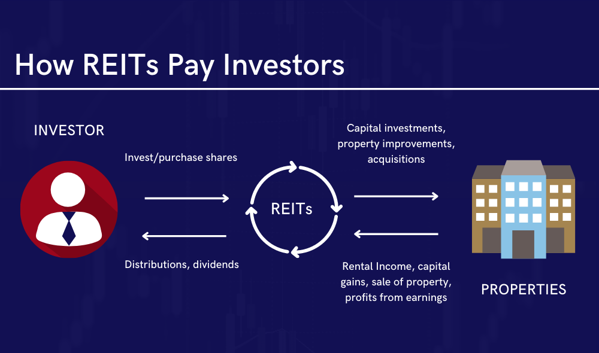

## Table of Contents

## What are REITs and how do they work?

REITs, or Real Estate Investment Trusts, are companies that own, operate, or finance income-generating real estate. They allow individuals to invest in large-scale, income-producing real estate without having to buy, manage, or finance properties themselves. By investing in a REIT, people can earn a share of the income produced through real estate, similar to how they might earn dividends from stocks.

REITs work by pooling money from many investors to purchase a portfolio of properties. These properties can include apartment buildings, shopping centers, offices, or even hotels. The income generated from these properties, mainly through rent, is then distributed to the investors as dividends. To qualify as a REIT, a company must pay out at least 90% of its taxable income as dividends to shareholders, which means REITs often offer high dividend yields compared to other investments.

## What are the different types of REITs available for investment?

There are three main types of REITs: equity REITs, mortgage REITs, and hybrid REITs. Equity REITs own and manage real estate properties. They make money by renting out the properties and collecting rent from tenants. This is the most common type of REIT, and investors get income from the rent as well as potential gains if the property value goes up.

Mortgage REITs, on the other hand, don't own physical properties. Instead, they invest in mortgages or mortgage-backed securities. They earn income from the interest on these loans. This type of REIT can be riskier because it depends a lot on interest rates and the health of the mortgage market.

Hybrid REITs combine the features of both equity and mortgage REITs. They own properties and also invest in mortgages. This mix can help balance the risks and rewards, giving investors a bit of both worlds. Each type of REIT has its own benefits and risks, so it's important to understand them before investing.

## How can beginners start investing in REITs?

Beginners can start investing in REITs by first understanding what they are and the different types available. REITs are like companies that own and manage real estate, and you can invest in them to earn money from rent or interest. There are equity REITs, which own properties and collect rent; mortgage REITs, which invest in mortgages and earn interest; and hybrid REITs, which do both. Knowing these types helps you pick the one that fits your investment goals.

Once you know about REITs, you can start investing through a brokerage account. You can open one with a bank or an online broker. After opening the account, you can search for REITs listed on stock exchanges, just like you would search for stocks. You can then buy shares in the REITs you're interested in. It's a good idea to start with a small amount of money and learn as you go. Remember, like any investment, REITs come with risks, so it's important to do your research and maybe talk to a financial advisor before you start.

## What are the key factors to consider when choosing a REIT to invest in?

When choosing a REIT to invest in, one of the first things to look at is the type of properties it owns. Different REITs focus on different kinds of real estate, like apartments, shopping centers, or office buildings. Each type can have different risks and rewards. For example, apartment REITs might be more stable because people always need a place to live, while retail REITs can be riskier because shopping habits can change.

Another key [factor](/wiki/factor-investing) is the financial health of the REIT. You want to look at things like the dividend yield, which tells you how much money you might get back from your investment. Also, check the payout ratio to see if the REIT is paying out more money than it's making, which could be a red flag. It's also good to look at the REIT's debt levels because too much debt can be risky.

Lastly, consider the management team and the REIT's track record. A good management team can make smart decisions that help the REIT grow and perform well. You can also look at how the REIT has done in the past to see if it's been a good investment. Remember, past performance doesn't guarantee future results, but it can give you a sense of what to expect.

## How do REITs generate income for investors?

REITs generate income for investors mainly through the rent they collect from their properties. When you invest in an equity REIT, you're basically buying a piece of a bunch of buildings, like apartments or shopping centers. The people or businesses that use these buildings pay rent, and that rent money gets shared with all the investors as dividends. Since REITs have to pay out at least 90% of their taxable income to shareholders, this can mean pretty good dividends for investors.

If you invest in a mortgage REIT, the income comes from a different place. Instead of owning buildings, these REITs lend money to people buying properties or buy mortgage-backed securities. They make money from the interest on these loans. This interest is then shared with investors as dividends. So, even though they don't own physical properties, mortgage REITs still give investors a way to earn money from real estate.

## What are the tax implications of investing in REITs?

When you invest in REITs, you need to know about the taxes. The dividends you get from REITs are usually taxed as regular income, not as the lower tax rate for qualified dividends from stocks. This means you might pay more in taxes on the money you earn from REITs. Also, if you sell your REIT shares for more than you paid, you'll have to pay capital gains tax on the profit.

There's another thing to think about with REITs: the dividends can sometimes include a part that's considered a return of capital. This part isn't taxed right away. Instead, it reduces your cost basis in the REIT, which can affect your taxes when you sell the shares. It's a good idea to keep track of these details and maybe talk to a tax advisor to understand how investing in REITs will affect your taxes.

## How does the performance of REITs compare to other real estate investments?

REITs and other real estate investments like buying a rental property or investing in a real estate fund can give you different results. REITs are easy to buy and sell because they're traded on stock exchanges, just like stocks. This means you can get in and out of your investment quickly. But, the value of REITs can go up and down a lot because they're affected by the stock market. On the other hand, if you buy a rental property, you might get steady rental income, but it takes a lot more work and money to buy and manage the property.

When you look at how much money you can make, REITs often give you higher dividends than other real estate investments because they have to pay out most of their income to shareholders. But, the total return, which includes both the dividends and any increase in the price of the REIT, can be different from year to year. With a rental property, your return depends on rent and how much the property's value goes up over time. Real estate funds might give you a mix of these, but they can have fees that eat into your profits. So, each type of real estate investment has its own way of making money, and which one is better can depend on what you want and how much risk you're okay with.

## What are some common strategies for diversifying a REIT investment portfolio?

One way to diversify a REIT investment portfolio is to invest in different types of REITs. Instead of putting all your money into one kind, like only equity REITs that own apartment buildings, you can spread it out. You could invest in some mortgage REITs that deal with loans, and some hybrid REITs that do a bit of both. This way, if one type of REIT doesn't do well, the others might help balance it out.

Another strategy is to look at REITs that focus on different kinds of properties. For example, you might invest in REITs that own shopping centers, others that own office buildings, and some that own warehouses. Different types of properties can do well at different times, so having a mix can help protect your investment. Also, you can think about investing in REITs in different parts of the country or even in different countries. This can help because real estate markets can be strong in one place but weak in another.

Lastly, you can diversify by mixing REITs with other kinds of investments. Instead of just having REITs, you could also invest in stocks, bonds, or even other real estate investments like rental properties. This way, if the real estate market has a tough time, your other investments might still do well. It's all about spreading your money around to lower the risk and maybe get a better overall return.

## How can investors use leverage to enhance returns from REITs?

Investors can use leverage to enhance returns from REITs by borrowing money to buy more shares than they could with their own cash. When the REIT's value goes up or when it pays dividends, the investor can make more money because they own more shares. But, using leverage is risky. If the REIT's value goes down, the investor could lose more money than they put in because they still have to pay back the loan.

It's important to be careful with leverage. While it can make your gains bigger, it can also make your losses bigger. If the REIT doesn't do well, you might not have enough money from dividends to pay back the loan, and you could end up owing money. So, it's a good idea to think about how much risk you're okay with before using leverage to invest in REITs.

## What are the risks associated with investing in REITs and how can they be mitigated?

Investing in REITs comes with some risks. One big risk is that the value of the REIT can go up and down a lot because it's affected by the stock market. If the real estate market has a tough time, the value of the REIT can drop, and you might lose money. Another risk is that REITs often use a lot of debt to buy properties, and if they can't pay back the loans, it can hurt the REIT's value. Also, the dividends from REITs are taxed as regular income, which might be higher than taxes on other types of investments. This can eat into your returns.

You can do some things to lower these risks. One way is to diversify your investments. Instead of putting all your money into one REIT, you can invest in different types of REITs, like ones that own different kinds of properties or are in different parts of the country. This way, if one REIT doesn't do well, the others might help balance it out. Another way is to be careful with how much you borrow to invest in REITs. Using too much borrowed money can make your losses bigger if the REIT's value goes down. Lastly, it's a good idea to keep an eye on the real estate market and the economy. If you see signs that things might get tough, you can adjust your investments to be safer.

## How do macroeconomic factors influence REIT performance?

Macroeconomic factors can have a big impact on how well REITs do. Things like interest rates, the economy, and even inflation can make a difference. When interest rates go up, it can be harder for REITs to borrow money to buy properties, which might slow down their growth. Also, if the economy is doing badly, people and businesses might not be able to pay rent, which means less money coming in for the REIT. On the other hand, when the economy is strong, more people can afford to rent, and that can help REITs make more money.

Inflation can also affect REITs. When prices go up, the cost of running properties, like fixing them up or paying for utilities, can go up too. But, if REITs can raise the rent to match inflation, it might not be so bad. Another thing to think about is how the job market is doing. If a lot of people have jobs, they're more likely to rent apartments or office spaces, which is good for REITs. But if a lot of people lose their jobs, it can be hard for REITs because fewer people can afford to pay rent. So, keeping an eye on these big economic factors can help you understand how REITs might do in the future.

## What advanced analytical tools can experts use to evaluate REITs?

Experts can use advanced analytical tools to evaluate REITs by looking at financial ratios and models. One common tool is the Funds From Operations (FFO), which shows how much money a REIT makes from its operations. FFO is better than just looking at net income because it doesn't count the money lost from selling properties. Another tool is the Adjusted Funds From Operations (AFFO), which takes FFO and subtracts the costs of maintaining and fixing up properties. This gives a clearer picture of how much money the REIT really has to pay out to investors. Experts also use the Net Asset Value (NAV) to see if the REIT's market price is a good deal compared to what its properties are worth.

Another important tool is the Discounted Cash Flow (DCF) model, which helps predict how much money the REIT will make in the future and what that money is worth today. By using DCF, experts can see if the REIT is a good investment based on future earnings. They also look at the REIT's debt levels with tools like the Debt-to-Equity ratio, which shows how much the REIT has borrowed compared to what it owns. A high ratio can mean more risk, but it can also help the REIT grow if the real estate market is doing well. By using these tools, experts can make better decisions about which REITs to invest in.

## How can one analyze and select REITs?

Analyzing and selecting Real Estate Investment Trusts (REITs) requires a thorough understanding of key financial metrics and operational factors. Two critical metrics for evaluating REITs are Funds From Operations (FFO) and Adjusted Funds From Operations (AFFO). These metrics provide insights into a REIT's cash flow and profitability, excluding non-cash charges like depreciation that are not indicative of the true economic performance of real estate assets.

FFO is calculated by adding depreciation and amortization to earnings and subtracting any gains on sales of properties. The formula is:

$$
\text{FFO} = \text{Net Income} + \text{Depreciation} + \text{Amortization} - \text{Gains from Sales of Assets}
$$

AFFO further refines FFO by accounting for capital expenses necessary to maintain property value and operations, providing a more accurate picture of sustainable cash flow available for distribution to shareholders. AFFO is often considered a more realistic measure for evaluating the earnings potential of a REIT.

Net Asset Value (NAV) is another vital consideration, representing the value of a REIT's portfolio minus any liabilities. It is used to assess whether a REIT is trading at a premium or discount compared to its intrinsic value. Calculating NAV involves summing the market value of all properties, subtracting liabilities, and dividing by the number of outstanding shares.

Investors should evaluate other qualitative factors beyond financial metrics. The expertise and track record of the REIT's management team are crucial as they directly impact strategic decisions and operational efficiency. Additionally, the property portfolio's quality, diversity, and geographic spread influence the stability and growth potential of returns. A diversified portfolio can minimize risks associated with specific sectors or locations adversely affected by economic shifts or market trends.

Market trends affecting the real estate sector, such as demographic changes, economic cycles, and regulatory developments, should also be considered to anticipate potential impacts on a REIT's performance. Staying informed about these dynamics enables investors to make well-rounded decisions.

Finally, maintaining diversification within REIT types and geographic locations can mitigate risks and enhance returns. Diversification reduces dependence on any single market or property type, providing a buffer against localized downturns and sector-specific challenges. By incorporating these considerations, investors can more effectively analyze and select REITs that align with their financial goals and risk tolerance.

## References & Further Reading

[1]: Bergstra, J., Bardenet, R., Bengio, Y., & Kégl, B. (2011). ["Algorithms for Hyper-Parameter Optimization."](https://papers.nips.cc/paper/4443-algorithms-for-hyper-parameter-optimization) Advances in Neural Information Processing Systems 24.

[2]: ["Advances in Financial Machine Learning"](https://www.amazon.com/Advances-Financial-Machine-Learning-Marcos/dp/1119482089) by Marcos Lopez de Prado

[3]: ["Evidence-Based Technical Analysis: Applying the Scientific Method and Statistical Inference to Trading Signals"](https://www.amazon.com/Evidence-Based-Technical-Analysis-Scientific-Statistical/dp/0470008741) by David Aronson

[4]: ["Machine Learning for Algorithmic Trading"](https://github.com/stefan-jansen/machine-learning-for-trading) by Stefan Jansen

[5]: ["Quantitative Trading: How to Build Your Own Algorithmic Trading Business"](https://www.amazon.com/Quantitative-Trading-Build-Algorithmic-Business/dp/1119800064) by Ernest P. Chan