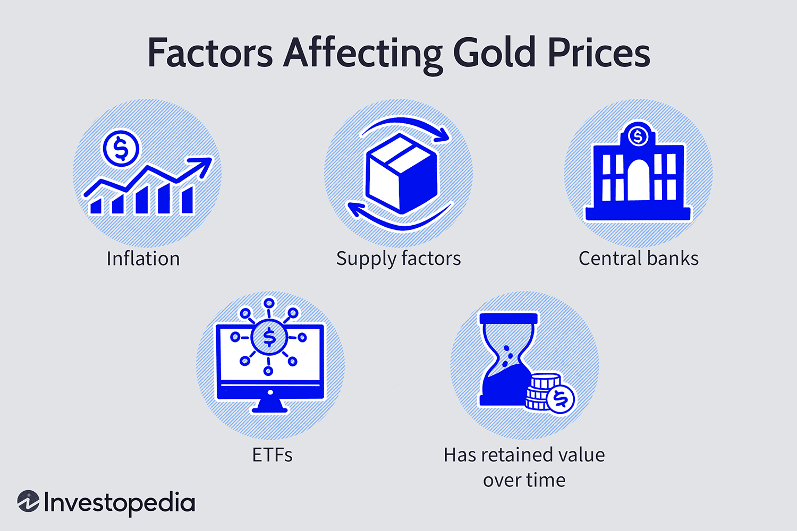

Gold has long been a fundamental asset in investment portfolios, esteemed for its ability to preserve wealth, especially during periods of economic uncertainty. With its historical significance and enduring value, gold attracts investors seeking stability and diversity in their holdings. This article aims to provide a comprehensive guide to investing in gold by examining various methods and strategies, from traditional means like owning physical gold to modern approaches such as gold ETFs and mining stocks. In addition, we will discuss how algorithmic trading can play a pivotal role in optimizing returns from gold investments by using technology to enhance decision-making and execution. Understanding the unique value proposition of gold is essential for investors to make well-informed decisions and capitalize on potential opportunities in the gold market. By exploring these facets, investors can be better equipped to navigate the complexities of gold investment and enhance their overall investment strategy.

## Table of Contents



## Understanding Gold as an Investment

Gold has been a cornerstone in investment strategies, often considered a safeguard during economic fluctuations. Its primary appeal lies in its role as a hedge against inflation and currency devaluation. When inflation erodes the purchasing power of money, gold's inherent value tends to rise, preserving wealth over time. This characteristic has solidified its reputation as a safe haven during volatile market conditions.

Historically, gold has been prized both as a medium of exchange and a store of value. Its enduring appeal stems from its rarity, durability, and universal acceptance. During periods of market instability or geopolitical tension, investors flock to gold, resulting in price stability and often appreciation. Unlike stocks or bonds, gold does not generate income through dividends or interest. However, it has displayed a consistent upward trajectory in value, making it an attractive option for long-term investors. 

The unique attribute of gold is its lack of correlation with traditional financial assets, such as equities and fixed-income securities. While financial markets may be swayed by economic data, interest rates, or corporate earnings reports, gold prices often move independently. This non-correlation provides a diversification benefit, reducing overall portfolio risk. By including gold in a diversified portfolio, investors can mitigate potential losses from adverse movements in stock and bond markets.

Although gold does not offer the periodic payouts associated with other investments, its historical performance and role as an inflation hedge position it as a vital component of a well-rounded investment strategy. The metal's ability to maintain and potentially increase in value amidst economic downturns makes it a prudent choice for those seeking stability and security in their financial plans.

## Ways to Invest in Gold

Investing in gold offers a range of options, each catering to different investor preferences, risk levels, and investment goals. Below are the principal methods through which investors can gain exposure to gold:

1. **Physical Gold**: This involves purchasing tangible gold products, such as bullion bars or coins. Physical gold is often regarded as a direct way to own gold since it comes with no counterparty risk. However, buyers must consider secure storage solutions and insurance to protect against theft or loss. This form of investment may pose liquidity challenges as selling physical gold can be less straightforward compared to other investment forms.

2. **Gold Exchange-Traded Funds (ETFs) and Mutual Funds**: Gold ETFs are investment funds traded on stock exchanges, much like individual stocks. These funds typically track the price of gold and allow investors to gain exposure to gold without the need to handle it physically. One of the primary advantages is liquidity, as ETFs can be easily bought and sold on exchanges. They also remove the concerns about storage and security that come with physical ownership. Mutual funds, while similar, may provide a broader diversification within the precious metals sector but often come with higher management fees compared to ETFs.

3. **Gold Mining Stocks**: Investing in gold mining stocks involves buying shares in companies that mine for gold. This approach offers the potential for leveraged gains if the mining operations are successful and the gold prices are rising. However, it also increases exposure to company-specific risks, such as management efficiency and operational costs, which can affect company performance independently of gold prices. 

4. **Futures and Options**: These derivatives provide speculative opportunities on the future price movements of gold. Futures contracts involve agreeing to buy or sell gold at a predetermined price at a specified date in the future. Options, on the other hand, give the holder the right, but not the obligation, to buy or sell gold at a set price before the contract expires. While these instruments offer the potential for significant returns due to their leverage, they are inherently risky and require a sophisticated understanding of the market dynamics. They are most suitable for seasoned investors who can afford higher risk in exchange for possible higher rewards.

Each method of investing in gold presents its unique set of advantages and challenges, making it crucial for investors to assess their own risk tolerance, investment timeline, and financial goals when choosing how to invest in gold.

## Algorithmic Trading in Gold Investments

Algorithmic trading plays a transformative role in gold investments by leveraging advanced technology to automate trading strategies. This form of trading utilizes algorithms—sets of defined instructions or rules—to execute trades. These algorithms can analyze vast amounts of market data at high speeds, enabling rapid decision-making and execution. The primary advantage of this speed and efficiency is the potential to maximize profits through timely market responses.

Algorithms in trading are designed to identify market trends, analyze historical data, and execute trades automatically based on pre-set rules. For instance, a common algorithmic strategy may involve mean reversion or [momentum](/wiki/momentum) indices, where trades are executed when the gold price deviates from or aligns with historical averages. Python is often used in this domain due to its robust libraries for data analysis and algorithm development. An example of such a strategy in Python could involve using libraries like NumPy and pandas to compute moving averages and execute trades when certain conditions are met.

```python
import pandas as pd
import numpy as np

# Simulated gold price data
gold_prices = pd.Series([1800, 1795, 1798, 1802, 1800, 1803, 1799, 1801])

# Calculate moving average
ma_short = gold_prices.rolling(window=2).mean()
ma_long = gold_prices.rolling(window=4).mean()

# Simple mean reversion strategy
def trading_signal(short_ma, long_ma):
    if short_ma > long_ma:
        return "Buy"
    elif short_ma < long_ma:
        return "Sell"
    else:
        return "Hold"

signals = [trading_signal(ma_short[i], ma_long[i]) for i in range(len(ma_short))]

print(signals)
```

This code snippet calculates short-term and long-term moving averages and generates trading signals based on their crossover, which is a simplistic representation of how [algorithmic trading](/wiki/algorithmic-trading) strategies might function. By adhering to these pre-defined rules, algorithmic systems help investors mitigate human biases and reduce emotional trading decisions, which are often influenced by market sentiment and can lead to suboptimal outcomes.

Furthermore, these algorithms can incorporate various data sources, including technical indicators and news sentiment, to refine decision-making further. This capability enhances portfolio optimization, enabling investors to construct more robust investment strategies specific to gold.

Overall, by integrating algorithmic trading strategies, investors can optimize their gold portfolios to achieve better risk-adjusted returns. Through technological innovation, these strategies represent a significant advancement in financial markets, driven by the ability to process information more efficiently and execute trades at optimal moments.

## How to Buy Physical Gold

Physical gold is a tangible asset that can be purchased from various sources, including dealers, online platforms, or auctions. Each avenue offers unique advantages and considerations.

When acquiring physical gold, understanding purity and weight is essential. Gold purity is denoted in karats, with 24-karat gold being pure gold. However, such gold is often mixed with other metals to enhance durability, which is typical in 18-karat or 14-karat gold. Weight is measured in troy ounces, where 1 troy ounce equals approximately 31.1035 grams. Ensuring that both purity and weight are accurately represented is critical in evaluating the investment’s worth.

Storage and insurance are key factors in protecting your investment. Secure storage options include safe deposit boxes at banks or private vault services. Insuring your gold investment safeguards against theft or loss and is typically offered by specialized insurance providers.

Liquidity can be a challenge when dealing in physical gold, as converting it back into cash may not be as immediate as other assets. Factors affecting [liquidity](/wiki/liquidity-risk-premium) include location, market demand, and the form in which the gold is held (e.g., bars, coins). Finding reputable buyers, such as certified dealers or auction houses, can facilitate smoother transactions when selling gold.

Understanding market prices is paramount to avoid overpaying. This involves staying informed about the current spot price of gold, which is frequently quoted in financial markets. Price discrepancies can occur due to premiums associated with specific coins, bars, or dealer markups.

In summary, buying and managing physical gold involves careful consideration of purity, weight, storage, and market prices to ensure that the investment maintains its value over time.

## Investing in Gold ETFs and Stocks

Gold Exchange-Traded Funds (ETFs) and stocks present accessible and flexible avenues for investors looking to gain exposure to the gold market without the need for directly holding physical gold. These investment vehicles are particularly suitable for those interested in benefiting from gold's price movements while maintaining a high degree of liquidity.

Gold ETFs track the market price of gold, mirroring its fluctuations, and are traded on stock exchanges, much like regular stocks. This feature provides investors with the ability to buy and sell ETFs throughout the trading day, offering a level of liquidity akin to that of equities, which is not possible with physical gold. As such, Gold ETFs are often considered a cost-effective and straightforward means of investing in gold, eliminating the complications associated with storage and security inherent in physical gold ownership.

When selecting a brokerage to purchase gold ETFs, it is crucial for investors to conduct comprehensive research. This involves evaluating factors such as brokerage fees, the range of available ETFs, and customer service quality. Additionally, investors should consider the expense ratio of the ETFs, which reflects the fund's management costs, as these can impact the overall returns on investment.

Investing in gold mining stocks represents another indirect method of investing in the gold market. These stocks allow investors to leverage the operational performance of companies engaged in gold extraction. The value of mining stocks can be influenced by factors such as production levels, mining costs, and managerial practices, in addition to gold prices. Therefore, investing in mining stocks requires a nuanced understanding of the mining industry's dynamics and the specific companies within it.

A key strategy for reducing investment risk is diversification among different ETFs and gold-related stocks. By spreading investments across various gold ETFs and mining stocks, investors can mitigate the impact of market [volatility](/wiki/volatility-trading-strategies) and company-specific risks. Diversification ensures that the performance of a single investment does not disproportionately affect the entire portfolio.

In conclusion, gold ETFs and mining stocks offer flexible and diverse options for investing in the gold market. By understanding the characteristics of these investment forms and employing strategic diversification, investors can enhance their ability to achieve desired outcomes while managing associated risks.

## Conclusion

Gold plays an essential role in diversifying investment portfolios due to its unique attributes. Unlike traditional financial instruments, gold offers various avenues for investment, each catering to specific investor goals and preferences. Investors can choose from physical gold, exchange-traded funds (ETFs), gold stocks, and futures contracts, allowing for tailored investment strategies. This versatility makes gold an adaptable component that can augment the resilience of an investment portfolio.

Algorithmic trading has emerged as a transformative tool in the pursuit of optimizing gold investment outcomes. By leveraging technology, algorithmic trading enables investors to automate their strategies, thereby enhancing efficiency and precision in executing trades. Algorithms can analyze vast sets of market data, identify trends, and make informed trading decisions, thus mitigating human errors and emotional biases. The integration of algorithmic strategies into gold investments can significantly maximize potential returns, offering a sophisticated edge in navigating market complexities.

Furthermore, an in-depth understanding of gold's multifaceted investment aspects empowers investors to craft informed strategies. By being well-acquainted with gold's role as an inflation hedge, its price behavior, and diversification benefits, investors can better harness its value proposition within their portfolios. Knowledge about the nuances of different investment forms, such as the liquidity of physical gold or the risks associated with futures, enables more calculated and rewarding investment choices.

A balanced approach to gold investment is vital for achieving both stability and growth in a portfolio. Investors should consider their risk tolerance, investment horizon, and market conditions when incorporating gold into their strategies. By diversifying among various gold investment forms and employing algorithmic trading techniques, investors can effectively manage risks while capitalizing on opportunities to enhance portfolio performance. Such a comprehensive approach ensures the successful realization of gold's potential as a cornerstone of modern investment strategy.

## References & Further Reading

[1]: ["Advances in Financial Machine Learning"](https://www.amazon.com/Advances-Financial-Machine-Learning-Marcos/dp/1119482089) by Marcos Lopez de Prado

[2]: ["Evidence-Based Technical Analysis: Applying the Scientific Method and Statistical Inference to Trading Signals"](https://www.amazon.com/Evidence-Based-Technical-Analysis-Scientific-Statistical/dp/0470008741) by David Aronson

[3]: ["Machine Learning for Algorithmic Trading"](https://github.com/PacktPublishing/Machine-Learning-for-Algorithmic-Trading-Second-Edition) by Stefan Jansen

[4]: ["Quantitative Trading: How to Build Your Own Algorithmic Trading Business"](https://www.amazon.com/Quantitative-Trading-Build-Algorithmic-Business/dp/1119800064) by Ernest P. Chan

[5]: Rosa, F., & Vanneschi, L. (2020). ["Gold Price Fluctuations and their Relation to Financial Market Indices: Use of a Genetic Programming Approach."](https://sci-hub.se/10.1155/2020/8049504) Central European Journal of Operations Research. 

[6]: Bodie, Z., Kane, A., & Marcus, A.J. (2013). ["Investments"](https://www.mheducation.com/highered/product/investments-bodie-kane/M9781264412662.html). McGraw-Hill Education.