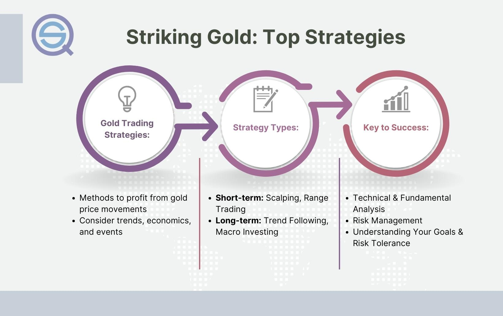

## Table of Contents

## What is gold and why is it considered a valuable investment?

Gold is a shiny, yellow metal that people have valued for thousands of years. It is rare and does not rust or tarnish easily, which makes it special. People use gold to make jewelry, coins, and other decorative items. It is also used in some electronics and medical devices because it conducts electricity well and is safe for the body.

Gold is considered a valuable investment for several reasons. First, it keeps its value over time. When the economy is not doing well, gold often becomes more valuable because people see it as a safe place to put their money. Second, gold is easy to buy and sell all over the world, so it is a good way to keep wealth that can be used anywhere. Many people also like gold because it is a physical thing they can hold, unlike stocks or money in a bank.

## How does the price of gold fluctuate and what factors influence it?

The price of gold goes up and down because of many different things. One big reason is how much people want to buy gold. When people are worried about the economy, they often buy more gold because they think it is safe. This makes the price go up. Another reason is how much gold is available. If there is not much gold to buy, the price will go up. If there is a lot of gold, the price might go down.

Other things that can change the price of gold are the value of money, like the US dollar. If the dollar gets weaker, gold usually gets more expensive. Also, what is happening in the world can affect the price. If there are big problems or wars, people might buy more gold for safety, which makes the price go up. Governments and big banks buying or selling gold can also make the price change.

## What are the different ways to invest in gold (physical gold, gold ETFs, gold mining stocks, etc.)?

One way to invest in gold is by buying physical gold, like gold bars or coins. You can keep them at home or in a safe place like a bank. Physical gold is good because you own it directly, but you have to be careful to buy from trusted places and keep it safe. Another way to invest in gold is through gold ETFs, which are like funds that hold gold. You buy shares of the [ETF](/wiki/etf-trading-strategies), and it is easier than keeping physical gold. ETFs can be bought and sold like stocks, so they are easy to trade.

Another option is investing in gold mining stocks. These are stocks of companies that mine gold. When the price of gold goes up, these companies can make more money, so their stocks might go up too. But, these stocks can be riskier because the success of the company depends on more than just the price of gold. It also depends on how well they can find and mine gold. Each way to invest in gold has its own benefits and risks, so it's important to think about what fits best with your investment goals.

## What are the advantages of including gold in an investment portfolio?

Including gold in an investment portfolio can help spread out your risk. Gold often goes up in value when other investments, like stocks, go down. This is because gold is seen as a safe place to put money during tough economic times. So, if the stock market is not doing well, having some gold can help protect your money. This way, your overall investment might not lose as much value.

Another advantage of gold is that it keeps its value over time. Unlike paper money, which can lose value because of inflation, gold tends to hold its worth. This makes it a good way to keep your wealth safe in the long run. Also, gold is easy to buy and sell all over the world, so it is a good way to keep wealth that can be used anywhere.

## How much of one's portfolio should be allocated to gold?

Many experts say that a good amount of gold to have in your investment portfolio is between 5% and 10%. This amount can help you spread out your risk without putting too much of your money into one thing. If you have too much gold, it might not grow as fast as other investments like stocks. But if you have a little bit, it can help protect your money when the economy is not doing well.

How much gold you should have can also depend on your own goals and how much risk you are okay with. If you want to be very safe, you might want a bit more gold. If you are okay with more risk and want to grow your money faster, you might want less gold. It's important to think about what you want from your investments and talk to a financial advisor to figure out the right amount of gold for you.

## What are the risks associated with investing in gold?

One risk of investing in gold is that it does not always make money. Sometimes, the price of gold can go down, and if you need to sell it at that time, you might lose money. Gold does not pay any interest or dividends like some other investments do, so the only way to make money from it is if the price goes up. This means you might miss out on [earning](/wiki/earning-announcement) money from other investments that could grow faster.

Another risk is that physical gold can be hard to store and keep safe. If you buy gold bars or coins, you need a safe place to keep them, like a safe at home or a bank vault. This can cost money and be a hassle. Also, if you lose your gold or it gets stolen, you could lose your investment completely. Gold ETFs and mining stocks have different risks, like the fees you pay for ETFs or the ups and downs of the stock market for mining companies.

Overall, while gold can be a good way to protect your money, it is important to understand these risks. It's a good idea to think about how much risk you are okay with and maybe talk to a financial advisor before deciding how much gold to include in your investment portfolio.

## How does gold perform during economic downturns and inflationary periods?

During economic downturns, gold often does well. When the economy is not doing good, people get worried about their money. They start looking for safe places to put it. Gold is seen as a safe investment because it keeps its value even when other things like stocks go down. So, when the economy is bad, more people buy gold, which makes its price go up. This can help protect your money when other investments are losing value.

Gold also does well during times of high inflation. Inflation means that the value of money goes down, so things cost more. Gold is good during these times because it keeps its value better than money. When inflation is high, people buy gold to keep their wealth safe. This demand for gold can make its price go up. So, having some gold in your investment portfolio can help you when prices are going up a lot.

## What are the tax implications of investing in gold?

When you invest in gold, you need to think about taxes. If you sell your gold for more money than you paid for it, you have to pay a tax on the profit. This is called a capital gains tax. How much you pay depends on how long you owned the gold. If you owned it for a year or less, it's a short-term capital gain, and you pay the same tax rate as your regular income. If you owned it for more than a year, it's a long-term capital gain, and the tax rate is usually lower.

Physical gold like bars and coins has another tax to think about. If you sell them, you might have to pay sales tax when you buy them, depending on where you live. Some states don't have sales tax on gold, but others do. Also, if you decide to give your gold away or leave it to someone when you die, there could be gift or estate taxes. It's a good idea to talk to a tax advisor to understand all the taxes that might apply to your gold investments.

## How can one start investing in gold and what are the initial steps?

To start investing in gold, first decide how you want to invest. You can buy physical gold like bars or coins, or you can invest in gold ETFs, which are like funds that hold gold, or gold mining stocks, which are stocks of companies that mine gold. Each way has its own benefits and risks. Physical gold is something you can hold, but you need to keep it safe. Gold ETFs are easier to buy and sell, but they come with fees. Gold mining stocks can grow if the company does well, but they can also be riskier.

Once you decide how you want to invest, the next step is to find a good place to buy gold. For physical gold, you can go to a trusted dealer or a bank. For gold ETFs and mining stocks, you can use a brokerage account, which is like an account where you can buy and sell investments. Make sure to do some research and pick a trusted place to buy from. After you buy your gold, keep track of how it is doing and think about how it fits into your overall investment plan. It's a good idea to talk to a financial advisor to make sure you are making the best choices for your money.

## What are some advanced strategies for trading gold, such as futures and options?

Trading gold using futures and options can be a bit more complicated than just buying physical gold or ETFs. Futures are agreements to buy or sell gold at a certain price on a certain date in the future. They can be risky because you have to pay a lot if the price of gold goes the wrong way. But they can also be good if you want to bet on where you think the price of gold will go. You can use futures to make money if you think gold will go up or down. You need to have a special account with a futures broker to trade them.

Options are another way to trade gold. They give you the right, but not the obligation, to buy or sell gold at a certain price before a certain date. There are two types of options: calls and puts. A call option lets you buy gold at a set price, and a put option lets you sell it at a set price. Options can be less risky than futures because you don't have to buy or sell the gold if you don't want to. But they can still be complicated, and you need to understand how they work before you start trading them. Both futures and options need a good understanding of the market and a plan for managing risk.

## How do geopolitical events impact the gold market and how can investors leverage this?

Geopolitical events, like wars or big political changes, can make the price of gold go up and down. When there is trouble in the world, people often get worried about their money. They think gold is a safe place to put it because it keeps its value even when things are bad. So, when there are big problems, more people buy gold, which makes its price go up. For example, if there is a war or a country is having a big political problem, people might buy more gold to feel safe.

Investors can use these events to make smart choices about buying or selling gold. If you think a big event is going to happen, you might want to buy gold before it does. This way, you can sell it later for more money when the price goes up because of the event. But, it's important to be careful. Geopolitical events can be hard to predict, and the price of gold can go down if things get better. So, it's a good idea to keep watching the news and maybe talk to a financial advisor to help you decide what to do.

## What are the long-term trends in the gold market and how should they influence investment strategies?

Over the long term, the price of gold tends to go up. This is because gold is rare and more people want it as the world's population grows. Also, when there is inflation, which means the value of money goes down, gold usually does well because it keeps its value better than money. Over many years, gold has been a good way to keep wealth safe. But, the price can go up and down a lot in the short term because of things like the economy, what is happening in the world, and how much people want to buy gold.

When you are thinking about how to invest in gold for the long term, it's a good idea to have some gold in your investment plan. Many experts say that having between 5% and 10% of your money in gold can help spread out your risk. This means if other investments like stocks go down, your gold might go up and help protect your money. But, don't put all your money in gold because it doesn't grow as fast as other investments. It's important to think about your own goals and how much risk you are okay with. Talking to a financial advisor can help you figure out the right amount of gold for you.

## References & Further Reading

[1]: ["Advances in Financial Machine Learning"](https://www.amazon.com/Advances-Financial-Machine-Learning-Marcos/dp/1119482089) by Marcos Lopez de Prado

[2]: ["Evidence-Based Technical Analysis: Applying the Scientific Method and Statistical Inference to Trading Signals"](https://www.amazon.com/Evidence-Based-Technical-Analysis-Scientific-Statistical/dp/0470008741) by David Aronson

[3]: ["Machine Learning for Algorithmic Trading"](https://github.com/PacktPublishing/Machine-Learning-for-Algorithmic-Trading-Second-Edition) by Stefan Jansen

[4]: ["Quantitative Trading: How to Build Your Own Algorithmic Trading Business"](https://www.amazon.com/Quantitative-Trading-Build-Algorithmic-Business/dp/1119800064) by Ernest P. Chan

[5]: Rosa, F., & Vanneschi, L. (2020). ["Gold Price Fluctuations and their Relation to Financial Market Indices: Use of a Genetic Programming Approach."](https://sci-hub.se/10.1155/2020/8049504) Central European Journal of Operations Research. 

[6]: Bodie, Z., Kane, A., & Marcus, A.J. (2013). ["Investments"](https://www.mheducation.com/highered/product/investments-bodie-kane/M9781264412662.html). McGraw-Hill Education.