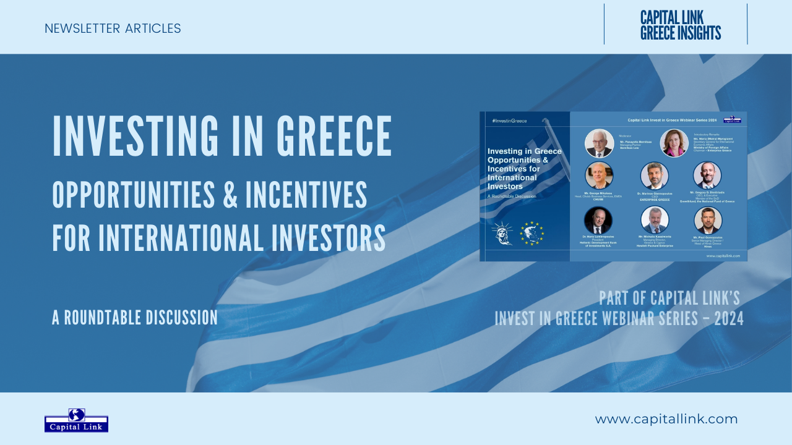

## Table of Contents

## What are the basic types of investment options available in Greece?

In Greece, people can invest their money in different ways. Some common options are savings accounts, stocks, bonds, and real estate. Savings accounts are safe and offered by banks, where you can keep your money and earn a little interest over time. Stocks are when you buy a small part of a company, and if the company does well, the value of your stock can go up. Bonds are like loans you give to the government or a company, and they pay you back with interest. Real estate means buying property, like houses or land, which can increase in value or provide rental income.

Another investment option in Greece is mutual funds, which are a mix of stocks, bonds, and other assets managed by professionals. This can be a good choice if you want to spread your risk because your money is not all in one place. You can also invest in commodities, like gold or oil, which can be a way to protect your money from inflation. Each type of investment has its own level of risk and potential reward, so it's important to think about what fits your goals and how much risk you are willing to take.

## How does the Greek economic environment affect investment decisions?

The Greek economic environment plays a big role in how people decide to invest their money. Greece has had some ups and downs with its economy, like the financial crisis a few years ago. This can make people worried about investing in things like stocks or bonds because they might lose money if the economy gets worse. On the other hand, when the economy is doing well, people might feel more confident and be more willing to take risks with their investments. The government's policies, like taxes and regulations, also affect what kinds of investments are attractive. For example, if the government offers tax breaks for investing in certain areas, more people might choose to put their money there.

Another thing to think about is how stable the Greek economy is. If there's a lot of uncertainty, like with political changes or economic policies, people might prefer safer investments like savings accounts or real estate. Real estate can be a good choice because even if the economy is not doing great, people always need places to live. But, if the economy is growing and stable, people might be more interested in stocks or starting their own businesses. Overall, the economic environment in Greece shapes what kinds of investments seem smart and safe at any given time.

## What are the potential risks of investing in Greek real estate?

Investing in Greek real estate can be risky because the economy can change a lot. If the economy gets worse, it might be hard to find people who want to rent or buy your property. This can make it tough to earn money from your investment. Also, if the economy is not doing well, the value of your property might go down, and you could lose money if you need to sell it.

Another risk is that the rules and laws about owning property in Greece can change. The government might decide to raise taxes on property or change the rules about renting or selling. This can make it more expensive or harder to keep your investment. Plus, if there are problems with the property, like needing repairs, it can cost a lot of money and time to fix, which can eat into your profits.

Lastly, there can be issues with the location of the property. Some areas might not be popular with tourists or locals, which can make it hard to find tenants or buyers. Also, if the area has problems like crime or poor infrastructure, it can make your investment less attractive. So, it's important to do a lot of research and think carefully before investing in Greek real estate.

## What tax considerations should investors be aware of when investing in Greece?

When you invest in Greece, you need to think about taxes. If you make money from your investments, like from selling stocks or renting out property, you'll have to pay taxes on that income. The tax rate can change depending on how much money you make and what kind of investment it is. For example, if you earn money from renting out a house, you'll pay a different tax than if you made money from selling stocks. It's important to know these rates so you can plan how much money you'll actually keep after taxes.

Also, Greece has some special taxes and rules that can affect your investments. There might be taxes on the property itself, like an annual property tax, which you need to pay even if you're not making any money from the property. And if you're not from Greece, there might be extra taxes or rules for you. It's a good idea to talk to a tax expert who knows about Greek taxes to make sure you understand all the rules and don't end up paying more than you need to.

## How can an investor diversify their portfolio using Greek assets?

An investor can diversify their portfolio using Greek assets by investing in a mix of different types of investments available in Greece. For example, they could put some money into Greek stocks, which are shares in Greek companies. This can be a good way to grow their money if the companies do well. They could also invest in Greek bonds, which are like loans to the government or companies that pay back with interest. This can be a safer way to earn some money, but it might not grow as fast as stocks. Another option is to buy Greek real estate, like houses or land, which can provide rental income or increase in value over time.

To spread the risk even more, an investor could also look into Greek mutual funds, which are managed by professionals and include a mix of stocks, bonds, and other assets. This way, their money is not all in one place, which can help protect them if one type of investment does badly. They might also consider investing in Greek commodities, like olive oil or wine, which can be a way to protect their money from inflation. By mixing these different types of Greek assets, an investor can create a balanced portfolio that can help them reach their financial goals while managing risk.

## What are the historical returns of the Athens Stock Exchange and how do they compare to other European markets?

The Athens Stock Exchange (ASE) has had ups and downs over the years. During good times, like before the financial crisis in the early 2000s, the ASE saw high returns. But during the Greek financial crisis that started around 2009, the ASE saw big losses. The crisis made the value of stocks drop a lot, and it took a long time for the market to recover. In more recent years, the ASE has been doing better, but it still has more ups and downs compared to some other European markets.

Compared to other European markets, like the German DAX or the French CAC 40, the Athens Stock Exchange has been more volatile. This means the value of stocks in Greece can change a lot more quickly and unpredictably. The DAX and CAC 40, which are in bigger and more stable economies, tend to have steadier returns over time. So, while investing in the ASE can offer the chance for big gains, it also comes with more risk than investing in some other European stock markets.

## What role do Greek government bonds play in an investment strategy?

Greek government bonds can be a part of an investment strategy because they are like loans you give to the Greek government. When you buy these bonds, the government promises to pay you back with interest over time. This can be a good way to earn some money without taking too much risk, especially if you want to keep your money safe. But, because Greece had a big financial crisis in the past, these bonds can be riskier than bonds from countries with stronger economies. So, you need to think about how much risk you are okay with before you decide to invest in Greek government bonds.

Including Greek government bonds in your investment mix can help you spread out your risk. If you have all your money in one type of investment, like stocks, and something bad happens to the stock market, you could lose a lot. But if you also have some money in Greek government bonds, they might not lose value as much as stocks. This way, even if one part of your investments goes down, the other parts might help balance it out. So, Greek government bonds can be a useful tool to make your overall investment strategy safer and more balanced.

## How do geopolitical factors influence investment in Greece?

Geopolitical factors can have a big impact on how people decide to invest in Greece. For example, if there is a lot of tension or conflict with nearby countries, it might make investors worried about the stability of the region. This can make them less likely to put their money into Greek stocks or real estate because they might think it's too risky. Also, if there are big changes in the political situation inside Greece, like elections or new government policies, this can affect how safe investors feel about putting their money there. If the government changes a lot or makes new rules that are not clear, it can make investors nervous.

On the other hand, good geopolitical news can make Greece a more attractive place to invest. If Greece has strong relationships with other countries and is seen as a stable place, more people might want to invest there. For example, if Greece joins big international projects or gets support from the European Union, this can boost confidence in the Greek economy. Investors might see this as a sign that Greece is a good place to put their money because it's less likely to have big problems. So, keeping an eye on what's happening in the world and in Greece can help investors make smarter choices about where to put their money.

## What are the regulatory frameworks governing investments in Greece and how do they impact investors?

In Greece, there are rules and laws that tell investors what they can and can't do with their money. These rules come from the Hellenic Capital Market Commission (HCMC), which makes sure that the stock market and other investments are fair and safe. The HCMC sets rules for things like how companies can sell their stocks and how much information they have to share with investors. There are also rules about taxes that investors need to know, like how much they have to pay on money they make from selling stocks or renting out property. These rules can change, so it's important for investors to keep up with them.

These regulatory frameworks can affect investors in different ways. For example, if the rules are strict, it might make it harder for investors to make quick decisions or take big risks. But strict rules can also make investors feel safer because they know the market is being watched closely. On the other hand, if the rules change a lot or are not clear, it can make investors worried about what might happen next. This can make them less likely to invest in Greece because they might think it's too risky. So, understanding these rules and how they might change can help investors make better choices about where to put their money.

## How can investors use financial derivatives to hedge against risks in the Greek market?

Investors can use financial derivatives like options and futures to protect themselves from risks in the Greek market. For example, if an investor owns Greek stocks and is worried that the stock prices might go down, they can buy a put option. A put option gives them the right to sell their stocks at a set price, even if the market price drops. This way, they can limit how much money they might lose if the stock market in Greece goes down.

Another way to hedge is by using futures contracts. If an investor is worried about changes in interest rates or currency values that might affect their investments in Greece, they can use futures to lock in prices now. For example, if they own Greek bonds and are worried about interest rates going up, they can sell bond futures. This can help them balance out any losses they might have if interest rates do go up. By using these financial tools, investors can feel more secure about putting their money into the Greek market.

## What advanced strategies can be employed to capitalize on sector-specific growth in Greece?

Investors can focus on certain industries in Greece that are growing fast, like tourism, renewable energy, and technology. For example, Greece's beautiful beaches and history make it a popular place for tourists. Investors can buy hotels or start tourism businesses to make money from this. Also, Greece is trying to use more clean energy, like wind and solar power. Investing in companies that build or run these energy projects can be a smart move because the government wants more green energy. Lastly, the tech industry in Greece is getting bigger, with new startups and tech hubs. Putting money into tech companies or funds that support them can help investors grow their money as the industry grows.

To really take advantage of these growing sectors, investors can use some special strategies. One way is to use sector-specific exchange-traded funds (ETFs) that focus on Greek tourism, energy, or tech companies. These ETFs can spread the risk while still letting investors benefit from the growth in these areas. Another strategy is to do a lot of research and find smaller companies in these sectors that have a lot of potential to grow. By investing early in these companies, investors can make big profits if the companies do well. Also, investors can look for partnerships or joint ventures with Greek companies in these sectors. This can help them get a share of the growth without having to start a business from scratch.

## How do macroeconomic indicators in Greece forecast future investment opportunities and risks?

Macroeconomic indicators like GDP growth, unemployment rates, and inflation can give investors a good idea about what might happen in Greece's economy. If the GDP is growing and unemployment is going down, it can mean that the economy is doing well. This might make investors feel more confident about putting their money into Greek stocks, real estate, or starting businesses. On the other hand, if inflation is high, it can make things more expensive and might make investors worried about losing money. By looking at these indicators, investors can guess if there will be good opportunities to make money or if there are risks they should be careful about.

Another important indicator is the government's budget and debt levels. If the Greek government is spending a lot more money than it's making, it might have to borrow more, which can make investors nervous. High debt levels can lead to higher taxes or changes in rules that might affect investments. But if the government is managing its money well and keeping debt low, it can make investors feel safer about investing in Greece. By keeping an eye on these indicators, investors can plan better and decide when and where to invest their money in Greece.

## References & Further Reading

[1]: Bergstra, J., Bardenet, R., Bengio, Y., & Kégl, B. (2011). ["Algorithms for Hyper-Parameter Optimization."](https://dl.acm.org/doi/10.5555/2986459.2986743) Advances in Neural Information Processing Systems 24.

[2]: ["Advances in Financial Machine Learning"](https://www.amazon.com/Advances-Financial-Machine-Learning-Marcos/dp/1119482089) by Marcos Lopez de Prado

[3]: ["Evidence-Based Technical Analysis: Applying the Scientific Method and Statistical Inference to Trading Signals"](https://www.amazon.com/Evidence-Based-Technical-Analysis-Scientific-Statistical/dp/0470008741) by David Aronson

[4]: ["Machine Learning for Algorithmic Trading"](https://github.com/stefan-jansen/machine-learning-for-trading) by Stefan Jansen

[5]: ["Quantitative Trading: How to Build Your Own Algorithmic Trading Business"](https://www.amazon.com/Quantitative-Trading-Build-Algorithmic-Business/dp/1119800064) by Ernest P. Chan