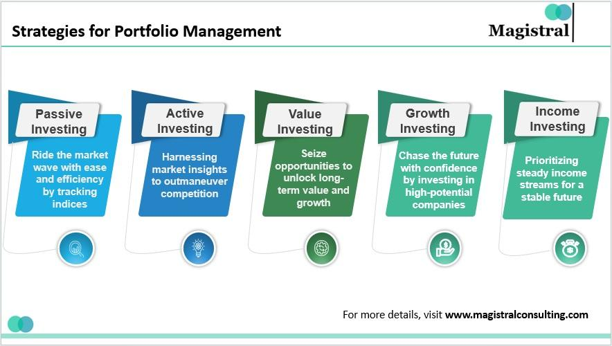

## Table of Contents

## What is a mutual fund and how does it work?

A mutual fund is a type of investment where many people put their money together to buy a variety of stocks, bonds, or other investments. It's like a big basket where everyone's money is mixed and managed by a professional who decides what to buy and sell. This makes it easier for people to invest in a diverse range of assets without having to pick each one themselves.

When you invest in a mutual fund, you buy shares of the fund. The price of each share goes up or down based on how well the investments in the fund are doing. If the fund does well, the value of your shares goes up, and you can make money. If the fund doesn't do well, the value of your shares goes down, and you could lose money. You can usually sell your shares whenever you want, but some funds might have rules about when you can take your money out.

## What are the different types of mutual funds available for investment?

There are several types of mutual funds, each designed for different investment goals and risk levels. One common type is the equity fund, which mainly invests in stocks. These funds can focus on different things, like big companies, small companies, or companies in certain industries. They can be riskier but also have the potential for higher returns. Another type is the fixed-income fund, which invests in bonds and other debt instruments. These are usually less risky than equity funds and aim to provide steady income through interest payments.

Another popular type is the balanced fund, which mixes stocks and bonds to balance risk and return. This can be a good choice for people who want a bit of both growth and stability. There are also index funds, which try to match the performance of a specific market index, like the S&P 500. They are often cheaper to invest in because they don't need a lot of active management. Lastly, there are specialty funds, which focus on specific themes or sectors, like technology or green energy. These can be more risky because they are less diversified but can offer high returns if the sector does well.

## How can beginners start investing in mutual funds?

If you're new to investing, starting with mutual funds can be a good choice because they are easy to understand and manage. The first step is to set your investment goals. Are you saving for a big purchase, like a house, or planning for retirement? Knowing your goals will help you pick the right type of mutual fund. Next, you'll need to open an investment account. You can do this through a bank, a brokerage firm, or an online platform. Make sure to choose one that offers the mutual funds you're interested in and has low fees.

Once your account is set up, you can start choosing mutual funds. Look for funds that match your goals and risk level. If you're not sure, you might want to start with a balanced fund or an index fund, which are often good choices for beginners. After you've picked your funds, decide how much money you want to invest. You can usually start with a small amount, and many funds let you add more money over time. Keep an eye on your investments, but remember that mutual funds are usually meant for long-term growth, so try not to worry too much about short-term changes in value.

## What are the key factors to consider when selecting a mutual fund?

When choosing a mutual fund, one of the first things to think about is your investment goals. Are you looking to grow your money over many years, or do you need regular income? This will help you decide between growth-oriented funds, like equity funds, or income-focused funds, like fixed-income funds. Another important [factor](/wiki/factor-investing) is risk. Some funds are riskier than others, so think about how much risk you're comfortable with. If you're new to investing, you might want to start with a fund that has less risk, like a balanced or index fund.

The performance of the fund is also key. Look at how the fund has done in the past, but remember that past results don't guarantee future success. It's also good to check the fees and expenses of the fund. Lower fees can mean more money stays in your pocket. Finally, think about the fund manager's experience and the fund's investment strategy. A good manager with a clear strategy can make a big difference in how well the fund does. By considering these factors, you can pick a mutual fund that fits your needs and helps you reach your financial goals.

## How should one assess the performance of a mutual fund?

To assess the performance of a mutual fund, start by looking at its returns over different time periods, like one year, three years, and five years. This gives you an idea of how well the fund has done in the past. But remember, past performance doesn't tell you how the fund will do in the future. It's also helpful to compare the fund's returns to a benchmark, like the S&P 500 for equity funds. If the fund is doing better than the benchmark, that's a good sign. But if it's doing worse, you might want to think about why that is happening.

Another important thing to look at is the risk the fund takes to get its returns. You can do this by checking the fund's [volatility](/wiki/volatility-trading-strategies), which shows how much the fund's value goes up and down. A fund with high returns but also high risk might not be the best choice if you don't like taking chances with your money. Also, consider the fund's expense ratio, which is how much you pay each year to own the fund. Lower fees mean more of your money stays invested, which can help your returns over time. By looking at these things together, you can get a good picture of how well a mutual fund is doing and if it's a good fit for you.

## What are the common investment strategies for managing a mutual fund portfolio?

One common strategy for managing a mutual fund portfolio is called diversification. This means spreading your money across different types of investments, like stocks, bonds, and maybe even real estate. By doing this, you reduce the risk that comes with putting all your money in one place. If one investment doesn't do well, others might make up for it. This strategy helps you balance the risk and reward in your portfolio, making it safer over the long run.

Another strategy is called asset allocation. This involves deciding how much of your money to put into different kinds of assets based on your goals and how much risk you're willing to take. For example, if you're young and saving for retirement, you might put more money into stocks because they can grow a lot over time. But if you're closer to retirement, you might want more bonds because they're usually safer. Adjusting your asset allocation over time can help you meet your financial goals while managing risk.

Rebalancing is also an important strategy. Over time, the value of your investments can change, which means your portfolio might not be as balanced as you want it to be. Rebalancing means selling some of what has grown a lot and buying more of what hasn't, to get back to your original plan. This helps keep your portfolio in line with your goals and risk level. By using these strategies, you can manage your mutual fund portfolio in a way that works best for you.

## How can diversification be applied in a mutual fund portfolio?

Diversification in a mutual fund portfolio means spreading your money across different types of investments. Instead of putting all your money into one kind of stock or bond, you can invest in a mix of them. For example, you might choose mutual funds that focus on different industries, like technology, healthcare, and energy. You could also include funds that invest in different countries or regions, like the U.S., Europe, and Asia. By doing this, you reduce the risk that comes with having all your money in one place. If one industry or country doesn't do well, the others might still perform okay, helping to balance out your overall returns.

To apply diversification, you can start by [picking](/wiki/asset-class-picking) mutual funds that cover a wide range of assets. For instance, you might invest in an equity fund that focuses on large companies, another that looks at small companies, and a third that invests in international stocks. You could also add a fixed-income fund that buys government bonds and another that invests in corporate bonds. This way, your portfolio isn't too dependent on any single type of investment. Over time, as you learn more about your risk tolerance and investment goals, you can adjust your mix of funds to keep your portfolio diversified and aligned with what you want to achieve.

## What role does asset allocation play in managing mutual fund investments?

Asset allocation is a key part of managing your mutual fund investments. It means deciding how to split your money between different types of investments, like stocks, bonds, and maybe even cash. The idea is to match your investment mix with your goals and how much risk you're okay with. For example, if you're young and saving for retirement, you might put more money into stocks because they can grow a lot over time. But if you're closer to retirement, you might want more bonds because they're usually safer.

Changing your asset allocation over time can help you keep your portfolio in line with your goals. As you get older or your financial situation changes, you might need to shift your investments. For example, as you near retirement, you might move some money from stocks to bonds to lower your risk. By doing this, you can manage your mutual fund investments in a way that helps you reach your financial goals while keeping your risk at a level you're comfortable with.

## How can one use rebalancing to optimize a mutual fund portfolio?

Rebalancing is a way to keep your mutual fund portfolio in line with your original investment plan. Over time, some of your investments might grow faster than others, which can change the balance of your portfolio. For example, if you started with half your money in stocks and half in bonds, but the stocks did really well, you might end up with more money in stocks than you wanted. Rebalancing means selling some of the stocks that grew a lot and buying more bonds to get back to your original plan. This helps you stick to your goals and manage your risk.

To use rebalancing effectively, you should decide how often you want to check your portfolio. Some people do it every year, while others might do it every six months or even every quarter. When you rebalance, you look at your investments and see if they're still split the way you want. If they're not, you make some trades to fix it. By doing this regularly, you can keep your portfolio working the way you planned and make sure it still fits your goals and how much risk you're okay with.

## What advanced strategies can be used to manage risk in mutual fund portfolios?

One advanced strategy to manage risk in mutual fund portfolios is called hedging. Hedging means taking steps to protect your investments from big losses. For example, you might buy investments that go up when your mutual funds go down. This way, if your mutual funds lose value, the other investments can help make up for it. Another way to hedge is by using options, which are contracts that give you the right to buy or sell an investment at a certain price. These can be tricky to understand and use, so they're usually for more experienced investors.

Another strategy is called dollar-cost averaging. This means putting money into your mutual funds regularly, no matter what the market is doing. By doing this, you buy more shares when prices are low and fewer when prices are high. Over time, this can help reduce the risk of putting all your money in at the wrong time. It's a simple but effective way to manage risk and can help you build your portfolio steadily.

A third strategy is using stop-loss orders. A stop-loss order is an instruction to sell a mutual fund if its value drops to a certain level. This can help limit your losses if the market takes a big dip. While stop-loss orders can protect you from big losses, they can also mean you sell at a low point and miss out on a recovery. Using these orders wisely can be a good way to manage risk, but it's important to think carefully about where to set them.

## How do tax considerations affect mutual fund investment strategies?

Tax considerations can have a big impact on how you manage your mutual fund investments. When you invest in mutual funds, you might have to pay taxes on the money you make, like dividends and capital gains. Capital gains are the profits you make when you sell a fund for more than you paid for it. If you hold a mutual fund for less than a year before selling, you'll pay short-term capital gains tax, which is usually higher than the long-term rate. Long-term capital gains tax applies if you hold the fund for more than a year. To reduce your tax bill, you might want to think about holding onto your funds for longer to take advantage of the lower long-term rates.

Another tax strategy is to invest in tax-efficient funds, like index funds or exchange-traded funds (ETFs). These types of funds often have lower turnover, which means they buy and sell investments less often. Less trading means fewer taxable events, which can help you keep more of your money. You can also use tax-loss harvesting, which means selling funds that have lost value to offset the taxes on your gains. By thinking about taxes when you make investment decisions, you can keep more of your earnings and make your mutual fund strategy work better for you.

## What are the latest trends and innovations in mutual fund management?

One of the latest trends in mutual fund management is the rise of [ESG](/wiki/esg-investing) investing. ESG stands for Environmental, Social, and Governance. More and more people want to invest in companies that are good for the planet, treat their workers well, and have strong leadership. So, mutual fund managers are creating funds that focus on these values. These funds try to make money while also making a positive impact on the world. Another trend is the use of technology, like [artificial intelligence](/wiki/ai-artificial-intelligence) (AI) and big data, to make better investment choices. Fund managers use these tools to look at lots of information quickly and find the best investments. This can help them make smarter decisions and hopefully get better returns for investors.

Innovations in mutual fund management also include the introduction of smart beta funds. Smart beta funds try to do better than traditional index funds by using different ways to pick and weigh investments. Instead of just following a market index, they might focus on factors like a company's size, how much it pays in dividends, or how much its stock price moves around. This can help investors get better returns while still keeping their portfolios diverse. Another innovation is the growing popularity of robo-advisors. These are online platforms that use algorithms to manage your investments automatically. They often have lower fees than human advisors and can be a good choice for people who want a simple and affordable way to invest in mutual funds.

## What is the role of mutual funds in diversified portfolios?

Mutual funds are investment vehicles that pool capital from multiple investors to purchase a diversified portfolio of securities. They play a significant role in the financial markets by offering an accessible and professionally managed avenue for individuals to invest. The primary benefits of mutual funds include diversification, professional management, [liquidity](/wiki/liquidity-risk-premium), and economies of scale.

### Benefits of Mutual Funds

1. **Diversification**: One of the key advantages of mutual funds is their ability to achieve diversification, which entails spreading investments across various asset classes, industries, and geographies. This helps in mitigating risks, as the negative performance of one security can potentially be offset by positive performance in another. The formula for the variance of a portfolio, as a measure of risk, is represented as:
$$
   \sigma^2_p = \sum_{i=1}^{n} \sum_{j=1}^{n} w_i w_j \sigma_{ij}

$$

   Where $\sigma^2_p$ is the portfolio variance, $w_i$ and $w_j$ are the weights of the assets, and $\sigma_{ij}$ is the covariance between the assets.

2. **Professional Management**: Mutual funds are managed by professional fund managers who conduct in-depth research and make investment decisions on behalf of investors. This professional oversight can be advantageous for investors who lack the expertise or time to manage their investments directly.

### Types of Mutual Funds

There are various types of mutual funds designed to fit different investment strategies:

- **Equity Funds**: Invest primarily in stocks and are suitable for growth-oriented strategies.
- **Bond Funds**: Focus on fixed-income securities, offering income and relative stability.
- **Balanced Funds**: Combine stocks and bonds to offer a balanced risk-return profile.
- **Index Funds**: Track a specific index, providing broad market exposure with lower costs.
- **Sector Funds**: Target specific sectors of the economy, which can align with thematic investment strategies.

### Popularity in Retail and Institutional Investing

Mutual funds have seen growing popularity among both retail and institutional investors. For retail investors, mutual funds provide a straightforward way to gain access to a diversified portfolio with relatively low investment minimums. For institutional investors, mutual funds offer a convenient means to manage large sums of money with the benefit of professional management.

### Selecting Mutual Funds

When selecting mutual funds, investors should consider several factors to align with their investment objectives:

- **Performance History**: Evaluate past performance while understanding that it doesn’t guarantee future results.
- **Expense Ratio**: The cost of managing the fund, which can impact net returns.
- **Fund Manager’s Track Record**: Assess the experience and success of the fund manager.
- **Investment Strategy**: Ensure that the fund's strategy aligns with the investor’s goals and risk tolerance.

Mutual funds can effectively meet diverse financial objectives and risk tolerances when chosen thoughtfully, serving as a central component of a well-rounded investment strategy.

## How can one master portfolio management?

Portfolio management is a critical aspect of investment success, encompassing a range of strategies and techniques designed to optimize the performance of an investment portfolio. It involves the careful selection, oversight, and adjustment of assets to achieve specific financial goals while managing risk.

### Different Approaches to Portfolio Management

Portfolio management commonly follows two primary approaches: active and passive management.

**Active Portfolio Management** involves making ongoing buy and sell decisions with the aim to outperform a benchmark index. This approach requires extensive research, analysis, and market forecasting, as fund managers seek to capitalize on short-term price fluctuations and market inefficiencies. The goal is to achieve returns exceeding those of a particular market index.

**Passive Portfolio Management** aims to replicate the performance of a specific index or benchmark. Managers use strategies like index investing, where the portfolio holds similar securities in the same proportions as the target index. The focus here is on long-term growth with lower fees and minimal trading activity, aligning with the belief that markets are generally efficient over the long term.

### Risk Management Techniques

Effective risk management is crucial in maintaining a balanced portfolio. It involves diversifying across different asset classes and geographical regions to limit exposure to any single investment's volatility. Key techniques include:

- **Diversification**: Spreading investments across various sectors, asset classes, and geographical areas to mitigate risk.
- **Asset Allocation**: Determining the optimal mix of asset classes (e.g., equities, bonds, cash) to balance risk and reward based on an investor’s risk tolerance and time horizon.

### The Process of Rebalancing

Rebalancing is the practice of realigning a portfolio's asset allocation with its target allocation. This process involves buying and selling portions of the portfolio to maintain the desired level of asset allocation. Rebalancing is necessary because some investments may grow faster than others, shifting the portfolio's initial risk profile. By selling high-performing assets and buying underperforming ones, investors can adhere to their risk tolerance and investment objectives. This systematic approach can enhance long-term returns and reduce risk.

### Key Metrics to Assess Portfolio Performance

Assessing the effectiveness of a portfolio management strategy requires analyzing several key performance metrics:

- **Return on Investment (ROI)**: Measures the gain or loss generated relative to the initial investment.
$$
  \text{ROI} = \left( \frac{\text{Current Value of Investment} - \text{Cost of Investment}}{\text{Cost of Investment}} \right) \times 100

$$

- **Sharpe Ratio**: Evaluates the risk-adjusted return by comparing the portfolio's excess return over the risk-free rate to its standard deviation.
$$
  \text{Sharpe Ratio} = \frac{\text{Average Portfolio Return} - \text{Risk-Free Rate}}{\text{Standard Deviation of Portfolio Return}}

$$

- **Alpha**: Indicates the portfolio manager's added value in terms of return relative to the benchmark's return.

- **Beta**: Measures the portfolio's sensitivity to market movements, indicating its volatility compared to the overall market.

These metrics, alongside thorough analysis, help investors and fund managers gauge whether the portfolio is meeting its objectives effectively and where adjustments may be necessary.

## References & Further Reading

[1]: Markowitz, H. (1952). ["Portfolio Selection"](https://onlinelibrary.wiley.com/doi/abs/10.1111/j.1540-6261.1952.tb01525.x). The Journal of Finance, 7(1), 77-91.

[2]: Pedersen, L. H. (2015). ["Efficiently Inefficient: How Smart Money Invests and Market Prices are Determined"](https://www.jstor.org/stable/j.ctt1287knh). Princeton University Press.

[3]: Pardo, R. (2008). ["The Evaluation and Optimization of Trading Strategies"](https://onlinelibrary.wiley.com/doi/book/10.1002/9781119196969). Wiley Trading.

[4]: Hasbrouck, J. (2007). ["Empirical Market Microstructure: The Institutions, Economics, and Econometrics of Securities Trading"](https://academic.oup.com/book/52241). Oxford University Press.

[5]: Schwartz, R. A., & Francioni, R. (2004). ["Equity Markets in Action: The Fundamentals of Liquidity, Market Structure & Trading"](https://books.google.com/books/about/Equity_Markets_in_Action.html?id=fPV16sxH8oUC). Wiley.

[6]: Chan, E. (2009). ["Quantitative Trading: How to Build Your Own Algorithmic Trading Business"](https://github.com/ftvision/quant_trading_echan_book). Wiley Trading.