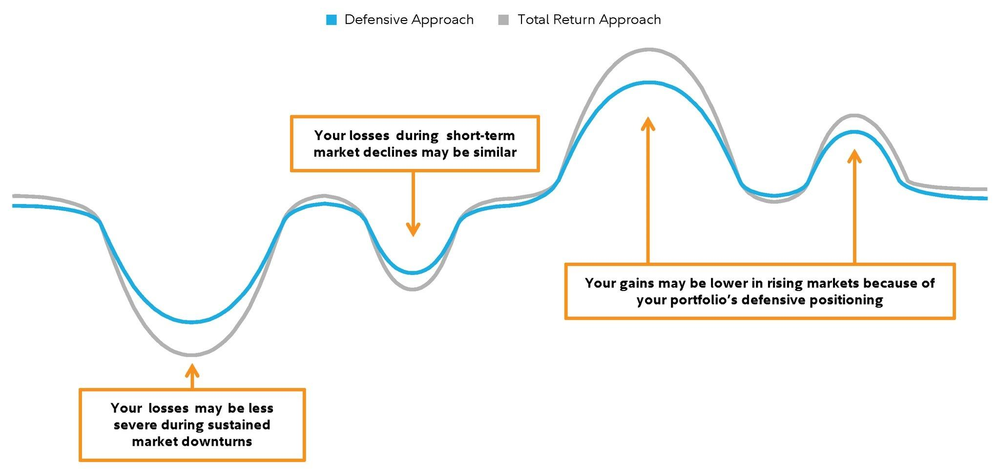

## Table of Contents

## What is a market downturn and how is it defined?

A market downturn is when the prices of stocks and other investments start to fall. It happens when more people want to sell their investments than buy them. This can make the overall value of the stock market go down. A downturn can last for a short time or a longer period, depending on what is causing it.

People often use the term "bear market" to describe a big market downturn. A bear market is usually defined as a drop of 20% or more from recent highs in the stock market. This can be scary for investors because their investments lose value. But downturns are a normal part of the stock market cycle, and they can be followed by times when the market goes back up again.

## Why is it important to have an investment strategy during market downturns?

Having an investment strategy during market downturns is important because it helps you stay calm and make smart choices when things get tough. When the market goes down, it's easy to get scared and sell your investments quickly. But if you have a plan, you know what to do ahead of time. This can stop you from making quick decisions that you might regret later. A good strategy can help you stick to your long-term goals, even when the market is not doing well.

Another reason to have a strategy is that it can help you take advantage of lower prices during a downturn. When stock prices drop, it can be a good time to buy more if you believe in the companies you're investing in. Your strategy can tell you when it might be a good time to buy, so you can get more shares at a lower price. This can help your investments grow more when the market goes back up. Having a plan gives you a clear path to follow, making it easier to handle the ups and downs of the market.

## What are the common emotional reactions to market downturns and how can they impact investment decisions?

When the market goes down, people often feel scared and worried. They might think their money is disappearing and start to panic. This fear can make them want to sell their investments quickly to stop losing more money. But selling in a hurry can be a bad idea because it means they might miss out on the market going back up later. Feeling scared can also make people not want to invest at all, even though buying when prices are low can be a good move.

These emotional reactions can really mess up investment decisions. If someone sells their investments because they're scared, they might sell at a low price and then miss out when the market goes back up. On the other hand, if they're too scared to buy when prices are low, they might miss a chance to get more shares at a good price. Having a plan can help people control their emotions and stick to smart choices, even when the market is going down.

## What are some basic investment strategies for beginners during market downturns?

When the market goes down, it's a good idea for beginners to have a simple plan. One basic strategy is to keep investing regularly, no matter what the market is doing. This is called dollar-cost averaging. It means you buy a little bit of investments at different times, so you don't have to worry about trying to guess when the market will go up or down. By doing this, you can buy more shares when prices are low and fewer when prices are high, which can help your investments grow over time.

Another strategy is to focus on long-term goals instead of short-term changes in the market. If you're saving for something like retirement or buying a house, it's important to remember that the market will go up and down, but it usually goes up over the long run. So, try not to panic and sell your investments when the market is down. Instead, stick to your plan and keep your eyes on your long-term goals. This can help you make better decisions and avoid selling at the wrong time.

Lastly, it can be helpful to diversify your investments. This means spreading your money across different types of investments, like stocks, bonds, and maybe even some cash. When the market goes down, not all types of investments will go down at the same time. By having a mix, you can lower the risk of losing a lot of money all at once. Diversifying can make you feel more secure and help you stay calm during market downturns.

## How can diversification help protect your investments during a market downturn?

Diversification helps protect your investments during a market downturn by spreading your money across different types of investments. When you diversify, you don't put all your money into just one thing, like stocks. Instead, you might also invest in bonds, real estate, or even keep some cash. This way, if the stock market goes down, your other investments might not go down as much or might even go up. By having a mix of investments, you lower the risk of losing a lot of money all at once.

For example, if you only have stocks and the stock market has a big downturn, all your money could be at risk. But if you also have some bonds, those might stay steady or even increase in value when stocks are falling. This can help balance out the losses from your stocks. Diversifying your investments can make you feel more secure and help you stay calm during tough times in the market. It's like not putting all your eggs in one basket, so if one basket falls, you still have other baskets to rely on.

## What role does asset allocation play in managing risk during market downturns?

Asset allocation is about deciding how to spread your money across different types of investments, like stocks, bonds, and cash. It's a big part of managing risk during market downturns. When you choose how much to put into each type of investment, you're trying to balance the risk and reward. Stocks can grow a lot, but they can also lose value quickly during a downturn. Bonds are usually safer and can help protect your money when the stock market goes down. By deciding how much to put into each, you can make your overall investment less risky.

Having the right asset allocation can help you weather a market downturn better. If you have too much in stocks and the market falls, you could lose a lot of money. But if you have some money in bonds or cash, those parts of your portfolio might not go down as much or might even go up. This can help cushion the blow from the falling stock market. By thinking about your asset allocation, you can set up your investments to handle the ups and downs of the market more smoothly.

## What are the benefits and risks of investing in defensive stocks during a market downturn?

Defensive stocks are companies that make things people always need, like food, medicine, or utilities. During a market downturn, these stocks can be a good choice because they usually don't go down as much as other stocks. People still need to buy food and medicine even when the economy is bad, so these companies keep making money. This can help protect your investments when other parts of the market are falling. By investing in defensive stocks, you can feel more secure and have a steady part of your portfolio that might not lose as much value.

But there are also risks to think about. Defensive stocks might not grow as fast as other stocks when the market is doing well. If you put all your money into defensive stocks, you might miss out on bigger gains from other types of investments. Also, even though they are less risky, they can still go down in value during a really bad market downturn. So, it's important to balance your investments and not put all your money into one type of stock. By mixing defensive stocks with other investments, you can manage the risks and still have a chance to grow your money over time.

## How can dollar-cost averaging be used effectively during market downturns?

Dollar-cost averaging means you invest a set amount of money at regular times, no matter if the market is up or down. During a market downturn, this strategy can be really helpful. When prices are low, your fixed amount of money buys more shares. So, if you keep investing the same amount each month, you'll end up with more shares when the market is down. This can be a good thing because when the market goes back up, those extra shares can grow in value and help your investments do better over time.

Using dollar-cost averaging during a downturn also helps you avoid trying to guess when the market will hit its lowest point. It's hard to know exactly when to buy at the bottom, and trying to time the market can lead to mistakes. By sticking to a regular investment plan, you don't have to worry about getting the timing just right. Instead, you can focus on your long-term goals and keep investing steadily, which can make you feel more confident and less stressed during tough times in the market.

## What advanced strategies can experienced investors use to capitalize on market downturns?

Experienced investors can use a strategy called "buying the dip" during market downturns. This means they look for good companies whose stock prices have gone down a lot but are still strong businesses. They buy these stocks at a lower price, hoping to make a profit when the market goes back up. This can be risky because no one knows for sure when the market will recover, but it can also lead to big gains if they pick the right stocks. To do this well, investors need to do a lot of research and understand the companies they're investing in.

Another advanced strategy is to use options, like put options, to make money from a falling market. A put option gives you the right to sell a stock at a certain price, even if the market price goes lower. If you think a stock will go down, you can buy a put option and then sell it for a profit if the stock price drops. This can be a way to make money during a downturn, but it's complicated and risky. It's important for investors to really understand how options work and be ready to lose money if things don't go as planned.

## How can options and other derivatives be used to hedge against market downturns?

Options and other derivatives can be used to protect your investments during market downturns. One way to do this is by buying put options. A put option gives you the right to sell a stock at a certain price, even if the market price goes lower. If you think the market will go down, you can buy put options on stocks you own. This way, if the stock price falls, you can still sell it at the higher price you set with the put option. This can help limit your losses and protect your money when the market is falling.

Another way to use derivatives is by using futures contracts. Futures are agreements to buy or sell something at a set price in the future. If you think the market will go down, you can sell futures contracts on an index like the S&P 500. If the market does go down, the value of your futures contract will go up, which can help offset the losses in your other investments. Using futures can be a bit tricky and involves understanding how they work, but they can be a powerful tool for experienced investors to manage risk during downturns.

## What are the tax implications of selling investments during a market downturn?

When you sell investments during a market downturn, you need to think about taxes. If you sell an investment for less than what you paid for it, you have a capital loss. You can use this loss to lower your taxes. You can subtract up to $3,000 of your capital losses from your regular income each year. If your losses are more than $3,000, you can [carry](/wiki/carry-trading) the extra over to future years to keep lowering your taxes.

But if you sell an investment for more than what you paid for it, you have a capital gain. You will have to pay taxes on this gain. The tax rate depends on how long you owned the investment. If you owned it for less than a year, it's a short-term capital gain, and you pay your regular income tax rate on it. If you owned it for more than a year, it's a long-term capital gain, and the tax rate is usually lower. So, selling during a downturn can help you save on taxes if you have losses, but you need to be careful about gains.

## How should long-term investment goals influence strategy adjustments during market downturns?

When you have long-term investment goals, like saving for retirement or buying a house, they should guide how you handle market downturns. Instead of panicking and selling your investments when the market goes down, you should stick to your plan and focus on your long-term goals. These goals are usually far in the future, so short-term drops in the market shouldn't change your overall strategy. By keeping your eyes on the big picture, you can make better decisions and avoid selling your investments at a low price.

Your long-term goals can also help you see market downturns as opportunities. If you believe in the companies you're investing in, a downturn can be a good time to buy more shares at a lower price. This can help your investments grow more when the market goes back up. So, instead of changing your strategy a lot during a downturn, you might just need to adjust a little, like keeping up with your regular investments or maybe buying a bit more if you have the money. Staying focused on your long-term goals can help you stay calm and make smart choices during tough times in the market.

## References & Further Reading

[1]: Crane, A. D., Crotty, K., & Umar, Z. (2020). ["Algorithmic trading and market volatility: The 2018 market meltdown."](https://kevin-crotty.com/research.html) Journal of Financial Economics, 137(3), 701-716.

[2]: Lopez de Prado, M. (2018). ["Advances in Financial Machine Learning."](https://www.amazon.com/Advances-Financial-Machine-Learning-Marcos/dp/1119482089) Wiley.

[3]: Chan, E. P. (2009). ["Quantitative Trading: How to Build Your Own Algorithmic Trading Business."](https://github.com/ftvision/quant_trading_echan_book) Wiley.

[4]: Jansen, S. (2020). ["Machine Learning for Algorithmic Trading."](https://github.com/stefan-jansen/machine-learning-for-trading) Packt Publishing.

[5]: Aronson, D. R. (2006). ["Evidence-Based Technical Analysis: Applying the Scientific Method and Statistical Inference to Trading Signals."](https://www.amazon.com/Evidence-Based-Technical-Analysis-Scientific-Statistical/dp/0470008741) Wiley.