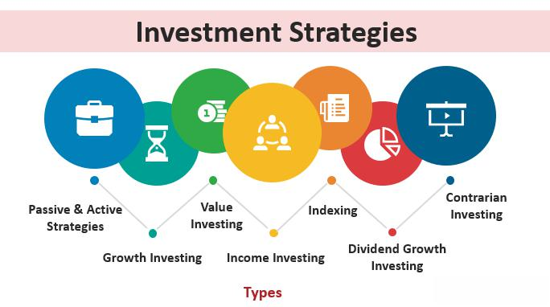

Investment strategy plays a critical role, especially during periods of market volatility and downturns. Market crashes, defined by abrupt and significant declines in stock prices, have historically disrupted the economic landscape, notably in years such as 2000, 2008, and 2020. These events often trigger anxiety among investors, yet they simultaneously present unique opportunities for those willing to apply strategic foresight and planning.

Throughout history, market downturns have tested the resilience and adaptability of investment strategies, compelling investors to reassess and refine their approaches. The dot-com bubble burst in 2000, the financial crisis of 2008, and the COVID-19 pandemic-induced crash in 2020 serve as reminders of the market's inherently unpredictable nature. These episodes highlight the necessity for proactive and resilient investment strategies, financial planning, and an understanding of modern tools like algorithmic trading to navigate turbulent times effectively.



Investors who prepare ahead of time are best positioned to protect their assets and capitalize on downturns. This involves embracing a multi-faceted approach that includes diversification, hedging, and leveraging advanced trading technologies. Such preparation not only mitigates potential losses but also allows for the exploitation of undervalued assets during market recoveries.

In this article, we will explore the various investment strategies tailored for volatile markets, examining the roles of diversification, financial planning, and algorithmic trading. By preparing for market downturns, investors can both shield their wealth and uncover opportunities for growth, benefiting from a comprehensive understanding of market dynamics and informed investment practices.

## Table of Contents

## Understanding Market Crashes

Market crashes are characterized by precipitous and substantial drops in stock prices, frequently translating to significant financial losses within a very short timeframe. These events can be precipitated by a variety of factors, such as economic downturns, geopolitical tensions, or unforeseen global events, as evidenced by historical instances like the 2000 dot-com bubble, the 2008 financial crisis, and the 2020 COVID-19 pandemic-induced crash. Although unpredictable, they offer valuable learning opportunities for investors seeking to protect their portfolios from future downturns.

Market crashes often come with little warning, affecting broad swathes of the market simultaneously. The suddenness of these crashes is partly due to investor panic and subsequent sell-offs, which can be fueled by algorithmic trading systems that react swiftly to market signals. This phenomenon underscores the importance for investors to remain vigilant and prepared for such eventualities.

Analyzing historical data from past market crashes is crucial for understanding their underlying causes and patterns. For instance, the 2008 crisis was deeply rooted in the collapse of the housing market and the failure of large financial institutions. Similarly, the 2000 crash resulted from speculative investing in tech stocks. Such analyses help investors distinguish between crashes stemming from systemic economic issues and those caused by external shocks, like pandemics or geopolitical unrest.

Strategies can be developed through examining past downturns to provide a blueprint for future protection. For instance, the implementation of risk management tools and the diversification of asset portfolios can mitigate potential losses. Tailoring investment approaches based on these historical insights helps investors anticipate and buffer against potential market fluctuations.

Python, as a tool, can be used to simulate past market behavior and predict potential future crashes using historical data sets. Here's a basic example of how one might employ Python with financial data libraries:

```python
import pandas as pd
import numpy as np
import matplotlib.pyplot as plt
from pandas_datareader import data as pdr

# Fetch historical stock data
stock_data = pdr.get_data_yahoo('SPY', start='1995-01-01', end='2023-01-01')

# Calculate daily returns
stock_data['Returns'] = stock_data['Close'].pct_change()

# Identify crash events (e.g., returns less than -0.07 or -7%)
crash_events = stock_data[stock_data['Returns'] < -0.07]

# Plot market crashes
plt.figure(figsize=(10,7))
plt.plot(stock_data.index, stock_data['Close'], label='S&P 500')
plt.scatter(crash_events.index, crash_events['Close'], color='red', label='Crash Events', marker='o')
plt.xlabel('Date')
plt.ylabel('S&P 500 Close Price')
plt.title('S&P 500 Market Crashes')
plt.legend()
plt.show()
```

By leveraging such simulations and analyses, investors can form data-driven strategies tailored to reduce impact during tumultuous periods, maintaining a steadier [course](/wiki/best-algorithmic-trading-courses) through inevitable market [volatility](/wiki/volatility-trading-strategies).

## Investment Strategies for Crashing Markets

Diversification is a critical component in safeguarding a portfolio during market downturns. By spreading investments across various asset classes, investors can mitigate the risks associated with the volatility inherent in financial markets. This approach reduces the impact of any one asset's poor performance on the overall portfolio, ensuring a more balanced risk-reward ratio.

Fixed income securities, particularly government bonds such as treasury securities, offer stability amid market uncertainty. These instruments are typically less volatile than equities and provide a predictable income stream through interest payments. For example, U.S. Treasury bonds are backed by the federal government, which makes them one of the safest investments during tumultuous times. By incorporating fixed income into a portfolio, investors can cushion the effects of economic downturns. Historical data from previous market disruptions often show an increased preference for these "safe-haven" assets.

Investing in hard assets, such as real estate, provides tangible value and the potential for income generation through rents. Real estate tends to have a low correlation with the stock market, adding an element of diversification to investment portfolios. Furthermore, physical properties can generate steady cash flows, which can help offset losses in other areas during market crashes. This asset class can be accessed directly through property ownership or indirectly through Real Estate Investment Trusts (REITs).

Hedging with put options can serve as an insurance mechanism against potential losses. A put option gives the holder the right, but not the obligation, to sell a stock at a predetermined price before the option expires. By purchasing put options, investors are effectively setting a floor on potential losses, as these instruments increase in value as the underlying asset's price decreases. This strategy can be particularly useful during periods of heightened market volatility, as it provides investors with a means to protect their assets while retaining exposure to potential market gains.

Inverse strategies, such as utilizing inverse Exchange Traded Funds (ETFs), allow investors to profit from market declines. These financial instruments are designed to move in the opposite direction of a specific index or asset class. For instance, if the S&P 500 index experiences a downturn, an inverse [ETF](/wiki/etf-trading-strategies) linked to the S&P 500 would ideally gain value. However, investors should note that inverse ETFs are typically intended for short-term speculation due to their daily rebalancing mechanism, which can lead to tracking errors over prolonged periods.

These investment strategies can collectively strengthen a portfolio's resilience during market crashes. By effectively combining these approaches, investors can navigate periods of financial uncertainty with greater confidence and potentially capitalize on the opportunities that market disruptions present.

## The Role of Financial Planning

Financial planning plays a pivotal role in preparing for market volatility, aiming to cushion the impact of economic downturns on individual and family finances. This planning involves creating a comprehensive strategy that aligns financial resources with long-term goals, considering the unpredictability of market movements.

Establishing an emergency fund is a foundational element of financial planning. It provides a financial buffer during periods of economic uncertainty, ensuring that investors maintain [liquidity](/wiki/liquidity-risk-premium) without having to divest long-term investments at a loss. A commonly recommended practice is to have three to six months' worth of living expenses saved in a liquid account, such as a savings or money market account. This fund serves as a protective layer against unforeseen expenses or temporary loss of income.

Long-term planning, which includes retirement saving strategies, is equally critical in managing risks associated with market volatility. Utilizing retirement accounts like 401(k)s or IRAs can provide tax advantages and compound growth over extended periods. Diversifying retirement portfolios with a mix of equities, bonds, and alternative investments can help mitigate potential risks. The principle of dollar-cost averaging—investing a fixed amount of money at regular intervals—can be beneficial during volatile times, as it reduces the impact of market fluctuations on the invested capital.

Regular portfolio reviews ensure that an investor's asset allocation remains aligned with their risk tolerance and financial objectives. These reviews involve assessing the performance of individual investments, sector allocations, and overall portfolio risk. Adjustments may be necessary to address life changes or shifts in market conditions. Investment rebalancing, such as increasing bond holdings in a declining stock market, can help maintain desired risk levels.

Incorporating these elements into a financial strategy can provide a robust framework for navigating market downturns. Financial advisors often recommend periodic check-ups on financial plans to accommodate for changes in personal circumstances, regulatory environments, and market trends. Through proactive financial planning, individuals can enhance their ability to withstand economic upheavals and work towards achieving their long-term aspirations.

## Algorithmic Trading and Its Impact

Algorithmic trading leverages advanced computer algorithms to automate and execute high-speed financial transactions. These systems, driven by intricate programming and large datasets, enable traders to operate at speeds unattainable by human traders. The core advantage of [algorithmic trading](/wiki/algorithmic-trading) lies in its efficiency. Algorithms can process vast amounts of data to identify trends, execute trades at optimal prices, and manage risk. By minimizing human intervention, these systems reduce the likelihood of errors and capitalize on fleeting market opportunities.

Despite its advantages, algorithmic trading can exacerbate volatility during market disruptions. During market routs, algorithms operating on similar signals may collectively amplify price movements, leading to rapid and significant fluctuations. This phenomenon was vividly illustrated in the 2018 market reactions. On February 5, 2018, the Dow Jones Industrial Average experienced its largest single-day point drop at the time. Research suggests that algorithmic trading played a substantial role in this dramatic movement, as trading algorithms engaged in rapid buying and selling, further swinging the market due to automated responses to market conditions [1].

Understanding the mechanics and impact of algorithmic trading is essential for investors. This insight allows market participants to anticipate how such systems might react under various market conditions and adjust their strategies accordingly. Investors may need to consider factors like liquidity, the prevalence of high-frequency trading, and potential for algorithm-driven volatility when developing their broader market strategies.

To further highlight the role of algorithms, consider a simple Python example illustrating a basic moving average crossover strategy, which is a common algorithmic trading strategy:

```python
def moving_average(data, window_size):
    return data.rolling(window=window_size).mean()

def crossover_strategy(data, short_window, long_window):
    short_ma = moving_average(data['Close'], short_window)
    long_ma = moving_average(data['Close'], long_window)

    data['Signal'] = 0
    data['Signal'][short_window:] = np.where(short_ma[short_window:] > long_ma[short_window:], 1, 0)
    data['Position'] = data['Signal'].diff()
    return data

# Example usage with a DataFrame `df` containing historical stock prices:
# df_with_signals = crossover_strategy(df, short_window=40, long_window=100)
```

This code defines a simple moving average crossover, where a buy signal is generated when the short-term moving average exceeds the long-term moving average, and a sell signal when the opposite occurs. While this is a basic example, it underscores the potential for algorithms to swiftly and systematically react to market data, potentially contributing to volatility, especially if widely adopted by traders.

In conclusion, while algorithmic trading enhances market efficiency and offers strategic advantages, its role during periods of market distress can amplify trends, both stabilizing and destabilizing. Understanding algorithmic trading provides investors a critical tool in navigating and anticipating market dynamics.

[1] Crane, A. D., Crotty, K. and Umar, Z. (2020). Algorithmic trading and market volatility: The 2018 market meltdown. Journal of Financial Economics, 137(3), 701-716.

## Combining Strategies: A Holistic Approach

Combining different investment strategies provides a robust approach to navigating market fluctuations, particularly evident during periods of financial turbulence. By integrating traditional investment methodologies with innovative technologies, investors can achieve a fortified strategy that caters to diverse economic conditions and personal financial goals.

Traditional investment strategies often emphasize diversification, which reduces risk by spreading investments across various asset classes, geographic regions, and sectors. This method is crucial as it mitigates unsystematic risk—the risk inherent in a particular company or industry. However, the integration of technology, especially in the form of algorithmic trading and data analytics, offers several advantages in enhancing investment strategies and adapting them to market conditions.

Algorithmic trading, for example, leverages data-driven insights and executes trades at speeds unachievable by humans. This technology allows for real-time adjustments to investment portfolios, which is invaluable in volatile markets. An algorithm can be programmed to execute buy or sell orders based on predefined conditions, such as price thresholds or technical indicators. A Python implementation could look like:

```python
import yfinance as yf  # For more datasets, visit: https://paperswithbacktest.com/datasets

# Example of a moving average crossover strategy using yFinance
ticker = 'AAPL'
df = yf.download(ticker, start='2020-01-01', end='2023-10-01')

# Calculate short and long moving averages
short_window = 40
long_window = 100

df['Short_MA'] = df['Close'].rolling(window=short_window, min_periods=1).mean()
df['Long_MA'] = df['Close'].rolling(window=long_window, min_periods=1).mean()

# Generate signals
df['Signal'] = 0
df['Signal'][short_window:] = \
    [1 if df['Short_MA'][i] > df['Long_MA'][i] else 0 for i in range(short_window, len(df))]
df['Positions'] = df['Signal'].diff()

print(df[['Close', 'Short_MA', 'Long_MA', 'Signal', 'Positions']].tail())
```

This code segment demonstrates a moving average crossover strategy, which is a fundamental algorithm in quantitative finance. It assesses the trend direction and generates signals to optimize asset holdings dynamically.

Additionally, the importance of tailoring investment strategies to individual circumstances cannot be overstated. Factors such as age, risk tolerance, financial goals, and market outlook should dictate the composition and rebalancing of portfolios. Customizing strategies ensures that financial plans remain relevant and responsive to both personal changes and external market conditions.

Adapting to market dynamics requires investors to remain vigilant and informed, ensuring that strategies are not only reactive but also proactive. It is prudent to continuously review and adjust investment approaches, incorporating new information and technologies as they emerge. This adaptability enhances portfolio resilience, providing a buffer against unpredictable market events and aligning with long-term financial objectives.

## Conclusion

Investment strategies during market crashes require careful planning and execution to navigate the complexities and inherent uncertainties of financial markets. A well-thought-out approach combines various elements that collectively bolster resilience against disruptive market events. 

Diversification remains a cornerstone strategy, offering a means to spread risk across a broad range of asset classes. By ensuring that investments do not concentrate excessively in any single sector or asset type, investors can mitigate the potential for severe losses. This approach ensures that even if certain assets underperform during a downturn, others may provide stability or even gains.

Financial planning is equally critical. Establishing a robust plan that includes an emergency fund and long-term goals enables investors to remain focused and less reactive to short-term market volatility. Proper financial planning aligns investment strategies with personal risk tolerance and financial objectives, creating a buffer against market-induced anxiety.

A heightened awareness of algorithmic trading's impacts is increasingly important. Algorithmic systems, while beneficial for liquidity and trading efficiency, can also contribute to rapid price changes and increased volatility. Investors should understand these dynamics to better predict potential market movements and adjust strategies accordingly.

By combining a variety of strategies, investors can enhance their ability to withstand market uncertainties. A holistic approach that integrates traditional diversification with insights into modern trading technologies equips investors with the flexibility necessary to navigate unstable periods. This adaptability is vital, as market conditions can shift rapidly.

Continuous education remains paramount for long-term investment success. Engaging with current financial research, market trends, and emerging technologies enables investors to refine their strategies continuously. By staying informed and adapting to new developments, investors can maintain a competitive edge and position themselves favorably for future gains. Pursuing knowledge and flexibility ensures preparedness for the manifold challenges posed by market downturns.

## References & Further Reading

[1]: Crane, A. D., Crotty, K., & Umar, Z. (2020). ["Algorithmic trading and market volatility: The 2018 market meltdown."](https://kevin-crotty.com/research.html) Journal of Financial Economics, 137(3), 701-716.

[2]: Lopez de Prado, M. (2018). ["Advances in Financial Machine Learning."](https://www.amazon.com/Advances-Financial-Machine-Learning-Marcos/dp/1119482089) Wiley.

[3]: Chan, E. P. (2009). ["Quantitative Trading: How to Build Your Own Algorithmic Trading Business."](https://github.com/ftvision/quant_trading_echan_book) Wiley.

[4]: Jansen, S. (2020). ["Machine Learning for Algorithmic Trading."](https://github.com/stefan-jansen/machine-learning-for-trading) Packt Publishing.

[5]: Aronson, D. R. (2006). ["Evidence-Based Technical Analysis: Applying the Scientific Method and Statistical Inference to Trading Signals."](https://www.amazon.com/Evidence-Based-Technical-Analysis-Scientific-Statistical/dp/0470008741) Wiley.