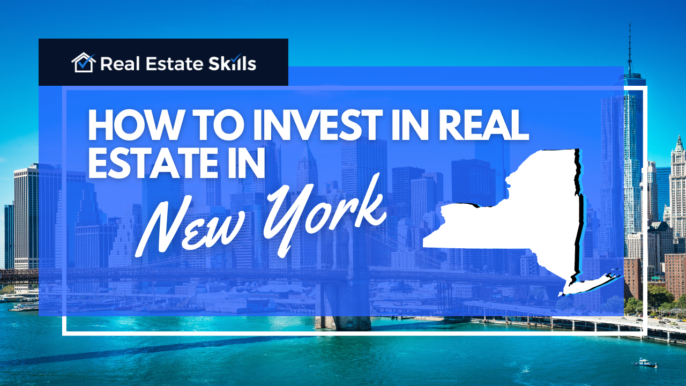

## Table of Contents

## What are the basic concepts of real estate investment in New York City?

Real estate investment in New York City involves buying properties to make money. People invest in homes, apartments, or commercial buildings. The goal is to earn money from rent or by selling the property for more than they paid. New York City is a big and busy place, so property values can go up a lot. This makes it a good place to invest, but it can also be risky because prices can change a lot.

When investing in New York City, it's important to know the different neighborhoods. Some areas are more expensive and popular, like Manhattan, while others might be cheaper and up-and-coming, like parts of Brooklyn or Queens. Each neighborhood has its own rules and market trends. Investors need to do a lot of research to understand which areas are good for investment. They also need to think about costs like taxes, maintenance, and any renovations that might be needed.

Another key part of real estate investment in New York City is understanding the laws and regulations. The city has strict rules about what you can do with properties, especially when it comes to renting them out. Investors need to know about rent control laws, zoning laws, and other regulations that can affect their investment. Working with a good real estate agent or lawyer can help make sure everything is done correctly and legally.

## How does the New York City real estate market differ from other major cities?

The New York City real estate market is unique because it's one of the most expensive and competitive in the world. Prices in neighborhoods like Manhattan can be much higher than in other major cities like Chicago or Atlanta. This is because New York City is a global hub for business, finance, and culture, which attracts a lot of people and drives up demand for housing. The city's limited space also means that there's not a lot of room to build new properties, which keeps prices high. In contrast, cities like Houston or Phoenix have more land available for development, which can lead to more affordable housing options.

Another difference is the diversity of neighborhoods in New York City. Each area has its own character and price range, from the luxury apartments in Tribeca to the more affordable homes in parts of Brooklyn or Queens. This variety means investors and buyers have many options, but it also makes the market more complex. In other cities like San Francisco or Boston, the real estate market might be more uniform, with less variation in neighborhood prices and styles. New York's diverse neighborhoods also mean that local regulations and market trends can vary a lot, which is something investors need to consider carefully.

Lastly, the regulatory environment in New York City is stricter than in many other cities. There are specific laws about rent control, zoning, and property use that can affect how investors manage their properties. For example, rent stabilization laws in New York can limit how much landlords can increase rent, which is not as common in cities like Miami or Las Vegas. These regulations can make investing in New York more challenging but also potentially more rewarding if navigated successfully.

## What are the most popular neighborhoods for real estate investment in NYC?

Some of the most popular neighborhoods for real estate investment in New York City are in Manhattan, like the Upper West Side and the Financial District. The Upper West Side is loved for its nice homes and good schools, which makes it a great place for families. The Financial District is popular because it's close to many big businesses, and people like living near where they work. Both areas have high property values, but they can also bring in good rental income because a lot of people want to live there.

Brooklyn neighborhoods like Williamsburg and Park Slope are also very popular for real estate investment. Williamsburg is known for its trendy vibe and lots of young people, which makes it a hot spot for rental properties. Park Slope is more family-friendly with good schools and parks, so it attracts people looking for a quieter life but still close to the city. Both areas have seen a lot of growth in property values over the years, making them good places to invest.

In Queens, neighborhoods like Astoria and Long Island City are becoming more popular for real estate investment. Astoria is known for its diverse community and good food scene, which attracts a lot of renters. Long Island City has been growing fast with new buildings and is close to Manhattan, making it a good choice for people who want to live near the city but in a less crowded area. Both neighborhoods offer good investment opportunities because they are becoming more popular and property values are going up.

## What types of properties are best for beginners investing in NYC real estate?

For beginners investing in New York City real estate, multi-family homes are a good choice. These are buildings with several apartments, like a two-family or three-family home. You can live in one part and rent out the others. This way, the rent money can help pay the mortgage and other costs. It's a good way to start because you learn how to be a landlord while also living in the property. Neighborhoods like Astoria in Queens or parts of Brooklyn like Bushwick have many multi-family homes that are good for beginners.

Another good option for beginners is to invest in condos. Condos are like apartments, but you own the unit instead of renting it. They can be easier to manage than a whole building because the condo association takes care of common areas and some repairs. Condos in up-and-coming areas like Long Island City or parts of Harlem can be a smart investment. They might not be as expensive as condos in places like Manhattan, but they can still go up in value over time. Plus, you can rent them out to make money.

## How can one assess the potential return on investment for NYC properties?

To assess the potential return on investment for properties in New York City, you need to look at a few key things. First, think about the rental income. If you buy a property to rent out, you want to know how much rent you can charge. Look at similar properties in the same neighborhood to see what they are renting for. Then, subtract your costs like mortgage payments, taxes, and maintenance from the rent to see if you'll make money each month. This is called the cash flow. If the cash flow is positive, that's a good sign.

Next, consider how much the property might be worth in the future. Real estate in New York City can go up in value over time, especially in popular neighborhoods. Look at past trends to see how much property values have increased in the area. If you think the value will keep going up, you could make money by selling the property later for more than you paid. This is called capital appreciation. To get a full picture of your return on investment, add up the cash flow you expect to get over time and the potential profit from selling the property. This will help you decide if the investment is worth it.

## What are the key financial considerations when investing in NYC real estate?

When investing in NYC real estate, one of the main financial considerations is the cost of buying the property. NYC is known for its high property prices, so you need to have a lot of money saved up or be ready to take out a big loan. You also need to think about other costs like closing costs, which can be a lot of money, and the down payment, which is often higher in NYC than in other places. Once you own the property, you'll have to pay property taxes, which can be high in NYC, and you might need to fix up the place before you can rent it out or live in it. All these costs add up, so you need to make sure you can afford them.

Another important thing to think about is how you'll make money from the property. If you plan to rent it out, you need to figure out how much rent you can charge and if that will be enough to cover your costs like the mortgage, taxes, and maintenance. You also need to think about how much the property might be worth in the future. If you think the value will go up, you could make money by selling it later. But remember, the real estate market in NYC can change a lot, so there's always a risk that prices might go down instead of up. It's a good idea to do a lot of research and maybe talk to a financial advisor to make sure you understand all the risks and rewards before you invest.

## How do local regulations and zoning laws impact real estate investment in NYC?

Local regulations and zoning laws in New York City can have a big impact on real estate investment. These rules decide what you can do with a property, like if you can turn it into apartments or use it for a business. For example, some areas have strict rules about how many units you can have in a building or what kind of businesses can be there. If you want to change how a property is used, you might need special permission, which can take time and money. Also, New York City has rent control laws, which means you can't raise the rent as much as you want on some apartments. This can affect how much money you make from renting out your property.

Zoning laws also affect what kind of buildings can be built in different areas. Some neighborhoods only allow certain types of buildings, like single-family homes or low-rise apartments. This can limit what you can do with a property you buy. If you want to build something different, you might need to go through a long process to change the zoning, which can be hard and expensive. Understanding these rules is really important before you invest in NYC real estate. It helps you know what you can and can't do with a property, and how these rules might affect your plans to make money from it.

## What are advanced strategies for leveraging real estate investments in NYC?

One advanced strategy for leveraging real estate investments in NYC is to use a 1031 exchange. This is a way to sell one property and buy another without paying taxes on the profit right away. You can keep doing this to grow your investment without paying taxes until you decide to cash out. It's a smart move if you want to keep your money working for you in the real estate market. But, you need to follow strict rules about timing and the kind of property you buy next, so it's good to work with a professional to make sure you do it right.

Another strategy is to invest in real estate investment trusts (REITs) that focus on NYC properties. REITs let you invest in a bunch of properties at once, which can spread out your risk. They also pay out most of their income as dividends, which can give you a steady stream of money. This can be a good way to get into the NYC real estate market without having to buy and manage properties yourself. Just remember, like any investment, REITs can go up and down in value, so you need to do your homework and maybe talk to a financial advisor.

## How can investors use market trends and data to make informed decisions in NYC?

Investors can use market trends and data to make smart choices in NYC by looking at how property prices have changed over time. They can check out reports and data from real estate websites or local government to see which neighborhoods are getting more popular and where prices are going up. This helps them guess which areas might be good to invest in because they think prices will keep going up. They can also look at how many people are moving into or out of different neighborhoods, which can tell them where demand for housing might be growing. By keeping an eye on these trends, investors can pick the right time to buy or sell properties to make the most money.

Another way to use data is to look at rental market trends. Investors can find out how much rent people are paying in different parts of NYC and see if those rents are going up or down. This helps them figure out if they can make enough money from renting out a property to cover their costs and make a profit. They can also use data about how long it takes to rent out a place, which can show them how easy or hard it might be to find tenants. By putting all this information together, investors can make better decisions about where to invest and how to manage their properties to get the best return on their investment.

## What are the risks associated with investing in high-end luxury properties in NYC?

Investing in high-end luxury properties in NYC can be risky because these properties are very expensive. If the real estate market goes down, the value of luxury properties can drop a lot more than regular homes. This means you could lose a big amount of money if you need to sell during a bad time. Also, luxury properties often have high maintenance costs, like fancy repairs and upkeep, which can eat into your profits. If you can't rent out the property for enough money to cover these costs, you might end up losing money every month.

Another risk is that luxury properties can be harder to sell or rent out. Not as many people can afford to buy or rent these expensive places, so it might take longer to find a buyer or tenant. This can be a problem if you need to sell quickly or if you're counting on rental income to pay your bills. Plus, the luxury market can be affected by things like changes in the economy or fewer rich people wanting to live in NYC. All these things can make investing in luxury properties in NYC a bit more risky than investing in regular homes.

## How can one optimize tax strategies when investing in NYC real estate?

One way to optimize tax strategies when investing in NYC real estate is by using a 1031 exchange. This lets you sell one property and buy another without paying taxes on the profit right away. You can keep doing this to grow your investment without paying taxes until you decide to cash out. It's a smart move if you want to keep your money working for you in the real estate market. But, you need to follow strict rules about timing and the kind of property you buy next, so it's good to work with a professional to make sure you do it right.

Another way to save on taxes is by taking advantage of deductions. You can deduct things like mortgage interest, property taxes, and the costs of fixing up your property. These deductions can lower how much tax you have to pay each year. It's important to keep good records of all your expenses so you can claim these deductions. Talking to a tax advisor can help you make sure you're getting all the deductions you can and following the rules correctly.

## What are the future predictions for the NYC real estate market and how should they influence investment strategies?

Experts think that the NYC real estate market will keep growing, but it might not grow as fast as before. More people are moving to NYC, and it's still a big place for business and culture. This means that property values should go up over time, especially in popular neighborhoods. But, things like high interest rates or a bad economy could slow down the market. So, it's a good idea to keep an eye on these things and be ready to change your plans if needed.

Because of these predictions, investors should think about buying properties in up-and-coming neighborhoods where prices might go up a lot. Places like parts of Brooklyn or Queens could be good choices because they are getting more popular but are still cheaper than Manhattan. It's also smart to have a long-term plan and be ready to hold onto properties for a while. This way, you can wait for the market to go up and make more money when you sell. Always do a lot of research and maybe talk to a real estate expert to make the best choices for your investment.

## References & Further Reading

[1]: Streitfeld, D. (2015). ["The Housing Market in Manhattan Soars."](https://www.usnews.com/news/articles/2016-01-27/housing-market-surges-in-2015-but-faces-bumpy-road-ahead) The New York Times.

[2]: ["Advances in Financial Machine Learning"](https://www.amazon.com/Advances-Financial-Machine-Learning-Marcos/dp/1119482089) by Marcos Lopez de Prado

[3]: Aronson, D. R. (2006). ["Evidence-Based Technical Analysis: Applying the Scientific Method and Statistical Inference to Trading Signals."](https://www.amazon.com/Evidence-Based-Technical-Analysis-Scientific-Statistical/dp/0470008741) Wiley Trading.

[4]: Jansen, S. (2020). ["Machine Learning for Algorithmic Trading."](https://github.com/stefan-jansen/machine-learning-for-trading) Packt Publishing.

[5]: Chan, E. P. (2009). ["Quantitative Trading: How to Build Your Own Algorithmic Trading Business."](https://github.com/ftvision/quant_trading_echan_book) Wiley Trading.