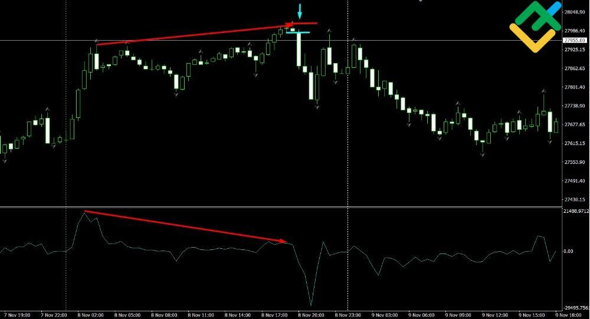

## Table of Contents

## What is the Nikkei 225 Index and why is it important?

The Nikkei 225 Index is a stock market index that tracks the performance of 225 large companies listed on the Tokyo Stock Exchange in Japan. It is one of the most widely followed stock indices in the world and is often used as a measure of the overall health of the Japanese economy. The index was first published in 1950 and is calculated by taking the average price of the 225 stocks, making it a price-weighted index.

The Nikkei 225 is important because it gives investors and economists a quick way to understand how the Japanese stock market is doing. When the Nikkei goes up, it usually means that the companies in Japan are doing well, and people feel more confident about the economy. On the other hand, if the Nikkei goes down, it can be a sign that the economy might be facing some challenges. Because Japan is one of the largest economies in the world, changes in the Nikkei can also affect global markets and influence investment decisions around the world.

## How can beginners start investing in the Nikkei 225?

For beginners looking to invest in the Nikkei 225, the first step is to open a brokerage account that allows you to trade international stocks. Many online brokers offer access to foreign markets, including Japan. Once you have an account set up, you can start looking into how to invest in the Nikkei 225. One of the easiest ways is to buy an exchange-traded fund (ETF) that tracks the Nikkei 225. ETFs are like baskets of stocks that you can buy and sell like a single stock, and they make it simple to invest in a whole index without having to buy each stock individually.

Another way to invest in the Nikkei 225 is by buying shares of individual companies that are part of the index. This can be more complicated because you need to research each company to understand if it's a good investment. It's also riskier because if one company does poorly, it can affect your investment more than if you had spread your money across many companies through an [ETF](/wiki/etf-trading-strategies). Before you start investing, it's a good idea to learn as much as you can about the market and maybe even talk to a financial advisor to get some guidance.

## What are the basic investment strategies for the Nikkei 225?

One basic investment strategy for the Nikkei 225 is to use a buy-and-hold approach. This means you buy an ETF that tracks the Nikkei 225 or shares of companies in the index and keep them for a long time. The idea is that over many years, the Japanese economy and the companies in the Nikkei 225 will grow, and your investment will grow with them. This strategy is good for beginners because it doesn't require you to watch the market every day or make quick decisions. You just need to be patient and believe in the long-term growth of the Japanese economy.

Another strategy is called dollar-cost averaging. With this approach, you invest a fixed amount of money into the Nikkei 225 at regular intervals, like every month. This helps you avoid trying to guess the best time to buy. When the market is down, your fixed amount buys more shares, and when the market is up, it buys fewer shares. Over time, this can lower the average price you pay for your investment. This strategy can be less stressful because it spreads out your investment over time and helps you avoid big losses if the market suddenly drops.

A third strategy is to use technical analysis. This involves looking at charts and patterns of the Nikkei 225 to try to predict where the market is going next. You might buy when you think the market is going up and sell when you think it's going down. This strategy can be more complicated and risky because it requires a lot of time and knowledge to do well. It's not usually recommended for beginners, but if you're interested in learning more about the market, it can be a good way to start understanding how it works.

## How does the performance of the Nikkei 225 compare to other major indices?

The Nikkei 225, which tracks the performance of 225 large companies in Japan, is often compared to other major indices like the S&P 500 in the United States, the FTSE 100 in the United Kingdom, and the DAX in Germany. Each of these indices represents a different economy and has its own way of calculating performance. For example, the S&P 500 is a market-cap weighted index that includes 500 of the largest companies in the U.S., while the Nikkei 225 is a price-weighted index. This means that the way these indices move can be influenced by different factors. Over time, the Nikkei 225 has sometimes performed better than these other indices, and sometimes it has performed worse. It all depends on what's happening in the Japanese economy compared to other countries.

In recent years, the Nikkei 225 has shown strong growth, especially when compared to some other indices. For instance, from 2020 to 2023, the Nikkei 225 saw significant gains, partly due to Japan's economic recovery efforts and supportive monetary policies. During the same period, the S&P 500 also did well but faced more [volatility](/wiki/volatility-trading-strategies) due to changes in U.S. economic policies and global events. The FTSE 100 and DAX, on the other hand, had mixed performances influenced by Brexit and European economic issues. Overall, the Nikkei 225's performance is closely tied to Japan's economic health, and while it can be a good investment, it's important to consider how it fits into the broader global market context.

## What are the key economic indicators to watch when investing in the Nikkei 225?

When you're thinking about investing in the Nikkei 225, it's a good idea to keep an eye on Japan's economic indicators. One important thing to watch is the Gross Domestic Product (GDP) growth rate. This tells you how fast Japan's economy is growing. If the GDP is going up, it's a good sign that companies in the Nikkei 225 might do well. Another key indicator is the unemployment rate. If fewer people are out of work, it means more people are [earning](/wiki/earning-announcement) money and spending it, which can help businesses grow. You should also pay attention to inflation rates. If prices are going up too fast, it can hurt the economy, but a little bit of inflation can be good because it means people are spending money.

Another thing to watch is the Bank of Japan's monetary policy. This includes interest rates and other actions the bank takes to control the economy. If the Bank of Japan lowers interest rates, it can make it easier for companies to borrow money and grow, which is good for the Nikkei 225. On the other hand, if they raise rates, it might slow down the economy. You should also look at the yen's exchange rate. If the yen gets stronger compared to other currencies, it can make Japanese exports more expensive and hurt companies that sell things overseas. But if the yen gets weaker, it can help those companies by making their products cheaper for foreign buyers. Keeping an eye on these indicators can help you make smarter choices about when to invest in the Nikkei 225.

## How can investors use technical analysis to make decisions about the Nikkei 225?

Technical analysis is a way for investors to look at past price movements and patterns of the Nikkei 225 to try to predict what might happen next. Investors use charts and tools to see trends, like if the Nikkei is going up or down over time. They might look for patterns, like when the price goes up and down in a certain way that has happened before. This can help them decide if it's a good time to buy or sell. For example, if they see a pattern that often leads to a price increase, they might decide to buy shares or an ETF that tracks the Nikkei 225.

Another part of technical analysis is looking at things called indicators, like moving averages or the Relative Strength Index (RSI). A moving average smooths out price data to help investors see the overall direction of the market. If the Nikkei's price is above its moving average, it might mean the market is doing well. The RSI helps investors see if the Nikkei is overbought or oversold, which can signal if a price change might be coming soon. By using these tools, investors can make more informed decisions about when to get into or out of the market, but it's important to remember that technical analysis is not perfect and should be used along with other information.

## What are the risks associated with investing in the Nikkei 225 and how can they be mitigated?

Investing in the Nikkei 225 comes with several risks. One big risk is that the market can go up and down a lot. This is called market volatility. If the Nikkei drops a lot, you could lose money. Another risk is currency risk. If you're not in Japan, you have to change your money into yen to invest. If the yen gets weaker compared to your home currency, it can make your investment worth less when you change it back. There's also the risk that something bad might happen to the Japanese economy, like a recession or a natural disaster, which could hurt the companies in the Nikkei 225 and make their stock prices go down.

To help lower these risks, you can do a few things. One way is to not put all your money into the Nikkei 225. Instead, spread it out over different investments, like stocks from other countries or different types of investments like bonds. This is called diversification, and it can help protect you if the Nikkei goes down. Another way is to keep your investments for a long time. Over many years, the ups and downs of the market can even out, and you might see your investment grow. You can also use stop-loss orders, which automatically sell your investment if the price drops to a certain level, to help limit how much money you could lose. By being careful and using these strategies, you can try to make your investment in the Nikkei 225 safer.

## How do geopolitical events affect the Nikkei 225 and what strategies can be employed to navigate these?

Geopolitical events can have a big impact on the Nikkei 225. When something big happens in the world, like a war or a trade disagreement between countries, it can make the stock market go up and down. For example, if Japan has a trade fight with another country, it might hurt Japanese companies that sell things to that country, and their stock prices could go down. Also, if there's a lot of uncertainty because of what's happening in the world, investors might get scared and sell their stocks, which can make the Nikkei 225 drop. So, it's important to keep an eye on what's going on around the world because it can affect your investments.

To navigate these geopolitical risks, one strategy is to stay informed about what's happening in the world. You can read the news or follow experts who talk about how world events might affect the stock market. Another strategy is to diversify your investments. Instead of putting all your money into the Nikkei 225, you can spread it out over different types of investments, like stocks from other countries or bonds. This way, if something bad happens that hurts the Nikkei, your other investments might help balance it out. Lastly, you can use a long-term investment approach. Over many years, the ups and downs caused by geopolitical events can even out, and your investment might grow. By being aware and using these strategies, you can better handle the risks that come with geopolitical events.

## What are advanced trading strategies for the Nikkei 225, such as options and futures?

Advanced trading strategies for the Nikkei 225 include using options and futures. Options give you the right, but not the obligation, to buy or sell the Nikkei 225 at a certain price before a certain date. For example, if you think the Nikkei is going to go up, you can buy a call option. This lets you buy the Nikkei at a lower price than it might be in the future. If you think the Nikkei is going to go down, you can buy a put option, which lets you sell it at a higher price than it might be later. Options can be risky because you can lose the money you paid for them if the Nikkei doesn't move the way you thought it would, but they can also help you make more money if you're right.

Futures are another way to trade the Nikkei 225. Futures are contracts where you agree to buy or sell the Nikkei at a certain price on a certain date in the future. If you think the Nikkei is going to go up, you can buy a futures contract. If it does go up, you can sell the contract later for more money than you paid for it. If you think the Nikkei is going to go down, you can sell a futures contract. If it does go down, you can buy it back later for less money than you sold it for. Futures can be very risky because you have to put up money to cover possible losses, and if the market moves against you, you could lose a lot. But they can also help you make big profits if you're right about where the market is going.

## How can investors use sector analysis to enhance their Nikkei 225 investment strategy?

Investors can use sector analysis to make smarter choices about their Nikkei 225 investments by looking at how different parts of the Japanese economy are doing. The Nikkei 225 includes companies from many different sectors, like technology, cars, and banks. By studying these sectors, investors can see which ones are growing and which ones might be facing problems. For example, if the technology sector is doing well because of new inventions or more people buying tech products, an investor might decide to put more money into tech companies in the Nikkei 225. On the other hand, if the car industry is struggling because fewer people are buying cars, an investor might want to be careful about investing in car companies.

Using sector analysis can also help investors spread out their money in a smart way. Instead of just buying the whole Nikkei 225, they can choose to invest more in the sectors that are doing well and less in the ones that are not. This can help them make more money if they pick the right sectors. For example, if the healthcare sector is growing because of new medicines or more people needing healthcare, an investor might decide to buy more shares of healthcare companies. By paying attention to how different sectors are doing, investors can make better decisions about where to put their money in the Nikkei 225.

## What role does the Japanese yen play in investing in the Nikkei 225?

The Japanese yen plays a big part in investing in the Nikkei 225. If you're not in Japan, you need to change your money into yen to buy stocks or ETFs that track the Nikkei 225. If the yen gets stronger compared to your home currency, it can make your investment worth less when you change it back. On the other hand, if the yen gets weaker, it can make your investment worth more. So, the value of the yen can affect how much money you make or lose from your investment.

Because of this, investors need to keep an eye on the yen's exchange rate. Changes in the yen can be influenced by Japan's economy, the Bank of Japan's policies, and what's happening in the world. If the yen is expected to get stronger, it might be a good time to invest in the Nikkei 225 because you could buy more yen with your money. But if the yen is expected to get weaker, you might want to wait or use strategies to protect against currency changes, like hedging. Understanding the yen's role can help you make better decisions about when and how to invest in the Nikkei 225.

## How can long-term investors build a diversified portfolio around the Nikkei 225?

Long-term investors can build a diversified portfolio around the Nikkei 225 by not putting all their money into just this index. Instead, they can spread their investments across different types of assets. For example, they might invest in the Nikkei 225 through an ETF, but also put money into stocks from other countries, like the S&P 500 in the U.S. or the FTSE 100 in the U.K. They could also add bonds, which are less risky than stocks and can provide steady income. By doing this, if the Nikkei 225 goes down, the other investments might help balance out the losses.

Another way to diversify is by investing in different sectors within Japan. The Nikkei 225 includes companies from many sectors, like technology, cars, and banks. Investors can choose to put more money into the sectors that are doing well and less into the ones that are not. For example, if the healthcare sector in Japan is growing, they might decide to invest more in healthcare companies. This can help them make more money if they pick the right sectors. By spreading their money across different types of investments and sectors, long-term investors can build a strong and balanced portfolio around the Nikkei 225.

## References & Further Reading

[1]: Chan, E. P. (2009). ["Quantitative Trading: How to Build Your Own Algorithmic Trading Business."](https://github.com/ftvision/quant_trading_echan_book) John Wiley & Sons.

[2]: Jansen, S. (2018). ["Machine Learning for Algorithmic Trading."](https://www.oreilly.com/library/view/machine-learning-for/9781839217715/) Packt Publishing.

[3]: Aronson, D. R. (2006). ["Evidence-Based Technical Analysis: Applying the Scientific Method and Statistical Inference to Trading Signals."](https://www.amazon.com/Evidence-Based-Technical-Analysis-Scientific-Statistical/dp/0470008741) Wiley.

[4]: Prado, M. L. de. (2018). ["Advances in Financial Machine Learning."](https://www.amazon.com/Advances-Financial-Machine-Learning-Marcos/dp/1119482089) John Wiley & Sons.

[5]: Bergstra, J., Bardenet, R., Bengio, Y., & Kégl, B. (2011). ["Algorithms for Hyper-Parameter Optimization."](https://dl.acm.org/doi/10.5555/2986459.2986743) Advances in Neural Information Processing Systems 24.

[6]: Nomura Asset Management. ["About Nikkei 225 ETFs."](https://www.google.com/finance/quote/1321:TYO)

[7]: iShares by BlackRock. ["ETFs Tracking Nikkei 225."](https://www.ishares.com/uk/individual/en/products/253742/ishares-nikkei-225-ucits-etf)