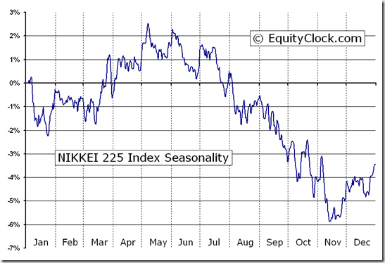

The Nikkei 225 is a prominent stock market index that serves as a crucial benchmark for the Tokyo Stock Exchange. It comprises the largest blue-chip companies in Japan, including industry giants such as Sony, Toyota, and Canon. This index offers a comprehensive view of Japan's diverse and dynamic economy.

Investors who seek substantial exposure to the Japanese market can benefit from understanding various investment strategies and algorithmic trading opportunities associated with the Nikkei 225. Algorithmic trading, in particular, has transformed how investors engage with this index. By leveraging computer algorithms, trades can be executed swiftly and precisely, capitalizing on minute market fluctuations and trends. Incorporating real-time data and sophisticated market indicators allows traders to make well-informed decisions, enhancing their potential for profit.



This article examines the different investment strategies employed in trading the Nikkei 225, with a particular focus on algorithmic trading methods. By exploring these strategies, investors can gain insights into how to navigate one of the world's most vibrant economies and optimize their investment outcomes.

## Table of Contents

## Understanding the Nikkei 225

The Nikkei 225 Stock Average, established in 1950, stands as a pivotal barometer of the Japanese economy, much like the Dow Jones Industrial Average in the United States. This price-weighted index comprises 225 leading companies listed on the Tokyo Stock Exchange, representing a comprehensive cross-section of Japanese industrial diversity. 

Prominent corporations such as Sony, Toyota, and Canon are included in the index, reflecting Japan's global influence in sectors like electronics, automotive manufacturing, and optical products. This diversity ensures that the index remains an accurate reflection of Japan's economic health, making it a crucial tool for both domestic and international investors.

The index's price-weighted nature means that companies with higher stock prices have a greater influence on the index value, as opposed to market capitalization-weighted indices where the size of the company plays a more significant role. For instance, if a high-priced stock like Sony's experiences a significant price fluctuation, it disproportionately impacts the Nikkei 225.

Understanding the constituents and structure of the Nikkei 225 is essential for developing informed and effective trading strategies. Investors and traders analyze the index to gauge overall market sentiment, economic trends, and sectoral performances. They also often benchmark their portfolios against it to assess performance relative to the broader Japanese market. 

The composition of the Nikkei 225 is reviewed annually in September, with changes implemented in October, ensuring the index remains a relevant representation of Japan's economic landscape. This annual review process assesses and adjusts the index to accommodate shifts in industry importance and company performances, maintaining a current and dynamic reflection of the market. 

Knowledge about the Nikkei 225's structure and constituent companies aids in creating robust trading strategies, as it allows investors to anticipate movements based on sectoral shifts and individual stock performances, thus aligning their portfolios with macroeconomic and microeconomic trends observed within the index.

## Algorithmic Trading in the Nikkei 225

Algorithmic trading in the Nikkei 225 involves leveraging computer algorithms to automate the execution of trades. These algorithms, developed with pre-defined criteria, allow traders to execute orders with precision and speed that human traders cannot match. This method is particularly beneficial in rapidly changing markets like the Nikkei 225.

High-frequency trading ([HFT](/wiki/high-frequency-trading-strategies)) is a predominant form of [algorithmic trading](/wiki/algorithmic-trading) utilized within the Nikkei 225. HFT strategies focus on executing a large number of trade orders at incredibly fast speeds, often within milliseconds. The fundamental advantage of HFT lies in its ability to exploit minute price movements, thus enhancing the potential for profit through rapid turnover. This is achieved by capitalizing on bid-ask spreads and [arbitrage](/wiki/arbitrage) opportunities that may persist temporarily in the market.

An essential component of effective algorithmic trading is the integration of real-time market data and indicators into the trading algorithms. This includes using inputs such as price levels, trading [volume](/wiki/volume-trading-strategy), technical indicators, and market sentiment data. These inputs enable the algorithm to make trading decisions dynamically and react promptly to market conditions.

Algorithms typically use various mathematical models and statistical methods to identify trading signals and generate optimal trading strategies. For instance, moving averages, [statistical arbitrage](/wiki/statistical-arbitrage), and regression models are often implemented to identify trends and price discrepancies in the market. Python, with its powerful libraries like NumPy, pandas, and SciPy, is frequently used to build and backtest these models.

Here's a basic example of how a moving average crossover strategy can be implemented in Python:

```python
import pandas as pd
import numpy as np

# Assuming 'df' is a DataFrame containing historical price data for the Nikkei 225
# with a 'Close' column for the closing prices

def moving_average_strategy(df, short_window=40, long_window=100):
    signals = pd.DataFrame(index=df.index)
    signals['price'] = df['Close']
    signals['short_mavg'] = df['Close'].rolling(window=short_window, min_periods=1).mean()
    signals['long_mavg'] = df['Close'].rolling(window=long_window, min_periods=1).mean()

    # Create signals
    signals['signal'] = 0.0
    signals['signal'][short_window:] = np.where(signals['short_mavg'][short_window:] > signals['long_mavg'][short_window:], 1.0, 0.0)  
    signals['positions'] = signals['signal'].diff()

    return signals

# Example usage:
# signals = moving_average_strategy(dataframe_containing_nikkei225_prices)
```

This program calculates short and long moving averages and generates buy or sell signals based on when the shorter moving average crosses above or below the longer moving average. Such strategies, when implemented with real-time data feeds and trading execution, can form the backbone of a successful algorithmic trading system in the Nikkei 225.

By harnessing cutting-edge technology, traders leveraging algorithmic protocols can maintain a significant edge, automating decision-making processes, and maximizing efficiency in a competitive trading environment.

## Investment Strategies for the Nikkei 225

Momentum trading in the Nikkei 225 involves leveraging the natural ebb and flow of market trends. Traders buy securities that exhibit upward [momentum](/wiki/momentum), riding the price increase until a trend reversal is observed. Conversely, they sell off securities experiencing downward momentum, reducing exposure to potential losses. This strategy relies heavily on technical analysis and real-time data to identify and confirm trends. Traders may utilize tools like moving averages and Relative Strength Index (RSI) to ascertain market trends and execute timely trades within the Nikkei 225.

Arbitrage strategies in trading the Nikkei 225 capitalize on price discrepancies between index futures and the respective underlying stocks. These strategies typically involve buying undervalued assets while simultaneously selling overvalued ones, thereby locking in profits when prices eventually converge. Traders may explore statistical arbitrage, which uses mathematical models to find mispriced pairs and execute trades. Ensuring a rapid response to arbitrage opportunities is vital due to their transient nature, often lasting seconds in high-frequency trading environments.

Hedging techniques are essential for managing risks associated with the volatile nature of the Nikkei 225. One prevalent method involves using put options to protect against potential losses. A put option grants the holder the right, but not the obligation, to sell a security at a specified price within a determined timeframe. By purchasing put options, investors can effectively cap potential losses from adverse price movements in the index. A common approach is to use protective puts where an investor maintains a long position in a stock and buys a put option on an equivalent number of shares, thus providing insurance against significant downturns.

In Python, implementing a simple momentum trading algorithm might look like this:

```python
import pandas as pd

def calculate_momentum(data, window=10):
    return data['Close'].diff(window)

# Sample data format
# data = pd.DataFrame({
#     'Close': [22500, 22520, 22550, 22570, 22595, 22600]
#     })

data['Momentum'] = calculate_momentum(data)

buy_signals = data[data['Momentum'] > 0]  # Indicative of an upward trend
sell_signals = data[data['Momentum'] < 0]  # Indicative of a downward trend
```

This basic example computes the momentum by taking the difference in closing prices over a specified window, identifying buy signals when the momentum is positive and sell signals when negative.

By employing these investment strategies tailored to the Nikkei 225, investors can navigate market fluctuations more astutely, potentially achieving favorable outcomes even amidst [volatility](/wiki/volatility-trading-strategies).

## Exchange-Traded Funds (ETFs) as an Investment Vehicle

Exchange-Traded Funds (ETFs) offer investors a streamlined and economically efficient avenue for investing in the Nikkei 225. These funds function by replicating the performance of the Nikkei 225, allowing investors to gain exposure to a wide range of Japanese blue-chip companies without the need to individually purchase each stock in the index. By offering a broad market exposure, ETFs enable investors to diversify their portfolios with just a single trade.

Notable options that track the Nikkei 225 include funds managed by Blackrock iShares and Nomura Asset Management. These ETFs provide an opportunity for investors to access a diversified collection of stocks spanning various sectors of the Japanese economy. This diversification reduces the risk associated with investing in individual securities by spreading it across numerous sectors and companies.

ETFs are also characterized by their [liquidity](/wiki/liquidity-risk-premium) benefits. Since they are traded on the stock exchange, like common stocks, they can be bought or sold throughout the trading day at prevailing market prices. This feature offers investors the flexibility to enter or [exit](/wiki/exit-strategy) positions with ease, thus providing a significant advantage over some other forms of investment.

Moreover, ETFs generally incur lower management fees compared to actively managed funds. This cost efficiency is largely attributed to the passive management style of most ETFs, which entails tracking an index rather than engaging in frequent buying and selling based on market predictions. Consequently, the reduced expenses associated with ETFs can contribute to higher net returns for investors over time.

Overall, ETFs represent a pragmatic investment vehicle for those interested in the Nikkei 225, combining the benefits of diversification, liquidity, and cost-effectiveness. Investors are thus able to efficiently participate in Japan's economic growth while minimizing the complexity traditionally associated with stock market investments.

## Analyzing Market Indicators and External Influencers

Key economic indicators such as GDP growth, unemployment rates, and inflation are pivotal in shaping the dynamics of the Nikkei 225. These indicators reflect the overall health of Japan's economy, influencing corporate profits and investor confidence.

### Economic Indicators

#### GDP Growth
Gross Domestic Product (GDP) growth is a critical measure of economic performance. A positive GDP growth rate suggests a healthy and expanding economy, which often leads to increased corporate earnings and investor optimism. Conversely, sluggish GDP growth might induce caution among investors, potentially leading to a sluggish Nikkei 225. Historical data indicates that significant GDP contractions, such as those during economic recessions, often coincide with downturns in the stock market indices.

#### Unemployment Rates
Unemployment rates offer insights into the labor market's strength. Lower unemployment signifies that more individuals are employed, thereby increasing consumer spending capacity and boosting corporate revenues. Higher employment rates can lead to increased demand for goods and services, positively impacting companies listed on the Nikkei 225. In contrast, rising unemployment might dampen consumer spending and, consequently, corporate earnings, negatively impacting stock prices.

#### Inflation
Inflation impacts purchasing power and cost structures within the economy. Moderate inflation typically signals healthy demand, prompting companies to invest and expand, which can elevate stock prices. However, hyperinflation can erode consumer purchasing power and increase production costs, negatively impacting profit margins for companies represented in the Nikkei 225. Investors closely monitor inflation data from the Bank of Japan (BOJ) as it can lead to adjustments in monetary policy, affecting interest rates and subsequently influencing stock market movements.

### Global Influences

The interconnectedness of global markets means that external shocks and trends from major economies, particularly the United States, significantly influence the Nikkei 225. The performance of US stock markets often impacts Japanese markets through investor sentiment and capital flows. For instance, a bullish US stock market can foster positive sentiment, leading to increased foreign investment in Japanese equities.

Currency exchange rates, especially the USD/JPY pair, also have profound implications. A depreciation of the yen against the dollar makes Japanese exports more competitive, potentially boosting revenues for export-oriented companies in the index. Conversely, a strong yen can hurt these exporters by making Japanese goods more expensive abroad.

### Geopolitical Events

Geopolitical events, including trade agreements, conflicts, and diplomatic tensions, can have immediate and substantial effects on the Nikkei 225. For example, trade policies between Japan and its major trading partners can alter market dynamics by impacting tariffs and market accessibility for Japanese products. Additionally, geopolitical tensions that could lead to supply chain disruptions or shifts in trade alliances may create volatility in the stock markets.

In summary, a comprehensive understanding of both national economic indicators and global influences is essential for investors and traders in the Nikkei 225. These factors collectively shape the trading environment and help forecast potential market movements, crucial for informed investment decisions.

## Risk Management in Nikkei 225 Trading

Effective risk management strategies are vital for navigating the complexities of trading the Nikkei 225, a dynamic and influential stock market index. Among these strategies, diversification and stop-loss orders are foundational practices that help in reducing potential losses.

Diversification involves spreading investments across various sectors and asset classes. By doing so, investors can mitigate the impact of poor performance in a particular sector or company. For instance, if an investor holds stocks in electronics, automotive, and healthcare companies within the Nikkei 225, a downturn in the electronics sector might be offset by gains in the automotive or healthcare sectors. This approach minimizes the overall portfolio risk by ensuring that negative performances in one area don't drastically affect the entire investment.

Stop-loss orders are another crucial tool for risk management. They automatically trigger the sale of a stock if its price falls below a predetermined level, thus capping potential losses. For example, if an investor purchases a stock at 10,000 Yen, they could set a stop-loss order at 9,500 Yen. This means that if the stock price drops to 9,500 Yen, it will be sold automatically, limiting the loss to 500 Yen per share.

Position sizing plays a significant role in maintaining a balanced risk-reward ratio. This involves deciding how much of one's portfolio should be allocated to a particular trade based on the total portfolio value and the risk associated with the trade. For instance, if an investor's total portfolio value is 10,000,000 Yen and they are willing to risk 1% on a trade, the maximum loss they should be willing to accept is 100,000 Yen. Using a calculated position size ensures that no single trade can significantly impact the overall portfolio, reinforcing long-term financial stability.

Python can be employed to calculate optimal position sizes. Here is a simple example:

```python
portfolio_value = 10000000  # Total portfolio value in Yen
risk_per_trade = 0.01  # Risk set at 1% of the portfolio
stop_loss_amount = 500  # Amount willing to risk per share

position_size = (portfolio_value * risk_per_trade) / stop_loss_amount
print("Optimal position size (number of shares):", position_size)
```

This code will help determine the number of shares to purchase for a trade where the stop-loss is 500 Yen below the purchase price, ensuring adherence to the 1% risk threshold.

Continuous review and adjustment of trading strategies are also essential for maintaining adaptability to changing market conditions. Regular analysis of market trends, economic indicators, and individual stock performances allows investors to make informed decisions and tweak their strategies as needed. This flexibility ensures that traders can respond effectively to new opportunities and potential risks, maintaining their competitive edge in the volatile trading environment of the Nikkei 225.

## Conclusion

Investing in the Nikkei 225 offers a compelling opportunity to participate in Japan's vibrant economic landscape. The index, comprising diverse industry leaders, provides substantial exposure to various economic sectors, from technology and automotive to finance and consumer goods. This diversity not only broadens the potential for returns but also allows investors to tap into different aspects of economic growth across Japan, enhancing the overall portfolio diversity.

Algorithmic trading strategies further refine this investment opportunity by enhancing the precision and speed of trades. These strategies deploy sophisticated algorithms to analyze market data in real-time, allowing investors to respond swiftly to market movements and optimize their trading outcomes. The ability to execute transactions efficiently and accurately gives a distinct competitive advantage, particularly in rapidly changing market conditions where timing is crucial.

Investors can access the Nikkei 225 through different avenues, such as direct stock purchases, derivatives like options and futures, or more accessible choices like Exchange-Traded Funds (ETFs). Each method offers unique advantages; direct stock purchases grant investors a tangible stake in individual companies, derivatives allow for leveraged exposure with potentially lower capital outlay, and ETFs provide a streamlined, cost-effective approach with inherent portfolio diversification. A well-structured investment strategy, which carefully considers these options, can significantly enhance the potential returns from the Nikkei 225, leveraging Japan's economic strengths and the trading edge offered by modern algorithmic approaches.

## References & Further Reading

[1]: Chan, E. P. (2009). ["Quantitative Trading: How to Build Your Own Algorithmic Trading Business."](https://github.com/ftvision/quant_trading_echan_book) John Wiley & Sons.

[2]: Jansen, S. (2018). ["Machine Learning for Algorithmic Trading."](https://www.oreilly.com/library/view/machine-learning-for/9781839217715/) Packt Publishing.

[3]: Aronson, D. R. (2006). ["Evidence-Based Technical Analysis: Applying the Scientific Method and Statistical Inference to Trading Signals."](https://www.amazon.com/Evidence-Based-Technical-Analysis-Scientific-Statistical/dp/0470008741) Wiley.

[4]: Prado, M. L. de. (2018). ["Advances in Financial Machine Learning."](https://www.amazon.com/Advances-Financial-Machine-Learning-Marcos/dp/1119482089) John Wiley & Sons.

[5]: Bergstra, J., Bardenet, R., Bengio, Y., & Kégl, B. (2011). ["Algorithms for Hyper-Parameter Optimization."](https://dl.acm.org/doi/10.5555/2986459.2986743) Advances in Neural Information Processing Systems 24.

[6]: Nomura Asset Management. ["About Nikkei 225 ETFs."](https://www.google.com/finance/quote/1321:TYO)

[7]: iShares by BlackRock. ["ETFs Tracking Nikkei 225."](https://www.ishares.com/uk/individual/en/products/253742/ishares-nikkei-225-ucits-etf)