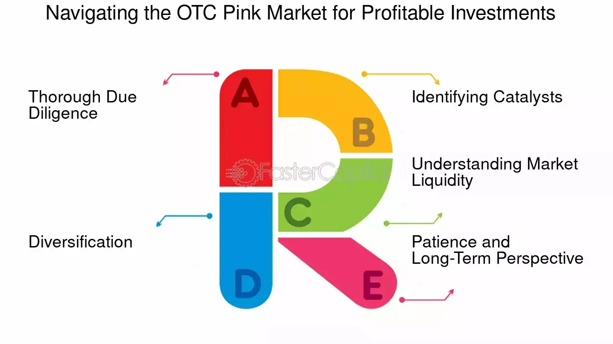

## Table of Contents

## What is the OTC Pink Market and how does it differ from other markets?

The OTC Pink Market is a part of the over-the-counter (OTC) market where stocks and other securities are traded directly between parties without going through a formal exchange like the New York Stock Exchange. It is operated by OTC Markets Group and is known for having the least stringent financial standards and reporting requirements of all the OTC markets. This means that companies listed on the OTC Pink Market might not have to provide as much information about their financial health as companies listed on other markets.

The OTC Pink Market differs from other markets, like the OTCQB and OTCQX, mainly in terms of the level of transparency and regulation. The OTCQB and OTCQX have higher standards for financial reporting and corporate governance, making them more suitable for companies that want to build investor confidence. In contrast, the OTC Pink Market is often used by smaller or newer companies that might not meet the stricter requirements of other markets. This can make investing in OTC Pink stocks riskier because there is less information available to help investors make informed decisions.

## What are the basic risks associated with investing in OTC Pink Market stocks?

Investing in OTC Pink Market stocks can be risky because these companies don't have to share as much information about their finances as companies on bigger markets. This means it's harder for investors to know if a company is doing well or not. Without clear financial reports, it's tough to tell if a company is making money or losing it, which makes it risky to invest in them.

Another risk is that OTC Pink Market stocks are often from smaller or newer companies. These companies might not have a long history of success, so they could fail more easily. If a company goes out of business, investors can lose all their money. Also, because these stocks are less known and traded less often, it can be hard to sell them quickly if you need to, which adds to the risk.

## How can a beginner start investing in OTC Pink Market stocks?

To start investing in OTC Pink Market stocks, a beginner needs to first open a brokerage account. This can be done through many online brokers that offer access to OTC markets. Once the account is set up, you'll need to deposit money into it to start trading. Look for the stocks you're interested in by searching for their ticker symbols, which often have a five-letter code and end in "PK" to show they're on the OTC Pink Market. After finding a stock you want to buy, you can place an order through your brokerage account.

It's really important for beginners to do a lot of research before investing in OTC Pink Market stocks. Because these companies don't have to share as much information, it can be harder to find out if they're doing well. You might want to read news articles, company announcements, and any financial reports they do provide. Also, think about starting with a small amount of money that you're okay with losing, since these investments can be risky. Talking to a financial advisor can also help you make smarter choices as you start investing.

## What are some common investment strategies for OTC Pink Market stocks?

One common strategy for investing in OTC Pink Market stocks is to focus on companies that are working on new and exciting things. These might be small companies with new ideas or technologies that could grow a lot in the future. Investors look for companies that they think will become more popular and valuable over time. They do a lot of research to find these hidden gems, reading news and trying to understand the company's plans. This strategy can be risky because it's hard to predict which companies will succeed, but it can also lead to big rewards if you pick the right ones.

Another strategy is to invest in companies that are already making money and growing slowly but steadily. These companies might not be as exciting as the new ones, but they can be safer because they have a track record of doing well. Investors look at the company's financial reports and see if they are making more money each year. This strategy is less risky than betting on new companies, but the potential for big gains might be smaller. It's about finding a balance between risk and reward, and choosing companies that seem stable and likely to keep growing.

A third strategy is to use a diversified approach. Instead of putting all your money into one or two stocks, you spread it out across many different OTC Pink Market stocks. This way, if one company does badly, it won't hurt your whole investment as much. Diversification can help reduce risk, but it also means you need to keep track of more companies. It's important to keep researching and updating your portfolio to make sure you're still happy with your investments.

## How do you evaluate the financial health of a company listed on the OTC Pink Market?

Evaluating the financial health of a company on the OTC Pink Market can be tricky because these companies don't have to share as much information as those on bigger markets. You can start by looking at any financial reports the company does provide, like income statements, balance sheets, and cash flow statements. These documents can tell you if the company is making money, how much debt it has, and how it's managing its cash. If the company is making more money than it's spending and has enough cash to keep going, that's a good sign. You can also look at the company's history to see if it's been growing over time.

Another way to evaluate a company's financial health is by reading news articles and company announcements. These can give you clues about how the company is doing and what its plans are for the future. If the company is getting new customers, launching new products, or making other positive changes, that's a good sign. On the other hand, if the company is losing customers, facing lawsuits, or having other problems, that's a warning sign. Talking to other investors or joining online forums can also help you learn more about the company and see what other people think about its financial health.

## What role does due diligence play in investing in OTC Pink Market stocks?

Due diligence is super important when you're thinking about investing in OTC Pink Market stocks. It means doing your homework to learn everything you can about a company before you decide to buy its stock. Because companies on the OTC Pink Market don't have to share as much information as bigger companies, you need to be extra careful. You should look at any financial reports they do provide, read news articles, and check out what other investors are saying. This helps you figure out if the company is doing well and if it's a good investment.

Without doing due diligence, you might end up losing money. The OTC Pink Market can be risky because there's less information available, so you need to be really careful. By taking the time to research and understand a company's financial health, plans, and any problems it might have, you can make smarter choices. This can help you avoid companies that might be in trouble and find ones that have a good chance of growing and making you money.

## How can investors use technical analysis in the OTC Pink Market?

Technical analysis can be a useful tool for investors in the OTC Pink Market, even though it might be harder to find good data. It involves looking at charts and patterns to try and guess where a stock's price might go next. Investors can use things like moving averages, which show the average price of a stock over a certain time, to see if the stock is going up or down. They can also look at support and resistance levels, which are price points where the stock tends to stop falling or rising. By studying these patterns, investors can make better guesses about when to buy or sell a stock.

Because OTC Pink Market stocks often don't trade as much as stocks on bigger markets, the data might not be as reliable. But if investors can find enough trading information, they can still use technical analysis to help them. For example, they might see that a stock's price keeps bouncing off a certain level, which could be a sign to buy when it gets close to that level again. Or they might notice that the stock's price is making higher highs and higher lows, which could mean it's a good time to buy. By using technical analysis, investors can add another tool to their toolkit to help them make smarter choices in the OTC Pink Market.

## What are the tax implications of trading OTC Pink Market stocks?

Trading OTC Pink Market stocks can have tax implications just like trading stocks on bigger markets. When you make money from selling your stocks, you have to pay capital gains tax. If you hold the stock for less than a year before selling, it's considered a short-term capital gain, and you'll pay tax on it at your regular income tax rate. But if you hold the stock for more than a year, it's a long-term capital gain, and the tax rate is usually lower. So, how long you keep your stocks can affect how much tax you have to pay.

If you lose money on your OTC Pink Market stocks, you might be able to use those losses to lower your taxes. This is called tax loss harvesting. You can use your losses to reduce your taxable income, which can save you money on taxes. But there are rules about how much you can deduct and how you have to report it, so it's a good idea to talk to a tax professional to make sure you're doing it right. They can help you understand all the tax rules and make sure you're not missing out on any benefits.

## How do regulatory changes affect investment strategies in the OTC Pink Market?

Regulatory changes can have a big impact on how people invest in the OTC Pink Market. When the rules change, it can affect what information companies have to share with investors. If new rules make companies share more financial details, it might make investing in the OTC Pink Market safer because investors can make better choices with more information. But if the rules get stricter and some companies can't meet the new requirements, they might leave the market. This could mean fewer choices for investors and might make them change their strategies to focus on companies that can still meet the new rules.

Changes in regulations can also affect how easy it is to buy and sell stocks in the OTC Pink Market. If new rules make it harder to trade, investors might need to be more patient and hold onto their stocks for longer. This could lead them to focus more on long-term investments rather than trying to make quick profits. On the other hand, if regulations make trading easier, investors might be more willing to take risks and trade more often. Keeping up with regulatory changes is important for investors so they can adjust their strategies and stay successful in the OTC Pink Market.

## What advanced strategies can be used to mitigate risks in OTC Pink Market investments?

One advanced strategy to mitigate risks in OTC Pink Market investments is to use a stop-loss order. This is a way to tell your broker to sell a stock if it drops to a certain price. It helps you limit how much money you could lose if the stock's price goes down a lot. Another part of this strategy is to spread your money across different stocks, which is called diversification. By not putting all your money into one stock, you can reduce the risk of losing everything if one company does badly. This way, even if one stock goes down, the others might still do well and balance out your losses.

Another strategy is to do deep research and use both fundamental and technical analysis. Fundamental analysis means looking at a company's financial health, like its income and debts, to see if it's a good investment. Technical analysis involves studying stock price charts to find patterns that can help you guess where the price might go next. By combining these two methods, you can make smarter choices about when to buy and sell. It's also a good idea to keep an eye on the news and any changes in regulations that might affect the OTC Pink Market. Staying informed can help you adjust your strategies and avoid big surprises that could hurt your investments.

## How can investors leverage market trends and news to optimize their OTC Pink Market investment strategies?

Investors can use market trends and news to make better choices in the OTC Pink Market. By keeping up with what's happening in the market, like which industries are growing or shrinking, investors can find good opportunities. For example, if there's a lot of news about a new technology that's becoming popular, investors might want to look for companies in that industry. They can also watch for big events like new product launches or changes in laws that might affect certain companies. By staying informed, investors can buy stocks when they think they're a good deal and sell them when they think the price will go down.

Using news and trends also helps investors avoid big risks. If there's bad news about a company, like it's losing money or facing a lawsuit, investors can sell their stocks before the price drops too much. They can also use news to see if a company is doing better than expected, which might be a good time to buy more stock. By paying attention to what's happening around them, investors can make smarter decisions and protect their money in the OTC Pink Market.

## What are the best practices for portfolio diversification within the OTC Pink Market?

Diversifying your portfolio in the OTC Pink Market means spreading your money across different stocks to lower your risk. Instead of putting all your money into one or two companies, you can invest in many different ones. This way, if one company does badly, it won't hurt your whole investment as much. You can choose stocks from different industries, like technology, healthcare, or energy, so that if one industry has problems, the others might still do well. It's also a good idea to mix stocks that are growing quickly with ones that are more stable, so you have a balance between risk and safety.

Another important part of diversifying in the OTC Pink Market is to keep an eye on how much you're investing in each stock. You don't want to have too much money in any one company, even if you think it's a great investment. A good rule is to not put more than a certain percentage of your money into any single stock. This helps make sure that your portfolio stays balanced and that you're not too dependent on any one company's success. By spreading your investments and keeping them balanced, you can protect your money and have a better chance of making profits in the OTC Pink Market.

## References & Further Reading

[1]: ["Trading the Pink Sheets: Risks and Opportunities of the Over-the-Counter Market"](https://www.investing.com/academy/trading/what-are-pink-sheet-stocks/) by Gilbert P. Han and Sam Y. Lee

[2]: ["Advances in Financial Machine Learning"](https://www.amazon.com/Advances-Financial-Machine-Learning-Marcos/dp/1119482089) by Marcos Lopez de Prado

[3]: ["Quantitative Trading: How to Build Your Own Algorithmic Trading Business"](https://www.amazon.com/Quantitative-Trading-Build-Algorithmic-Business/dp/1119800064) by Ernest P. Chan

[4]: ["Evidence-Based Technical Analysis: Applying the Scientific Method and Statistical Inference to Trading Signals"](https://www.amazon.com/Evidence-Based-Technical-Analysis-Scientific-Statistical/dp/0470008741) by David Aronson

[5]: ["Machine Learning for Algorithmic Trading"](https://github.com/stefan-jansen/machine-learning-for-trading) by Stefan Jansen