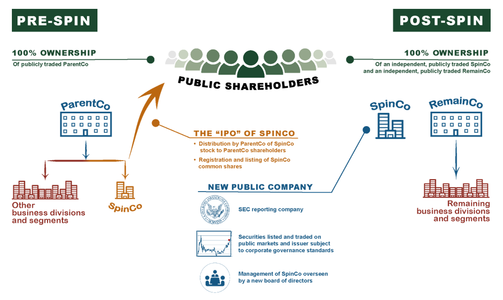

Investment strategies involving spin-offs, parent companies, and algorithmic trading are crucial aspects of today's financial markets. Spin-offs occur when a parent company forms a new independent entity by distributing shares of a subsidiary to its existing shareholders. This strategic decision can reshape market dynamics by unlocking shareholder value, enhancing operational focus, and potentially improving performance metrics. Understanding these elements offers valuable insights, allowing investors to recognize and exploit market inefficiencies.

Algorithmic trading, meanwhile, uses computer algorithms to automate trading decisions based on predefined criteria. This approach enhances trading efficiency while minimizing the emotional biases of manual trading. By analyzing extensive datasets and leveraging machine learning, algorithmic trading identifies optimal trading opportunities, responding swiftly to market movements. Its role is increasingly significant in processing the complex data flows resulting from spin-offs and other corporate restructurings.



By examining the intersection of spin-offs and algorithmic trading, investors can gain a comprehensive view of how these strategies affect investment opportunities, market conditions, and potential risks. This understanding provides the foundation to effectively navigate corporate restructurings and automated trading, ultimately enhancing portfolio performance and ensuring informed decision-making in the fast-paced financial landscape.

## Table of Contents

## Understanding Spinoffs and Their Impact

A spinoff is a strategic corporate maneuver where a parent company creates a new independent entity by distributing shares of its subsidiary or a part of its operations to its existing shareholders. This is often executed to enhance the parent company’s overall value by focusing on core activities and allowing the new entity to pursue its growth trajectory independently. The primary objective behind a spinoff is to unlock shareholder value by tailoring operational strategies specific to each entity’s market and operational realities. This separation can lead to more transparent financials and operational performance, which markets may better appreciate.

The benefits of executing a spinoff can be multifold:

1. **Streamlining Operations**: By offloading less strategically aligned or non-core assets, the parent company can concentrate resources, management focus, and strategic efforts on its primary business areas. This operational streamlining often results in improved efficiencies and performance metrics.

2. **Enhanced Strategic Focus**: For the new entity, being independent allows tailoring strategies that cater to specific market needs without being constrained by the broader goals and strategies of the parent company. This autonomy can foster innovation and agile decision-making, potentially leading to accelerated growth.

3. **Unlocking Shareholder Value**: The creation of two distinct publicly traded companies can unlock shareholder value by surfacing the "hidden" value of various segments previously clumped within the broader parent company framework. 

From an investment perspective, spinoffs present unique opportunities and challenges:

- **Market Conditions and Stock Liquidity**: The introduction of a new standalone company into the market can have varying effects on stock liquidity and overall market dynamics. Spinoffs can initially experience volatility as the market adjusts to the new entity. Investors often reassess valuation metrics and growth prospects, which can lead to fluctuations in share prices.

- **Valuation Adjustments**: Investors tend to evaluate the newly formed company with fresh perspectives, possibly leading to a reevaluation of its market worth differently from when it was part of the larger entity. This revaluation can result in price corrections that present opportunities for astute investors.

In conclusion, understanding the strategic reasoning behind a spinoff and the subsequent market mechanics is crucial for investors aiming to capitalize on this corporate action. Spinoffs have the potential to reshape market landscapes by introducing entities with renewed strategic purposes that can be better aligned with market demand and shareholder interests.

## Algorithmic Trading Explained

Algorithmic trading, often referred to as algo trading, involves the use of computational algorithms to automatically execute trading orders based on a predefined set of instructions. These algorithms can manage timing, price, or the [volume](/wiki/volume-trading-strategy) of orders, enabling traders to make complex and rapid trading decisions. 

The primary advantage of [algorithmic trading](/wiki/algorithmic-trading) is the enhancement of trading efficiency. By automating trades, it eliminates the possibility of human error and emotional biases, providing more consistent and predictable results. Efficiency is further amplified by the speed at which algorithms operate, capable of executing trades in fractions of a second, far beyond the capacity of human traders.

To optimize trading strategies, algorithms analyze vast datasets, employing [machine learning](/wiki/machine-learning) techniques and statistical models. Machine learning models, such as regression analysis, decision trees, and neural networks, help uncover patterns and trends within the data that might not be apparent to human traders. For example, a simple moving average crossover strategy can be defined as:

$$

\text{Buy signal} = \text{if } MA_{\text{short-term}} > MA_{\text{long-term}} 
$$
$$
\text{Sell signal} = \text{if } MA_{\text{short-term}} < MA_{\text{long-term}} 
$$

where $MA_{\text{short-term}}$ and $MA_{\text{long-term}}$ are moving averages over short and long periods, respectively. 

Python, a favored programming language for developing trading algorithms, can be employed to construct these models. Libraries such as NumPy, pandas, and scikit-learn play a crucial role in data analysis and model building. Here is a basic Python snippet to calculate moving averages:

```python
import pandas as pd

# Assuming 'data' is a pandas DataFrame with a 'Close' column
data['Short_MA'] = data['Close'].rolling(window=50).mean()
data['Long_MA'] = data['Close'].rolling(window=200).mean()

# Generating buy/sell signals
data['Signal'] = 0
data.loc[data['Short_MA'] > data['Long_MA'], 'Signal'] = 1  # Buy
data.loc[data['Short_MA'] < data['Long_MA'], 'Signal'] = -1 # Sell
```

This automation of the trading process allows for high-frequency trading, where large volumes of trades are executed in short timeframes, making it possible to capitalize on even the smallest market fluctuations.

In conclusion, algorithmic trading empowers traders with tools to enhance their strategy execution, offering systematic and data-driven solutions that minimize biases and improve trading performance. Understanding and leveraging these technologies can significantly influence investment outcomes and bring a competitive edge in financial markets.

## Interplay Between Spinoffs and Algorithmic Trading

Spinoffs are significant events in the financial markets, often introducing new variables that affect market dynamics including [volatility](/wiki/volatility-trading-strategies) and [liquidity](/wiki/liquidity-risk-premium). They occur when a parent company distributes shares of its subsidiary, creating a new independent entity. This transition typically results in the availability of new, distinct financial data and market conditions, which can influence investor sentiment and market perception.

Algorithmic trading, with its capability to analyze vast amounts of data and execute trades at high speeds, must adjust its models to accommodate these changes. When a spin-off occurs, the historical performance data of both the parent and the new entity no longer apply in the same way. Thus, algorithmic strategies require recalibration to incorporate fresh data and account for shifts in market conditions induced by the spin-off event. This involves updating predictive models and trading algorithms to reflect the new corporate structures and market scenarios.

High-frequency trading ([HFT](/wiki/high-frequency-trading-strategies)) strategies, a subset of algorithmic trading, are particularly adept at exploiting the inefficiencies and volatility that can accompany spin-off events. Due to their speed and data processing capability, HFT systems can quickly respond to price discrepancies and adapt to short-term market anomalies. These strategies often capitalize on volatility spikes by executing a large number of trades within microseconds, extracting small profits from transient price movements.

Python's libraries such as `pandas` and `numpy` are invaluable for quickly processing and analyzing the new data that emerges post-spin-off. Consider the following simple example, detailing how Python can be used to adjust algorithmic models in response to a spin-off:

```python
import pandas as pd
import numpy as np

# Simulated spin-off event data
spinoff_data = {
    'time': pd.date_range(start='2023-01-01', periods=100, freq='T'),
    'parent_stock': np.random.normal(100, 1, 100),
    'new_entity_stock': np.random.normal(30, 0.5, 100)
}

# Creating a DataFrame
df = pd.DataFrame(spinoff_data)

# Calculate volatility due to spin-off
df['parent_volatility'] = df['parent_stock'].rolling(window=10).std()
df['new_entity_volatility'] = df['new_entity_stock'].rolling(window=10).std()

# Example outputting to monitor stock response to spin-off
print(df[['time', 'parent_stock', 'new_entity_stock', 'parent_volatility', 'new_entity_volatility']].tail())
```

Algorithmic models will utilize such volatility metrics to adapt their trading strategies, ensuring they remain effective within the new market environment. By promptly recalibrating, traders can better navigate the immediate aftermath of a spin-off, leveraging both short-term trading opportunities and maintaining updated long-term investment strategies.

In summary, the relationship between spin-offs and algorithmic trading highlights the necessity for investors and trading systems to remain flexible and responsive. As spin-offs reshape market environments, algorithmic models and high-frequency trading must evolve in tandem, optimizing for them to thrive in these altered financial landscapes.

## Investment Strategies for Spinoffs

Investors assessing spin-offs must critically evaluate the reasons that drive the parent company to undertake such a corporate restructuring. The primary objective of a spin-off is often to unlock shareholder value by allowing the subsidiary to operate independently, potentially streamlining operations and aligning strategic objectives more closely with market demands. Evaluating the potential for growth in the new independent entity is crucial, as it can indicate enhanced future profitability and value creation. Factors such as management efficiency, market share, and innovation potential are key metrics to consider.

A common investment strategy in spin-offs is the buy-and-hold approach. This strategy involves retaining shares of the new entity based on its growth potential and strategic advantages. Historical data often show that spin-off companies can outperform their parent companies and benchmarks due to increased operational focus and improved resource allocation. This is particularly evident when the spin-off has access to niche markets or proprietary technologies that can drive long-term growth.

Alternatively, event-driven strategies can be employed to capitalize on short-term market reactions. This approach involves trading based on the temporary price movements associated with the corporate restructuring process. Spin-offs frequently result in market inefficiencies due to uncertainty, valuation mismatches, or shifts in investor sentiment. These present [arbitrage](/wiki/arbitrage) opportunities for nimble investors who can leverage these short-term fluctuations.

Algorithmic insights can significantly enhance the effectiveness of these strategies. By utilizing machine learning algorithms and statistical models, investors can analyze large datasets to identify patterns and signals that may not be apparent to human traders. For example, an algorithmic trading model might identify correlations between the performance of spin-off companies and specific market variables such as sector trends, economic indicators, or investor sentiment metrics.

Moreover, the integration of natural language processing (NLP) can enrich sentiment analysis by evaluating news releases, earnings calls, and market commentary related to the spin-off. Python libraries such as `nltk` and `spaCy` can be utilized to perform sentiment analysis, aiding in the prediction of market movements based on qualitative data. A simple sentiment analysis in Python could look like this:

```python
from nltk.sentiment import SentimentIntensityAnalyzer

text = "The spin-off is expected to enhance strategic focus and drive shareholder value."
sia = SentimentIntensityAnalyzer()
sentiment = sia.polarity_scores(text)

print(sentiment)
```

This code evaluates the sentiment of a news snippet and generates a sentiment score, which can be incorporated into broader trading strategies.

By combining traditional investment assessments with advanced algorithmic tactics, investors can rigorously analyze the viability of spin-offs and tailor their strategies to align with both the immediate and foreseeable changes in market conditions. This hybrid approach allows for a more informed and nuanced strategy, potentially leading to a more balanced risk-reward profile in spin-off investments.

## Challenges and Risks

Spinoffs, while strategically advantageous to some parent companies, inherently come with several risks that investors must consider. One primary concern is increased volatility, as these restructuring events generally cause stock price fluctuations due to uncertainties surrounding the new entity's market performance and operational focus. Companies undergoing spinoffs often experience a period of adjustment, during which stock liquidity may be impacted. Regulatory considerations also play a crucial role, as different jurisdictions have varying legal requirements and oversight concerning corporate restructuring activities. These can affect timelines and the overall success of the spinoff process.

Algorithmic trading faces unique challenges during periods of high volatility, often caused by spinoff events. Execution risks can become prominent when algorithms, designed for stability, encounter unexpected price swings and shifts in market liquidity. These systems may enter trades based on outdated or misinterpreted data, leading to suboptimal outcomes. Moreover, sudden liquidity changes can result in wider bid-ask spreads, raising transaction costs and impacting profitability.

Mitigation strategies are essential to managing the risks associated with spinoffs and algorithmic trading. For spinoff evaluations, thorough due diligence and comprehensive financial analysis of both the parent company and the nascent entity help ascertain future performance prospects and potential risks. Portfolio diversification further reduces exposure to any single company's volatility, spreading risk across a broader range of investments.

In algorithmic trading, dynamic adjustments to trading algorithms are crucial. This involves continually recalibrating models to incorporate real-time data and evolving market conditions. For instance, machine learning algorithms can be implemented to automatically adjust strategy parameters based on ongoing performance and market feedback. Here's an example of how a basic adaptive trading algorithm might be coded in Python:

```python
import numpy as np

def update_trading_strategy(current_data, model, threshold=0.05):
    # Assume current_data is a time series of stock prices
    # Update model if prediction error surpasses threshold
    prediction = model.predict(current_data)
    error = np.abs(current_data[-1] - prediction)

    if error > threshold:
        model.fit(current_data)  # Refit the model with current data
    return model

# Example of usage
# current_data is a numpy array of recent stock prices
# model is a pre-defined statistical model (e.g., ARIMA, LSTM)
updated_model = update_trading_strategy(current_data, model)
```

Staying informed about regulatory changes and market conditions is vital for both traditional and algorithmic approaches, ensuring strategies remain compliant and context-aware. Regularly updating investment criteria and remaining open to strategic pivots based on regulatory intelligence can help in safeguarding against unforeseen legal setbacks.

In conclusion, spinoffs and algorithmic trading pose complex challenges that necessitate a well-planned approach to mitigate risks effectively. By implementing thoughtful due diligence, flexible strategies, and ongoing market awareness, investors can better manage potential threats and leverage these fixtures of modern financial markets for strategic gain.

## Conclusion

Spinoffs, parent companies, and algorithmic trading significantly influence modern financial markets, leading to evolving investment strategies and market dynamics. Spinoffs create independent entities from parent companies, often leading to shifts in market liquidity and investor sentiment. These structural changes provide opportunities and risks, necessitating a nuanced understanding of market mechanics.

Algorithmic trading, characterized by the use of computer algorithms, automates trading strategies to optimize timing and execution. By analyzing large datasets, algorithms identify patterns and make trading decisions that humans might miss, offering a strategic advantage. The rapid execution of trades allows investors to capitalize on short-term market fluctuations, which can be particularly pronounced following corporate actions like spin-offs.

To effectively navigate these market phenomena, investors must integrate algorithmic and traditional investment insights. This involves leveraging data-driven signals from algorithmic trading while considering [fundamental analysis](/wiki/fundamental-analysis) and macroeconomic factors. For instance, an investor might use algorithmic models to identify undervalued spin-off entities or to time entry and [exit](/wiki/exit-strategy) points following spin-off announcements.

Furthermore, adapting to continuously changing market conditions is crucial. As algorithms adapt to new information, human investors should also remain agile, tweaking strategies based on the latest data and regulatory developments. Risk management techniques, such as diversification and dynamic allocation, play a critical role in mitigating potential negative outcomes from volatility and execution risks.

Ultimately, the interplay between spinoffs and algorithmic trading represents both a challenge and an opportunity. By comprehensively understanding these processes, investors can position themselves to benefit from emerging opportunities while effectively managing risks. Adopting an informed, adaptable strategy is essential for success in the complex and rapidly evolving financial landscape.

## References & Further Reading

1. Copeland, T., and Weston, J. (1983). *Financial Theory and Corporate Policy*. Addison-Wesley Publishing Company. This work provides an extensive overview of corporate financial theory, including the strategic motivations and market impacts of spinoffs.

2. Schipper, K., and Smith, A. (1983). "Effects of Recontracting on Shareholder Wealth: The Case of Voluntary Spinoffs". *Journal of Financial Economics*, 12(4), pp. 437-467. This paper examines how voluntary spinoffs impact shareholder wealth and market responses.

3. Kuhn, T., and Eckhardt, W. (2009). *Algorithmic Trading and DMA: An Introduction to Direct Access Trading Strategies*. Harriman House. This book is a comprehensive guide to the principles and practice of algorithmic trading.

4. Avellaneda, M., and Stoikov, S. (2008). "High-frequency Trading in a Limit Order Book". *Quantitative Finance*, 8(3), pp. 217-224. The paper discusses key algorithmic trading strategies crucial for understanding high-frequency trading dynamics.

5. Mitchell, M., and Stafford, E. (2000). "Managerial Decisions and Long-term Stock Price Performance". *The Journal of Business*, 73(3), pp. 287-329. This study explores the implications of corporate decisions like spinoffs for long-term stock performance.

6. Aldridge, I. (2013). *High-Frequency Trading: A Practical Guide to Algorithmic Strategies and Trading Systems*. Wiley. Aldridge presents practical insights into high-frequency trading models, crucial for managing the interplay between spinoffs and trading algorithms.

7. Gilson, S. C., Healy, P. M., Noe, C. F., and Palepu, K. G. (2001). "Factors Affecting the Measuring of Post-Spin-off Operating Performance". *The Review of Financial Studies*, 14(3), pp. 739-767. This work investigates the factors influencing post-spinoff performance metrics, offering useful insights into operational outcomes.

8. Kissell, R. (2014). *The Science of Algorithmic Trading and Portfolio Management*. Academic Press. Kissell’s work provides an in-depth analysis of algorithmic strategy development and its application in portfolio management, valuable for investors adjusting to spin-off events.

These resources collectively offer a detailed foundation for understanding how spinoffs, parent companies, and algorithmic trading strategies interact within financial markets, equipping investors with the knowledge to exploit opportunities and mitigate risks effectively.

