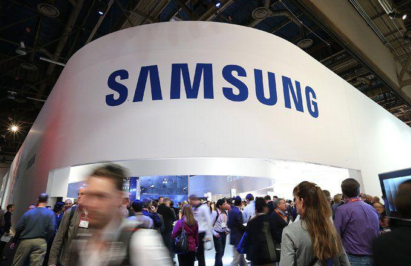

South Korean conglomerate Samsung is one of the largest and most influential players in global investments, renowned for its technological advancements and widespread market presence. Nevertheless, American investors frequently encounter obstacles when attempting to invest directly in Samsung due to the absence of its shares on major U.S. stock exchanges. This challenge is compounded by regulatory restrictions and the complexity associated with international financial transactions.

To overcome these hurdles, American investors have alternative avenues such as the Korea Fund (KF) and the iShares MSCI South Korea ETF (EWY). These funds provide practical options for gaining exposure to Samsung and other leading South Korean companies. The Korea Fund (KF) is a closed-end equity fund specializing in South Korean stocks, while the iShares MSCI South Korea ETF (EWY) offers a diversified portfolio through an exchange-traded fund mechanism, both incorporating significant investments in Samsung.



Additionally, algorithmic trading plays a crucial role in optimizing investment strategies related to Samsung. By leveraging sophisticated algorithms, investors can efficiently manage their trades, thereby enhancing the precision and effectiveness of their investment strategies. Algorithmic trading allows for the automation of trading processes, offering a distinct advantage over traditional manual trading methods, particularly in fast-paced global markets.

The aim of this article is to provide insights into Samsung's market positioning and guide American investors through the complexities of engaging with international investment opportunities. Understanding how to utilize these funds and the benefits of advanced trading techniques can empower investors to make informed decisions when considering Samsung as an investment target.

## Table of Contents

## Understanding the KF and EWY Funds

The Korea Fund (KF) and the iShares MSCI South Korea ETF (EWY) are investment vehicles that provide investors with the opportunity to participate in the economic progress of South Korean companies, prominently including Samsung Electronics Co., Ltd. These funds are crucial for investors seeking exposure to South Korea's dynamic markets without directly purchasing foreign stocks.

Historically, Samsung has played a significant role within these funds, often constituting a substantial portion of their portfolios. This is indicative of Samsung's importance in Korea's economy, where it serves as a pivotal player across various sectors such as consumer electronics, semiconductors, and telecommunications. In the case of EWY, the fund specifically tracks the MSCI Korea 25/50 Index, which ensures that no single stock exceeds a certain weight, yet Samsung's prominence typically results in it being one of the largest holdings, often representing a substantial percentage of the fund's total portfolio.

For example, in a typical allocation, Samsung may comprise approximately 20% of the EWY fund, reflecting both its market capitalization and its influence on the South Korean economy. This weighting is a reflection of Samsung's substantial contribution to South Korea's GDP and its substantial presence across global markets. 

The Korea Fund (KF), although structured differently as a closed-end fund, also provides a similar opportunity for investors. Its portfolio is heavily weighted towards electronics and technology sectors, where Samsung's influence is paramount. Investors considering investing in KF or EWY should analyze these allocations and consider the implications of Samsung's performance on the overall fund's value.

Understanding the detailed breakdown of these funds is crucial. Investors are encouraged to review quarterly and annual reports that highlight the proportion of Samsung stocks within these funds. Such disclosures offer insights into how fluctuations in Samsung’s stock price can impact the value of the KF and EWY funds. 

In conclusion, the Korea Fund and the iShares MSCI South Korea [ETF](/wiki/etf-trading-strategies) offer beneficial access points for those seeking investment in Samsung without directly trading its shares on South Korean exchanges. By understanding the weighting and role of Samsung within these funds, investors can better navigate the complexities of international investing and make informed decisions that align with their financial goals.

## Algorithmic Trading: A Modern Approach

Algorithmic trading has significantly transformed the landscape of financial markets, providing a strategic advantage through the automation of trading decisions. For investors in Samsung, as part of funds like the Korea Fund (KF) and iShares MSCI South Korea ETF (EWY), incorporating [algorithmic trading](/wiki/algorithmic-trading) can enhance both the precision and timing of trades.

The core of algorithmic trading lies in leveraging algorithms to execute orders based on pre-determined strategies. These algorithms analyze market conditions, historical data, and statistical indicators to make informed trading decisions. In the context of Samsung stocks within KF and EWY, specific algorithms, such as mean reversion, [momentum](/wiki/momentum)-based, and [arbitrage](/wiki/arbitrage) strategies, are particularly effective.

1. **Mean Reversion**: This strategy operates on the principle that prices tend to revert to their mean over time. By identifying deviations from the average price movements of Samsung or related indices, algorithms can predict and capitalize on the reversion to the mean. This is particularly useful in the volatile trading periods that can affect Samsung's stock prices.

    ```python
    import numpy as np

    def mean_reversion_strategy(prices, window_size):
        moving_average = np.mean(prices[-window_size:])
        current_price = prices[-1]

        if current_price < moving_average:
            return "Buy"
        elif current_price > moving_average:
            return "Sell"
        else:
            return "Hold"
    ```

2. **Momentum-based Strategies**: These algorithms exploit the continuation of existing market trends. By analyzing the upward or downward trends of Samsung's stock prices, momentum trading aims to generate profits by "riding" the trend until it shows signs of reversal. This requires sophisticated tools for trend detection and risk management.

3. **Arbitrage Strategies**: Despite regulatory differences, algorithmic systems can leverage arbitrage opportunities between different markets or financial instruments. For Samsung stocks traded through KF and EWY, arbitrage algorithms look for price discrepancies across platforms or related assets, executing trades to make risk-free profits.

Integrating these algorithmic strategies into investments in Samsung via KF and EWY funds necessitates a robust technology infrastructure. Investors typically employ high-frequency trading systems to handle large volumes of data and execute trades with minimal latency. Additionally, these systems are equipped with risk assessment modules to manage the inherent market risks effectively.

The advantages of algorithmic trading extend beyond speed and precision; they also offer enhanced market [liquidity](/wiki/liquidity-risk-premium) and reduced transaction costs. These benefits can significantly improve the efficiency of executing trades involving Samsung shares.

Overall, employing algorithmic trading strategies can substantially improve investment outcomes for those involved in Samsung through KF and EWY funds. As technology progresses, newer and more sophisticated algorithms will continue to evolve, offering ever-increasing opportunities for optimizing investment strategies in global markets.

## Challenges in Direct Samsung Investment

Direct investment in Samsung by American investors is fraught with challenges primarily due to regulatory barriers and the absence of American Depositary Receipts (ADRs). These barriers limit the direct purchase of Samsung shares on U.S. stock exchanges, compelling investors to explore alternative avenues, such as trading in over-the-counter (OTC) markets or engaging in the Grey Market. 

**Regulatory Barriers and Absence of ADRs**

American Depositary Receipts (ADRs) are a preferred method for U.S. investors seeking to invest in foreign companies, as they simplify the process by allowing these companies to trade on U.S. exchanges, thus bypassing many hurdles associated with foreign exchange trading. However, Samsung does not issue ADRs, meaning its shares are not directly available on major U.S. exchanges. Consequently, American investors are forced to find alternative methods to acquire Samsung shares.

**Complications of Trading Over-the-Counter and in the Grey Market**

The OTC market involves trading financial instruments directly between two parties without the supervision of an exchange, while the Grey Market allows the trading of financial instruments in products or sectors that are not officially open for trading or are yet to be recognized by official exchange platforms. Both the OTC and Grey Market offer potential solutions for investing in companies like Samsung that lack U.S. exchange listings. 

However, these methods pose significant complications. OTC transactions often suffer from low liquidity, meaning investors might face difficulties when attempting to buy or sell large volumes of Samsung shares without affecting the stock price. This low liquidity increases the potential for price [volatility](/wiki/volatility-trading-strategies) and can result in less favorable trading conditions.

Moreover, these markets are characterized by decreased transparency. In the absence of a centralized exchange, there is limited visibility into pricing or the number of trades occurring, which could potentially expose investors to informational disadvantages and higher risks of fraudulent activities.

**Increased Risks and Appeal of Alternative Investments**

The inherent risks associated with OTC and Grey Market trading, such as low liquidity and the lack of regulatory oversight, often make fund-based investments in Samsung a more attractive option. Investors can gain exposure to Samsung through funds like the Korea Fund (KF) or the iShares MSCI South Korea ETF (EWY), which mitigate some of these issues by providing diversified portfolios that include Samsung as a major component. By utilizing these funds, investors enjoy enhanced liquidity, transparency, and reduced risks associated with direct investments in Samsung shares. 

Overall, while direct investment in Samsung remains challenging for American investors, these obstacles highlight the importance of considering alternative investment strategies to effectively manage and potentially capitalize on exposure to this influential South Korean conglomerate.

## Benefits of ETF Investments

Exchange-Traded Funds (ETFs) such as the iShares MSCI South Korea ETF (EWY) present a compelling option for investors seeking exposure to South Korean markets with reduced risk compared to direct stock purchases like those of Samsung. This form of investment is particularly beneficial for American investors, as it circumvents the complexities associated with purchasing individual foreign stocks directly.

ETFs offer diversified investment portfolios, which mitigate the risk inherent in individual stock investment. By holding a basket of various assets, ETFs like EWY allow investors to spread their risk across multiple companies and sectors in the South Korean market. This diversification is crucial in reducing the volatility often associated with concentrated investments. For instance, an ETF might hold shares not only in Samsung but also in other key players across industries such as Hyundai, Kia, and POSCO, thereby buffering against sector-specific downturns.

Additionally, investing in ETFs provides the advantage of liquidity and ease of trading. Unlike the challenges faced when attempting to invest directly in foreign stocks via over-the-counter or grey markets—which can suffer from low liquidity and transparency issues—ETFs are traded on major U.S. exchanges. This means investors can buy and sell ETF shares during normal trading hours just like any domestic stock, adding a layer of convenience and financial accessibility. 

Moreover, ETFs typically have lower expense ratios compared to mutual funds, thanks to their passive management structure. For investors, this translates to cost savings which can accumulate significantly over time, providing a more economical approach to international equity investment.

Furthermore, the presence of ETFs in an investor's portfolio promotes effective portfolio diversification. By exposing the investor to a broad range of sectors within an international market, ETFs like EWY help manage risk and potentially enhance returns through global market exposure. This global perspective is increasingly important in today's interconnected economy, where diversification can act as a hedge against domestic economic fluctuations.

In conclusion, utilizing ETFs as a financial instrument not only simplifies the process of international investment but also offers significant benefits in terms of risk management, cost efficiency, and liquidity. This makes ETFs an attractive proposition for investors aiming to capitalize on the strength and growth prospects of foreign markets, particularly those dominated by influential corporations like Samsung.

## Conclusion

Samsung is a leading force in the global markets, representing a significant investment opportunity. However, U.S. investors face hurdles when attempting to directly acquire Samsung stocks due to the lack of listings on major U.S. exchanges and the absence of American Depositary Receipts. These challenges can be mitigated through investments in funds like the Korea Fund (KF) and iShares MSCI South Korea ETF (EWY). These funds not only provide exposure to Samsung, a substantial part of their portfolios, but also offer a diversified entry into the South Korean market, mitigating risks associated with direct investments.

Algorithmic trading emerges as a powerful tool to optimize these investments, offering automated efficiency and precision that surpass traditional trading methods. By integrating algorithms into investment strategies concerning KF and EWY, investors can enhance performance and manage risk more effectively. This approach, combined with the funds, presents an advantageous path for engaging with Samsung's market potential.

As financial technologies and trading strategies continue to advance, both seasoned and novice investors can benefit significantly from an understanding of these investment dynamics. By strategically navigating the complexities associated with international investments, they can make informed decisions that capitalize on Samsung's prominent role in the global economy.

## References & Further Reading

[1]: Mundo, D. (2021). ["Investing in South Korea via ETFs"](https://www.investopedia.com/articles/investing/080515/top-3-south-korea-etfs.asp) Forbes.

[2]: ["Advances in Financial Machine Learning"](https://www.amazon.com/Advances-Financial-Machine-Learning-Marcos/dp/1119482089) by Marcos Lopez de Prado

[3]: Aronson, D. R. (2006). ["Evidence-Based Technical Analysis: Applying the Scientific Method and Statistical Inference to Trading Signals"](https://www.amazon.com/Evidence-Based-Technical-Analysis-Scientific-Statistical/dp/0470008741)

[4]: ["Machine Learning for Algorithmic Trading"](https://github.com/stefan-jansen/machine-learning-for-trading) by Stefan Jansen

[5]: Securities and Exchange Commission. ["Getting Started with ETFs."](https://www.etf.com/sections/etf-report-features/getting-started-etfs)

[6]: ["Quantitative Trading: How to Build Your Own Algorithmic Trading Business"](https://www.amazon.com/Quantitative-Trading-Build-Algorithmic-Business/dp/1119800064) by Ernest P. Chan

[7]: Narang, R. (2013). ["Inside the Black Box: A Simple Guide to Quantitative and High-Frequency Trading"](https://www.amazon.com/Inside-Black-Box-Quantitative-Frequency/dp/1118362411)