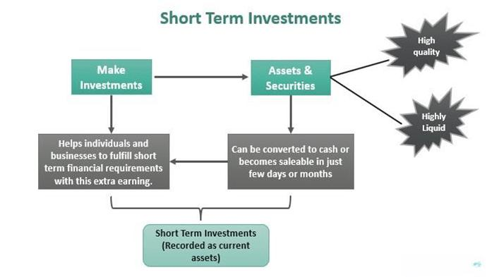

## Table of Contents

## What are the basic differences between short-term and long-term investment goals?

Short-term investment goals are things you want to achieve in a short amount of time, usually within a year or two. These goals might include saving up for a vacation, buying a new laptop, or putting money aside for an emergency fund. Because you need the money soon, you usually put it in safe places where you can get it quickly, like a savings account or a short-term certificate of deposit. These places might not make you a lot of money, but they are safe and you can get your money when you need it.

Long-term investment goals are things you plan for over many years, like saving for retirement, buying a house, or paying for your child's college education. Since you don't need the money right away, you can take more risks to possibly earn more money over time. You might choose to invest in stocks, bonds, or mutual funds. These can go up and down in value, but over many years, they often grow more than safer options. The key is to be patient and keep your money invested for a long time to see the best results.

## How can beginners start investing for short-term goals?

If you're new to investing and want to start saving for short-term goals, the first step is to figure out how much money you need and when you'll need it. Let's say you want to save for a vacation in a year. You'll need to set a savings target and decide how much you can put away each month. Once you have your plan, you can start looking at safe places to keep your money. A good choice for short-term goals is a high-yield savings account. These accounts are easy to open, and you can usually take your money out whenever you need it. They also offer a bit more interest than regular savings accounts, which helps your money grow a little faster.

Another option for short-term investing is a short-term certificate of deposit (CD). A CD is like a savings account, but you agree to leave your money in the bank for a set time, like six months or a year. In return, the bank gives you a higher [interest rate](/wiki/interest-rate-trading-strategies) than a regular savings account. The catch is that if you take your money out early, you might have to pay a penalty. So, CDs are good if you're sure you won't need the money before the CD matures. Both high-yield savings accounts and short-term CDs are safe and simple ways for beginners to start investing for short-term goals.

## What are some common investment vehicles for long-term goals?

For long-term goals like retirement or buying a house, one common investment vehicle is stocks. When you buy stocks, you're buying a small piece of a company. Over many years, stocks can grow a lot in value, but they can also go up and down a lot in the short term. This makes them riskier, but if you can leave your money in for a long time, stocks can be a good way to grow your savings. You can buy stocks directly, or you can invest in stock mutual funds or exchange-traded funds (ETFs), which hold a bunch of different stocks and can be less risky than owning just one or two stocks.

Another common investment vehicle for long-term goals is bonds. Bonds are like loans you give to a company or the government. They promise to pay you back with interest over time. Bonds are usually safer than stocks, but they don't grow as much in value. They can be a good way to balance out the risk in your investment plan. You can buy individual bonds, or you can invest in bond mutual funds or ETFs, which hold a lot of different bonds and can be easier to manage.

A third option for long-term investing is real estate. You can buy property and rent it out to earn money over time. Real estate can grow in value, and the rent can help you pay off the property. It's a bit more complicated than stocks or bonds because you have to manage the property, but it can be a good way to build wealth over the long term. You can also invest in real estate investment trusts (REITs), which are like mutual funds that invest in properties and pay out the income as dividends.

## How does risk tolerance affect investment choices for different time horizons?

Risk tolerance is how much risk you are okay with when you invest your money. It's important because it helps you decide what to invest in, especially when you think about how long you will keep your money invested. If you have a short-term goal, like saving for a vacation in a year, you probably don't want to take big risks. That's because you need your money soon, and you don't want to lose it. So, you might choose safe investments like a high-yield savings account or a short-term CD. These options won't make you a lot of money, but they are safe and you can get your money when you need it.

For long-term goals, like saving for retirement, you can usually take more risk. That's because you don't need the money right away, so you have time to wait for your investments to grow. If you have a high risk tolerance, you might choose to invest more in stocks or stock funds. These can go up and down a lot, but over many years, they often grow more than safer options. If you have a lower risk tolerance, you might choose a mix of stocks and bonds. Bonds are safer but don't grow as much, so they can help balance out the risk. Your risk tolerance helps you pick the right investments for your goals and how long you plan to keep your money invested.

## What role does diversification play in managing short-term and long-term investments?

Diversification is like not putting all your eggs in one basket. It means spreading your money across different types of investments so that if one investment does badly, you won't lose all your money. For short-term goals, diversification is important but you usually stick to safer options. You might put your money in a high-yield savings account and a short-term CD. This way, if one of them doesn't do well, you still have the other one to fall back on. It helps keep your money safe because you need it soon.

For long-term goals, diversification is really important because you can take more risks. You might invest in stocks, bonds, and maybe even real estate. If the stock market goes down, your bonds might still do well, and your real estate might keep [earning](/wiki/earning-announcement) you money. Over many years, this mix can help your money grow more steadily. Diversification helps manage risk and can make your long-term investments more likely to succeed, even if some parts of your portfolio don't do well.

## Can you explain the concept of compound interest and its impact on long-term investments?

Compound interest is like a magic trick that helps your money grow over time. It's when you earn interest not just on the money you put in, but also on the interest you've already earned. Imagine you put $100 in a savings account that gives you 5% interest every year. After the first year, you'll have $105. In the second year, you'll earn 5% interest on $105, so you'll have $110.25. This keeps going, and over many years, your money can grow a lot more than if you just got interest on your original $100.

For long-term investments, compound interest is really powerful. If you start saving for retirement when you're young, the interest can keep adding up over decades. Let's say you invest $5,000 at age 25 and it grows at 7% a year. By the time you're 65, that $5,000 could be worth over $38,000, just because of compound interest. That's why starting early and leaving your money invested for a long time can make a big difference in how much you'll have when you need it.

## How should one adjust their investment strategy as they transition from short-term to long-term goals?

When you move from short-term to long-term goals, you need to change your investment strategy. For short-term goals, you want to keep your money safe because you'll need it soon. You might put it in a savings account or a short-term CD. These options don't grow a lot, but they are safe. As you start thinking about long-term goals, like retirement or buying a house, you can take more risks. That's because you don't need the money right away, so you have time for your investments to grow.

For long-term goals, you should think about investing in stocks, bonds, and maybe even real estate. Stocks can grow a lot over many years, but they can also go up and down a lot in the short term. Bonds are safer but don't grow as much. Real estate can earn you money over time through rent and growing property value. You'll need to find a good mix of these investments that matches how much risk you're okay with. As you get closer to your long-term goals, you might want to move some of your money into safer investments to protect what you've saved.

## What are advanced strategies for maximizing returns on short-term investments?

For short-term investments, one advanced strategy to maximize returns is to use a laddering approach with certificates of deposit (CDs). This means you split your money into several CDs that mature at different times. For example, you might put some money in a 3-month CD, some in a 6-month CD, and some in a 9-month CD. When each CD matures, you can either take the money out or put it into a new CD. This way, you can take advantage of higher interest rates if they go up, and you always have some money becoming available if you need it.

Another strategy is to use money market funds. These are like savings accounts but often offer higher interest rates. Money market funds invest in safe, short-term securities like government bonds and commercial paper. They are a bit riskier than a regular savings account, but they can give you better returns. You can usually take your money out whenever you need it, which makes them good for short-term goals. Just remember that while they are safer than stocks, they can still lose value, so you need to be careful.

## How can tax implications influence short-term and long-term investment decisions?

Taxes can make a big difference in how much money you keep from your investments. For short-term investments, if you sell something like a stock and make a profit within a year, you have to pay short-term capital gains tax. This tax is usually the same as your regular income tax, which can be high. So, if you're thinking about short-term investments, you need to think about how much tax you'll have to pay and if it's worth it. Sometimes, it might be better to stick with safer options like savings accounts or CDs, which don't have capital gains tax.

For long-term investments, the tax rules are different and can help you keep more of your money. If you hold onto an investment like a stock for more than a year before selling it, you pay long-term capital gains tax. This tax rate is usually lower than the short-term rate, which means you get to keep more of your profit. Also, some long-term investments like retirement accounts (like 401(k)s or IRAs) can grow without being taxed until you take the money out. This can make a big difference over many years, so it's important to think about taxes when you're planning for the long term.

## What are the benefits and risks of using leverage in long-term investment strategies?

Using leverage in long-term investment strategies means borrowing money to invest more than you have. The main benefit of this is that it can make your returns bigger. If you invest $10,000 of your own money and it grows by 10%, you make $1,000. But if you borrow another $10,000 and invest $20,000 total, that same 10% growth gives you $2,000. So, leverage can help you grow your money faster, especially over many years. It's like using a lever to lift a heavy weight; a little effort can move a lot more.

But leverage also comes with big risks. If your investments go down in value, you can lose more than just your own money. Let's say you borrowed $10,000 and your investment drops by 10%. You lose $2,000, but you still have to pay back the $10,000 you borrowed. This can be a big problem if you can't pay it back. Also, when you borrow money, you usually have to pay interest on it. If your investments don't grow enough to cover that interest, you can end up losing money even if your investments go up a little. So, using leverage can be risky, and you need to be very careful with it.

## How do market cycles affect the timing of investments for both short-term and long-term goals?

Market cycles are like the ups and downs that happen in the stock market over time. They can affect when you should invest your money, especially for short-term goals. If you need your money soon, like in a year or two, you want to be careful about putting it in the stock market. That's because if the market goes down right before you need your money, you might lose some of it. So, for short-term goals, it's usually better to stick with safer investments like savings accounts or short-term CDs. These won't make you a lot of money, but they are less likely to go down when the market cycles change.

For long-term goals, like saving for retirement, market cycles can actually help you if you understand them. When the market goes down, it can be a good time to buy stocks because they are cheaper. Over many years, the market usually goes up more than it goes down, so if you can leave your money in for a long time, you can buy low and sell high. This means you might want to keep investing even when the market is down, because you have time to wait for it to go back up. Understanding market cycles can help you make smart choices about when to buy and sell, making your long-term investments grow more over time.

## What are the latest trends in investment strategies for optimizing both short-term and long-term returns?

One of the latest trends in investment strategies for short-term goals is the use of robo-advisors. These are online platforms that use computer algorithms to manage your money. They can help you pick safe investments like high-yield savings accounts or short-term bonds that match your short-term goals. Robo-advisors can also automatically adjust your investments to keep them safe and help you earn a little more. Another trend is the use of peer-to-peer lending, where you lend money to people or small businesses online and earn interest. This can be riskier than a savings account, but it can give you better returns for short-term goals.

For long-term goals, one big trend is the focus on sustainable and socially responsible investing (SRI). This means investing in companies that are good for the environment or society. People are starting to see that these investments can do well over time and also make a positive impact. Another trend is the use of target-date funds, which are designed to change over time to match your retirement date. When you're young, they might invest more in stocks, but as you get closer to retirement, they shift to safer investments like bonds. This helps you grow your money over the long term while reducing risk as you get older. Both of these trends can help you optimize your long-term returns by balancing growth and risk.

## What is the Role of Algorithmic Trading in Managing Investments?

Algorithmic trading utilizes computer algorithms to execute trades in financial markets with high efficiency and precision. This trading approach is characterized by its ability to process large data sets and act upon them in real time, thereby providing significant advantages for both short-term and long-term investment strategies.

For short-term investment strategies, [algorithmic trading](/wiki/algorithmic-trading) can swiftly capitalize on small market inefficiencies, executing trades within milliseconds, which is crucial in volatile markets. Algorithms are programmed to follow specific instructions, adjusting for variables such as timing, price, and [volume](/wiki/volume-trading-strategy), ultimately reducing human error and emotional biases. This precision allows for successful high-frequency trading ([HFT](/wiki/high-frequency-trading-strategies)), where numerous trades are carried out within seconds to exploit minute price differences.

In long-term investment contexts, algorithmic trading supports robust portfolio management by utilizing strategies like mean-variance optimization grounded in Modern Portfolio Theory (MPT). MPT seeks to create a portfolio that achieves a desired return for a given level of risk by optimizing the allocation of various assets. The algorithm evaluates historical data, expected returns, and the covariance between asset classes to suggest an optimal portfolio mix. The formula used in this optimization is:

$$
\text{Minimize} \quad \sigma_p^2 = \sum_{i=1}^n \sum_{j=1}^n w_i w_j \sigma_{ij}
$$

Here, $\sigma_p^2$ is the portfolio variance, $w_i$ and $w_j$ are the weights of assets $i$ and $j$ in the portfolio, and $\sigma_{ij}$ represents the covariance between the returns of these assets.

Robo-advisors embody a specific application of algorithmic trading, aimed at simplifying investment management for individual investors. Leveraging algorithms, robo-advisors can automatically adjust the asset allocation to align with the investor's risk profile and investment goals. These platforms generally require minimal input from the investor while continuously rebalancing the portfolio to maintain the desired risk-return balance.

Robo-advisors apply methodologies like Monte Carlo simulations to forecast potential investment outcomes based on various economic scenarios. These tools allow investors to understand the potential risks and returns associated with different portfolio configurations, enhancing informed decision-making.

The efficient use of algorithmic trading enables investors to achieve better alignment with their financial objectives through systematic and data-driven approaches. By minimizing human intervention, algorithmic trading reduces costs and enhances performance through high-speed executions, precise risk management, and ongoing portfolio optimization.

## References & Further Reading

[1]: Bergstra, J., Bardenet, R., Bengio, Y., & Kégl, B. (2011). ["Algorithms for Hyper-Parameter Optimization."](https://papers.nips.cc/paper/4443-algorithms-for-hyper-parameter-optimization) Advances in Neural Information Processing Systems 24.

[2]: ["Advances in Financial Machine Learning"](https://www.amazon.com/Advances-Financial-Machine-Learning-Marcos/dp/1119482089) by Marcos Lopez de Prado

[3]: ["Evidence-Based Technical Analysis: Applying the Scientific Method and Statistical Inference to Trading Signals"](https://www.amazon.com/Evidence-Based-Technical-Analysis-Scientific-Statistical/dp/0470008741) by David Aronson

[4]: ["Machine Learning for Algorithmic Trading"](https://github.com/stefan-jansen/machine-learning-for-trading) by Stefan Jansen

[5]: ["Quantitative Trading: How to Build Your Own Algorithmic Trading Business"](https://www.amazon.com/Quantitative-Trading-Build-Algorithmic-Business/dp/1119800064) by Ernest P. Chan