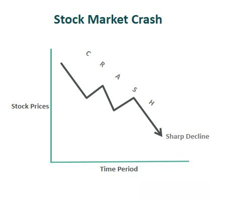

The stock market is a dynamic and volatile environment, characterized by cycles of growth and periods of decline. Investors must navigate these fluctuations, which can be influenced by a myriad of factors including economic conditions, geopolitical events, and unexpected global developments. During market declines, while challenges such as potential losses and increased volatility are evident, unique opportunities also arise for astute investors. 

This article examines various investment strategies that investors can leverage during such downturns, with a particular emphasis on algorithmic trading techniques. Algorithmic trading involves the use of computer programs to execute trades based on a set of predefined criteria, offering significant advantages in terms of speed, precision, and the elimination of emotional bias in decision-making. However, this approach is not without its risks and complexities. We will explore the fundamental principles of algorithmic trading, outline its benefits, and address potential risks associated with this sophisticated method of trading.



## Table of Contents

## Understanding Stock Market Declines

Market declines can be triggered by a myriad of factors, ranging from economic downturns, geopolitical tensions, to unexpected global events. Understanding these triggers is essential for investors aiming to navigate these periods effectively.

Economic factors are among the primary drivers of market declines. During periods of high inflation, [interest rate](/wiki/interest-rate-trading-strategies) hikes are often implemented to curb price increases, which can lead to decreased consumer spending and business investments. For instance, the 2008 financial crisis was precipitated by subprime mortgage defaults, which subsequently triggered a severe global recession[1].

Geopolitical tensions can also lead to market instability. Conflicts, trade wars, or political instability can create uncertainty, disrupting trade and investment flows. The U.S.-China trade tensions in recent years are a pertinent example, causing fluctuations in global stock markets as tariffs were imposed and negotiations unfolded.

Unexpected global events, such as natural disasters or pandemics, can lead to sudden market declines. The COVID-19 pandemic, for example, resulted in one of the sharpest global market drops, as widespread economic lockdowns disrupted supply chains and reduced consumer demand[2].

It is crucial for investors to recognize that market declines are part of the cyclical nature of financial markets. The stock market operates in cycles, characterized by periods of expansion and contraction. Panic during downturns can lead to rash decisions, often exacerbating financial losses.

Historically, markets have demonstrated resilience and the ability to rebound after declines. This pattern underscores the importance of maintaining a long-term investment perspective. For instance, despite the significant drop during the 2008 financial crisis, the S&P 500 index rebounded and reached new highs in subsequent years.

Adopting a long-term strategy not only helps soothe the immediate panic associated with a market downturn but also positions investors to participate in the recovery phase. Through understanding the factors that lead to market declines and recognizing the cyclical nature of markets, investors can better manage their portfolios and make informed decisions during these challenging periods.

---

References:
[1] Reinhart, C. M., & Rogoff, K. S. (2009). *This Time is Different: Eight Centuries of Financial Folly*. Princeton University Press.
[2] Baker, S. R., Bloom, N., Davis, S. J., & Terry, S. J. (2020). *COVID-Induced Economic Uncertainty* (No. w26983). National Bureau of Economic Research.

## Investment Strategies During a Market Decline

During market declines, implementing effective investment strategies is crucial to minimizing risks and preserving capital. One cornerstone of such strategies is diversification. Diversification involves spreading investments across various asset classes, industries, and geographical regions to reduce exposure to any single economic event or market segment. By having a well-diversified portfolio, investors can better cushion the impact of economic downturns, as losses in one area may be offset by gains in another.

An essential aspect of safeguarding investments during market declines is understanding one's risk tolerance. Every investor's ability to endure financial loss varies, and recognizing this tolerance allows for informed decision-making. It is advisable to periodically reassess and adjust portfolio allocations to align with current risk tolerance levels. For example, a shift from equities to a more conservative mix of fixed-income securities might be appropriate for risk-averse investors during market turbulence.

Investors may also consider incorporating defensive stocks into their portfolios. These are stocks of companies with stable earnings and dividends that are generally less sensitive to economic cycles. Sectors like utilities, consumer staples, and healthcare often exhibit defensive characteristics, providing potential stability during economic downturns.

Additionally, investing in bonds can offer relative safety in volatile periods. Bonds, typically government or high-grade corporate bonds, tend to provide more predictable returns and lower [volatility](/wiki/volatility-trading-strategies) compared to stocks. The inclusion of bonds in a portfolio can help balance overall risk, offering a hedge against market uncertainty.

In summary, during periods of market decline, strategic diversification, a keen understanding of risk tolerance, and the incorporation of defensive assets like stocks and bonds are fundamental tactics to safeguard investments and optimize potential returns.

 to Algorithmic Trading

Algorithmic trading, commonly known as 'algo trading', refers to the use of computer programs to automate the process of trading financial instruments based on a set of predefined criteria. This modern method leverages computational power to execute orders at speeds and frequencies that are impossible for human traders.

One primary advantage of [algorithmic trading](/wiki/algorithmic-trading) is its speed. Trading algorithms can analyze market conditions and execute orders in fractions of a second, enabling traders to capitalize on even the most fleeting market opportunities. Such rapid execution is particularly beneficial in high-frequency trading ([HFT](/wiki/high-frequency-trading-strategies)), where success often hinges on being able to exploit very short-term market inefficiencies.

Additionally, algorithmic trading offers unparalleled precision. Each trade is executed at the precise moment determined by the algorithm, eliminating human errors such as misclicks or poor judgment under pressure. By adhering strictly to the algorithm's rules, this form of trading ensures consistency and accuracy in order placement.

A significant benefit of algo trading is the removal of emotional decision-making. Emotions can often cloud judgment, leading to impulsive decisions that may not align with a trader's long-term strategy. By automating the trading process, algorithms ensure that trades are made based solely on data-driven criteria, minimizing the impact of emotions like fear or greed.

Common algorithmic trading strategies include [arbitrage](/wiki/arbitrage) and [trend following](/wiki/trend-following). Arbitrage involves exploiting price discrepancies of identical or similar financial instruments on different markets or in different forms. This strategy generally aims to lock in risk-free profits by simultaneously buying and selling these instruments. On the other hand, trend-following strategies generate profits by identifying and riding trends in asset prices. By analyzing historical price data, algorithms can detect trends and forecast future price movements, executing trades that align with these trends.

For example, a simple moving average crossover strategy in Python might look like this:

```python
import pandas as pd

def moving_average_strategy(data, short_window=40, long_window=100):
    signals = pd.DataFrame(index=data.index)
    signals['signal'] = 0.0

    signals['short_mavg'] = data['close'].rolling(window=short_window, min_periods=1, center=False).mean()
    signals['long_mavg'] = data['close'].rolling(window=long_window, min_periods=1, center=False).mean()

    signals['signal'][short_window:] = np.where(signals['short_mavg'][short_window:] > signals['long_mavg'][short_window:], 1.0, 0.0)  

    signals['positions'] = signals['signal'].diff()

    return signals

# Example usage with a DataFrame 'data' containing price data
signals = moving_average_strategy(data)
```

In this strategy, the algorithm generates buy signals when the short-term moving average crosses above the long-term moving average, and sell signals when the opposite occurs. By systematically applying such rules, algorithms can efficiently manage trading operations while aligning with overall market trends.

## Developing an Algorithmic Trading Strategy

To develop a successful algorithmic trading strategy, the initial step is to identify the assets and markets where the strategy will be utilized. This requires a comprehensive understanding of different markets, such as equities, commodities, [forex](/wiki/forex-system), or cryptocurrencies, each characterized by unique features and behaviors. A prospective trader should consider variables like market [liquidity](/wiki/liquidity-risk-premium), volatility, and transaction costs, as these are critical in formulating a strategy that maximizes potential benefits while minimizing risk.

Once the assets have been selected, choosing an appropriate algorithmic trading platform is crucial. A variety of platforms are available, each tailored to different levels of experience and types of strategies. Platforms like MetaTrader, QuantConnect, and [Interactive Brokers](/wiki/interactive-brokers-api) offer robust tools and APIs that facilitate algorithmic trading. A good platform should support the necessary programming languages (e.g., Python, C++) and offer features for testing and deploying algorithms efficiently.

Backtesting, a critical component in developing an algorithmic trading strategy, involves simulating the trading algorithm's performance using historical data. This process helps validate the strategy and refine it before risking actual capital. The goal of [backtesting](/wiki/backtesting) is to ensure that the strategy not only performs well retrospectively but also has the potential to perform under various market conditions moving forward.

In Python, a typical backtesting process might look like this:

```python
import pandas as pd
import numpy as np
from backtesting import Backtest, Strategy
from backtesting.lib import crossover
from backtesting.test import SMA, GOOG

class MyStrategy(Strategy):
    def init(self):
        price = self.data.Close
        self.sma1 = self.I(SMA, price, 10)
        self.sma2 = self.I(SMA, price, 20)

    def next(self):
        if crossover(self.sma1, self.sma2):
            self.buy()
        elif crossover(self.sma2, self.sma1):
            self.sell()

bt = Backtest(GOOG, MyStrategy, cash=10000, commission=.002)
output = bt.run()
bt.plot()
```

This code uses the `backtesting` library to implement a simple moving average crossover strategy. It initializes two Simple Moving Averages (SMA) and enters buy or sell positions based on their crossover. The use of such libraries aids in efficiently conducting backtests, thereby allowing the trader to iterate through different strategies quickly and effectively.

In conclusion, the development of an algorithmic trading strategy begins with careful asset selection, followed by platform choice and rigorous backtesting using historical data. These steps form the foundation upon which an effective and reliable trading strategy can be built, ensuring alignment with the trader's objectives and risk tolerance.

References:
- [QuantConnect Website](https://www.quantconnect.com/)
- [MetaTrader 5](https://www.metatrader5.com/en)

## Risks and Considerations in Algo Trading

Algorithmic trading, while offering numerous advantages, is not devoid of risks and considerations that investors must acknowledge. A primary concern in algorithmic trading is the risk of overfitting. Overfitting occurs when an algorithm is excessively tailored to historical data, capturing noise instead of genuine market patterns. This results in a trading strategy that performs well in backtesting but fails to deliver similar results in live markets. To mitigate overfitting, practitioners often employ techniques such as out-of-sample testing and cross-validation.

Another significant risk stems from the technological reliance inherent in algorithmic trading. Trading algorithms depend on the infrastructure and technology they operate on. System failures, such as hardware malfunctions or connectivity issues, can lead to substantial financial losses or missed trading opportunities. Additionally, algorithmic trading systems are susceptible to software bugs and glitches that can cause erroneous trades. Therefore, frequent system audits and maintaining robust IT support are essential.

Implementing a robust risk management system is crucial for mitigating potential losses. Risk management in algorithmic trading encompasses several strategies, such as setting stop-loss limits, employing position sizing algorithms, and diversifying across strategies and asset classes. Stop-loss orders automatically [exit](/wiki/exit-strategy) a position when the price moves against the trader beyond a predetermined threshold, limiting potential losses. Position sizing algorithms help determine the appropriate amount of capital to allocate to each trade, reducing the risk of significant losses from any single position.

Continuous monitoring and adjustment of trading algorithms are vital in enhancing performance. Market conditions are dynamic, and strategies that were once profitable may become obsolete. Regularly updating and optimizing algorithms helps maintain their effectiveness. Monitoring also facilitates the detection of abnormal algorithm behavior, enabling prompt corrective measures.

In conclusion, while algorithmic trading presents powerful opportunities for exploiting market inefficiencies, it requires diligent consideration of associated risks. By understanding and addressing these risks through comprehensive testing, robust risk management, and continuous improvement, traders can better harness the potential of algorithmic trading strategies.

## Conclusion

Investing in the stock market during periods of decline can prove beneficial when approached with well-informed strategies. Market downturns, while challenging, present unique opportunities for investors to acquire valuable assets at reduced prices. To navigate these periods effectively, a combination of traditional investment strategies and algorithmic trading techniques can be employed. 

Algorithmic trading, with its capacity for speed and precision, provides a sophisticated means to exploit market opportunities. By automating the trading process based on predefined parameters, investors can minimize emotional biases that often lead to suboptimal decisions. However, it's crucial to recognize the demands of algorithmic trading, which include the necessity for a solid understanding of the algorithms used and a comprehensive risk management strategy. Developments in technology and data accessibility have made algorithmic trading more accessible, yet it remains essential for investors to remain vigilant about the ethical and market implications of their automated strategies.

A balanced approach, incorporating both conventional methods such as diversification and risk assessment, alongside algorithmic trading, can help optimize investment performance during market fluctuations. By adapting strategies to shifting market conditions and maintaining a long-term view, investors can better weather the challenges of market declines and capitalize on the opportunities they present. Through diligence and an understanding of both traditional and algorithmic strategies, investors can enhance their capacity to achieve favorable outcomes in the stock market.

## References & Further Reading

[1]: Reinhart, C. M., & Rogoff, K. S. (2009). ["This Time is Different: Eight Centuries of Financial Folly."](https://www.nber.org/system/files/working_papers/w13882/w13882.pdf) Princeton University Press.

[2]: Baker, S. R., Bloom, N., Davis, S. J., & Terry, S. J. (2020). ["COVID-Induced Economic Uncertainty."](https://www.nber.org/system/files/working_papers/w26983/w26983.pdf) National Bureau of Economic Research.

[3]: ["QuantConnect Website."](https://www.quantconnect.com/)

[4]: ["MetaTrader 5."](https://www.metatrader5.com/)

[5]: Aronson, D. R. (2007). ["Evidence-Based Technical Analysis: Applying the Scientific Method and Statistical Inference to Trading Signals."](https://onlinelibrary.wiley.com/doi/book/10.1002/9781118268315) Wiley.

[6]: Jansen, S. (2018). ["Machine Learning for Algorithmic Trading."](https://searchworks.stanford.edu/view/13246850) Packt Publishing.

[7]: Chan, E. P. (2009). ["Quantitative Trading: How to Build Your Own Algorithmic Trading Business."](https://github.com/ftvision/quant_trading_echan_book) Wiley.