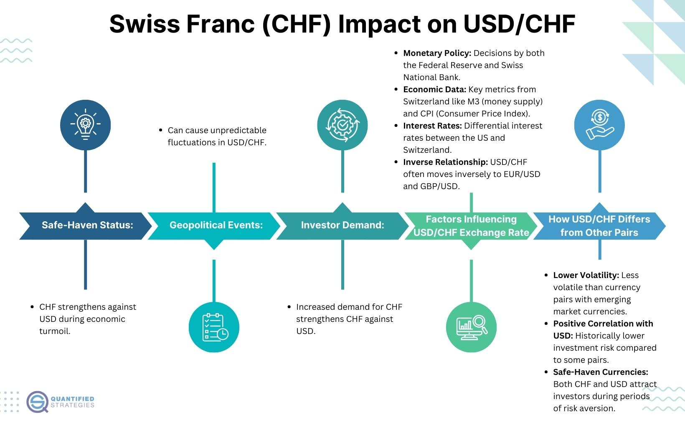

## Table of Contents

## What is the Swiss Franc and why is it considered a safe-haven currency?

The Swiss Franc is the official currency of Switzerland and Liechtenstein. It is often represented by the symbol CHF. The Swiss Franc is known for being a stable and strong currency. This is because Switzerland has a strong economy and a stable political system. People trust the Swiss Franc because of these reasons.

The Swiss Franc is considered a safe-haven currency because it is seen as a safe place to keep money during times of global economic uncertainty. When there are problems in the world, like financial crises or political instability, people often move their money to the Swiss Franc. They do this because they believe it will keep their money safe. This makes the Swiss Franc a popular choice for investors looking for security.

## How does the Swiss National Bank influence the value of the Swiss Franc?

The Swiss National Bank (SNB) influences the value of the Swiss Franc by controlling the amount of money in circulation and setting interest rates. When the SNB wants to make the Swiss Franc weaker, it can increase the money supply. This means there is more money available, which can lower the value of the Franc. The SNB can also lower interest rates, which makes it less attractive for people to save money in Swiss Francs, leading to a weaker currency.

On the other hand, if the SNB wants to make the Swiss Franc stronger, it can reduce the money supply. By doing this, there is less money available, which can increase the value of the Franc. The SNB can also raise interest rates, making it more attractive for people to save money in Swiss Francs, which can lead to a stronger currency. The SNB uses these tools to keep the Swiss economy stable and to control inflation.

## What are the basic investment options available for the Swiss Franc?

One way to invest in the Swiss Franc is by buying the currency itself. You can do this through a bank or a foreign exchange service. When you think the Swiss Franc will get stronger compared to other currencies, you can buy it and then sell it later for a profit. This is called [forex](/wiki/forex-system) trading. It can be risky because currency values can change a lot, but it's a direct way to invest in the Swiss Franc.

Another option is to invest in Swiss Franc-denominated assets. This means buying things like Swiss government bonds, which are loans to the government that pay you back with interest. These are usually seen as safe because the Swiss government is very stable. You can also buy stocks of Swiss companies. If you think these companies will do well, their stock prices might go up, and you can make money. Both bonds and stocks can be bought through a brokerage account.

Lastly, you can invest in Swiss Franc-based mutual funds or exchange-traded funds (ETFs). These funds hold a mix of different investments, like stocks and bonds, all in Swiss Francs. They are managed by professionals, so you don't have to pick the investments yourself. This can be a good way to spread out your risk because your money is in many different things. You can buy these funds through a broker or sometimes directly from the fund company.

## How can beginners start investing in Swiss Francs?

If you're a beginner and want to start investing in Swiss Francs, the first step is to open a brokerage account. You can do this online with many different companies. Once you have an account, you can start buying Swiss Francs directly through forex trading. This means you're buying the currency itself, hoping it will get stronger compared to other currencies. Forex trading can be risky because currency values can change a lot, so it's important to learn about it before you start.

Another way to invest in Swiss Francs is by buying Swiss Franc-denominated assets, like Swiss government bonds or stocks of Swiss companies. Swiss government bonds are loans to the government that pay you back with interest and are usually seen as safe. If you think Swiss companies will do well, buying their stocks can be a good idea. You can also look into Swiss Franc-based mutual funds or ETFs. These funds hold a mix of different investments, like stocks and bonds, all in Swiss Francs, and are managed by professionals. This can be a good way to spread out your risk because your money is in many different things. You can buy these through a broker or sometimes directly from the fund company.

## What are the risks associated with investing in Swiss Francs?

Investing in Swiss Francs can be risky because currency values can change a lot. If you buy Swiss Francs and their value goes down compared to other currencies, you might lose money. This can happen because of many things, like changes in the Swiss economy, actions by the Swiss National Bank, or big events happening around the world. Also, forex trading, which is buying and selling currencies, can be hard to predict and can lead to big losses if you're not careful.

Another risk is that investing in Swiss Franc-denominated assets, like bonds or stocks, also carries its own dangers. Even though Swiss government bonds are usually seen as safe, there's still a chance the value could go down or that interest rates could change. Stocks of Swiss companies can go up and down based on how well the companies are doing, and if the company doesn't do well, you could lose money. Also, if you invest in mutual funds or ETFs in Swiss Francs, the value of these funds can change based on the performance of the investments they hold.

## How do interest rates affect investment in the Swiss Franc?

Interest rates set by the Swiss National Bank can have a big impact on how people invest in the Swiss Franc. When the interest rates go up, it means you can earn more money by saving or investing in Swiss Francs. This makes the Swiss Franc more attractive to investors because they want to get a higher return on their money. As a result, more people might buy Swiss Francs, which can make the currency stronger.

On the other hand, when interest rates go down, it means you earn less money by saving or investing in Swiss Francs. This can make the Swiss Franc less attractive to investors because they can find better returns elsewhere. As a result, fewer people might want to buy Swiss Francs, which can make the currency weaker. So, interest rates are an important thing to watch if you're thinking about investing in the Swiss Franc.

## What are some advanced trading strategies for the Swiss Franc?

One advanced trading strategy for the Swiss Franc is called [carry](/wiki/carry-trading) trading. This is when you borrow money in a currency with low interest rates and then use that money to buy a currency with higher interest rates, like the Swiss Franc. If the interest rates in Switzerland are higher than in another country, you can make money from the difference. But this strategy can be risky because if the value of the Swiss Franc goes down compared to the currency you borrowed, you could lose money.

Another strategy is called hedging. This is when you use the Swiss Franc to protect yourself from risks in other investments. For example, if you have investments in other countries and you're worried about those currencies getting weaker, you can buy Swiss Francs to balance out any losses. This can help you keep your money safe, but it can also be complicated because you need to predict how different currencies will move compared to each other.

A third strategy is technical analysis. This is when you look at charts and patterns to try to predict where the Swiss Franc is going. Traders use things like moving averages and support and resistance levels to make decisions. This can be a good way to find good times to buy or sell the Swiss Franc, but it's not always right because the future is hard to predict.

## How can investors use currency hedging when investing in Swiss Francs?

Currency hedging is a way for investors to protect their money when they invest in Swiss Francs. If an investor has money in another currency and wants to invest in Swiss Francs, they might worry that the value of the Swiss Franc could go down compared to their own currency. To avoid losing money, they can use currency hedging. This means they can buy a financial product, like a forward contract or an option, that will help balance out any losses if the Swiss Franc gets weaker. This way, even if the Swiss Franc loses value, the investor's overall investment stays safer.

Using currency hedging can be a bit complicated, but it's a good way to manage risk. For example, if an investor from the United States wants to invest in Swiss Francs, they can use a forward contract to lock in today's exchange rate for a future date. This means they know exactly how many Swiss Francs they will get for their dollars, no matter what happens to the exchange rate. While this can protect against losses, it also means the investor won't benefit if the Swiss Franc gets stronger. So, currency hedging is about finding a balance between safety and potential gains.

## What role does the Swiss Franc play in a diversified investment portfolio?

The Swiss Franc can be a useful part of a diversified investment portfolio because it is seen as a safe-haven currency. This means that during times of global economic uncertainty, like financial crises or political instability, the Swiss Franc tends to hold its value better than other currencies. By including Swiss Francs in your portfolio, you can protect your money from big losses if other investments go down. This makes the Swiss Franc a good way to spread out your risk and keep your investments safer.

Adding Swiss Francs to your portfolio can also give you a chance to make money if the currency gets stronger compared to other currencies. You can do this by buying Swiss Francs directly or by investing in Swiss Franc-denominated assets like bonds or stocks. While there are risks involved, like any investment, having some Swiss Francs in your portfolio can help balance out the ups and downs of other investments, making your overall portfolio more stable.

## How have historical events impacted the value of the Swiss Franc and what can we learn from them?

Historical events have had a big impact on the value of the Swiss Franc. For example, during the 2008 global financial crisis, many people moved their money to the Swiss Franc because they thought it was safe. This made the Swiss Franc stronger compared to other currencies. Another big event was in 2011 when the Swiss National Bank set a limit on how strong the Swiss Franc could get against the Euro. They did this to help Swiss businesses that were having a hard time because the strong Franc made their products more expensive for people in other countries. But in 2015, the Swiss National Bank suddenly removed this limit, and the Swiss Franc got much stronger very quickly. This surprised a lot of people and caused big changes in the currency markets.

From these events, we can learn that the Swiss Franc is often seen as a safe place to keep money during tough times. This is why it can get stronger when there are problems in the world. We can also learn that actions by the Swiss National Bank, like setting limits on the currency's value, can have a big impact on the Swiss Franc. These actions can help or hurt the economy, depending on what the bank is trying to do. It's important for investors to pay attention to what the Swiss National Bank is doing and to be ready for big changes in the value of the Swiss Franc.

## What are the tax implications of investing in Swiss Francs for non-Swiss residents?

If you are not a resident of Switzerland and you invest in Swiss Francs, you need to think about taxes. The tax rules can be different depending on where you live. In general, if you make money from buying and selling Swiss Francs, you might have to pay taxes on that money in your home country. This is called capital gains tax. Some countries also have rules about reporting foreign currency investments, so you need to check the tax laws in your country to know what you have to do.

Another thing to think about is if you earn interest from Swiss Franc investments, like from Swiss bonds. Many countries will tax this interest income. Switzerland might also take some tax from the interest before it gets to you, but this depends on any tax treaties between Switzerland and your country. It's a good idea to talk to a tax advisor who knows about international taxes to make sure you understand all the tax rules and follow them correctly.

## How can expert investors leverage economic indicators to predict movements in the Swiss Franc?

Expert investors can use economic indicators to predict movements in the Swiss Franc by looking at things like inflation rates, interest rates, and economic growth in Switzerland. For example, if inflation in Switzerland is low and the Swiss National Bank raises interest rates, the Swiss Franc might get stronger. This is because higher interest rates make the Swiss Franc more attractive to people who want to save or invest their money. Also, if the Swiss economy is growing well, this can make the Swiss Franc stronger because people trust the economy and want to invest in it.

Another important indicator is the trade balance, which shows how much Switzerland is exporting compared to importing. If Switzerland is exporting a lot more than it is importing, this can make the Swiss Franc stronger because other countries need to buy Swiss Francs to pay for Swiss goods. On the other hand, if there are problems in the global economy, like a financial crisis, people might move their money to the Swiss Franc because it is seen as a safe place to keep money. By watching these economic indicators, expert investors can make better guesses about where the Swiss Franc is going and make smarter investment choices.

## References & Further Reading

[1]: ["The Foreign Exchange Market: Structure and Policies"](https://getuplearn.com/blog/foreign-exchange-market/) by Thomas Oberlechner

[2]: ["Switzerland's Role in the Global Financial System"](https://www.transparency.org/en/blog/switzerland-beneficial-ownership-register-ending-corporate-secrecy) by International Monetary Fund

[3]: ["Quantitative Momentum: A Practitioner's Guide to Building a Momentum-Based Stock Selection System"](https://www.amazon.com/Quantitative-Momentum-Practitioners-Momentum-Based-Selection/dp/111923719X) by Wesley R. Gray and Jack R. Vogel

[4]: ["Algorithmic and High-Frequency Trading"](https://www.amazon.com/Algorithmic-High-Frequency-Trading-Mathematics-Finance/dp/1107091144) by Álvaro Cartea, Sebastian Jaimungal, and José Penalva

[5]: ["The Handbook of Electronic Trading: A Guide to the Theory and Practice of Systems Trading"](https://books.google.com/books/about/The_Handbook_of_Electronic_Trading.html?id=2mRUPgAACAAJ) by Joseph Rosen and Howard W. Abba
