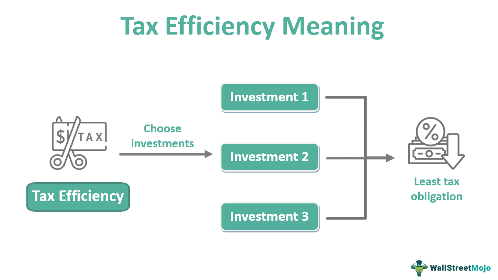

In today's rapidly evolving financial landscape, investors are increasingly seeking strategic avenues to maximize returns, particularly when it comes to retirement planning. Navigating the complexities of investment requires an understanding of various elements, including tax efficiency and emerging technologies. A significant aspect of investment success, tax efficiency, profoundly influences returns, especially within retirement accounts like 401(k)s and IRAs, where tax-deferred or tax-free growth opportunities are prominent.

Simultaneously, the advent of algorithmic trading has introduced new dynamics to investment strategies. By leveraging computer algorithms, this method allows for executing trades with enhanced speed and precision, minimizing human bias and opening doors to profiting from unique market trends and conditions. Algorithmic trading has become a transformative force in the financial markets, reshaping how investors approach asset management and providing new opportunities amidst its challenges.



This article aims to explore the intersection of investment strategies designed for retirement accounts, the critical role of tax efficiency, and the influence of algorithmic trading on these elements. Understanding these facets is fundamental for investors aspiring to align their strategies with tax implications and technological advancements, ultimately leading to optimized investment outcomes. Through this exploration, readers will gain insights into how the integration of these components affects overall financial success in a competitive investment environment.

## Table of Contents

## Understanding Retirement Accounts and Investment Strategies

Retirement accounts, such as 401(k)s and Individual Retirement Accounts (IRAs), provide individuals with significant tax advantages that can substantially enhance the growth of retirement savings over time. These accounts are designed to encourage long-term saving by offering tax-deferred or tax-free benefits, which can be crucial in maximizing one's investment returns.

### Tax Advantages of Retirement Accounts

1. **401(k) Plans**: Contributions to traditional 401(k) plans are made on a pre-tax basis, reducing the individual's taxable income in the year of the contribution. The investments then grow tax-deferred until withdrawal, at which point they are taxed as ordinary income. There are also Roth 401(k) options, where contributions are made with after-tax dollars, but withdrawals, including investment gains, are tax-free in retirement under certain conditions.

2. **Individual Retirement Accounts (IRAs)**: Traditional IRAs offer similar tax-deferral benefits as 401(k)s, where contributions may be tax-deductible and withdrawals during retirement are taxed as income. Roth IRAs, conversely, allow for tax-free growth and withdrawals, provided certain criteria are met, such as the account being open for at least five years and the holder being at least 59½ years old.

### Investment Strategies Based on Risk Tolerance and Timelines

Investors in retirement accounts can tailor their strategies to fit their unique financial goals, risk tolerance, and retirement timelines. 

- **Conservative Strategies**: These typically involve a higher allocation to bonds and fixed-income assets, offering lower risk and stable returns. This approach may be suitable for individuals closer to retirement or those with a low-risk tolerance.

- **Aggressive Strategies**: Younger investors or those with a higher risk tolerance might opt for aggressive strategies that focus heavily on equities to capitalize on potential market upswings over time. This strategy capitalizes on the power of compounding and typically involves higher short-term volatility.

### Coordination Across Multiple Retirement Accounts

Many investors hold multiple retirement accounts, such as a combination of 401(k)s and IRAs. A coordinated approach in managing these accounts can optimize asset allocation and enhance overall returns.

- **Diversification**: By spreading investments across different asset classes and accounts, investors can reduce risk and increase the potential for returns.

- **Strategic Asset Allocation**: Allocating assets based on an individual's risk profile and market outlook can improve investment returns. For instance, utilizing the flexibility of IRAs to hold a broader range of investment vehicles while maintaining employer-specific investments in a 401(k) can provide both stability and growth.

Moreover, a structured approach that takes advantage of the specific benefits of each account type can create a more resilient retirement portfolio. For instance, holding tax-inefficient assets, such as bonds or Real Estate Investment Trusts (REITs), in tax-deferred accounts while keeping stocks in taxable accounts might optimize after-tax returns.

Overall, understanding the distinct features of retirement accounts and aligning those features with a comprehensive investment strategy is critical for maximizing long-term financial outcomes. This ensures that investors not only grow their wealth effectively but also preserve it against potential tax liabilities as they transition into retirement.

## The Role of Tax Efficiency in Investment Success

Tax-efficient investing is crucial for maximizing after-tax returns. By minimizing tax liabilities on investment income, investors can significantly enhance their overall financial outcomes. Employing various strategies, such as asset location, tax-advantaged account utilization, and tax-loss harvesting, can have a profound impact on investment growth.

Asset location involves strategically placing investments in specific accounts to reduce tax exposure. For instance, placing high-yield bonds, which generate ordinary income, in tax-deferred accounts like 401(k)s or IRAs allows the income to grow without immediate tax consequences. Conversely, placing equities that predominantly generate capital gains in taxable accounts can be beneficial, especially if they qualify for the lower long-term capital gains tax rates.

Tax-advantaged accounts, such as Roth IRAs and traditional IRAs, provide opportunities for tax-free or tax-deferred growth. Roth IRAs, funded with after-tax dollars, offer tax-free withdrawals in retirement, making them ideal for assets expected to appreciate significantly. Traditional IRAs, funded with pre-tax dollars, defer taxes until disbursement, often at a lower tax rate post-retirement.

Tax-loss harvesting is another effective strategy where investors sell securities at a loss to offset gains from other investments, thereby reducing their taxable income. This approach is especially useful in volatile markets. For example, assume an investor holds two securities: Security A has unrealized gains of $10,000, while Security B has unrealized losses of $6,000. By selling Security B and realizing the loss, the investor can offset part of the gains from Security A, reducing the taxable gain to $4,000.

Understanding the nuances of dividend taxation, capital gains, and interest income is essential for optimizing tax outcomes. Qualified dividends, taxed at long-term capital gains rates, offer more favorable tax treatment than ordinary dividends. Capital gains are subject to different tax rates depending on the holding period; long-term gains (from assets held more than a year) are taxed at reduced rates compared to short-term gains.

By strategically employing these tax-efficient investing practices, investors can significantly enhance their after-tax returns, contributing to overall investment success.

 to Algorithmic Trading

Algorithmic trading employs advanced computer algorithms to execute trades at high speeds, leveraging large datasets and removing much of the emotional decision-making from investment processes. This technique uses pre-programmed instructions to analyze market conditions and execute orders based on a set of defined parameters and strategies, which can include [trend following](/wiki/trend-following), [arbitrage](/wiki/arbitrage), and mean reversion.

One of the primary advantages of [algorithmic trading](/wiki/algorithmic-trading) is its ability to process and interpret vast amounts of market data far more rapidly than a human could. By doing so, algorithms can identify and act on trading signals faster than conventional methods. For example, in trend following, the algorithm identifies sustained market movements in a particular direction and executes trades that align with the trend. This method minimizes the risk associated with market [volatility](/wiki/volatility-trading-strategies) by capitalizing on continued price fluctuations.

Arbitrage strategies, another common use of algorithmic trading, exploit price discrepancies of the same asset across different markets. Algorithms analyze these price differences and execute trades to profit from the imbalance. This practice often requires extremely fast execution times to be effective, making it ideal for algorithmic systems.

Mean reversion strategies assume that asset prices will return to an average over time. Algorithms can exploit this by taking positions when prices deviate significantly from historical averages, aiming to profit when the price trends back towards the mean.

Despite its potential for enhanced trading performance, algorithmic trading introduces new challenges. The increased speed and [volume](/wiki/volume-trading-strategy) of trades can lead to market instability, exemplified by incidents such as the "Flash Crash" of 2010. Additionally, developers must consider the complexity of programming robust algorithms that can adapt to changing market conditions without human intuition.

Recent advancements in [machine learning](/wiki/machine-learning) and [artificial intelligence](/wiki/ai-artificial-intelligence) are further transforming algorithmic trading, enabling more sophisticated pattern recognition and predictive models. These developments offer both opportunities and challenges, requiring continuous updates to algorithms and strategies to maintain efficacy.

As this trading method continues to evolve, understanding its intricacies will be essential for investors seeking to harness its capabilities while mitigating associated risks.

## Tax Implications in Algorithmic Trading

High-frequency trading ([HFT](/wiki/high-frequency-trading-strategies)), a subset of algorithmic trading, is characterized by rapid trade execution, often leading to short-term capital gains. These gains are typically taxed at ordinary income rates, as opposed to the lower rates afforded to long-term capital gains. This distinction is critical as it directly impacts overall investment returns. For instance, in the United States, ordinary income tax rates can be significantly higher than long-term capital gains rates, which are capped at 20% depending on the investor's income bracket.

Effective tax management in algorithmic trading necessitates an acute understanding of trade timing and the implications of taxable events. Investors must align their trading strategies with tax regulations to minimize potential liabilities. One major consideration is the holding period for securities. Positions held for less than a year (short-term) attract higher tax rates, whereas those held beyond a year benefit from lower rates applicable to long-term capital gains.

A notable tax rule that affects algorithmic traders is the wash sale rule. This regulation disallows the claiming of tax deductions from losses on securities if the same or substantially identical securities are purchased within 30 days before or after the sale. The complexity of this rule is exacerbated in HFT, where the rapid turnover of securities can inadvertently trigger wash sales, negating potential tax advantages of loss deductions. Traders, therefore, must meticulously track their transactions to avoid inadvertently engaging in wash sales.

Here is an example code snippet in Python that could help track potential wash sales:

```python
from datetime import datetime, timedelta

def identify_wash_sales(trade_history):
    wash_sales = []
    for i, sale in enumerate(trade_history):
        if sale['type'] == 'sell':
            # Define the 30-day window around the sell date
            sell_date = sale['date']
            start_date = sell_date - timedelta(days=30)
            end_date = sell_date + timedelta(days=30)

            for j, rebuy in enumerate(trade_history):
                # Check for repurchase of the same security within the wash sale window
                if (rebuy['type'] == 'buy' and rebuy['security'] == sale['security'] 
                    and start_date <= rebuy['date'] <= end_date
                    and i != j):  # Exclude the current sale record
                    wash_sales.append((sale, rebuy))

    return wash_sales

# Example usage:
trade_history = [
    {'type': 'buy', 'security': 'XYZ', 'date': datetime(2023, 1, 2)},
    {'type': 'sell', 'security': 'XYZ', 'date': datetime(2023, 2, 1)},
    {'type': 'buy', 'security': 'XYZ', 'date': datetime(2023, 2, 15)},
]

potential_wash_sales = identify_wash_sales(trade_history)
for sale, rebuy in potential_wash_sales:
    print(f"Wash sale detected: Sell of {sale['security']} on {sale['date']} and rebuy on {rebuy['date']}")
```

This simplified model helps illustrate the monitoring of transaction history to detect wash sales. The dynamic nature of algorithmic trading demands that investors be vigilant not only in their trading strategies but also in their tax strategies to effectively manage potential tax impacts and enhance net returns. Understanding these intricacies and integrating them into the trading process is essential for optimizing the financial outcomes of algorithmic trading practices.

## Strategies for Tax Efficiency in Algorithmic Trading

Diversifying strategies between long-term and short-term positions is a key approach for managing tax implications in algorithmic trading. This strategy involves balancing investments that are held for different durations, each subject to varying tax treatments. Short-term capital gains, resulting from assets held for one year or less, are taxed at higher ordinary income rates, while long-term capital gains from assets held for more than a year benefit from reduced tax rates. By carefully selecting which assets to hold longer, investors can potentially reduce their overall tax burden.

Tax-loss harvesting is another effective strategy that can provide tax relief during periods of market volatility. This technique involves selling securities at a loss to offset capital gains realized elsewhere, thereby reducing taxable income. For instance, if an algorithm detects a declining stock likely to produce a loss, it can execute a sale to realize this loss, which is then used to counterbalance gains. The rules around this, such as the wash sale rule, must be adhered to in order to effectively realize these tax benefits.

Incorporating tax-advantaged retirement accounts into algorithmic trading can defer tax liabilities on rapidly growing investments. These accounts, such as 401(k)s and Roth IRAs, offer tax deferral advantages, wherein capital gains, dividends, and interest are not taxed until funds are withdrawn. This allows investments to grow more substantially over time, unimpaired by immediate tax obligations. By channeling a portion of trading activities through these accounts, investors can maximize the compounded growth potential of their portfolios while postponing tax payments.

Overall, integrating diverse strategies, from managing asset holding periods to leveraging retirement accounts, forms a comprehensive approach to achieving tax efficiency in algorithmic trading. This requires continuous monitoring of both market trends and tax regulations to remain flexible and effective in navigating potential tax implications.

## Balancing Algorithmic Trading with Investment Taxation

Integrating tax considerations into trading algorithms is a critical strategy for achieving optimized returns and ensuring compliance with tax regulations. By embedding tax-awareness into algorithmic models, investors can strategically manage their portfolios, taking into account potential tax liabilities that might arise from trading activities.

One approach to achieving this is by collaborating with tax professionals who can provide insights into the intricacies of tax laws and their implications on investment strategies. Such professionals can help design algorithms that [factor](/wiki/factor-investing) in various tax rules, including capital gains tax rates, wash sale rules, and the implications of short-term versus long-term holdings. By incorporating these elements, investors can reduce unnecessary tax burdens and enhance their net returns.

Real-time consideration of tax impacts is vital for efficient portfolio management. Algorithmic trading strategies can be programmed to account for tax-efficient asset allocation, timing of trades to benefit from preferential tax rates, and harvesting tax losses to offset gains. For example, by incorporating rules that prioritize the sale of securities with losses before year's end, algorithms can effectively implement tax-loss harvesting strategies. In Python, such strategies can be integrated using libraries like NumPy and pandas to monitor and analyze trading data to make tax-optimized decisions:

```python
import pandas as pd

# Sample function to execute tax-loss harvesting
def tax_loss_harvest(trades_df):
    today = pd.to_datetime('today')
    year_end = pd.to_datetime(f'{today.year}-12-31')

    # Filter losses
    loss_trades = trades_df[(trades_df['profit'] < 0) & (trades_df['trade_date'] <= year_end)]

    # Execute selling for tax-loss harvesting
    for index, trade in loss_trades.iterrows():
        execute_trade(trade['security_id'], 'SELL', trade['quantity'])

# Hypothetical function to illustrate trading execution
def execute_trade(security_id, action, quantity):
    # Function to perform trade
    pass
```

Moreover, a balanced approach should also incorporate strategic realignment of investment strategies based on updated tax regulations and market conditions. Continuous monitoring and iterative refinement of algorithms ensure they remain aligned with both tax efficiency and investment objectives.

Ultimately, the integration of tax considerations into algorithmic trading requires a dynamic framework that adapts to changing tax laws and market environments. By doing so, investors can maintain a competitive edge, enhance portfolio returns, and ensure compliance with tax obligations, thereby achieving a harmonious balance in their trading activities. Continuous education and adaptation are crucial as tax laws evolve, necessitating ongoing collaboration with tax professionals and technological advancements in trading algorithms.

## Conclusion

In the contemporary investment landscape, the convergence of tax efficiency, retirement planning, and algorithmic trading offers a multifaceted environment with both challenges and opportunities. This amalgamation requires investors to refine their strategies by incorporating tax considerations directly into their investment methodologies. By meticulously aligning strategies with tax implications, investors can potentially enhance their after-tax returns, which is crucial for achieving financial prosperity and security in retirement.

Navigating this complex landscape demands continuous education and adaptability. Investors must remain abreast of constantly evolving tax legislation and advancements in trading technologies. Such developments can significantly impact investment decisions and outcomes. For example, staying informed about changes in capital gains taxation or updates in algorithmic trading algorithms can provide a decisive edge. 

Moreover, a proactive approach in updating one's financial knowledge ensures that investors are not only compliant with current regulations but also optimize their investment strategies for the maximum benefit. Engaging with financial advisors or tax professionals can further aid in crafting strategies that are both tax-efficient and aligned with one's long-term financial goals. 

Ultimately, for investors aiming to capitalize on these opportunities, continuous learning and strategic adaptability are crucial to maintaining competitiveness and achieving sustained financial growth.

## References & Further Reading

[1]: ["Advances in Financial Machine Learning"](https://www.amazon.com/Advances-Financial-Machine-Learning-Marcos/dp/1119482089) by Marcos Lopez de Prado

[2]: ["Machine Learning for Algorithmic Trading"](https://github.com/stefan-jansen/machine-learning-for-trading) by Stefan Jansen

[3]: ["Quantitative Trading: How to Build Your Own Algorithmic Trading Business"](https://github.com/LucindaYa/quant-resources/blob/master/Quantitative%20Trading%20How%20to%20Build%20Your%20Own%20Algorithmic%20Trading%20Business.pdf) by Ernest P. Chan

[4]: ["Evidence-Based Technical Analysis: Applying the Scientific Method and Statistical Inference to Trading Signals"](https://www.amazon.com/Evidence-Based-Technical-Analysis-Scientific-Statistical/dp/0470008741) by David Aronson

[5]: Bergstra, J., Bardenet, R., Bengio, Y., & Kégl, B. (2011). ["Algorithms for Hyper-Parameter Optimization."](https://dl.acm.org/doi/10.5555/2986459.2986743) Advances in Neural Information Processing Systems 24.