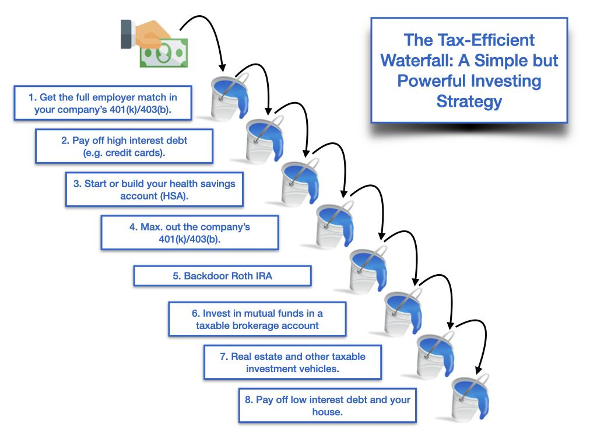

## Table of Contents

## What are the basic types of retirement accounts available for tax-efficient investing?

There are several types of retirement accounts that help you save for the future while reducing your taxes. The most common ones are the 401(k) and the Individual Retirement Account (IRA). A 401(k) is usually offered by your employer, and you can put part of your salary into it before taxes are taken out. This means you pay less in taxes now, and your money grows without being taxed until you take it out when you retire. An IRA is something you can set up on your own, and it also lets you save for retirement with tax benefits. There are two main types of IRAs: Traditional and Roth.

A Traditional IRA lets you put money in before you pay taxes on it, similar to a 401(k). This can lower your taxable income now, and you'll pay taxes when you withdraw the money in retirement. A Roth IRA, on the other hand, is funded with money you've already paid taxes on. The big advantage is that if you follow the rules, you won't have to pay taxes on the money when you take it out in retirement. Both types of IRAs have limits on how much you can contribute each year, and there are rules about when you can take the money out without penalties.

Choosing the right retirement account depends on your situation, like your income, whether your employer offers a 401(k), and your tax situation. It's a good idea to talk to a financial advisor to figure out which type of account will help you save the most for retirement in the most tax-efficient way.

## How does tax-deferred growth in retirement accounts benefit investors?

Tax-deferred growth in retirement accounts means that the money you invest grows without being taxed each year. This is different from a regular investment account where you might have to pay taxes on any gains every year. Because you don't have to pay taxes right away, more of your money stays invested and can grow over time. This can make a big difference over many years, as the money you would have paid in taxes keeps [earning](/wiki/earning-announcement) more money.

For example, if you put money into a 401(k) or a Traditional IRA, you won't pay taxes on the earnings until you take the money out in retirement. This can be a big advantage because you might be in a lower tax bracket when you retire, so you'll pay less in taxes then. Plus, the longer your money grows without taxes, the more it can compound and increase. This is why tax-deferred growth is such a powerful tool for saving for retirement.

## What is the difference between traditional and Roth retirement accounts in terms of tax treatment?

Traditional retirement accounts, like a Traditional IRA or a 401(k), let you put in money before you pay taxes on it. This means you can lower your taxable income now because you're not paying taxes on the money you put into these accounts. But when you take the money out in retirement, you'll have to pay taxes on it. So, if you think you'll be in a lower tax bracket when you retire, a Traditional account might be a good choice because you'll pay less in taxes later.

Roth retirement accounts, like a Roth IRA, work differently. You put money into a Roth account after you've already paid taxes on it. The big advantage is that when you take the money out in retirement, you don't have to pay any taxes on it, as long as you follow the rules. This can be really good if you think taxes might go up in the future or if you expect to be in a higher tax bracket when you retire. So, with a Roth account, you pay taxes now but get tax-free growth and withdrawals later.

## How can asset location strategies improve tax efficiency in retirement accounts?

Asset location strategies can help you save on taxes by putting different types of investments in the right kind of accounts. For example, if you have investments that grow a lot but don't pay much in dividends, like stocks, it's smart to put them in a Roth account. That way, when you sell those stocks and make a profit, you won't have to pay taxes on that profit because Roth accounts let you take money out tax-free. On the other hand, if you have investments that pay a lot of dividends, like bonds, it's better to put them in a Traditional account. That's because you can lower your taxes now by putting the money in before you pay taxes on it, and you'll only pay taxes when you take the money out in retirement.

By using asset location strategies, you can make sure you're paying the least amount of taxes possible. It's all about matching the right investments with the right accounts to take advantage of the tax rules. For example, if you have a mix of stocks and bonds, you might put the stocks in your Roth IRA and the bonds in your Traditional IRA. This way, you're setting yourself up to pay less in taxes over time, which means more money for you in retirement.

## What are the tax implications of withdrawing funds from different types of retirement accounts?

When you take money out of a Traditional IRA or 401(k), you have to pay taxes on it. This is because you didn't pay taxes on the money when you put it in. The money you take out counts as income, so it gets added to your other income for the year, and you pay taxes based on your total income. If you take money out before you're 59 and a half years old, you might also have to pay a 10% penalty, unless you meet certain exceptions. So, it's important to think about when you'll need the money and how much you'll have to pay in taxes when you take it out.

With a Roth IRA, the rules are different. You already paid taxes on the money you put in, so when you take it out, you don't have to pay taxes on it, as long as you follow the rules. You have to be at least 59 and a half years old and have had the account for at least five years to take out the earnings tax-free. If you take out earnings before that, you might have to pay taxes and a penalty. But you can take out the money you put in at any time without paying taxes or penalties. This can be a big advantage if you think taxes might go up in the future or if you want to have some money you can get to without worrying about taxes.

## How can one use tax-loss harvesting within a retirement account to enhance tax efficiency?

Tax-loss harvesting is a way to save on taxes by selling investments that have lost value and using those losses to lower your taxes. But you can't do this inside a retirement account like an IRA or 401(k) because you don't pay taxes on the gains or losses inside these accounts. The whole point of tax-loss harvesting is to use the losses to reduce your taxable income, but since you don't pay taxes on the money in a retirement account until you take it out, you can't use tax-loss harvesting to save on taxes inside the account.

However, you can use tax-loss harvesting in a regular investment account, which is called a taxable account. If you have investments that have gone down in value in your taxable account, you can sell them and use the losses to reduce your taxes. You might then use the money to buy similar investments, so you stay invested but still get the tax benefit. This can help you save money on taxes now, which can be useful if you're also saving for retirement in other ways.

## What role do dividend-paying stocks play in a tax-efficient retirement strategy?

Dividend-paying stocks can be a good part of a tax-efficient retirement strategy, especially if you put them in the right kind of account. If you have these stocks in a Traditional IRA or 401(k), you won't have to pay taxes on the dividends until you take the money out in retirement. This can be helpful because you're not paying taxes on the dividends every year, which means more money stays in your account to grow. It's a smart move if you think you'll be in a lower tax bracket when you retire, so you'll pay less in taxes later.

On the other hand, if you put dividend-paying stocks in a Roth IRA, you won't have to pay taxes on the dividends at all, as long as you follow the rules. This can be really good if you think taxes might go up in the future or if you expect to be in a higher tax bracket when you retire. By putting these stocks in a Roth account, you can get tax-free growth and withdrawals, which can make a big difference over time. So, thinking about where to put your dividend-paying stocks can help you save on taxes and have more money in retirement.

## How can rebalancing a retirement portfolio affect its tax efficiency?

Rebalancing a retirement portfolio means adjusting your investments to keep the right mix of stocks, bonds, and other assets. When you do this inside a Traditional IRA or 401(k), it doesn't affect your taxes right away because you don't pay taxes on the money until you take it out. This means you can rebalance as often as you need to without worrying about taxes now. It helps keep your retirement savings on track without any immediate tax consequences.

However, if you rebalance a portfolio in a taxable account, it can have tax implications. When you sell investments that have gone up in value to rebalance, you might have to pay capital gains taxes on the profit. This can reduce the overall tax efficiency of your retirement strategy. To manage this, you might want to rebalance less often in a taxable account or use strategies like tax-loss harvesting to offset some of the taxes you owe. By being smart about when and how you rebalance, you can keep your portfolio in line with your goals while also saving on taxes.

## What are the advanced strategies for managing Required Minimum Distributions (RMDs) to minimize tax impact?

Managing Required Minimum Distributions (RMDs) can be tricky, but there are some smart ways to lower the tax impact. One way is to think about taking money out of your retirement accounts before you have to. If you start taking money out a little bit each year before you reach the age when RMDs start, you can spread out the taxes you'll have to pay. This can keep you from being pushed into a higher tax bracket all at once when your RMDs start. Another strategy is to use a Qualified Charitable Distribution (QCD). If you're 70½ or older, you can give up to $100,000 from your IRA directly to a charity. This counts toward your RMD but doesn't count as income, so you don't have to pay taxes on it.

Another advanced strategy is to think about converting some of your Traditional IRA money to a Roth IRA. You'll have to pay taxes on the money you convert, but after that, the money in the Roth IRA can grow without taxes, and you won't have to take RMDs from it. This can be a good move if you think you'll be in a higher tax bracket in the future or if you want to leave money to your heirs without them having to pay taxes on it. Lastly, if you're still working past the age when RMDs start, you might not have to take them from your current employer's 401(k). This can help you keep more money growing tax-deferred for longer. By using these strategies, you can manage your RMDs in a way that keeps your taxes as low as possible.

## How can one optimize the use of Health Savings Accounts (HSAs) for tax-efficient retirement planning?

Health Savings Accounts (HSAs) can be a powerful tool for tax-efficient retirement planning if you use them the right way. If you have a high-deductible health plan, you can put money into an HSA. The money you put in is taken out of your income before taxes, so it lowers your taxes now. Plus, the money in the HSA grows without being taxed, just like in a retirement account. When you take the money out to pay for medical expenses, you don't have to pay taxes on it. This triple tax advantage—tax-deductible contributions, tax-free growth, and tax-free withdrawals for medical expenses—makes HSAs a great way to save for healthcare costs in retirement.

To make the most of an HSA for retirement, you should try to save as much as you can in it each year, but only take out money when you really need it for medical expenses. If you can, pay for your current medical costs out of pocket and let the money in your HSA grow. When you retire, you can use the HSA money for healthcare costs, which can be a big part of your expenses. After you turn 65, you can even take money out of your HSA for any reason, not just medical expenses, though you'll have to pay taxes on it if it's not for healthcare. By using your HSA this way, you can save a lot on taxes and have more money for your retirement.

## What are the considerations for converting a traditional IRA to a Roth IRA to improve long-term tax efficiency?

Converting a Traditional IRA to a Roth IRA can be a smart move for long-term tax efficiency, but you need to think about a few things first. When you convert, you have to pay taxes on the money you move from the Traditional IRA to the Roth IRA. This means you'll have a bigger tax bill the year you do the conversion. So, you should think about whether you can afford to pay those taxes now. It's also a good idea to do the conversion in a year when your income is lower, so you'll pay less in taxes. Another thing to consider is what you think will happen with tax rates in the future. If you think taxes will go up, it might be worth paying taxes now at a lower rate to get tax-free growth and withdrawals later.

Once you've converted to a Roth IRA, the money can grow without being taxed, and you won't have to take Required Minimum Distributions (RMDs) like you would with a Traditional IRA. This can be a big advantage if you don't need the money right away and want to let it keep growing. Also, if you want to leave money to your kids or grandkids, a Roth IRA can be a good choice because they won't have to pay taxes on the money they take out. But remember, you have to wait five years after the conversion before you can take out the earnings without paying taxes and penalties. So, converting to a Roth IRA can be a great way to save on taxes in the long run, but you need to plan carefully and think about your current and future tax situation.

## How can estate planning be integrated with retirement account strategies to enhance tax efficiency for heirs?

Estate planning can be a big help in making sure your retirement accounts are passed on to your heirs in a way that saves them money on taxes. One way to do this is by naming your heirs as beneficiaries on your retirement accounts. This means that when you pass away, they can take the money out of the account over time, which can help them pay less in taxes. For example, if you have a Roth IRA, your heirs won't have to pay taxes on the money they take out, as long as the account has been open for at least five years. This can be a big advantage for them because they get to keep more of the money you've saved.

Another way to use estate planning with retirement accounts is by thinking about converting some of your Traditional IRA to a Roth IRA. When you convert, you have to pay taxes on the money, but after that, the money in the Roth IRA can grow without taxes, and your heirs won't have to pay taxes on it when they take it out. This can be a good move if you think tax rates might go up in the future or if you want to leave more money to your heirs without them having to worry about taxes. By planning ahead and using these strategies, you can make sure your retirement savings are passed on in the most tax-efficient way possible.

## References & Further Reading

[1]: ["Advances in Financial Machine Learning"](https://www.amazon.com/Advances-Financial-Machine-Learning-Marcos/dp/1119482089) by Marcos Lopez de Prado

[2]: ["Machine Learning for Algorithmic Trading"](https://github.com/stefan-jansen/machine-learning-for-trading) by Stefan Jansen

[3]: ["Quantitative Trading: How to Build Your Own Algorithmic Trading Business"](https://github.com/LucindaYa/quant-resources/blob/master/Quantitative%20Trading%20How%20to%20Build%20Your%20Own%20Algorithmic%20Trading%20Business.pdf) by Ernest P. Chan

[4]: ["Evidence-Based Technical Analysis: Applying the Scientific Method and Statistical Inference to Trading Signals"](https://www.amazon.com/Evidence-Based-Technical-Analysis-Scientific-Statistical/dp/0470008741) by David Aronson

[5]: Bergstra, J., Bardenet, R., Bengio, Y., & Kégl, B. (2011). ["Algorithms for Hyper-Parameter Optimization."](https://dl.acm.org/doi/10.5555/2986459.2986743) Advances in Neural Information Processing Systems 24.