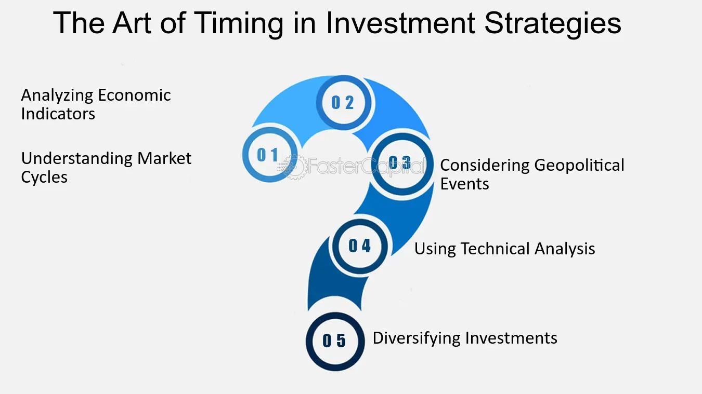

## Table of Contents

## What is the basic concept of timing in investment strategies?

Timing in investment strategies is all about trying to buy and sell investments at the right moments to make the most money. People who focus on timing believe that if they can predict when the market will go up or down, they can buy low and sell high. This can be tricky because markets can be unpredictable, and even experts often get it wrong. Many investors spend a lot of time studying charts and economic reports to try to guess the best times to make their moves.

However, timing the market perfectly is very hard to do consistently. Because of this, some people prefer a different approach called "time in the market." This means they focus on staying invested for a long time rather than trying to jump in and out at the perfect moments. They believe that over many years, the market generally goes up, so it's better to stay invested and not worry too much about short-term ups and downs. This strategy can be less stressful and often leads to good results over time.

## How can beginners identify the right time to sell an investment?

For beginners, figuring out the right time to sell an investment can be tough. One simple way to decide is to set clear goals for your investment. If you bought a stock to make a certain amount of money, and it reaches that goal, it might be a good time to sell. Another sign to sell could be if the company you invested in starts doing poorly, like if it's losing money or if there are big problems with its management. Watching the news and keeping up with the company's performance can help you make this decision.

Another thing to think about is your overall investment plan. If you need the money for something important, like buying a house or paying for school, it might be time to sell, even if the investment hasn't reached your goal yet. Also, if the investment is making you feel too stressed or worried, it might be better to sell and put your money into something that feels safer. Remember, it's okay to change your mind and sell if it feels right for you.

## What are the common indicators used to decide when to hold an investment?

When deciding to hold onto an investment, one common indicator is the overall performance of the company or asset. If the company is doing well, making profits, and growing, it might be a good idea to keep your investment. You can check this by looking at the company's financial reports, which show how much money they are making and how they are spending it. If the numbers look good and the company is doing better than its competitors, holding onto your investment could lead to more gains in the future.

Another indicator is the general trend of the market. If the market is going up and your investment is following that trend, it might be wise to hold on. Markets can have ups and downs, but if the overall direction is positive, holding your investment could pay off in the long run. Also, if you believe in the long-term potential of the company or asset, and you don't need the money right away, holding can be a good strategy. It's all about having patience and believing in the future growth of your investment.

## Can you explain the difference between short-term and long-term investment timing?

Short-term investment timing is about trying to make quick profits by buying and selling investments in a short period of time, like days or weeks. People who do this are often called traders. They watch the market very closely and try to guess when prices will go up or down. This can be exciting but also risky because the market can be unpredictable. If you guess wrong, you might lose money. Short-term timing needs a lot of attention and knowledge about the market.

Long-term investment timing is different. It's about holding onto investments for a long time, like years or even decades. People who do this are often called investors. They believe that over time, good companies will grow and their investments will become more valuable. Long-term timing is usually less stressful because you don't need to watch the market every day. Instead, you focus on the big picture and the future potential of your investments. This approach can be less risky and often leads to steady growth over time.

## What role does market analysis play in timing sales and holdings?

Market analysis helps people decide when to sell or hold their investments by giving them information about what's happening in the market. When you do market analysis, you look at things like how the economy is doing, what other investors are doing, and how companies are performing. If the market analysis shows that the market is going up and companies are doing well, it might be a good idea to hold onto your investments because they could keep growing. On the other hand, if the market analysis shows that the market might go down or a company is having problems, it might be a good time to sell before the value drops.

Using market analysis to time your sales and holdings can be helpful, but it's not perfect. Sometimes the market can surprise everyone and do the opposite of what the analysis predicted. That's why it's important to use market analysis as just one part of your decision-making. It's also good to think about your own goals and how long you plan to keep your investments. If you're patient and believe in the long-term growth of your investments, you might decide to hold even if the short-term market analysis suggests selling.

## How do economic cycles affect investment timing decisions?

Economic cycles are like big waves that go up and down over time. They affect how the economy is doing, and this can change when you should buy or sell your investments. When the economy is in a good phase, called an expansion, businesses make more money, people have jobs, and the stock market often goes up. During this time, it might be a good idea to hold onto your investments because they could keep growing. But, if you think the good times might end soon, you might want to sell and take your profits before the market goes down.

On the other hand, when the economy is in a bad phase, called a recession, businesses struggle, people lose jobs, and the stock market often goes down. During a recession, it might be a good time to buy investments because prices are lower. If you believe the economy will get better soon, you can buy at a lower price and then hold until the market goes back up. But, it's hard to know exactly when the economy will change from good to bad or bad to good, so you have to be careful and think about your own situation and goals when making decisions about buying or selling.

## What are some advanced technical analysis tools used for timing the market?

Advanced technical analysis tools help people try to guess when the market will go up or down. One popular tool is the Moving Average Convergence Divergence (MACD). It shows the relationship between two moving averages of a stock's price. When the MACD line crosses above the signal line, it might be a good time to buy because the stock could go up. When it crosses below, it might be a good time to sell because the stock could go down. Another tool is the Relative Strength Index (RSI), which measures how fast and how much a stock's price is changing. If the RSI is over 70, the stock might be overbought and could go down soon, so it might be a good time to sell. If it's under 30, the stock might be oversold and could go up, so it might be a good time to buy.

Another advanced tool is Bollinger Bands, which are lines drawn above and below the moving average of a stock's price. When the price touches the upper band, it might be overbought and a good time to sell. When it touches the lower band, it might be oversold and a good time to buy. Fibonacci retracement levels are also used to find possible support and resistance levels in the market. These levels are based on the idea that markets will retrace a predictable portion of a move, after which they will continue in the original direction. By drawing these levels on a chart, investors can try to guess where the price might go next and decide when to buy or sell.

## How can investors use fundamental analysis to time their sales and holdings?

Fundamental analysis helps investors decide when to sell or hold their investments by looking at the real value of a company. This means checking things like the company's earnings, how much money it makes, its debts, and how well it's doing compared to other companies. If the company is doing well and making more money, it might be a good idea to hold onto your investment because it could keep growing. But if the company starts doing badly, like losing money or having big problems, it might be a good time to sell before the value of your investment goes down.

Using [fundamental analysis](/wiki/fundamental-analysis) to time your sales and holdings can be helpful, but it's not perfect. Sometimes, even if a company looks good on paper, other things like changes in the economy or bad news can make its stock price go down. That's why it's important to keep an eye on the big picture and not just the numbers. If you believe in the long-term growth of the company and the economy looks stable, you might decide to hold your investment even if the short-term news isn't great.

## What are the psychological factors that influence timing decisions in investing?

Psychological factors can really affect when people decide to buy or sell their investments. One big [factor](/wiki/factor-investing) is fear. When the market is going down, people might get scared and sell their investments too soon, even if they could have made more money by waiting. This is called "panic selling." On the other hand, when the market is going up, people might get too excited and think it will keep going up forever. This can make them hold onto their investments for too long, missing the best time to sell. It's all about emotions like fear and greed, which can make people do things that might not be the best for their money.

Another psychological factor is something called "confirmation bias." This is when people only pay attention to information that agrees with what they already think. For example, if someone believes a certain stock will go up, they might only look at news and reports that say good things about it, ignoring any bad news. This can lead to bad timing decisions because they're not seeing the whole picture. Also, overconfidence can make people think they know more than they really do about the market, causing them to buy or sell at the wrong times. Understanding these psychological factors can help investors make better timing decisions and stick to their plans, even when the market gets emotional.

## How do algorithmic trading strategies impact the timing of sales and holdings?

Algorithmic trading strategies use computers to buy and sell investments very quickly. These strategies can change how people time their sales and holdings because they can make the market move faster. For example, if a lot of people are using algorithms that sell when the market goes down a little bit, it can make the market go down even more. This can make other investors panic and sell their investments too, even if they were planning to hold them for a longer time. So, [algorithmic trading](/wiki/algorithmic-trading) can make the market more unpredictable and affect when people decide to buy or sell.

On the other hand, some investors use algorithmic trading to help them make better timing decisions. They can set up their computers to follow certain rules, like selling when a stock reaches a certain price or buying when the market goes down by a certain amount. This can take some of the emotion out of investing and help people stick to their plans. But, because so many people are using these strategies, it can make the market move in ways that are hard to predict. So, while algorithmic trading can help with timing, it also adds another layer of complexity to the market.

## What are the risks associated with trying to time the market, and how can they be mitigated?

Trying to time the market can be risky because it's hard to guess when the market will go up or down. If you get it wrong, you might buy when the price is high and then have to sell when it's low, losing money. Also, you might miss out on good times when the market is growing because you're waiting for the perfect moment to buy. This can make you feel stressed and worried, and it can take a lot of time and effort to watch the market all the time.

To make these risks smaller, you can focus on a long-term plan instead of trying to time the market perfectly. This means holding onto your investments for many years and not worrying too much about short-term ups and downs. Another way to reduce risk is to spread your money across different types of investments, like stocks, bonds, and real estate. This way, if one investment goes down, the others might still do well. Also, it's important to keep learning and not let your emotions make you buy or sell at the wrong times.

## Can you discuss case studies where precise timing of sales and holdings led to significant gains or losses?

One famous case where timing led to big gains was during the dot-com boom in the late 1990s. A lot of people bought stocks in new internet companies, hoping they would grow fast. One investor, let's call him John, bought shares in Amazon in 1997 when the stock was just starting to take off. He held onto his shares for a few years, even when the market got crazy and prices went way up. In early 2000, just before the dot-com bubble burst, John sold his Amazon shares and made a huge profit. If he had waited just a little longer, he would have lost a lot of money because the stock price crashed after the bubble burst. John's good timing helped him make a lot of money.

Another case where timing led to big losses was during the 2008 financial crisis. Many people had bought houses and taken out big loans, thinking the housing market would keep going up. One family, the Smiths, bought a house in 2006 when prices were very high. They thought they could sell it for even more money in a few years. But in 2008, the housing market crashed, and they had to sell their house for much less than they paid for it. If they had sold their house in 2006 or early 2007, they could have made some money or at least not lost as much. Their bad timing made them lose a lot of money.

## References & Further Reading

[1]: Bergstra, J., Bardenet, R., Bengio, Y., & Kégl, B. (2011). ["Algorithms for Hyper-Parameter Optimization."](https://papers.nips.cc/paper/4443-algorithms-for-hyper-parameter-optimization) Advances in Neural Information Processing Systems 24.

[2]: ["Advances in Financial Machine Learning"](https://www.amazon.com/Advances-Financial-Machine-Learning-Marcos/dp/1119482089) by Marcos Lopez de Prado

[3]: ["Evidence-Based Technical Analysis: Applying the Scientific Method and Statistical Inference to Trading Signals"](https://www.amazon.com/Evidence-Based-Technical-Analysis-Scientific-Statistical/dp/0470008741) by David Aronson

[4]: ["Machine Learning for Algorithmic Trading"](https://github.com/PacktPublishing/Machine-Learning-for-Algorithmic-Trading-Second-Edition) by Stefan Jansen

[5]: ["Quantitative Trading: How to Build Your Own Algorithmic Trading Business"](https://books.google.com/books/about/Quantitative_Trading.html?id=j70yEAAAQBAJ) by Ernest P. Chan