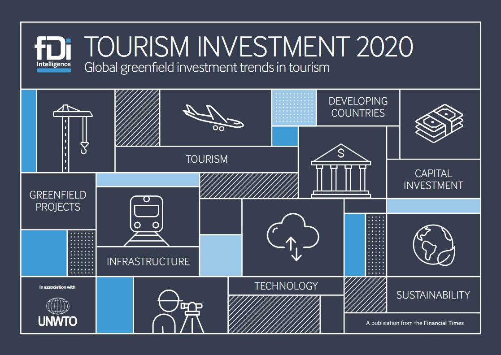

Investment tourism has witnessed a significant surge in recent years as investors increasingly recognize the lucrative opportunities within the travel and tourism sectors. This growth is driven by the sector's resilience and potential for high returns. Travel and tourism encompass a wide array of industries, from accommodation and transportation to entertainment and digital services, making it an attractive avenue for investment. 

Central to this evolving landscape is algorithmic trading, or algo trading, which is transforming how investors capitalize on opportunities within these sectors. Algorithmic trading employs algorithms to execute investment transactions at various speeds and volumes, leveraging computing power to analyze market data and pattern recognition to optimize decision-making. This technological advancement becomes particularly valuable in the volatile and rapidly changing tourism industry, where timely information and quick execution are paramount.



This article aims to explore how algo trading is being adopted in investment tourism, offering insights into the opportunities it facilitates and the challenges it poses. By understanding the interplay between algorithmic approaches and tourism investment, stakeholders can better navigate this dynamic environment, potentially enhancing their investment outcomes. As the industry continues to evolve, the integration of advanced trading strategies could pave the way for more sophisticated and efficient investment methodologies, further cementing the role of algorithmic trading in harnessing the potential within the tourism sector.

## Table of Contents

## Understanding Investment Tourism

Investment tourism refers to the strategic allocation of capital into the travel and tourism sectors, aiming to capitalize on the growth and profitability inherent in these industries. As globalization fosters increased movement and interaction between countries, the travel and tourism sectors have experienced exponential growth, making them attractive arenas for investment.

### Definition and Scope of Investment Tourism

The scope of investment tourism encompasses various sectors, including hospitality, transportation, and travel technology. Investors are drawn to this field due to the robust demand for travel experiences, driven by factors such as an increasingly interconnected world, rising middle-class populations in emerging markets, and growing disposable incomes. These dynamics create opportunities for significant returns on investment in strategically chosen tourism-related ventures.

### Key Areas Attracting Investments

1. **Hotels and Resorts**: This sub-sector includes investments in traditional hotels, boutique accommodations, luxury resorts, and vacation rentals. The appeal lies in the consistent demand for lodging, supported by both leisure and business travel. Investments in hotels can yield substantial returns, particularly in high-demand urban centers and tourist hotspots.

2. **Airlines**: Although generally considered high-risk due to fluctuating fuel prices and regulatory challenges, airlines remain a crucial component of the tourism infrastructure. Investments in this area are often driven by strategic partnerships, mergers, and acquisitions, aiming at gaining market share and operational efficiency.

3. **Online Travel Agencies (OTAs)**: Digital platforms facilitating travel arrangements and accommodations are lucrative due to their ability to harness data analytics and user engagement. These platforms not only offer booking services but also provide opportunities for cross-selling additional services like car rentals and travel insurance.

### Examples of Successful Investments

Several case studies highlight the potential for success within investment tourism:

- **Marriott International's acquisition of Starwood Hotels**: This strategic acquisition expanded Marriott's global footprint, creating the world's largest hotel chain. The merger allowed greater cross-selling opportunities and economies of scale, leading to increased revenue and market share.

- **Expedia's expansion strategy**: By acquiring several smaller companies and investing in technology, Expedia has solidified its position as a leader among OTAs. These moves enabled the company to offer comprehensive travel solutions and personalized user experiences, driving profitability and growth.

Investment tourism remains an appealing avenue for investors due to the ongoing growth trajectory of the global travel industry. Careful analysis and strategic capital allocation within this space can yield significant economic benefits, encouraging further exploration and development in this sector.

## The Role of Algo Trading in Tourism Investments

Algorithmic trading, commonly referred to as algo trading, is a method of executing trades utilizing automated pre-programmed trading instructions accounting for variables such as time, price, and [volume](/wiki/volume-trading-strategy). Within the context of investments in the travel and tourism sectors, algo trading offers numerous benefits and strategies that are particularly relevant and effective.

### Overview of Algorithmic Trading Application in Tourism Investments

Algorithmic trading leverages sophisticated algorithms to analyze vast datasets and execute trades at speeds unmatched by human traders. In the tourism sector, this capability allows investors to quickly respond to market movements influenced by seasonal trends, geopolitical developments, and consumer behavior patterns.

The implementation of algorithms in tourism investments empowers investors to capitalize on short-term market inefficiencies. By analyzing historical data and real-time information, algo trading aids in determining optimal entry and [exit](/wiki/exit-strategy) points in the market, thereby enhancing the potential for higher returns. This is particularly crucial in a market where factors such as travel restrictions or global events can rapidly alter market dynamics.

### Types of Algo Trading Strategies in the Tourism Sector

Several algo trading strategies are applicable to tourism investments:

1. **Trend-Following Strategy**: This strategy involves algorithms that identify and exploit patterns in tourism stocks that are consistent with the larger market momentum. For example, during peak travel seasons, certain stocks may display consistent upward trends, allowing algorithms to capitalize on predictable movements.

2. **Arbitrage Strategy**: Algorithms can perform high-frequency trades to take advantage of price discrepancies between related tourism stocks or between different markets. Efficiently executing these trades requires rapid data processing which algo trading provides, minimizing risk while maximizing profitability.

3. **Mean Reversion Strategy**: This strategy operates on the principle that prices will revert to their historical average. In the tourism sector, where prices can fluctuate due to volatile demand, identifying points of reversion can lead to strategic trades.

### Advantages of Using Algo Trading in Tourism Investments

The integration of algo trading in tourism investments offers distinct advantages:

- **Speed**: Algorithms can execute orders within milliseconds, a critical factor when dealing with the quick shifts observed in tourism-related markets.

- **Efficiency**: Automation reduces the manual labor involved in trading, thus minimizing errors and operational costs. Algorithms ensure that trades are executed at the most advantageous prices by quickly reacting to market changes.

- **Data-Driven Decision-Making**: Algo trading incorporates real-time data analysis using quantitative models. Investors can thus make informed decisions based on a comprehensive evaluation of market trends and patterns, increasing the likelihood of successful investments.

In summary, algo trading enhances tourism investment strategies by offering tools equipped to handle the sector's distinct challenges. Through strategic deployment of trend-following, [arbitrage](/wiki/arbitrage), and mean reversion strategies, investors are better positioned to navigate the complexities of the tourism market effectively. The speed, efficiency, and data-driven insights rendered by algo trading substantially uplift the potential for optimizing investment outcomes.

## Types of Algo Trading Strategies in Tourism

Algorithmic trading (algo trading) employs various strategies to optimize investment decisions within the dynamic tourism sector. These strategies utilize mathematical models and automated systems to analyze market data, execute trades, and capitalize on market inefficiencies. This section discusses three prominent algo trading strategies—trend-following, arbitrage, and mean reversion—that are relevant in the context of tourism-related investments.

### Trend-Following Strategies

Trend-following strategies aim to capitalize on the [momentum](/wiki/momentum) within tourism markets by identifying and following established trends. These strategies employ technical indicators such as moving averages or the Relative Strength Index (RSI) to assess the direction and strength of a trend. For instance, if the stock of a major airline shows a consistent upward trend supported by seasonal increases in tourism, a trend-following algorithm might trigger buy orders.

Traders can employ Python to implement a simple moving average crossover strategy:

```python
import pandas as pd

def simple_moving_average(data, short_window, long_window):
    data['short_mavg'] = data['Close'].rolling(window=short_window, min_periods=1).mean()
    data['long_mavg'] = data['Close'].rolling(window=long_window, min_periods=1).mean()
    signals = pd.DataFrame(index=data.index)
    signals['signal'] = 0.0
    signals['signal'][short_window:] = np.where(data['short_mavg'][short_window:] > data['long_mavg'][short_window:], 1.0, 0.0)
    signals['positions'] = signals['signal'].diff()
    return signals
```

This code snippet calculates short and long-term moving averages and generates buy signals when the short-term average crosses above the long-term average.

### Arbitrage Opportunities

Arbitrage strategies exploit price discrepancies between similar tourism-related financial instruments listed on different exchanges or markets. These strategies involve buying the undervalued instrument while simultaneously selling the overvalued one, thus profiting from the price convergence.

For example, differences in currency exchange rates can affect the stock price of a multinational hotel chain listed on foreign exchanges. Algo trading systems can automate the process of spotting and exploiting these disparities, ensuring quick execution of trades to capture minimal profit margins. High-frequency trading ([HFT](/wiki/high-frequency-trading-strategies)) is often employed in arbitrage, where milliseconds can determine the success of a trade.

### Mean Reversion Strategies

Mean reversion strategies are predicated on the concept that stock prices eventually return to their historical average. In the tourism sector, stocks impacted by temporary adverse news—such as natural disasters or political unrest—might initially deviate from their mean value. Mean reversion algorithms identify these deviations and predict a return to equilibrium, allowing traders to buy low and sell high.

An example Python code for a basic mean reversion strategy might look like this:

```python
def mean_reversion(data, window):
    mean = data['Close'].rolling(window=window).mean()
    std_dev = data['Close'].rolling(window=window).std()
    z_score = (data['Close'] - mean) / std_dev
    return z_score

data['z_score'] = mean_reversion(data, 20)
data['trade_signal'] = np.where(data['z_score'] > 1, -1, np.where(data['z_score'] < -1, 1, 0))
```

This algorithm calculates the Z-score for stocks over a defined window, generating signals to sell when the score is high (overvalued) and buy when it is low (undervalued).

In conclusion, algo trading within the tourism sector utilizes these strategies to systematically analyze and act on market trends and anomalies. While each strategy carries inherent risks and assumptions about market behavior, their implementation through sophisticated models allows investors to make informed decisions about tourism-related assets.

## Investment Opportunities in the Tourism Sector

Investment opportunities in the tourism sector have gained significant attention from investors globally, forming a crucial component of investment tourism. Hotels, resorts, and online travel companies are among the key segments that attract substantial investments. These sectors benefit from increasing global travel, which drives demand for accommodation, hospitality services, and booking platforms.

### Hotels and Resorts

The hotel industry is a prime target for investment due to its potential for steady revenue through occupancy rates and ancillary services like dining and events. High-end hotel chains, boutique hotels, and vacation resorts offer varying investment opportunities based on the target market and location. For example, major urban centers typically sustain a continuous influx of business travelers, whereas coastal resorts appeal to leisure tourists. Investors often focus on strategic locations where tourism is expected to grow, such as cities with upcoming international events or burgeoning tourist attractions.

### Online Travel Companies

Online travel agencies (OTAs) and booking platforms are pivotal in connecting travelers with their destinations, making them attractive to technology-driven investors. With the rise of digital commerce, companies like Expedia and Booking Holdings have exhibited robust growth, expanding their market reach and technological capabilities. Investments in OTAs are typically directed towards enhancing user experience, improving data analytics for customer insights, and expanding market shares in untapped regions.

### Emerging Markets

Emerging markets present substantial growth opportunities due to increasing disposable incomes, an expanding middle class, and growing interest in international travel. Regions in Asia, Africa, and Latin America have shown potential for tourism development, which is why they are becoming focal points for investment. These markets offer opportunities in infrastructure development, such as the construction of new hotels and supporting facilities, as well as in ecological and adventure tourism, which is gaining popularity.

### Mega-Resorts and Casinos

Mega-resorts and casinos represent another lucrative investment area within the tourism sector. These establishments often provide a comprehensive tourism experience, combining luxury accommodations, entertainment, shopping, and gaming under one roof. Locations like Las Vegas, Macau, and Singapore have shown how mega-resorts can serve as major tourism magnets and significant economic drivers. Investments here focus on creating state-of-the-art facilities that can attract high volumes of tourists and generate substantial revenue through diverse offerings.

In conclusion, the tourism sector offers a wide range of investment opportunities that cater to various investor interests and risk profiles. As global travel patterns evolve and new markets open, the potential for investments in hotels, resorts, online travel companies, and mega-resorts continues to grow, presenting lucrative prospects for both individual and institutional investors.

## Challenges and Risks in Algo Trading for Tourism Investments

Algorithmic trading in the tourism investment sector presents a range of challenges and risks that need to be addressed for successful implementation and outcomes. A primary concern is market [volatility](/wiki/volatility-trading-strategies), as the tourism industry is highly susceptible to global events that can cause sudden and unpredictable changes. These might include geopolitical instability, pandemics, natural disasters, and changes in currency exchange rates. Such events can lead to abrupt fluctuations in tourism demand and supply dynamics, affecting asset prices in the sector. Consequently, [algorithmic trading](/wiki/algorithmic-trading) systems must be designed with sophisticated risk management strategies to adapt to these rapid market shifts without incurring substantial losses.

Technical challenges are another significant aspect. Algo trading requires a robust technological infrastructure, including powerful computational resources, high-speed internet, and access to real-time data feeds. The absence of such infrastructure can lead to latency issues where trades are executed slower than anticipated, consequently affecting the profitability of time-sensitive strategies. Furthermore, the implementation of algorithms demands expert knowledge not only of computer programming and data analysis but also of financial principles and market behavior specific to tourism investments.

Developers and traders must also be cognizant of the complexities involved in [backtesting](/wiki/backtesting) algorithms against historical data. Backtesting models in the travel and tourism sector requires comprehensive datasets covering various market conditions, which can be challenging to obtain due to the sector's unique characteristics. Poor backtesting practices might provide misleading signals of an algorithm’s potential profitability, leading to erroneous investment decisions.

Moreover, there's a risk associated with the over-reliance on automation, where human oversight might be minimized. This can lead to undetected algorithmic errors or "algotrading mishaps" that occur when market participants act on erroneous trading signals. Effective oversight mechanisms must be employed to continuously monitor and evaluate the performance of trading systems.

Overall, while algorithmic trading can optimize investment strategies in the tourism sector, it necessitates addressing these challenges and implementing meticulous oversight and risk management protocols. Careful consideration of market-specific risks and continued enhancement of technological capabilities are pivotal to leveraging the benefits of algo trading in tourism investments.

## Conclusion

The integration of investment tourism with algorithmic trading holds significant potential for enhancing the effectiveness and profitability of investments in the travel and tourism sector. Algorithmic trading offers a structured and data-driven approach that can optimize the decision-making process, allowing investors to navigate complex market dynamics with greater precision and speed. This technological advancement has the potential to transform how investments are managed, providing a competitive edge through strategies that capitalize on real-time data analysis and automation.

Looking ahead, the future of investment opportunities within the tourism sector appears promising, particularly with the continued advancements in technology. Algorithmic trading is poised to play a pivotal role in identifying and exploiting growth areas such as emerging markets, online travel companies, and mega-resorts. As patterns in market behavior become increasingly predictable through algorithmic analysis, investors are better equipped to anticipate and respond to shifts, thus maximizing their return on investment.

However, it is crucial for investors to maintain a balanced perspective, acknowledging both the opportunities and inherent risks associated with algo trading in tourism investments. Market volatility and unexpected changes within the tourism industry pose significant challenges that require a sound understanding and robust infrastructure. Additionally, the technical expertise needed to effectively implement and manage algorithmic trading cannot be understated.

Therefore, investors are encouraged to conduct thorough research and consider both the benefits and potential pitfalls. By embracing a comprehensive risk management approach and leveraging the advantages of algorithmic trading, investors can harness its full potential in the tourism sector, paving the way for sustainable and profitable investments.

## References & Further Reading

[1]: Bergstra, J., Bardenet, R., Bengio, Y., & Kégl, B. (2011). ["Algorithms for Hyper-Parameter Optimization."](https://dl.acm.org/doi/10.5555/2986459.2986743) Advances in Neural Information Processing Systems 24.

[2]: ["Advances in Financial Machine Learning"](https://www.amazon.com/Advances-Financial-Machine-Learning-Marcos/dp/1119482089) by Marcos Lopez de Prado

[3]: ["Evidence-Based Technical Analysis: Applying the Scientific Method and Statistical Inference to Trading Signals"](https://www.amazon.com/Evidence-Based-Technical-Analysis-Scientific-Statistical/dp/0470008741) by David Aronson

[4]: ["Machine Learning for Algorithmic Trading"](https://github.com/stefan-jansen/machine-learning-for-trading) by Stefan Jansen

[5]: ["Quantitative Trading: How to Build Your Own Algorithmic Trading Business"](https://www.amazon.com/Quantitative-Trading-Build-Algorithmic-Business/dp/1119800064) by Ernest P. Chan