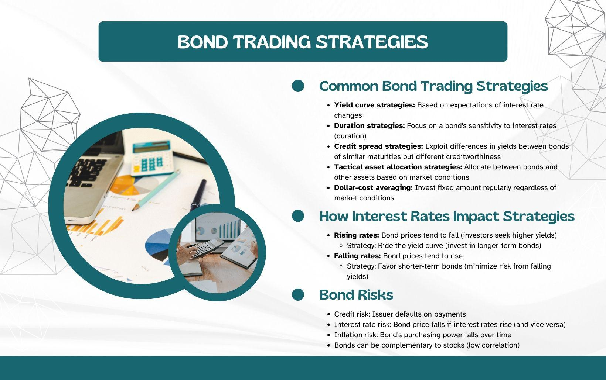

Bonds are a fundamental component of diversified investment portfolios, renowned for providing stability and generating reliable income. Compared to equities, bonds typically involve lower risk and offer more predictable returns, which makes them attractive to investors seeking a balance between security and performance. A bond is essentially a loan an investor makes to a borrower, typically governmental, municipal, or corporate entities, which is repaid over time with interest.

Traditionally, bond investments were managed manually, relying heavily on human judgment and experience to forecast market movements and potential risks. However, the landscape of bond investment has been dramatically transformed by the introduction of algorithmic trading. This innovative approach leverages sophisticated computer algorithms to automate and execute trades at speeds and efficiencies unmatched by human traders. Algorithmic trading provides investors with enhanced precision in timing trades, optimizing execution by analyzing market data in real-time to identify favorable trading conditions.



The integration of algorithmic trading into bond markets presents numerous advantages. It has introduced greater liquidity, reducing the cost of trades and offering more robust execution capabilities that minimize slippage and the market impact of large transactions. Moreover, algorithmic trading can mitigate risks and enhance the agility of managing bond portfolios, allowing for timely adjustments to changing market conditions.

Despite its benefits, algorithmic trading carries certain considerations that investors must acknowledge. The reliability of these automated systems hinges on high-quality data and sophisticated technological infrastructure. Additionally, there remains the critical need to navigate regulatory requirements that govern algorithmic trading practices, ensuring compliance and ethical conduct.

This article provides an exploration into the intersection of traditional bond investment strategies and modern algorithmic trading approaches, offering insights into the benefits and considerations of each. Through a comprehensive understanding, investors can harness the strengths of both methodologies, creating well-rounded portfolios that adeptly navigate the complexities of today's financial markets.

## Table of Contents

## Understanding Bonds Investment

Bonds are a cornerstone in the world of investments, offering a level of security and predictability that often contrasts with the volatility of equities. As debt securities, bonds represent a loan made by an investor to a borrower, typically corporate or governmental. The borrower agrees to pay periodic interest payments and to repay the principal amount at maturity, making bonds a reliable vehicle for yielding fixed returns.

### Types of Bonds

1. **Government Bonds**: These are issued by national governments and are often considered low-risk investments due to the backing of government credit. United States Treasury bonds are a common example, providing benchmark yields and aiding in stabilizing portfolios.

2. **Corporate Bonds**: These are issued by companies aiming to raise capital. Corporate bonds offer higher yields compared to government bonds due to their elevated risk. The creditworthiness of the issuing corporation significantly influences these bonds' interest rates.

3. **Municipal Bonds**: Issued by states, municipalities, or counties, they fund public projects. While they are generally tax-exempt at the federal level, investors face different risks depending on the economic health and credit rating of the issuing municipality.

### Risks Associated with Bonds

Despite their relative stability, bonds [carry](/wiki/carry-trading) specific risks that investors must navigate:

- **Interest Rate Risk**: Bond prices and interest rates share an inverse relationship. When interest rates rise, existing bond prices typically fall, and vice versa. This risk is heightened for long-duration bonds.

- **Credit Risk**: This involves the possibility of the issuer defaulting on interest or principal repayments. Rating agencies provide credit ratings for bonds, helping investors assess this risk level.

- **Liquidity Risk**: Some bonds may not be easily sold at their fair market value due to a lack of demand. Government bonds generally have higher liquidity compared to corporate or municipal bonds.

Understanding these fundamental aspects and strategies pertinent to bond investments enables investors to select bonds that align with their risk tolerance and financial goals, navigating the nuanced landscape of fixed-income securities with informed precision.

## Financial Strategies for Bonds Investment

Strategic allocation in bond investments is essential for balancing risk while achieving specific financial objectives. A well-crafted bond strategy can provide stability and income, enhancing an investment portfolio's overall performance. Among the various approaches, laddering and barbell strategies stand out for their effectiveness in mitigating risks associated with [interest rate](/wiki/interest-rate-trading-strategies) fluctuations.

### Laddering Strategy

The laddering strategy involves investing in bonds with staggered maturities, allowing investors to manage interest rate risk more efficiently. By constructing a bond ladder, investors can ensure that a portion of their portfolio matures at regular intervals, providing [liquidity](/wiki/liquidity-risk-premium) and flexibility to reinvest in potentially higher-yielding bonds as rates change. This strategy reduces exposure to the [volatility](/wiki/volatility-trading-strategies) of interest rate changes in the bond market, thus maintaining a more stable cash flow over time.

To implement a laddering strategy, an investor could allocate funds across a range of bonds with different maturity dates. For example, if an investor has $100,000 to allocate and is considering a 5-year investment horizon, they could invest $20,000 in bonds maturing in each of the next five years. As each bond matures, the principal can be reinvested in a new bond at the far end of the ladder, continuously extending the ladder and adapting to the prevailing interest rates.

### Barbell Strategy

The barbell strategy is another effective approach, allowing investors to capitalize on high short-term yields while securing long-term income stability. This strategy involves investing in a mix of short-term and long-term bonds, effectively creating a "barbell" shape in the maturity distribution of the portfolio.

Short-term bonds, typically with maturities of less than three years, offer higher liquidity and the ability to quickly adapt to changing interest rates. These bonds usually carry less interest rate risk, but they might yield lower returns. Conversely, long-term bonds, with maturities extending beyond ten years, tend to offer higher yields due to the increased risk of holding the bond over an extended period. However, they also provide the benefit of locked-in interest rates, securing income for the long haul.

The barbell strategy enables investors to take advantage of rising interest rates through the short-term portion of their portfolio, while the long-term bonds ensure that high yields are available if rates drop. This balanced approach provides a hedge against interest rate volatility, blending the benefits of both ends of the maturity spectrum.

In conclusion, both laddering and barbell strategies offer distinct advantages in managing risk and maximizing returns in bond investments. Investors can tailor their portfolios to their risk tolerance and financial goals by strategically selecting maturity profiles, thereby optimizing their exposure to interest rate movements. Understanding and implementing these strategies effectively can enhance portfolio resilience and stability.

## Algorithmic Trading in Bond Markets

Algorithmic trading in bond markets utilizes sophisticated computer algorithms to automate trading processes, ensuring transactions occur at optimal times based on pre-defined criteria. This approach harnesses computer-driven models to analyze vast data sets, identifying profitable opportunities with enhanced precision.

One of the primary advantages of [algorithmic trading](/wiki/algorithmic-trading) is increased market liquidity. By automatically executing trades without human intervention, it provides a continuous presence in the market, contributing to tighter bid-ask spreads and more efficient price discovery. This improved liquidity reduces transaction costs, as investors can buy and sell bonds with less price slippage. Furthermore, the ability to execute trades rapidly leads to improved execution efficiency, allowing investors to capitalize on fleeting market opportunities that might be missed with manual trading.

Several popular strategies dominate algorithmic trading in bond markets. Mean-reversion strategies capitalize on the assumption that asset prices will revert to their mean over time. By identifying bonds that deviate significantly from their historical average prices, algorithms can make trades anticipating a reversion towards the mean. In Python, a basic mean-reversion strategy might be implemented as follows:

```python
import numpy as np
import pandas as pd

def mean_reversion_strategy(prices, window=20):
    rolling_mean = prices.rolling(window=window).mean()
    signals = np.where(prices < rolling_mean, 1, 0)  # Buy signal
    return pd.Series(signals, index=prices.index)

# Example usage with a hypothetical bond price series
prices = pd.Series(data=[100, 102, 101, 103, 102, 105, 104, 100])
signals = mean_reversion_strategy(prices)
```

Momentum trading is another strategy that seeks to exploit the continuation of existing trends in bond prices. Algorithms identify bonds exhibiting strong recent performance, buying these assets with the expectation that the trend will persist. Momentum strategies often use indicators like moving average convergence divergence (MACD) or relative strength index (RSI) to guide their decisions.

Statistical [arbitrage](/wiki/arbitrage) involves exploiting price inefficiencies between related securities, typically through pairs trading. This strategy relies on statistical models to forecast the temporary mispricing between two bonds, executing trades to profit from the convergence of their prices. Such strategies require rigorous [backtesting](/wiki/backtesting) and statistical modeling to ensure they operate effectively in real market conditions.

Algorithmic trading has drastically altered bond market dynamics by introducing consistent liquidity, minimized transaction costs, and high-speed execution capabilities. As technology continues to advance, the use of algorithms in bond markets is likely to expand, driven by innovations in data analysis and [artificial intelligence](/wiki/ai-artificial-intelligence).

## Implementing Algo-Trading for Bond Investment

Implementing algorithmic trading in bond investment requires a comprehensive understanding of the necessary technological infrastructure and the importance of high-quality data. The successful execution of such strategies hinges on the ability to process large volumes of data and execute trades at optimal times. High-frequency trading systems, powered by advanced computing capabilities, enable market participants to achieve low latency and high throughput, essential components for successful algorithmic trading.

### Technological Infrastructure

The backbone of algorithmic trading systems is a robust technological infrastructure capable of handling real-time data analysis and trade execution. This typically involves sophisticated hardware and software, including high-speed internet connections, powerful servers, and specialized trading platforms. The infrastructure must support the development, testing, and deployment of trading algorithms, enabling rapid response to market movements. Additionally, connectivity to multiple trading venues ensures that traders can access diverse liquidity pools and execute orders efficiently.

### Quality of Data

High-quality data is vital for making informed trading decisions. Accurate historical and real-time data feeds allow traders to analyze market trends, identify arbitrage opportunities, and evaluate the impact of macroeconomic factors on bond prices. Sources include financial news services, market data providers, and exchange feeds. The integrity of data is crucial to prevent erroneous trades and ensure compliance with regulatory standards.

### Backtesting Strategies

Backtesting is a critical step in validating the effectiveness of trading algorithms. By simulating trading strategies on historical data, traders can assess the potential profitability and risk of their algorithms before deploying them in live markets. This process involves statistical analysis to determine key performance metrics such as Sharpe ratio, drawdown, and win/loss ratio. Python libraries like Pandas and NumPy are commonly used for data manipulation and analysis, while libraries such as Backtrader and Zipline facilitate comprehensive backtesting procedures.

```python
import backtrader as bt
import datetime

class MovingAverageStrategy(bt.Strategy):
    params = (('fast', 10), ('slow', 30),)

    def __init__(self):
        self.fast_ma = bt.indicators.SimpleMovingAverage(self.data.close, period=self.params.fast)
        self.slow_ma = bt.indicators.SimpleMovingAverage(self.data.close, period=self.params.slow)

    def next(self):
        if self.fast_ma > self.slow_ma:
            if not self.position:
                self.buy()
        elif self.fast_ma < self.slow_ma:
            if self.position:
                self.sell()

# Create a cerebro entity
cerebro = bt.Cerebro()

# Add a strategy
cerebro.addstrategy(MovingAverageStrategy)

# Create a data feed
data = bt.feeds.YahooFinanceData(dataname='US10Y', fromdate=datetime.datetime(2015, 1, 1), todate=datetime.datetime(2020, 12, 31))

# Add the data feed
cerebro.adddata(data)

# Run the strategy
cerebro.run()
```

### Integration of AI and Machine Learning

The inclusion of AI and [machine learning](/wiki/machine-learning) enhances the predictive capabilities of trading algorithms. These technologies facilitate the development of models that can learn from historical data and adapt to new market conditions. Machine learning algorithms, such as decision trees and neural networks, enable the identification of complex patterns and trends that are not immediately apparent through traditional analysis. Moreover, AI models can process natural language data from news articles and financial reports, providing a more comprehensive view of market sentiment and potential price movements.

By continuously learning and updating in response to new data, AI-driven algorithms offer the potential for improved performance and reduced risk. As technology advances, the complexity and effectiveness of these models continue to grow, providing traders with more refined tools to navigate the bond markets.

In conclusion, implementing algorithmic trading for bond investment demands a strong technological foundation, reliable data access, thorough backtesting, and the strategic integration of AI and machine learning. Together, these components ensure that traders can optimize execution strategies and maintain a competitive edge in ever-evolving financial markets.

## Case Studies and Real-World Applications

Examining successful market timing strategies is essential for optimizing bond portfolios, particularly with the integration of algorithmic trading. Algorithmic trading applications not only enhance decision-making but also significantly improve execution speed. A notable example is the use of mean-reversion strategies, where algorithms identify price discrepancies that deviate from their historical average, enabling traders to make profitable trades when prices revert to the norm.

For instance, let's consider a case where an algorithm is designed to identify oversold bonds. By using historical price data, the algorithm calculates the mean and standard deviation. When bond prices fall below a certain threshold, the algorithm triggers a buy signal, anticipating a price correction. Here's a simple Python implementation for a mean-reversion strategy:

```python
import numpy as np
import pandas as pd

# Sample historical bond prices
prices = np.array([100, 102, 99, 97, 96, 98, 101, 104, 103, 99])
mean_price = np.mean(prices)
std_dev = np.std(prices)

# Define a threshold
threshold = mean_price - std_dev

# Identify buying opportunities
buy_signals = prices < threshold

print("Mean Price:", mean_price)
print("Standard Deviation:", std_dev)
print("Buy Signals:", buy_signals)
```

In practice, sophisticated systems would incorporate high-frequency trading algorithms capable of executing numerous trades in milliseconds. This speed and precision far surpass human capabilities and can lead to more consistent returns and reduced transaction costs.

Furthermore, [statistical arbitrage](/wiki/statistical-arbitrage) is another potent strategy, where algorithms detect and exploit the price differences between similar bonds. For example, if two corporate bonds with similar credit risk and duration have differing yields, an algorithm can execute trades to exploit this inefficiency, profiting from the eventual price correction.

Actual market case studies demonstrate the importance of adaptability and risk management in algorithmic bond trading. During financial market disruptions, such as those experienced in the 2008 financial crisis and the 2020 COVID-19 pandemic, traditional methods were often inadequate. However, algorithms adept at real-time data analysis and adaptive strategies managed to mitigate risks and capitalize on market volatility.

The integration of machine learning algorithms further enhances predictive capabilities by analyzing massive datasets to uncover patterns unseen by conventional methods. For instance, AI-driven systems can adapt to emerging market trends and adjust trading strategies accordingly, ensuring sustained performance even in uncertain conditions.

In conclusion, the application of algorithmic trading in bond markets illustrates the profound impact of technology on investment strategies. Examining successful cases reinforces the need for continued innovation, adaptability, and robust risk management practices to optimize bond portfolios effectively.

## The Future of Bonds Investment with Algo Trading

Technological advancements are poised to significantly impact bond markets, particularly through innovations such as big data analytics and blockchain. These technologies can enhance transparency, streamline processes, and provide deeper insights into market dynamics, thereby transforming bond investment strategies.

**Big Data Analytics**

Big data analytics plays a crucial role in refining bond investment strategies by providing comprehensive insights into market trends and investor behavior. By analyzing vast datasets, investors can identify patterns and correlations that were previously undetectable. This allows for more informed decision-making and the potential for improved returns. In practice, big data can be used for risk assessment, pricing analysis, and predicting market movements, helping investors to optimize their bond portfolios. For example, a sophisticated algorithm might analyze economic indicators, social media sentiment, and historical prices to predict interest rate changes, thereby enabling better interest rate risk management.

**Blockchain**

Blockchain technology offers enhanced security and transparency for bond transactions. By utilizing decentralized ledgers, blockchain can ensure the authenticity of bond issuance and trading, reducing the risk of fraud. This can lead to increased trust and efficiency in the bond markets. Additionally, smart contracts—self-executing contracts with terms directly written into code—can automate and streamline bond transactions, reducing the administrative burden and chance of human error.

**AI-Driven Trading Algorithms**

AI-driven trading algorithms are increasingly becoming vital tools for bond investors, offering sophisticated strategies that adapt to ever-changing market conditions. These algorithms can process large amounts of data in real-time, providing rapid analysis and execution that far surpass human capabilities. Through machine learning, these algorithms continuously improve their predictive accuracy, which can lead to enhanced investment performance. For example, AI can be used to develop predictive models that forecast economic indicators or specific bond performance based on multifactorial datasets.

**Regulatory Changes**

Regulatory changes will significantly influence the adoption and evolution of algorithmic trading practices in bond markets. As algorithmic trading becomes more prevalent, regulators are likely to implement measures to ensure market stability and investor protection. These regulations could involve stricter reporting requirements, guidelines for data privacy, and the management of systemic risk posed by high-frequency trading. Therefore, keeping abreast of regulatory developments is essential for investors and firms utilizing algorithmic trading to ensure compliance and optimize their trading strategies.

Overall, the integration of big data analytics, blockchain, and AI in bond markets represents a significant shift towards more efficient and transparent investment practices. As these technologies continue to evolve, their application will likely become more sophisticated, offering investors unparalleled tools for achieving their financial objectives.

## Conclusion

In navigating the complexities of bond markets, having a thorough understanding of both the market dynamics and strategic allocation principles is critical for achieving successful investment outcomes. Bonds, known for their stability and predictable income streams, require investors to judiciously assess risk factors such as interest rate fluctuations, creditworthiness of issuers, and liquidity conditions. Successful bond investing hinges on balancing these risks against potential returns to meet financial objectives effectively.

Algorithmic trading has transformed the landscape by complementing traditional investment strategies. By leveraging computer algorithms capable of executing trades at optimal times, investors benefit from enhanced precision, improved transaction speeds, and reduced costs. Algorithms can continuously analyze market data to identify timing inefficiencies, allowing investors to optimize the execution of their trades.

Investors equipped with appropriate technological infrastructures are better positioned to harness these benefits. High-quality historical and real-time data sets, coupled with robust analytical tools, enable investors to perform detailed backtesting and refine their strategies accordingly. Incorporating artificial intelligence and machine learning further enhances the predictive power of algorithmic models, offering sophisticated strategies tailored to maximize returns while managing risks effectively.

In essence, the fusion of comprehensive bond market knowledge with advanced algorithmic trading techniques empowers investors to navigate the intricacies of modern financial markets. Such integrative approaches not only facilitate improved decision-making and execution but also enhance the ability to adapt to market shifts and achieve investment objectives efficiently.

## References & Further Reading

[1]: Bergstra, J., Bardenet, R., Bengio, Y., & Kégl, B. (2011). ["Algorithms for Hyper-Parameter Optimization."](https://dl.acm.org/doi/10.5555/2986459.2986743) Advances in Neural Information Processing Systems 24.

[2]: ["Advances in Financial Machine Learning"](https://www.amazon.com/Advances-Financial-Machine-Learning-Marcos/dp/1119482089) by Marcos Lopez de Prado

[3]: ["Evidence-Based Technical Analysis: Applying the Scientific Method and Statistical Inference to Trading Signals"](https://www.amazon.com/Evidence-Based-Technical-Analysis-Scientific-Statistical/dp/0470008741) by David Aronson

[4]: ["Machine Learning for Algorithmic Trading"](https://github.com/stefan-jansen/machine-learning-for-trading) by Stefan Jansen

[5]: ["Quantitative Trading: How to Build Your Own Algorithmic Trading Business"](https://www.amazon.com/Quantitative-Trading-Build-Algorithmic-Business/dp/1119800064) by Ernest P. Chan