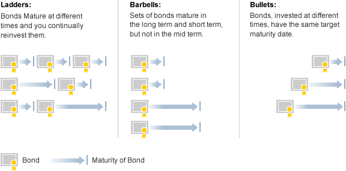

## Table of Contents

## What are bonds and how do they work?

Bonds are like IOUs that governments or companies issue to borrow money from investors. When you buy a bond, you're lending money to the issuer, and in return, they promise to pay you back the amount you lent, called the principal, on a specific date, known as the maturity date. They also agree to pay you interest regularly, usually every six months, until the bond matures. This interest is called the coupon.

Think of bonds as a way for big organizations to get money they need for projects or operations. For example, a city might issue bonds to build a new school, or a company might use them to expand its business. Investors like bonds because they are generally safer than stocks and provide a steady income from the interest payments. However, if the issuer runs into financial trouble, they might not be able to pay back the bond, which means the investor could lose money. So, while bonds are seen as safer, they still carry some risk.

## What are the different types of bonds available for investment?

There are several types of bonds that investors can choose from, each with its own features and levels of risk. Government bonds are issued by national governments and are often seen as very safe because they are backed by the government's ability to tax its citizens. For example, U.S. Treasury bonds are a popular type of government bond. Municipal bonds are issued by states, cities, or other local government bodies. They are used to fund public projects like schools or highways, and the interest they pay is often tax-free, which can be a big advantage for investors.

Corporate bonds are issued by companies and can be riskier than government bonds because the financial health of a company can change. They usually offer higher interest rates to make up for this extra risk. Within corporate bonds, there are investment-grade bonds, which are considered safer, and high-yield or junk bonds, which are riskier but offer higher returns. Another type is agency bonds, which are issued by government-affiliated organizations like Fannie Mae or Freddie Mac. These bonds are not directly backed by the full faith and credit of the government but are still seen as relatively safe.

Lastly, there are international bonds, which are issued by foreign governments or companies. These can add diversity to an investment portfolio but also come with additional risks like currency fluctuations and political instability. Inflation-linked bonds, like Treasury Inflation-Protected Securities (TIPS) in the U.S., adjust their principal according to inflation rates, protecting investors from the eroding effects of inflation. Each type of bond offers different benefits and risks, so investors need to consider their own financial goals and risk tolerance when choosing which bonds to invest in.

## How do bonds fit into a diversified investment portfolio?

Bonds are an important part of a diversified investment portfolio because they can help balance out the riskier parts of your investments, like stocks. When stock prices go up and down a lot, bonds can stay more stable. This means if the stock market has a bad day, the bonds in your portfolio might not lose as much value. This can help protect your money and make your overall investment less risky. Plus, bonds give you regular interest payments, which can be a nice steady income, especially if you're retired or need money coming in regularly.

Adding different types of bonds to your portfolio can also help spread out your risk even more. For example, you might have some government bonds, which are very safe, and some corporate bonds, which can be riskier but pay more interest. By mixing these, you can find a good balance between safety and [earning](/wiki/earning-announcement) potential. Also, if you include bonds from different countries or that adjust for inflation, you can protect your money from things like changes in currency value or rising prices. So, bonds are a key part of making sure your investments are spread out and can handle different kinds of financial ups and downs.

## What are the risks associated with investing in bonds?

When you invest in bonds, there are a few risks you should know about. One big risk is [interest rate](/wiki/interest-rate-trading-strategies) risk. If interest rates go up, the value of your bond might go down. This is because new bonds will be issued with higher interest rates, making your old bond less attractive to other investors. If you need to sell your bond before it matures, you might have to sell it for less than what you paid for it. Another risk is credit risk, which means the chance that the bond issuer might not be able to pay you back. If a company or government runs into financial trouble, they might default on their bond, and you could lose your money.

Another risk to think about is inflation risk. Inflation means the value of money goes down over time. If inflation goes up a lot, the interest you earn from your bond might not be enough to keep up with the rising prices. This can make your bond worth less in real terms. Also, there's something called reinvestment risk. This happens when your bond matures and you have to reinvest the money. If interest rates have gone down since you bought your bond, you might have to reinvest at a lower rate, which means you'll earn less interest in the future. So, while bonds are generally seen as safer than stocks, they still come with their own set of risks that you need to consider.

## How can beginners start investing in bonds?

For beginners looking to start investing in bonds, the first step is to understand what you want from your investment. Are you looking for safety, regular income, or a mix of both? Once you know your goals, you can start by looking at government bonds, like U.S. Treasury bonds, which are very safe and easy to buy. You can buy these directly from the U.S. Department of the Treasury's website, called TreasuryDirect. This is a good way to start because it's simple and you don't need a lot of money to get started.

After you feel comfortable with government bonds, you might want to look at other types of bonds, like corporate or municipal bonds. These can be bought through a brokerage account, which is like a special bank account for buying and selling investments. You can open a brokerage account with many banks or online investment platforms. When choosing bonds, think about how long you want to keep your money invested and how much risk you're okay with. It's a good idea to talk to a financial advisor if you're not sure, as they can help you pick the right bonds for your needs. Remember, the key is to start small, learn as you go, and slowly build a bond portfolio that fits your financial goals.

## What is the relationship between interest rates and bond prices?

When interest rates go up, bond prices usually go down. This happens because new bonds that are issued will have higher interest rates, making them more attractive to investors. If you have an older bond with a lower interest rate, it becomes less valuable because people would rather buy the new bonds that pay more. So, if you want to sell your old bond before it matures, you'll probably have to sell it for less than you paid for it. This is called interest rate risk.

On the other hand, when interest rates go down, bond prices tend to go up. This is because your older bond, which has a higher interest rate than the new bonds being issued, becomes more attractive to investors. They'll be willing to pay more for your bond because it pays more interest than the new ones. This relationship between interest rates and bond prices is important for investors to understand, as it can affect the value of their bond investments if they need to sell them before they mature.

## How do bond ratings affect investment decisions?

Bond ratings are like report cards for bonds. They tell you how safe or risky a bond is. Agencies like Moody's, Standard & Poor's, and Fitch give these ratings. A high rating, like AAA or AA, means the bond is very safe and the issuer is likely to pay you back. A low rating, like BB or below, means the bond is riskier and there's a bigger chance the issuer might not pay you back. When you're thinking about buying a bond, the rating can help you decide if it's a good fit for your investment goals and how much risk you're okay with.

If you want a safe investment, you'll probably go for bonds with high ratings. These bonds usually pay less interest because they're safer. But if you're willing to take more risk for a chance at higher returns, you might look at bonds with lower ratings. These bonds, often called junk bonds, pay more interest to make up for the extra risk. So, bond ratings are a big part of deciding which bonds to buy. They help you balance the safety of your money with the amount of interest you can earn.

## What are bond ladders and how can they be used in investment strategies?

A bond ladder is a way to invest in bonds that helps you manage risk and get regular income. It's like setting up a series of steps, where each step is a bond that matures at a different time. You buy bonds that mature in one year, two years, three years, and so on. When a bond at the bottom of the ladder matures, you take the money you get back and buy a new bond at the top of the ladder. This way, you always have bonds maturing and giving you money, which you can use or reinvest.

Using a bond ladder can be really helpful in your investment strategy. It helps you avoid having to reinvest all your money at once if interest rates change. If rates go up, you can reinvest the money from the matured bond at a higher rate. If rates go down, you still have other bonds paying you the old, higher rate. Plus, it gives you a steady stream of income because you're getting money back from different bonds at different times. This can be especially useful if you need regular income, like if you're retired.

## How can bonds be used to generate income in retirement?

Bonds can be a great way to make money in retirement because they give you regular interest payments. When you buy a bond, the issuer, like a government or a company, pays you interest every so often, usually every six months. This can be a steady income that helps you pay for your living expenses when you're not working anymore. If you have a bunch of different bonds, you can set them up so that some of them are always paying you interest at different times throughout the year. This way, you get money coming in regularly, which can make your retirement more comfortable.

Another way to use bonds for income in retirement is by setting up a bond ladder. A bond ladder is when you buy bonds that mature at different times. For example, you might buy bonds that mature in one year, two years, three years, and so on. When a bond matures, you get your money back, and you can use it to buy a new bond or spend it on your needs. This helps you because you don't have to worry about all your money being tied up in one bond. Plus, if interest rates go up, you can reinvest the money from the matured bond at a higher rate, which can help your income keep up with inflation.

## What are the tax implications of investing in bonds?

When you invest in bonds, you need to think about taxes. The interest you earn from most bonds is usually taxed as regular income. This means you'll pay taxes on it at the same rate as your salary or wages. But there are some bonds that have special tax rules. For example, if you buy municipal bonds, the interest you earn is often tax-free at the federal level, and sometimes at the state level too. This can be a big advantage if you're in a high tax bracket because it means you get to keep more of the interest you earn.

Another thing to know is that if you sell a bond for more than you paid for it, you might have to pay capital gains tax. This tax is usually lower than the tax on regular income. But if you sell the bond for less than you paid, you might be able to use that loss to reduce your taxes. Also, some bonds, like U.S. Treasury bonds, are exempt from state and local taxes, which can be helpful if you live in a place with high state taxes. So, when you're thinking about buying bonds, it's a good idea to consider how taxes will affect your returns and maybe talk to a tax advisor to make sure you understand all the rules.

## How can advanced investors use bond ETFs and mutual funds in their strategies?

Advanced investors can use bond ETFs (exchange-traded funds) and mutual funds to make their investment strategies better. Bond ETFs and mutual funds are like baskets that hold a bunch of different bonds inside them. This can help you spread out your risk because you're not putting all your money into just one bond. Instead, you're investing in a whole bunch of bonds at once. Also, bond ETFs and mutual funds can be easier to buy and sell than individual bonds. You can trade them on the stock market just like you would with stocks, which makes it easier to change your investments when you need to.

Using bond ETFs and mutual funds can also help advanced investors manage their money better. For example, if you want to invest in a specific type of bond, like government bonds or high-yield corporate bonds, you can find an [ETF](/wiki/etf-trading-strategies) or mutual fund that focuses on that type. This can help you match your investments to your goals and how much risk you're okay with. Plus, these funds often have professional managers who pick the bonds for you, which can save you time and help you get better results. So, bond ETFs and mutual funds are a smart way for advanced investors to build a strong, well-rounded bond portfolio.

## What are some advanced strategies for using bonds to hedge against market volatility?

Advanced investors can use bonds to protect their money from big ups and downs in the stock market. One way to do this is by using bonds that move in the opposite direction of stocks. For example, when the stock market goes down, government bonds like U.S. Treasury bonds often go up in value. By having some of these bonds in your portfolio, you can balance out the losses from your stocks. This is called hedging, and it can help keep your overall investment from losing too much value when the market gets rocky.

Another strategy is to use bond options. Bond options give you the right, but not the obligation, to buy or sell bonds at a certain price before a certain date. If you think the market is going to get more volatile, you can buy options that will make money if bond prices go up. This can help protect your portfolio because if the stock market drops and bond prices rise, the money you make from the options can help cover the losses from your stocks. Using bond options can be a bit tricky, so it's important to understand how they work and maybe talk to a financial advisor before you start.

## References & Further Reading

[1]: Bergstra, J., Bardenet, R., Bengio, Y., & Kégl, B. (2011). ["Algorithms for Hyper-Parameter Optimization."](https://dl.acm.org/doi/10.5555/2986459.2986743) Advances in Neural Information Processing Systems 24.

[2]: ["Advances in Financial Machine Learning"](https://www.amazon.com/Advances-Financial-Machine-Learning-Marcos/dp/1119482089) by Marcos Lopez de Prado

[3]: ["Evidence-Based Technical Analysis: Applying the Scientific Method and Statistical Inference to Trading Signals"](https://www.amazon.com/Evidence-Based-Technical-Analysis-Scientific-Statistical/dp/0470008741) by David Aronson

[4]: ["Machine Learning for Algorithmic Trading"](https://github.com/stefan-jansen/machine-learning-for-trading) by Stefan Jansen

[5]: ["Quantitative Trading: How to Build Your Own Algorithmic Trading Business"](https://www.amazon.com/Quantitative-Trading-Build-Algorithmic-Business/dp/1119800064) by Ernest P. Chan