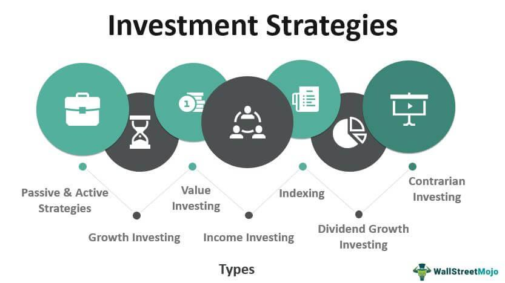

## Table of Contents

## What are the basic principles of investing for beginners?

Investing can seem scary at first, but it's really about putting your money to work so it can grow over time. One of the most important principles for beginners is to start early. The sooner you begin investing, the more time your money has to grow through something called compound interest. This means that not only does your initial investment earn money, but the earnings on that money earn money too. It's like a snowball that gets bigger as it rolls downhill. Another key principle is to understand your risk tolerance. This means knowing how much risk you're comfortable taking with your investments. Some investments, like stocks, can be riskier but might offer higher returns, while others, like bonds, are safer but usually grow more slowly.

Another principle to keep in mind is diversification. This means spreading your money across different types of investments to reduce risk. If one investment doesn't do well, others might still perform okay, balancing things out. A simple way to diversify is by investing in mutual funds or exchange-traded funds (ETFs), which hold a mix of different investments. Finally, it's important to have a clear goal for your investments. Are you saving for a house, retirement, or something else? Knowing your goal helps you decide how long you can keep your money invested and what kinds of investments might be best for you. By following these basic principles, you can start investing with more confidence and set yourself up for long-term financial growth.

## How do different investment vehicles like stocks, bonds, and mutual funds work?

Stocks are like tiny pieces of a company. When you buy a stock, you own a small part of that company. If the company does well, the value of your stock can go up, and you might make money. But if the company doesn't do well, the value can go down, and you could lose money. Stocks can also pay dividends, which are like little bonuses the company gives to its shareholders. Stocks are considered riskier because their value can change a lot, but they also have the potential for big returns.

Bonds are like loans you give to a company or the government. When you buy a bond, you're lending money to the issuer, and in return, they promise to pay you back with interest over time. Bonds are usually safer than stocks because they have a set schedule for when you'll get your money back, and the interest payments are predictable. But the returns on bonds are generally lower than what you might get from stocks. They're a good choice if you want something more stable in your investment mix.

Mutual funds are like baskets that hold a bunch of different investments, like stocks and bonds, all mixed together. When you buy into a mutual fund, you're buying a piece of that whole basket. This helps spread out your risk because if one investment in the basket doesn't do well, the others might still be okay. Mutual funds are managed by professionals who decide what goes into the basket, and you pay a fee for their services. They're a good way for beginners to invest because they offer diversification without having to pick individual stocks or bonds yourself.

## What are the key differences between saving and investing?

Saving and investing are two different ways to use your money, and they have different goals. Saving means putting money aside in a safe place, like a savings account or a money market account. The main goal of saving is to keep your money secure and easily available when you need it. Savings accounts usually don't earn much interest, but they're very safe because your money is protected by the bank or the government. Saving is great for short-term goals, like buying a new phone or saving for an emergency fund.

Investing, on the other hand, means using your money to buy things that you hope will grow in value over time, like stocks, bonds, or real estate. The main goal of investing is to grow your money over the long term. Investing can be riskier than saving because the value of your investments can go up or down. But if you invest wisely, you might earn more money than you would from a savings account. Investing is better for long-term goals, like saving for retirement or buying a house in the future.

In simple terms, saving is about keeping your money safe and accessible for the short term, while investing is about growing your money over the long term, even though it comes with more risk. Both are important parts of managing your money, and a good financial plan often includes both saving and investing.

## How can one start investing with a small amount of money?

Starting to invest with a small amount of money is easier than you might think. One of the best ways to begin is by using a robo-advisor. These are online services that use computer programs to help you invest your money. They often let you start with just a little bit of money, sometimes as low as $100. Robo-advisors will ask you some questions about your goals and how much risk you're okay with, and then they'll pick a mix of investments for you. This is a great way to get started because it's simple and doesn't cost a lot.

Another way to start investing with a small amount is by using apps that let you buy pieces of stocks, called fractional shares. Some apps let you invest with as little as $1. This means you can buy a small part of a stock instead of having to buy a whole one, which can be expensive. These apps are easy to use and can help you learn about investing while you're doing it. By starting small and using these tools, you can begin to grow your money over time, even if you don't have a lot to start with.

## What are the risks associated with various investment types?

Investing in stocks can be risky because their value can go up and down a lot. If a company does well, the price of its stock can go up, and you might make money. But if the company has problems, the stock price can drop, and you could lose money. Stocks are also affected by things like the economy and world events, which can make them even more unpredictable. If you put all your money into one stock and it doesn't do well, you could lose a lot. That's why it's important to spread your money across different stocks to lower your risk.

Bonds are usually safer than stocks, but they still have risks. One risk is that the company or government you lend money to might not be able to pay you back. This is called default risk. Another risk is [interest rate](/wiki/interest-rate-trading-strategies) risk. If interest rates go up, the value of your bond can go down because new bonds will pay more interest. Bonds usually don't grow as fast as stocks, so if you need your money to grow a lot, they might not be the best choice. But they can help balance out the risk in your investment mix.

Mutual funds and ETFs spread your money across many different investments, which can lower your risk. But they still have risks. The value of the stocks and bonds in the fund can go up and down, affecting the value of your investment. You also have to pay fees to the people who manage the fund, which can eat into your returns. And if the fund is focused on one type of investment, like tech stocks, it might not be as diversified as you think. So, even though mutual funds and ETFs can help manage risk, they're not completely safe.

## How does diversification help in managing investment risks?

Diversification means spreading your money across different types of investments. It's like not putting all your eggs in one basket. If you invest all your money in one stock and that stock goes down, you could lose a lot. But if you spread your money across many stocks, some might go down, but others might go up. This can help balance out the ups and downs, so you don't lose as much money if one investment does badly.

By diversifying, you're not relying on just one thing to make your money grow. You can invest in different kinds of things, like stocks, bonds, and real estate. Each type of investment has its own risks and rewards. When you mix them together, the overall risk goes down because the different investments don't usually go up and down at the same time. This way, you have a better chance of keeping your money safe and still making it grow over time.

## What are some common investment strategies for intermediate investors?

Intermediate investors often use a strategy called dollar-cost averaging. This means they put a fixed amount of money into their investments at regular times, like every month. By doing this, they buy more shares when prices are low and fewer when prices are high. Over time, this can help them pay less on average for their investments and reduce the risk of putting all their money in at the wrong time. It's a good way to keep investing without worrying too much about the ups and downs of the market.

Another common strategy is asset allocation. This means deciding how to split your money between different types of investments, like stocks, bonds, and cash. The idea is to match your investments with your goals and how much risk you're okay with. For example, if you're saving for retirement that's far away, you might put more money in stocks because they can grow a lot over time. But if you need the money sooner, you might put more in bonds because they're safer. By balancing your investments this way, you can aim for growth while also keeping some of your money safe.

Rebalancing is also important for intermediate investors. This means checking your investments from time to time and making sure they still match your plan. If one type of investment has grown a lot, it might be a bigger part of your portfolio than you want. Rebalancing means selling some of that investment and buying more of the others to get back to your original plan. This helps keep your risk level where you want it and can help you stick to your long-term goals.

## How do economic indicators affect investment decisions?

Economic indicators are like signs that tell us how the economy is doing. They can help investors decide where to put their money. For example, if the unemployment rate is low, it usually means more people have jobs and are spending money. This can be good for companies, so their stocks might go up. On the other hand, if inflation is high, it means prices are going up fast, which can make people spend less. This might hurt companies, so their stocks could go down. By watching these indicators, investors can guess which investments might do well or badly.

Another important economic indicator is the interest rate set by the central bank. If interest rates go up, borrowing money becomes more expensive. This can slow down the economy because people and companies might borrow less. It can also make bonds more attractive because they pay more interest. But if interest rates go down, borrowing becomes cheaper, which can help the economy grow. Stocks might do better because companies can borrow more easily to grow their business. By paying attention to these indicators, investors can adjust their plans to take advantage of what's happening in the economy.

## What role does asset allocation play in an investment portfolio?

Asset allocation is like deciding how to split your money between different types of investments, like stocks, bonds, and cash. It's important because it helps you match your investments with your goals and how much risk you're okay with. If you're saving for something far away, like retirement, you might put more money in stocks because they can grow a lot over time. But if you need the money sooner, you might put more in bonds because they're safer. By balancing your investments this way, you can aim for growth while also keeping some of your money safe.

Changing your asset allocation over time is also important. As you get closer to needing your money, you might want to move some of it from stocks to bonds to lower your risk. This is called rebalancing. It helps keep your investments in line with your plan and can help you stick to your long-term goals. By paying attention to your asset allocation, you can make sure your money is working hard for you in the right way.

## How can one use tax-advantaged accounts to optimize investment returns?

Tax-advantaged accounts are special accounts that can help you keep more of your investment earnings by reducing the taxes you pay. One common type is a retirement account like a 401(k) or an IRA. When you put money into these accounts, you might get a tax break right away, which means you pay less tax on the money you earn that year. Plus, the money in these accounts can grow without being taxed until you take it out, usually when you retire. This can make a big difference over time because you keep more of your investment earnings.

Another type of tax-advantaged account is a Health Savings Account (HSA) or a 529 plan for education. HSAs let you save money for medical expenses and get a tax break on your contributions, the growth of your investments, and when you take the money out for medical costs. 529 plans are for saving for college, and they offer tax-free growth and withdrawals if you use the money for education. By using these accounts wisely, you can save on taxes and let your investments grow more, helping you reach your financial goals faster.

## What advanced strategies like options trading and hedge funds entail?

Options trading is a way to bet on whether a stock will go up or down without actually buying the stock. When you buy an option, you're buying the right to buy or sell a stock at a certain price before a certain date. It's like a bet. If you think a stock will go up, you can buy a "call" option, which lets you buy the stock at a lower price later. If you think it will go down, you can buy a "put" option, which lets you sell the stock at a higher price later. Options can be risky because you can lose all the money you put in if the stock doesn't move the way you thought it would. But they can also help you make a lot of money if you're right. It's like playing a game where the stakes are high.

Hedge funds are like special clubs for rich people to invest their money. They use advanced strategies to try to make more money than regular investments. Hedge funds can do things like borrowing money to invest more, betting that stocks will go down, and using options and other complex tools. They're called "hedge" funds because they try to protect, or "hedge," against losses while still trying to make money. But hedge funds can be very risky and usually cost a lot in fees. They're not for everyone because you need a lot of money to join, and they're not as easy to understand as regular investments.

## How do global market trends influence investment strategies for expert investors?

Global market trends are like big waves that can push and pull the value of investments around the world. Expert investors pay close attention to these trends because they can help them decide where to put their money. For example, if a trend shows that technology companies are doing well everywhere, an expert might invest more in tech stocks. On the other hand, if there's a trend showing that a certain country's economy is slowing down, they might pull their money out of investments in that country. By watching these trends, expert investors can try to make more money and avoid big losses.

Another way global market trends influence expert investors is by changing how they spread their money across different types of investments. If a trend shows that interest rates are going up in many countries, experts might move more money into bonds because they'll pay more interest. Or if a trend shows that a certain industry, like renewable energy, is growing fast around the world, they might invest more in that industry. By adjusting their investments based on these trends, expert investors can try to take advantage of what's happening in the global market and make smarter choices about where to put their money.

## References & Further Reading

[1]: Bergstra, J., Bardenet, R., Bengio, Y., & Kégl, B. (2011). ["Algorithms for Hyper-Parameter Optimization."](https://papers.nips.cc/paper/4443-algorithms-for-hyper-parameter-optimization) Advances in Neural Information Processing Systems 24.

[2]: ["Advances in Financial Machine Learning"](https://www.amazon.com/Advances-Financial-Machine-Learning-Marcos/dp/1119482089) by Marcos Lopez de Prado

[3]: ["Evidence-Based Technical Analysis: Applying the Scientific Method and Statistical Inference to Trading Signals"](https://www.amazon.com/Evidence-Based-Technical-Analysis-Scientific-Statistical/dp/0470008741) by David Aronson

[4]: ["Machine Learning for Algorithmic Trading"](https://github.com/stefan-jansen/machine-learning-for-trading) by Stefan Jansen

[5]: ["Quantitative Trading: How to Build Your Own Algorithmic Trading Business"](https://www.amazon.com/Quantitative-Trading-Build-Algorithmic-Business/dp/1119800064) by Ernest P. Chan