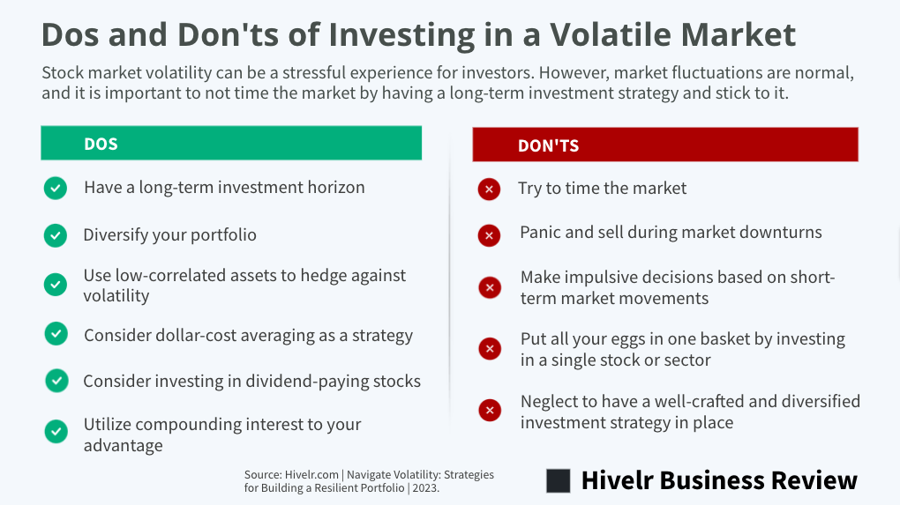

## Table of Contents

## What is a volatile market and how does it affect investments?

A volatile market is when the prices of stocks, bonds, or other investments go up and down a lot in a short time. It's like a roller coaster ride for the prices. This can happen because of many reasons, like big news events, changes in the economy, or even just because a lot of people are buying and selling at the same time.

When the market is volatile, it can be risky for people who have invested their money. If the prices drop suddenly, the value of their investments can go down a lot, and they might lose money. But, it's not all bad. Some people like to buy investments when the prices are low and then sell them when the prices go up again. So, while a volatile market can be scary, it can also be a chance to make money if you know what you're doing.

## What are the basic principles of investing in volatile markets for beginners?

Investing in volatile markets can be tricky, but there are some basic principles that can help beginners. First, it's important to understand that volatility means prices can change a lot and quickly. This can be scary, but it's also a chance to buy things when they're cheaper and sell them when they go up. The key is to stay calm and not make quick decisions based on fear or excitement. Instead, think about the long term and what you believe will happen in the future.

Another principle is to spread your money around. This is called diversification. Instead of putting all your money into one thing, you can invest in different types of things, like stocks, bonds, or even real estate. This way, if one thing goes down, you won't lose all your money. It's like not putting all your eggs in one basket. Diversification can help you manage the risk that comes with a volatile market.

Lastly, it's good to have a plan and stick to it. Decide how much risk you're okay with and what your goals are. Then, make a plan that matches those things. If the market gets wild, don't change your plan just because you're scared or excited. Stick to your plan and keep your eyes on your long-term goals. This can help you make better decisions and stay on track, even when the market is all over the place.

## How can diversification help manage risk in volatile markets?

Diversification helps manage risk in volatile markets by spreading your investments across different types of assets. Instead of putting all your money into one stock or one type of investment, you can invest in a mix of stocks, bonds, real estate, and maybe even some other things like commodities. This way, if one type of investment goes down in value because of the volatile market, the other investments might not go down as much or might even go up. It's like not putting all your eggs in one basket. If one egg breaks, you still have others that are safe.

By having a diverse portfolio, you can reduce the impact of big swings in the market on your overall investments. For example, if the stock market has a big drop, your bonds or real estate investments might stay steady or even increase in value. This balance can help cushion the blow and keep your investments from losing too much value all at once. Over time, this can lead to more stable returns and less stress, even when the market is acting wild.

## What role do stop-loss orders play in a volatile market strategy?

Stop-loss orders are a tool that can help you manage risk in a volatile market. They work by setting a specific price at which you want to sell your investment if it starts to drop. This way, you can limit how much money you might lose if the market goes down a lot. For example, if you buy a stock at $50 and set a stop-loss order at $45, the stock will automatically be sold if it hits $45, helping you avoid bigger losses if it keeps going down.

Using stop-loss orders can be really helpful in a volatile market because prices can change a lot and very quickly. By setting a stop-loss order, you can protect yourself from big drops without having to watch the market all the time. However, it's important to remember that stop-loss orders aren't perfect. Sometimes, the market can move so fast that your order might get filled at a lower price than you set, or the price might drop and then go back up right away, and you might miss out on gains. So, while stop-loss orders can be a good part of your strategy, they should be used carefully and with a clear understanding of how they work.

## How can dollar-cost averaging be used effectively during market volatility?

Dollar-cost averaging is a way to invest money over time, instead of all at once. It means you put the same amount of money into an investment regularly, like every month. This can be really helpful in a volatile market because you don't have to worry about [picking](/wiki/asset-class-picking) the perfect time to invest. When the market is up, your money buys fewer shares, but when the market is down, your money buys more shares. Over time, this can help you pay less on average for your investments.

Using dollar-cost averaging during market [volatility](/wiki/volatility-trading-strategies) can take away some of the stress of investing. Instead of trying to guess when the market will go up or down, you just keep investing the same amount regularly. This way, you're not putting all your money in at a high price, and you're not missing out on buying when the prices are low. It's a simple strategy that can help you build your investments steadily, even when the market is acting wild.

## What are the advantages and disadvantages of investing in defensive stocks during volatile times?

Defensive stocks are stocks from companies that make things people always need, like food, medicine, or utilities. When the market is volatile, these stocks can be a good choice because they tend to stay more stable. People still need to eat and use electricity no matter what the market is doing, so these companies usually keep making money. This can help protect your investments from big drops in value. Also, defensive stocks often pay regular dividends, which can give you some extra money even when the market is going up and down.

However, there are some downsides to investing in defensive stocks during volatile times. They might not grow as fast as other stocks when the market is doing well. This means you could miss out on bigger gains if you put all your money into defensive stocks. Also, even though they are more stable, they can still go down in value if the whole market takes a big hit. So, while defensive stocks can be a safer choice, they might not give you the big returns you're looking for, and they're not completely safe from market swings.

## How do options and futures serve as tools for hedging in volatile markets?

Options and futures are like insurance policies for your investments in a volatile market. They let you protect yourself from big price swings. An option gives you the right, but not the obligation, to buy or sell an asset at a certain price before a certain time. If the market goes down a lot, you can use an option to sell your investment at a higher price than it's currently worth, which can help limit your losses. Futures, on the other hand, are agreements to buy or sell something at a set price on a future date. They can help you lock in prices now, so you know what you'll be paying or getting later, even if the market goes crazy.

Both options and futures can be useful tools for managing risk, but they can be a bit tricky to understand and use. You need to know how they work and what you're doing, because they can be risky too. If you use them the wrong way, you could end up losing more money instead of protecting yourself. It's a good idea to learn about them or talk to a financial advisor before using them in your investment strategy. This way, you can make sure you're using them to help you, not hurt you, when the market is volatile.

## What advanced technical analysis techniques can be used to predict market volatility?

Technical analysis is a way to look at past market data to try and guess what will happen next. One advanced technique is using Bollinger Bands. These are lines drawn on a price chart that show how much the price of something has been moving around. When the price gets close to the top or bottom of the Bollinger Bands, it might mean the market is about to get more volatile. Traders use this to get ready for big price swings. Another technique is the Average True Range (ATR), which measures how much the price of something changes over a certain time. A bigger ATR means the market is more volatile, so traders can use it to see if the market is getting wilder.

Another useful tool is the Volatility Index (VIX), which is sometimes called the "fear index." It measures how much people expect the market to move around in the future. When the VIX goes up, it means people are expecting more volatility, so it can be a warning sign for traders. There's also something called the Relative Strength Index (RSI), which shows if a stock or market is being bought or sold too much. If the RSI is very high or very low, it might mean the market is about to change direction, which can lead to more volatility. By using these tools together, traders can get a better idea of when the market might start moving a lot and plan their investments accordingly.

## How can an investor use volatility indexes like the VIX to inform their strategy?

The VIX, or Volatility Index, is like a thermometer for the stock market's fear level. It shows how much people expect the market to move around in the future. When the VIX goes up, it means people are worried and expect big changes in the market soon. This can be a warning sign for investors. If you see the VIX going up, you might want to be more careful with your investments. You could think about buying things that are less likely to lose a lot of value, like defensive stocks or bonds, to protect your money.

On the other hand, when the VIX is low, it means people think the market will stay calm. This might be a good time to take more risks and try to make bigger gains. You could invest in stocks that might grow a lot if the market stays stable. But remember, the VIX is just one tool, and it's not perfect. It's good to use it along with other information and not make big decisions based on it alone. By keeping an eye on the VIX, you can get a better sense of what the market might do next and adjust your strategy to stay safe or take advantage of opportunities.

## What are the key considerations for adjusting an investment portfolio during periods of high volatility?

When the market gets really volatile, it's important to think about how to keep your investments safe. One key thing to consider is your risk level. If the market is swinging a lot, you might want to move some of your money into safer investments, like bonds or defensive stocks. These are things that don't change in price as much and can help protect your money from big drops. Another thing to think about is your investment goals. If you're saving for something far in the future, you might be okay with more risk because you have time to recover from any losses. But if you need your money soon, you might want to be more careful and keep it in safer places.

It's also a good idea to spread your money around, which is called diversification. Instead of putting all your money into one thing, you can invest in different types of things. This way, if one thing goes down because of the volatile market, the other things might not go down as much or might even go up. This can help balance out your losses and keep your portfolio more stable. Finally, don't forget about your emotions. When the market is wild, it's easy to get scared and make quick decisions. But it's better to stick to your plan and not let fear or excitement make you change your strategy too much. By thinking about these things, you can make smart choices and keep your investments on track, even when the market is acting crazy.

## How can algorithmic trading strategies be optimized for volatile market conditions?

Algorithmic trading uses computer programs to buy and sell things in the market. When the market is volatile, these programs need to be set up to handle big price swings. One way to do this is by using a strategy called "mean reversion." This means the program looks for times when the price of something goes way up or way down and then bets that it will go back to a more normal level. By doing this, the program can make money when the market is moving a lot. Another way is to use "[momentum](/wiki/momentum) trading," where the program buys things that are going up fast and sells things that are going down fast, hoping to ride the wave of the market's big moves.

It's also important to use something called "stop-loss orders" in the program. These are like safety nets that tell the computer to sell something if it drops to a certain price, so you don't lose too much money. The program can be set to watch the market all the time and adjust these stop-loss orders quickly to keep up with the fast changes. Also, using "volatility filters" can help. These filters tell the program to only trade when the market is moving a certain amount, so it doesn't make trades when things are too calm or too crazy. By setting up the program with these strategies, it can handle the ups and downs of a volatile market better and maybe even make more money.

## What are the latest research findings on behavioral finance and their implications for investment strategies in volatile markets?

Recent research in behavioral finance has shown that people often make emotional decisions when the market is volatile. They might sell their investments when prices go down because they're scared, even if it's not a good time to sell. This is called "loss aversion." Another finding is that people can get too excited and buy things when prices are going up a lot, which is called "herd behavior." These behaviors can lead to bad investment choices, like selling low and buying high. Understanding these patterns can help investors make better decisions. Instead of following their emotions, they can stick to a plan and think about the long term, which can lead to better results in a volatile market.

One important implication of these findings is that investors should try to be more aware of their emotions and not let them control their decisions. For example, using a strategy like dollar-cost averaging can help. This means putting the same amount of money into investments regularly, no matter what the market is doing. It can help take the emotion out of investing and make it easier to stick to a plan. Another implication is that having a diverse portfolio can help manage the risk of making emotional decisions. By spreading money across different types of investments, investors can feel more secure and less likely to panic and sell everything when the market gets wild.

## How can algo trading be integrated with long-term strategies?

Integrating [algorithmic trading](/wiki/algorithmic-trading) within a long-term investment strategy involves leveraging technology to make informed decisions based on quantitative data. This approach optimizes decision-making by implementing systematic, rule-based strategies, thereby mitigating emotional biases and enhancing consistency in execution. Algorithmic trading provides the capability to automate complex strategies that balance portfolio risks and returns effectively.

### Key Strategies

1. **Mean Reversion**: Mean reversion strategies assume that asset prices will revert to their historical mean over time. This strategy identifies overbought or oversold conditions and initiates trades accordingly. Automation of this strategy allows for rapid identification and exploitation of mean-reverting opportunities without constant human supervision.

   Example: Implementing a simple mean reversion strategy in Python might involve calculating the z-score of a stock's closing prices and executing buy or sell orders based on thresholds.

   ```python
   import pandas as pd
   import numpy as np

   def mean_reversion_strategy(data, window=20, threshold=1):
       data['Moving Average'] = data['Close'].rolling(window=window).mean()
       data['Std Deviation'] = data['Close'].rolling(window=window).std()
       data['Z-score'] = (data['Close'] - data['Moving Average']) / data['Std Deviation']

       data['Signal'] = np.where(data['Z-score'] > threshold, -1, np.nan)
       data['Signal'] = np.where(data['Z-score'] < -threshold, 1, data['Signal'])

       return data['Signal']
   ```

2. **Trend Following**: This strategy seeks to capitalize on market momentum by buying assets in an uptrend and selling those in a downtrend. Trend-following algorithms track price movements and use tools like moving averages to facilitate entry and exit points.

   Example: A simple trend-following strategy may involve buying when the short-term moving average crosses above the long-term moving average and selling when the opposite occurs.

3. **Risk Parity**: Risk parity focuses on allocating portfolio risk evenly across various asset classes, rather than capital. Algorithmic trading facilitates the dynamic rebalancing of portfolios to maintain the desired risk levels, especially amid changing market volatilities.

### Importance of Financial Ratios

**Sharpe Ratio**: The Sharpe Ratio measures the excess return per unit of risk. It is calculated as:

$$
\text{Sharpe Ratio} = \frac{R_p - R_f}{\sigma_p}
$$

where $R_p$ is the return of the portfolio, $R_f$ is the risk-free rate, and $\sigma_p$ is the standard deviation of the portfolio's excess return. Algorithmic trading can enhance Sharpe Ratio by optimizing asset allocation to achieve higher risk-adjusted returns.

**Sortino Ratio**: Unlike the Sharpe Ratio, the Sortino Ratio differentiates harmful volatility (downside risk) from total volatility by considering only negative deviations. It is expressed as:

$$
\text{Sortino Ratio} = \frac{R_p - R_f}{\sigma_d}
$$

where $\sigma_d$ is the standard deviation of negative asset returns.

**Information Ratio**: This ratio measures portfolio returns above the returns of a benchmark, divided by the tracking error. It is useful for assessing the consistency of returns relative to a benchmark:

$$
\text{Information Ratio} = \frac{R_p - R_b}{\text{Tracking Error}}
$$

where $R_b$ is the return of the benchmark portfolio. Algorithmic trading enables systematic improvement of these ratios by fine-tuning strategies to minimize deviations and enhance performance predictability.

By incorporating these quantitative measures with algorithmic trading strategies, investors can create robust frameworks that respond adeptly to market dynamics, achieving superior long-term growth and stability in their investment portfolios.

## References & Further Reading

[1]: [Bergstra, J., Bardenet, R., Bengio, Y., & Kégl, B. (2011). "Algorithms for Hyper-Parameter Optimization."](https://dl.acm.org/doi/10.5555/2986459.2986743) Advances in Neural Information Processing Systems 24.

[2]: ["Advances in Financial Machine Learning"](https://www.amazon.com/Advances-Financial-Machine-Learning-Marcos/dp/1119482089) by Marcos Lopez de Prado

[3]: ["Evidence-Based Technical Analysis: Applying the Scientific Method and Statistical Inference to Trading Signals"](https://www.amazon.com/Evidence-Based-Technical-Analysis-Scientific-Statistical/dp/0470008741) by David Aronson

[4]: ["Machine Learning for Algorithmic Trading"](https://github.com/stefan-jansen/machine-learning-for-trading) by Stefan Jansen

[5]: ["Quantitative Trading: How to Build Your Own Algorithmic Trading Business"](https://github.com/LucindaYa/quant-resources/blob/master/Quantitative%20Trading%20How%20to%20Build%20Your%20Own%20Algorithmic%20Trading%20Business.pdf) by Ernest P. Chan