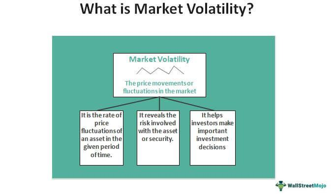

The financial landscape is a dynamic ecosystem characterized by continuous evolution and susceptibility to various market forces that often lead to volatility. Volatility in financial markets can pose significant challenges to investors, necessitating a strategic approach to achieve stability and consistent returns. In environments where price swings are common, adopting long-term investment strategies becomes essential. These strategies enable investors to focus on the overall trajectory of asset growth rather than being swayed by short-term market fluctuations.

In recent times, algorithmic trading has gained prominence as a pivotal tool in modern finance. Algorithmic trading involves the use of computer algorithms to automate the process of trading activities. This technological advancement has introduced new dimensions to how investors can strategize and manage portfolios. It offers the potential to execute trades with increased speed and precision while minimizing human error and emotional biases. The integration of algorithmic trading within long-term investment frameworks provides investors with robust methodologies to navigate volatile markets more effectively.



This article explores the intersection of long-term investment strategies and volatile markets, emphasizing the importance of algorithmic trading's role in contemporary finance. The focus is on providing insights to assist investors in making well-informed decisions amidst uncertainty. By understanding and harnessing the capabilities of technology-driven solutions, investors can better manage their portfolios, mitigating risks, and enhancing returns even in challenging market conditions. As such, leveraging the synergy between strategic long-term investments and algorithmic trading can be pivotal in achieving financial goals regardless of prevailing market volatility.

## Table of Contents

## Understanding Market Volatility

Market volatility refers to the frequency and extent of price fluctuations in the financial markets over a certain period. It is often depicted through rapid and unpredictable changes in the price of securities, creating an environment of uncertainty for investors. Volatility can occur in any asset class, including stocks, commodities, and currencies, and is both a potential opportunity and risk [factor](/wiki/factor-investing) in investment strategies.

Several factors can trigger market volatility:

1. **Economic Releases**: Macroeconomic indicators such as GDP growth, unemployment rates, and consumer spending affect market perceptions and can lead to price movements. For instance, a lower-than-expected unemployment figure may signal economic strength, leading to bullish market behavior.

2. **Earnings Reports**: Quarterly earnings announcements can create spikes in volatility as they provide insights into a company's financial health and future prospects. Positive earnings surprises can lead to significant upward price movements, whereas earnings disappointments can have the opposite effect.

3. **Geopolitical Events**: Events such as elections, wars, and international trade agreements can cause abrupt changes in investor sentiment and market prices. Geopolitical tensions can dramatically influence markets by creating uncertainty or reconfiguring global trade dynamics.

4. **Market Sentiment**: Investors' perceptions and emotions play a vital role in how markets behave. Sudden shifts in sentiment—often influenced by news cycles, analyst recommendations, or public events—can lead to increased buying or selling activity, contributing to volatility.

Accurately measuring and comprehending [volatility](/wiki/volatility-trading-strategies) is crucial for investors seeking to manage risks effectively. One popular metric for gauging market volatility is the **VIX index** (Volatility Index), which reflects the market's expectation of 30-day forward volatility derived from S&P 500 index options. A high VIX value indicates elevated uncertainty or risk, while a lower value suggests a calmer market environment.

Investors can use volatility metrics to inform their strategies by adopting several approaches:

- **Hedging**: Incorporating options or derivatives to protect against potential losses from adverse price movements in their portfolios.
- **Strategic Allocation**: Adjusting asset allocations based on expected volatility to optimize risk and return profiles.
- **Algorithmic Adjustments**: Applying algorithmic trading systems that react to volatility indicators by reallocating asset holdings or modifying trading frequencies based on predefined rules.

By understanding the intricacies of market volatility and the factors that influence it, investors can better navigate the complexities of financial markets, potentially enhancing their investment returns while mitigating associated risks. Tools and strategies that account for volatility not only safeguard investment portfolios but also provide strategic opportunities for capitalizing on price fluctuations.

## Long-Term Investing in Volatile Markets

Long-term investing provides a counterbalance to the erratic nature of volatile markets, prioritizing sustainable growth over immediate gains. By anchoring investment strategies in a long-term perspective, investors can navigate market turbulence with a focus on enduring value rather than transient price shifts.

### Buy-and-Hold Strategy

A buy-and-hold strategy involves purchasing securities and retaining them for an extended period, regardless of market fluctuations. This method capitalizes on the general upward trajectory of markets over time, leveraging compounding returns and minimizing transaction costs associated with frequent trading. By holding onto investments through various market cycles, investors can potentially ride out short-term volatility and benefit from the eventual appreciation in asset values.

### Portfolio Diversification

Diversification is a foundational principle in long-term investing, aiming to reduce risk by spreading investments across various asset classes, sectors, and geographical regions. A well-diversified portfolio can mitigate the impact of volatility, as declines in some investments may be offset by gains in others. Techniques such as the Modern Portfolio Theory (MPT) inform diversification strategies, optimizing portfolio returns for a given level of risk.

### Disciplined Investment Approach

Maintaining discipline is crucial for long-term investors, particularly in volatile markets where emotional reactions can lead to impulsive decisions. By adhering to a well-defined investment plan and resisting the urge to react to short-term market movements, investors can ensure consistency in strategy. Implementing systematic investment plans (SIPs) is one way to instill discipline, as it involves regularly investing a fixed amount regardless of market conditions, thus taking advantage of dollar-cost averaging.

### Focus on Fundamentals

Long-term investors can sustain and grow their portfolios during volatile periods by concentrating on investments with strong fundamentals. This involves analyzing financial indicators such as earnings growth, return on equity (ROE), and debt-to-equity ratios. Investments backed by robust financials and resilient business models are more likely to weather economic downturns and bounce back in recovery phases.

### Emphasis on Consistent Earnings

Consistent earnings are a hallmark of reliable investments, offering stability and potential for growth even in uncertain markets. Companies with steady earnings streams often exhibit robust business operations, capable of withstanding market disruptions. Investors may look for assets with a history of dividend growth or stable cash flows, which can provide income and signal a company's financial health.

In conclusion, while market volatility poses challenges for investors, adopting a long-term perspective grounded in [fundamental analysis](/wiki/fundamental-analysis), strategic diversification, and disciplined investing can enhance portfolio resilience. By prioritizing sustained growth and minimizing reactive trading, investors can better navigate the complexities of volatile markets.

## Algorithmic Trading: A Game Changer

Algorithmic trading, commonly referred to as algo trading, revolutionizes the way financial markets operate by utilizing computer algorithms to automate trading processes. This technological advancement enables execution of trades at unparalleled speed, optimizing returns while minimizing human error, which inherently biases trading decisions. Through sophisticated coding and data analysis, algorithms replicate traditional trading strategies and execute them with precision and efficiency.

Historically, [algorithmic trading](/wiki/algorithmic-trading) has been synonymous with short-term strategies, capitalizing on market inefficiencies and rapid price movements that offer fleeting opportunities for profit. However, its application extends beyond these confines and can be harmoniously integrated into long-term investment frameworks. By systematically analyzing extensive datasets, algorithms can identify trends and patterns that inform strategic decision-making over an extended period. This capability allows investors to position their portfolios proactively, adapting to market dynamics in real time.

The essence of algo trading lies in its ability to process large volumes of financial data and execute pre-defined instructions that may otherwise be arduous and time-consuming when performed manually. Algorithms can incorporate diverse variables such as asset prices, volumes, volatility, and time intervals, allowing for a multifaceted approach to trading. Mathematical models underpin many algorithmic strategies, enabling complex calculations and simulations to predict potential outcomes and optimize portfolio allocation.

For example, a common algorithmic strategy is statistical [arbitrage](/wiki/arbitrage), which involves constructing a market-neutral portfolio to exploit pricing discrepancies between related financial instruments. This approach requires extensive computational resources to analyze historical pricing data, compute statistical measures like z-scores, and time trades effectively to capitalize on these anomalies.

```python
import numpy as np
from scipy.stats import zscore

def identify_arbitrage_opportunities(prices):
    z_scores = zscore(prices)
    return np.where(np.abs(z_scores) > 2)  # Identifies significant deviations from the mean

prices = np.array([100, 102, 101, 103, 99, 98, 97])  # Example price data
arbitrage_opps = identify_arbitrage_opportunities(prices)
print("Arbitrage opportunities at indices:", arbitrage_opps)
```

Additionally, algorithms enhance long-term strategies such as [trend following](/wiki/trend-following), by continuously monitoring market signals and adjusting positions based on quantitative metrics. This adaptability not only maintains the strategy's alignment with prevailing market conditions but also protects the portfolio from adverse movements.

In conclusion, while algorithmic trading's origins lie in exploiting short-term market inefficiencies, its integration into long-term investment strategies demonstrates its versatility and transformative potential. By harnessing the power of technology, investors can efficiently analyze and respond to complex market data, aligning their portfolios with evolving market trends and ultimately enhancing overall investment outcomes.

## Integrating Algo Trading with Long-Term Strategies

Integrating algorithmic trading within a long-term investment strategy involves leveraging technology to make informed decisions based on quantitative data. This approach optimizes decision-making by implementing systematic, rule-based strategies, thereby mitigating emotional biases and enhancing consistency in execution. Algorithmic trading provides the capability to automate complex strategies that balance portfolio risks and returns effectively.

### Key Strategies

1. **Mean Reversion**: Mean reversion strategies assume that asset prices will revert to their historical mean over time. This strategy identifies overbought or oversold conditions and initiates trades accordingly. Automation of this strategy allows for rapid identification and exploitation of mean-reverting opportunities without constant human supervision.

   Example: Implementing a simple mean reversion strategy in Python might involve calculating the z-score of a stock's closing prices and executing buy or sell orders based on thresholds.

   ```python
   import pandas as pd
   import numpy as np

   def mean_reversion_strategy(data, window=20, threshold=1):
       data['Moving Average'] = data['Close'].rolling(window=window).mean()
       data['Std Deviation'] = data['Close'].rolling(window=window).std()
       data['Z-score'] = (data['Close'] - data['Moving Average']) / data['Std Deviation']

       data['Signal'] = np.where(data['Z-score'] > threshold, -1, np.nan)
       data['Signal'] = np.where(data['Z-score'] < -threshold, 1, data['Signal'])

       return data['Signal']
   ```

2. **Trend Following**: This strategy seeks to capitalize on market momentum by buying assets in an uptrend and selling those in a downtrend. Trend-following algorithms track price movements and use tools like moving averages to facilitate entry and exit points.

   Example: A simple trend-following strategy may involve buying when the short-term moving average crosses above the long-term moving average and selling when the opposite occurs.

3. **Risk Parity**: Risk parity focuses on allocating portfolio risk evenly across various asset classes, rather than capital. Algorithmic trading facilitates the dynamic rebalancing of portfolios to maintain the desired risk levels, especially amid changing market volatilities.

### Importance of Financial Ratios

**Sharpe Ratio**: The Sharpe Ratio measures the excess return per unit of risk. It is calculated as:

$$
\text{Sharpe Ratio} = \frac{R_p - R_f}{\sigma_p}
$$

where $R_p$ is the return of the portfolio, $R_f$ is the risk-free rate, and $\sigma_p$ is the standard deviation of the portfolio's excess return. Algorithmic trading can enhance Sharpe Ratio by optimizing asset allocation to achieve higher risk-adjusted returns.

**Sortino Ratio**: Unlike the Sharpe Ratio, the Sortino Ratio differentiates harmful volatility (downside risk) from total volatility by considering only negative deviations. It is expressed as:

$$
\text{Sortino Ratio} = \frac{R_p - R_f}{\sigma_d}
$$

where $\sigma_d$ is the standard deviation of negative asset returns.

**Information Ratio**: This ratio measures portfolio returns above the returns of a benchmark, divided by the tracking error. It is useful for assessing the consistency of returns relative to a benchmark:

$$
\text{Information Ratio} = \frac{R_p - R_b}{\text{Tracking Error}}
$$

where $R_b$ is the return of the benchmark portfolio. Algorithmic trading enables systematic improvement of these ratios by fine-tuning strategies to minimize deviations and enhance performance predictability.

By incorporating these quantitative measures with algorithmic trading strategies, investors can create robust frameworks that respond adeptly to market dynamics, achieving superior long-term growth and stability in their investment portfolios.

## Managing Risks in Volatile Markets

Volatility can significantly affect investment returns, necessitating effective risk management strategies for long-term success. Investors can employ various techniques to navigate turbulent market conditions. 

Limit and stop-loss orders are vital tools in managing risk. Limit orders allow investors to set a specific price at which they are willing to buy or sell a security, ensuring they do not pay more or receive less than desired. Stop-loss orders automatically trigger the sale of a security when it reaches a predetermined price, limiting potential losses if the market moves unfavorably. Both orders provide a safeguard against excessive loss and help maintain discipline in volatile markets.

Portfolio diversification is another crucial strategy. By spreading investments across a range of assets, investors can reduce risk exposure. Diversification minimizes the impact of poor performance in any single asset class, as gains in other areas may offset losses. This approach is grounded in the principle that different asset classes often react differently to market developments.

Protective puts offer further risk mitigation by providing insurance against declines. A protective put involves purchasing a put option for a stock that an investor already owns. This strategy allows investors to hedge their holdings, as the put option increases in value when the underlying stock falls, thus offsetting losses.

Algorithmic trading systems can automate these risk management processes, ensuring timely execution and reducing potential losses. By employing predefined rules and instructions, algorithms can efficiently handle complex trading strategies. For instance, an algorithm can be programmed to automatically adjust stop-loss orders based on market conditions or execute trades across diverse assets to maintain portfolio balance.

Here's a sample Python snippet demonstrating an algorithm to automate stop-loss orders:

```python
class StopLossOrder:
    def __init__(self, initial_price, stop_loss_threshold):
        self.initial_price = initial_price
        self.stop_loss_threshold = stop_loss_threshold
        self.stop_loss_price = initial_price * (1 - stop_loss_threshold)

    def check_stop_loss(self, current_price):
        if current_price <= self.stop_loss_price:
            return True  # Trigger stop-loss sell order
        return False

# Example usage
initial_price = 100
stop_loss_threshold = 0.05  # 5% stop-loss
current_price = 94

order = StopLossOrder(initial_price, stop_loss_threshold)
if order.check_stop_loss(current_price):
    print("Stop-loss order triggered. Sell the security.")
```

Algorithmic trading not only facilitates risk management through tools like limit orders and protective puts but also enhances portfolio strategies by executing trades based on quantitative data and models. This ensures that trades are made objectively, devoid of emotional bias, thus aligning closely with pre-set strategic goals. As a result, investors can more confidently navigate volatile markets, optimizing their portfolios for long-term stability and growth.

## The Pitfalls and Benefits of Algo Trading

Algorithmic trading, known for its potential to transform trading efficiency and decision-making accuracy, poses both benefits and challenges. Implementation of such systems requires careful consideration of the technological and strategic factors that influence their performance.

### Pitfalls of Algorithmic Trading

1. **Technical Glitches:** Algorithmic systems are susceptible to technical malfunctions, which can lead to significant financial losses. For instance, a coding error or server downtime can result in unintended trades. Regular system audits and fail-safes can mitigate these risks.

2. **Latency Issues:** The speed of executing trades is critical in algorithmic trading. Latency, the delay between the trade signal and execution, can result in suboptimal entry or exit points, impacting profits. Strategies like co-location and the use of optimized algorithms can help minimize latency effects.

3. **Over-reliance on Historical Data:** Algorithms generally rely on historical data to predict future market trends. However, past performance may not always accurately indicate future results, especially in volatile or unprecedented market conditions. It is crucial to continuously update models with real-time data to maintain their relevance.

4. **Market Impact:** Large orders executed too quickly may inadvertently move the market, affecting the trade's profitability. Algorithms should be designed to detect and adapt to current market liquidity to minimize market impact.

### Benefits of Algorithmic Trading

Despite these pitfalls, the advantages of algorithmic trading are compelling:

1. **Increased Efficiency:** Algorithms can process vast amounts of data rapidly, identifying opportunities and executing trades faster than human traders. This efficiency is crucial in capitalizing on short-term market inefficiencies.

2. **Reduced Emotional Bias:** Trading decisions made by algorithms are based on pre-defined criteria, eliminating the emotional biases that often hinder human traders. This consistency helps maintain the integrity of trading strategies.

3. **Enhanced Decision-Making:** Models can incorporate multiple data streams and analytical techniques, enabling more informed and precise decision-making. The utilization of machine learning can further refine these models, allowing them to adapt over time.

### Optimizing Algorithmic Trading

To harness the benefits while minimizing risks, consider the following strategies:

- **Robust Strategy Development:** Focus on developing strategies that incorporate risk management techniques like stop-loss orders to automatically limit losses.

- **Continuous Monitoring and Adaptation:** Regularly monitor algorithm performance and make necessary adjustments to adapt to changing market conditions. Implementing real-time analytics can aid in this process.

- **Simulation and Backtesting:** Before live deployment, rigorously backtest algorithms using historical data and simulate trades to evaluate potential outcomes.

- **Diversification of Strategies:** Employing a variety of algorithms that target different market conditions can spread risk and increase the likelihood of success.

By effectively balancing these considerations, algorithmic trading can serve as a powerful tool for navigating complex financial markets.

## The Future of Investing in Volatile Markets

As financial markets continue to evolve, technology and innovation are becoming integral to shaping investment strategies. The integration of [machine learning](/wiki/machine-learning) (ML) and [artificial intelligence](/wiki/ai-artificial-intelligence) (AI) with algorithmic trading systems holds the promise of enhancing predictive capabilities and refining investment decisions.

Machine learning algorithms, particularly [deep learning](/wiki/deep-learning) models, are proving invaluable in analyzing large volumes of financial data to identify patterns and trends that may not be immediately evident through traditional analysis. By learning from historical market data, these algorithms can generate predictive insights, aiding traders in anticipating future market movements. For example, [reinforcement learning](/wiki/reinforcement-learning)—a type of ML—can be employed to optimize trading strategies by continuously learning from the outcomes of each executed trade.

AI's capacity for sentiment analysis also provides traders with the ability to gauge market sentiment effectively. By analyzing newsfeeds, social media, and other textual data, AI models can quantify the market's mood towards specific securities or the broader economy, offering another layer of data to inform trading decisions.

Consider the following Python example utilizing a simple machine learning model to predict stock price movement based on historical data and sentiment analysis:

```python
import pandas as pd
from sklearn.model_selection import train_test_split
from sklearn.ensemble import RandomForestClassifier
from sklearn.metrics import accuracy_score

# Load historical stock data
stock_data = pd.read_csv('historical_stock_data.csv')

# Load sentiment analysis scores
sentiment_data = pd.read_csv('sentiment_scores.csv')

# Merge datasets on date
data = pd.merge(stock_data, sentiment_data, on='date')

# Features and target variable
X = data[['open', 'high', 'low', 'close', '[volume](/wiki/volume-trading-strategy)', 'sentiment_score']]
y = data['price_movement']  # Assume binary classification: up or down

# Train-test split
X_train, X_test, y_train, y_test = train_test_split(X, y, test_size=0.2, random_state=42)

# Random forest classifier
model = RandomForestClassifier(n_estimators=100, random_state=42)
model.fit(X_train, y_train)

# Predict and evaluate
y_pred = model.predict(X_test)
accuracy = accuracy_score(y_test, y_pred)
print(f'Model accuracy: {accuracy:.2f}')
```

This example illustrates how integrating sentiment data with traditional stock metrics can empower predictive models, improving the overall accuracy of predictions and enabling traders to make more informed decisions.

Fintech developments are also democratizing access to sophisticated investment tools, allowing a broader range of investors to navigate volatile markets confidently. Platforms leveraging robo-advisors, powered by AI and ML algorithms, are providing tailored investment advice to individuals who may not have direct access to financial experts. By lowering entry barriers and simplifying complex financial concepts, fintech is empowering more individuals to participate in the markets, fostering greater inclusivity.

Furthermore, blockchain technology is influencing the future of investing by enabling more transparent and secure transactions. The emergence of decentralized finance (DeFi), with its smart contract protocols, provides investors with new opportunities to engage in lending, borrowing, and trading without traditional intermediaries. This decentralization can contribute to reducing systemic risks typically associated with centralized financial institutions.

Overall, the future of investing in volatile markets is characterized by the integration of advanced technologies that refine decision-making and enhance investment strategies. As fintech continues to evolve, investors will have more sophisticated tools at their disposal, empowering them to navigate market volatility with greater confidence and efficacy.

## Conclusion

Investing in volatile markets necessitates a comprehensive understanding of market dynamics and a strategic approach to risk mitigation. Volatility, characterized by sudden and unpredictable price movements, can significantly impact investment returns. Therefore, a well-thought-out strategy that balances risk and return is essential for long-term success.

Long-term investing combined with algorithmic trading provides a robust framework for managing market fluctuations. By focusing on strong fundamentals and consistent earnings, long-term investors can maintain stability in their portfolios despite short-term volatility. The integration of algorithmic trading enhances this strategy by allowing for data-driven decision-making and the automation of trading processes. Algorithms can quickly analyze market trends and adjust investment strategies in real-time, reducing the risk of emotional bias and human error.

Leveraging technology in this way positions investors to not only survive but thrive in volatile markets. Staying informed about market conditions and advancements in financial technologies can empower investors to achieve their financial goals more effectively. Through a disciplined approach that blends traditional investment principles with modern technological tools, investors can enhance their portfolio performance and confidently navigate the complexities of today's financial landscape.

In summary, a nuanced understanding of market dynamics coupled with strategic, technology-driven tools forms the cornerstone of effective investing in volatile markets. By adopting these practices, investors are better equipped to manage risks and seize opportunities, regardless of prevailing market conditions.

## References & Further Reading

[1]: [Bergstra, J., Bardenet, R., Bengio, Y., & Kégl, B. (2011). "Algorithms for Hyper-Parameter Optimization."](https://dl.acm.org/doi/10.5555/2986459.2986743) Advances in Neural Information Processing Systems 24.

[2]: ["Advances in Financial Machine Learning"](https://www.amazon.com/Advances-Financial-Machine-Learning-Marcos/dp/1119482089) by Marcos Lopez de Prado

[3]: ["Evidence-Based Technical Analysis: Applying the Scientific Method and Statistical Inference to Trading Signals"](https://www.amazon.com/Evidence-Based-Technical-Analysis-Scientific-Statistical/dp/0470008741) by David Aronson

[4]: ["Machine Learning for Algorithmic Trading"](https://github.com/stefan-jansen/machine-learning-for-trading) by Stefan Jansen

[5]: ["Quantitative Trading: How to Build Your Own Algorithmic Trading Business"](https://github.com/LucindaYa/quant-resources/blob/master/Quantitative%20Trading%20How%20to%20Build%20Your%20Own%20Algorithmic%20Trading%20Business.pdf) by Ernest P. Chan