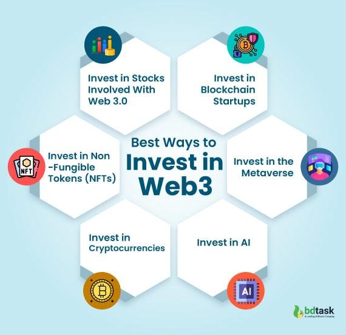

## Table of Contents

## What is Web 3.0 and how does it differ from previous internet generations?

Web 3.0, also known as the decentralized web, is the next generation of the internet that aims to give users more control over their data and online experiences. Unlike the current internet, which is dominated by large tech companies that control and monetize user data, Web 3.0 uses blockchain technology and other decentralized systems to create a more open and transparent internet. This means that instead of relying on big companies to manage and store your data, you can use peer-to-peer networks and smart contracts to have more privacy and security.

The main difference between Web 3.0 and previous internet generations is the level of control and ownership users have over their data. Web 1.0, the first generation of the internet, was mostly about static websites where users could only read information. Web 2.0, the current generation, introduced interactivity and social media, allowing users to create and share content, but at the cost of giving up a lot of personal data to big tech companies. Web 3.0 aims to build on the interactivity of Web 2.0 while returning control to the users, making the internet more democratic and less centralized.

## Why should someone consider investing in Web 3.0 technologies in 2024?

Investing in Web 3.0 technologies in 2024 could be a smart move because this new internet is growing fast. Web 3.0 is all about giving people more control over their data and making the internet more open. As more people learn about this, they want to be part of it. Companies that are working on Web 3.0, like those building blockchain and decentralized apps, could see a lot of growth. If you invest early, you might see big returns as these technologies become more popular.

Another reason to consider investing in Web 3.0 is that big companies and governments are starting to pay attention. They see the potential in these new technologies and are putting money into them. This means that Web 3.0 is not just a small trend but something that could change how the internet works. By investing now, you could be ahead of the curve and benefit from the growth that's expected in the coming years.

## What are the basic investment vehicles available for Web 3.0, such as cryptocurrencies and NFTs?

One way to invest in Web 3.0 is through cryptocurrencies. These are digital currencies that use blockchain technology, which is a big part of Web 3.0. Some popular cryptocurrencies include Bitcoin and Ethereum. When you buy these, you're betting that more people will use them as Web 3.0 grows. Another way is through tokens of specific Web 3.0 projects. These tokens can give you a share in the project and sometimes even a say in how it's run.

Another investment vehicle for Web 3.0 is Non-Fungible Tokens, or NFTs. NFTs are unique digital items that you can own, like art, music, or even virtual land. They're bought and sold using cryptocurrencies, and their value can go up if more people want them. Investing in NFTs means you're betting on the popularity of digital ownership and the growth of Web 3.0.

You can also invest in companies that are building Web 3.0 technologies. These might be startups working on new blockchain projects or bigger companies that are moving into the space. By buying their stocks or investing in their projects, you're supporting the growth of Web 3.0 and hoping to profit as these technologies become more widely used.

## How can beginners safely start investing in Web 3.0 assets?

If you're new to investing in Web 3.0 assets, start by learning the basics. Web 3.0 is all about new internet technologies like blockchain and cryptocurrencies. Take some time to read about these topics and understand how they work. There are lots of free resources online, like articles and videos, that can help you learn. Once you feel comfortable with the basics, you can start looking at different ways to invest, like buying cryptocurrencies or NFTs.

When you're ready to invest, start small. You don't need to put a lot of money in at first. Choose a reputable platform to buy your assets, like a well-known [cryptocurrency](/wiki/cryptocurrency) exchange. Make sure to do your research and read reviews to find a platform that's safe and easy to use. Also, be careful with your money. Only invest what you can afford to lose, because the value of Web 3.0 assets can go up and down a lot. It's a good idea to spread your investments across different assets to lower your risk.

Keep learning and stay updated on what's happening in the world of Web 3.0. Join online communities where people talk about their investments and share tips. This can help you make better decisions and stay safe. Remember, investing in Web 3.0 can be exciting, but it's important to be patient and not rush into things. Take your time, and you'll be on your way to becoming a smart investor in this new and growing field.

## What are some common risks associated with investing in Web 3.0, and how can they be mitigated?

Investing in Web 3.0 can be exciting, but it comes with some risks. One big risk is that the value of cryptocurrencies and NFTs can go up and down a lot. This is called [volatility](/wiki/volatility-trading-strategies), and it means you could lose money if the value drops after you buy. Another risk is that the technology behind Web 3.0 is still new and not fully tested. This means there could be problems with the platforms or projects you invest in, like security issues or failures. Also, since Web 3.0 is less regulated than traditional investments, there's a higher chance of scams and fraud.

To reduce these risks, start by only investing money you can afford to lose. This way, if the value goes down, it won't hurt you too much. It's also a good idea to spread your investments across different assets. This is called diversification, and it can help protect you if one investment does badly. Do your homework before you invest, and choose well-known and trusted platforms. Keep learning about Web 3.0 and stay updated on news and trends. This will help you make better choices and avoid scams. By being careful and smart, you can enjoy the potential rewards of investing in Web 3.0 while keeping the risks under control.

## What role do decentralized finance (DeFi) platforms play in Web 3.0 investment strategies?

Decentralized finance, or DeFi, platforms are a big part of Web 3.0 investment strategies. They let you do things like lending, borrowing, and trading without needing a bank or other middleman. Instead, DeFi uses smart contracts on blockchain technology to make these financial services work. This means you can have more control over your money and investments, and it's all done in a way that's open and clear for everyone to see.

When you invest in Web 3.0, DeFi platforms can be a good way to grow your money. You can earn interest by lending out your cryptocurrencies, or you can borrow money using your crypto as collateral. DeFi also lets you trade different tokens and assets, which can help you diversify your investments. But remember, DeFi can be risky because it's new and not as regulated as traditional finance. So, it's important to learn about DeFi and be careful with your investments.

## How can one evaluate the potential of a Web 3.0 project or startup for investment?

When you want to invest in a Web 3.0 project or startup, it's important to look at a few key things. First, check the team behind the project. Are they experienced and trustworthy? Do they have a good track record in the industry? Next, look at the project's goals and how they plan to achieve them. Is there a clear plan and a real need for what they're building? Also, consider the technology they're using. Is it innovative and likely to succeed in the long run? Finally, see if the project has a strong community and support. A good project often has a lot of people interested and talking about it.

Another thing to think about is the project's financial health. Do they have enough money to keep going, or are they always asking for more? Look at their token or coin if they have one. Is it being used for something useful, or is it just a way to raise money? It's also good to see if the project is working with other companies or getting attention from big players in the industry. This can be a sign that the project is on the right track. By taking the time to look at these things, you can make a smarter choice about whether to invest in a Web 3.0 project or startup.

## What advanced strategies can be used to diversify a Web 3.0 investment portfolio?

To diversify a Web 3.0 investment portfolio, you can start by spreading your money across different types of assets. Instead of putting all your money into one cryptocurrency, you can invest in several different ones. For example, you might buy some Bitcoin, some Ethereum, and some smaller cryptocurrencies called altcoins. You can also look into other Web 3.0 assets like NFTs or tokens from different projects. This way, if one type of asset goes down in value, the others might still do well, which can help protect your overall investment.

Another advanced strategy is to use DeFi platforms to earn more from your investments. You can lend out your cryptocurrencies to earn interest, or you can use them as collateral to borrow other assets. This can help you make money from your investments in different ways. Also, consider investing in Web 3.0 startups or companies that are building new technologies. By spreading your investments across different areas of Web 3.0, you can take advantage of the growth in this new field while reducing your risk.

## How does regulatory environment impact Web 3.0 investments, and what should investors be aware of in 2024?

The regulatory environment can have a big impact on Web 3.0 investments. Governments around the world are still figuring out how to handle new technologies like cryptocurrencies and blockchain. Some countries are making rules to protect investors and stop fraud, while others are more open and want to encourage growth. These rules can change how Web 3.0 projects work and how much they're worth. If a country makes strict rules, it might make it harder for Web 3.0 projects to grow there, which could affect your investments.

In 2024, investors should keep an eye on what governments are doing. Big changes in rules could mean big changes for your investments. For example, if a country starts to regulate cryptocurrencies more, the value of those assets might go down. It's a good idea to stay updated on news about regulations and think about how they might affect your investments. By understanding the regulatory environment, you can make smarter choices and be ready for any changes that come your way.

## What are the latest trends in Web 3.0 that could influence investment decisions in 2024?

In 2024, one big trend in Web 3.0 is the growth of decentralized social media platforms. These platforms let users own their data and have more control over what they see and share. This is different from big social media companies that use your data to make money. As more people get tired of these big companies, they might move to decentralized platforms. This could make these new platforms more popular and valuable, which is something investors should think about.

Another trend is the rise of decentralized finance, or DeFi, applications. DeFi lets people do things like lending, borrowing, and trading without banks or other middlemen. This can make financial services more open and fair. As more people use DeFi, the demand for the tokens and platforms that support it could go up. Investors should look at which DeFi projects are doing well and might keep growing in the future.

Lastly, there's a lot of interest in the metaverse and virtual reality in Web 3.0. The metaverse is a shared virtual space where people can work, play, and connect. Companies are building virtual worlds where you can own land and other digital items as NFTs. If the metaverse becomes more popular, the value of these virtual assets could go up. Investors should watch which metaverse projects are getting attention and might be good to invest in.

## How can experienced investors leverage blockchain analytics to optimize their Web 3.0 investment strategies?

Experienced investors can use blockchain analytics to make smarter choices about their Web 3.0 investments. Blockchain analytics tools let you see what's happening on the blockchain, like how many people are using a certain cryptocurrency or how much money is moving around. By looking at this data, investors can find out which projects are growing and which ones might be in trouble. For example, if you see a lot of new users joining a platform and more money being used there, it might be a good sign that the project is doing well. This can help you decide where to put your money for the best chance of making a profit.

Another way blockchain analytics can help is by spotting trends and patterns. You can see how different cryptocurrencies are doing compared to each other and find out which ones are getting more popular. This can help you diversify your investments and pick assets that are likely to grow. Also, by keeping an eye on the blockchain, you can catch any signs of fraud or problems early on. This way, you can avoid risky investments and protect your money. Using blockchain analytics can give you a big advantage in the fast-changing world of Web 3.0 investments.

## What are the long-term investment prospects for Web 3.0, and how should one plan for them?

The long-term investment prospects for Web 3.0 look promising because it's all about making the internet more open and giving people more control over their data. As more people learn about Web 3.0 and start using it, the technologies behind it, like blockchain and cryptocurrencies, could become more valuable. This means that if you invest in Web 3.0 now, you might see big returns in the future as these technologies grow and become more popular. But remember, Web 3.0 is still new and can be risky, so it's important to be patient and think about the long term.

To plan for long-term investments in Web 3.0, start by learning as much as you can about the different technologies and projects. Look for projects that have strong teams, clear goals, and a lot of support from the community. It's also a good idea to spread your investments across different types of Web 3.0 assets, like cryptocurrencies, NFTs, and DeFi platforms. This can help you lower your risk and take advantage of the growth in different areas of Web 3.0. Keep an eye on the news and trends, and be ready to adjust your investments as things change. By being smart and patient, you can set yourself up for success in the exciting world of Web 3.0.

## References & Further Reading

[1]: Tapscott, D., & Tapscott, A. (2018). ["Blockchain Revolution: How the Technology Behind Bitcoin and Other Cryptocurrencies is Changing the World"](https://www.tandfonline.com/doi/full/10.1080/10686967.2018.1404373). Portfolio.

[2]: Vigna, P., & Casey, M. J. (2016). ["The Age of Cryptocurrency: How Bitcoin and the Blockchain Are Challenging the Global Economic Order"](https://dl.acm.org/doi/10.5555/2717097). St. Martin's Griffin.

[3]: Swan, M. (2015). ["Blockchain: Blueprint for a New Economy"](https://dl.acm.org/doi/book/10.5555/3006358). O'Reilly Media.

[4]: Narayanan, A., Bonneau, J., Felten, E., Miller, A., & Goldfeder, S. (2016). ["Bitcoin and Cryptocurrency Technologies: A Comprehensive Introduction"](https://press.princeton.edu/books/hardcover/9780691171692/bitcoin-and-cryptocurrency-technologies). Princeton University Press.

[5]: De Filippi, P., & Wright, A. (2018). ["Blockchain and the Law: The Rule of Code"](https://www.jstor.org/stable/j.ctv2867sp). Harvard University Press.