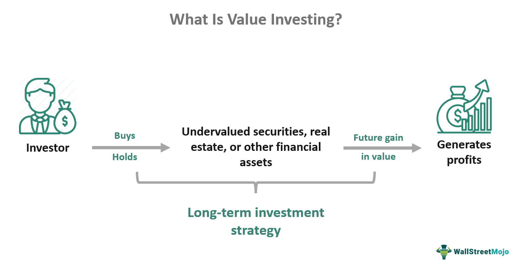

The cryptocurrency market in 2024 continues to evolve rapidly, characterized by significant growth, innovation, and volatility. As digital currencies become increasingly integral to the global financial system, several emerging trends are redefining the landscape. Cryptocurrency adoption is accelerating, driven by advancements in technology, regulatory acceptance, and a broader understanding of its potential benefits. Key areas influencing the market include Web 3.0 and algorithmic trading, both of which play a crucial role in shaping the future of digital currency investments. 

Understanding these trends is vital for investors aiming to make informed decisions. As the cryptocurrency market matures, traditional financial institutions and new investors alike are seeking to capitalize on these developments. Trends such as Decentralized Finance (DeFi), non-fungible tokens (NFTs), and stablecoins continue to gain traction, offering diverse opportunities and promising substantial returns. However, with these opportunities come risks that necessitate a nuanced appreciation of market dynamics for prudent investment strategies.



Web 3.0, the next generation of internet technology, emphasizes decentralization and user empowerment, thereby influencing the cryptocurrency ecosystem. By leveraging blockchain, artificial intelligence (AI), and smart contracts, Web 3.0 is facilitating more transparent and secure financial transactions. This shift is expected to enhance user control over personal data and privacy, redefining how digital currencies operate.

Similarly, algorithmic trading is transforming cryptocurrency markets by enabling higher efficiency and price discovery. The use of complex algorithms allows investors to execute trades at speeds and efficiencies far beyond human capability, fostering a more dynamic market environment. As automated trading strategies become more sophisticated, they offer new avenues for profit while simultaneously reshaping market behavior.

In conclusion, the interplay between emerging technologies and cryptocurrencies demands attention from investors and stakeholders. Navigating these trends effectively can uncover lucrative opportunities and mitigate risks. By embracing technological advancements like Web 3.0 and algorithmic trading, investors can prepare for a future where digital currencies play a pivotal role in economic and financial systems.

## Table of Contents

## Web 3.0 and Its Impact on Cryptocurrency

Web 3.0 represents the latest evolution of the internet, characterized by a shift towards decentralization and enhanced user interactivity. Unlike its predecessors, this iteration of the internet integrates advanced technologies like blockchain, artificial intelligence (AI), and smart contracts to create more autonomous, intelligent, and open digital experiences.

### Web 3.0 Technologies and Their Effect on Cryptocurrencies

Web 3.0 is primarily defined by blockchain technology, which introduces a distributed ledger system ensuring transparency and security in digital transactions. Cryptocurrencies, leveraging blockchain technology, benefit from enhanced security and reduced dependency on centralized entities. Smart contracts, which are self-executing contracts with the agreement terms directly written into the code, further enhance the functionality of cryptocurrencies by facilitating automated, trustless transactions.

Artificial intelligence in Web 3.0 contributes to the advancement of cryptocurrencies by enabling sophisticated data processing capabilities, which can be used to improve security measures and streamline transaction processes. The integration of AI promises to enhance the predictive capabilities of decentralized applications (dApps), fostering an ecosystem where cryptocurrencies can evolve rapidly to meet user demands.

### Championing User-Data Control and Privacy

A central tenet of Web 3.0 is its focus on user control over personal data. Decentralized systems allow users to manage their own data rather than relying on centralized platforms, thus enhancing privacy and security. This shift in data control is poised to alter market dynamics, as cryptocurrencies become more attractive to users who prioritize privacy and data security.

Decentralized identity solutions, part of Web 3.0, empower users by allowing them to establish digital identities that are secure and easily managed without reliance on a centralized authority. Cryptocurrencies, functioning within this framework, benefit from a more secure and private transaction environment.

In conclusion, Web 3.0's transformative technologies bring forth significant advancements in the [cryptocurrency](/wiki/cryptocurrency) landscape. The emphasis on decentralization, user-data control, and enhanced security through these technologies not only makes cryptocurrencies more robust and reliable but also aligns them with emerging user expectations for privacy and autonomy in the digital age. This evolution is likely to drive further adoption and innovation within the cryptocurrency market.

## Key Cryptocurrency Trends in 2024

In 2024, the cryptocurrency landscape is marked by several key trends, with Decentralized Finance (DeFi) continuing its evolution, non-fungible tokens (NFTs) gaining prominence in mainstream use cases, and the integration and increasing adoption of stablecoins in financial systems.

Decentralized Finance, or DeFi, has revolutionized the traditional financial system by facilitating peer-to-peer financial transactions using blockchain technology. In 2024, DeFi platforms are expected to grow more sophisticated, incorporating advanced financial products traditionally offered by banks, such as derivatives and insurance. The core advantage of DeFi remains its ability to eliminate intermediaries, thus reducing costs and increasing access to financial services. Innovative DeFi applications are likely to expand their reach beyond crypto-native audiences, fostering interoperability with traditional financial systems.

The rise of non-fungible tokens (NFTs) into mainstream use highlights their evolving role beyond digital art. In 2024, NFTs are anticipated to permeate various industries, including real estate, music, and sports, offering unique digital ownership representations. This mainstream adoption is driven by NFTs' versatility in representing ownership of both digital and physical assets, their traceability on blockchain, and their capability to enforce royalties and rights. Consequently, industries are exploring NFTs for enhancing consumer engagement and creating novel revenue streams.

Stablecoins, cryptocurrencies pegged to stable assets like fiat currencies, continue to gain [momentum](/wiki/momentum) in 2024 as integral components of the financial ecosystem. They address the [volatility](/wiki/volatility-trading-strategies) concerns inherent in traditional cryptocurrencies, offering users a reliable medium of exchange and store of value. The growing adoption of stablecoins is reflected in regulatory frameworks adapting to accommodate these assets, providing clarity and security for both issuers and users. Furthermore, stablecoins are pivotal in cross-border transactions, offering faster and cheaper alternatives to conventional money transfer services.

In summary, the key cryptocurrency trends in 2024 illustrate significant advancements in financial technology and structure. Decentralized Finance is reshaping financial interactions, NFTs are expanding their influence across various sectors, and stablecoins are increasingly integrated into financial systems, highlighting a transformative era in digital currencies.

## Investing in Cryptocurrency in the Web 3.0 Era

As the cryptocurrency landscape evolves under the influence of Web 3.0, investors are presented with diverse opportunities for portfolio diversification. The era introduces a blend of traditional digital currencies, non-fungible tokens (NFTs), and emerging Web 3.0 stocks, each representing unique attributes and investment potential.

### Diversification via Cryptocurrencies, NFTs, and Web 3.0 Stocks

Diversification remains a cornerstone strategy in investment, aiming to mitigate risk while maximizing returns. In the contemporary digital finance environment, diversification extends beyond cryptocurrencies to encompass NFTs and Web 3.0 stocks. Cryptocurrencies continue to offer decentralized investment opportunities and hedge against traditional financial systems. NFTs bring a new asset class representing digital ownership and have proliferated across art, gaming, and entertainment sectors. Meanwhile, Web 3.0 stocks, which include companies pioneering blockchain technology, data privacy, and [artificial intelligence](/wiki/ai-artificial-intelligence), offer another avenue for exposure to the growth of the decentralized internet.

### Best Practices for Identifying High-Potential Investments in the Web 3.0 Domain

Identifying high-potential investments in the Web 3.0 domain involves several strategic considerations:

1. **Research and Analysis**: Thorough analysis of market trends, technological advancements, and specific project roadmaps is crucial. Evaluating white papers, utility, and the problem-solving capability of a cryptocurrency or NFT can offer insights into its long-term viability.

2. **Community and Ecosystem**: Projects with robust and active communities often indicate dynamic growth potential. Ecosystem partnerships and collaborations also signal a project's integration and relevance within the broader Web 3.0 network.

3. **Team and Development**: Scrutinizing the founding team’s experience and track record, as well as ongoing development activities, is vital. Projects backed by experienced teams with a history of successful ventures are generally more credible.

4. **Risk Assessment**: Assessing the risk appetite and aligning it with investment goals is fundamental. This includes considering the volatility and regulatory landscape affecting cryptocurrencies and NFTs.

### Risks and Considerations Unique to Investing in Cryptocurrencies Influenced by Web 3.0

Investing in cryptocurrencies under the Web 3.0 framework introduces specific risks and considerations:

- **Regulatory Uncertainty**: The decentralized nature of Web 3.0 technologies often clashes with traditional regulatory frameworks, leading to potential legal ambiguities and challenges.

- **Market Volatility**: Cryptocurrencies remain subject to significant price volatility, influenced by market sentiment, macroeconomic factors, and technological disruptions.

- **Security Risks**: Web 3.0 platforms, while offering enhanced privacy and data control, are not immune to cyber threats, necessitating robust security measures by investors.

- **Technological Complexity**: The rapid pace of technological innovation may render certain platforms obsolete, requiring investors to stay informed and adaptable.

In summary, investing in cryptocurrency during the Web 3.0 era demands a well-rounded understanding of diverse asset classes, strategic investment tactics, and a keen awareness of inherent risks. By leveraging these factors, investors can potentially harness the transformative powers of Web 3.0 for sustainable investment growth.

## Algorithmic Trading in the Cryptocurrency Market

Algorithmic trading refers to the use of computer algorithms to automate the execution of trading strategies based on pre-set rules and patterns. This method leverages computational power and mathematical models to conduct rapid and precise transactions, significantly enhancing trading efficiency compared to manual trading. In the cryptocurrency market, [algorithmic trading](/wiki/algorithmic-trading) offers several benefits, including increased trading speed, reduced human errors, and the ability to process large volumes of trade data in short time frames.

### Benefits of Algorithmic Trading

Firstly, algorithmic trading improves market efficiency. Algorithms can analyze numerous market variables and execute trades within milliseconds, capitalizing on brief market opportunities that human traders might miss. This speed is crucial in the highly volatile cryptocurrency markets where price fluctuations can be rapid and unpredictable.

Moreover, algorithmic trading enhances price discovery. By integrating vast amounts of market data and executing trades based on complex algorithms, these trading systems contribute to more accurate and reflective market pricing. They react to new market information faster than traditional methods, adjusting prices accordingly and enhancing the overall market transparency.

### Role in Cryptocurrency Markets

Algorithmic trading is instrumental in shaping the cryptocurrency market dynamics. As of 2024, an increasing number of cryptocurrency exchanges incorporate algorithmic trading tools, improving [liquidity](/wiki/liquidity-risk-premium) and narrowing bid-ask spreads. This, in turn, makes the markets more attractive to investors by reducing transaction costs.

Here is a simple example of how algorithmic trading might be implemented in Python using the `ccxt` library for cryptocurrency trading. This script highlights a basic market-making strategy:

```python
import ccxt
import time

exchange = ccxt.binance()
symbol = 'BTC/USDT'
spread = 50  # Define spread in USD

while True:
    order_book = exchange.fetch_order_book(symbol)
    bid = order_book['bids'][0][0]
    ask = order_book['asks'][0][0]

    # Calculate the mid price
    mid_price = (bid + ask) / 2
    buy_price = mid_price - spread / 2
    sell_price = mid_price + spread / 2

    # Place buy and sell limit orders
    exchange.create_limit_buy_order(symbol, 1, buy_price)
    exchange.create_limit_sell_order(symbol, 1, sell_price)

    # Sleep before checking again
    time.sleep(60)
```

### Investment Opportunities

For investors, algorithmic trading presents a range of opportunities through automated trading strategies. Investors can design algorithms tailored to specific investment goals, such as market-making, [arbitrage](/wiki/arbitrage), or trend-following, reducing the need for constant market monitoring. By automating trades, investors can take advantage of even minor price movements across different exchanges, maximizing potential returns.

However, engaging in algorithmic trading requires a thorough understanding of its associated risks. Market conditions can change rapidly, and algorithms may not always adapt quickly, potentially leading to losses. Therefore, investors must continually test and optimize their algorithms, ensuring they remain effective across various market scenarios.

## Conclusion

In 2024, cryptocurrency investments are primarily influenced by several key trends. Foremost among these are the advancements in Web 3.0 and algorithmic trading. Web 3.0, characterized by its decentralized approach, leverages technologies such as blockchain, AI, and smart contracts. This paradigm shift enhances user control over data and privacy, thus fundamentally altering market dynamics. As a result, cryptocurrencies are becoming more integrated with these technologies, fostering innovative applications in Decentralized Finance (DeFi), non-fungible tokens (NFTs), and stablecoins.

Algorithmic trading, a significant technological advancement, plays a crucial role in reshaping cryptocurrency investment strategies. By utilizing complex algorithms and vast amounts of data, algorithmic trading enhances market efficiency and improves price discovery. Investors can potentially gain a competitive advantage through automated trading strategies, which offer precision and speed unattainable through traditional trading methods.

In conclusion, embracing these technological advancements—Web 3.0 and algorithmic trading—can revolutionize investment strategies and provide substantial opportunities for investors. As the cryptocurrency market evolves, those who adapt to these burgeoning trends stand to gain the most from successful cryptocurrency investing. Staying informed and agile in this fast-paced environment is critical for navigating the complexities of the digital asset landscape in 2024 and beyond.

## References & Further Reading

[1]: Tapscott, D., & Tapscott, A. (2018). ["Blockchain Revolution: How the Technology Behind Bitcoin and Other Cryptocurrencies is Changing the World"](https://www.tandfonline.com/doi/full/10.1080/10686967.2018.1404373). Portfolio.

[2]: Vigna, P., & Casey, M. J. (2016). ["The Age of Cryptocurrency: How Bitcoin and the Blockchain Are Challenging the Global Economic Order"](https://dl.acm.org/doi/10.5555/2717097). St. Martin's Griffin.

[3]: Swan, M. (2015). ["Blockchain: Blueprint for a New Economy"](https://dl.acm.org/doi/book/10.5555/3006358). O'Reilly Media.

[4]: Narayanan, A., Bonneau, J., Felten, E., Miller, A., & Goldfeder, S. (2016). ["Bitcoin and Cryptocurrency Technologies: A Comprehensive Introduction"](https://press.princeton.edu/books/hardcover/9780691171692/bitcoin-and-cryptocurrency-technologies). Princeton University Press.

[5]: De Filippi, P., & Wright, A. (2018). ["Blockchain and the Law: The Rule of Code"](https://www.jstor.org/stable/j.ctv2867sp). Harvard University Press.