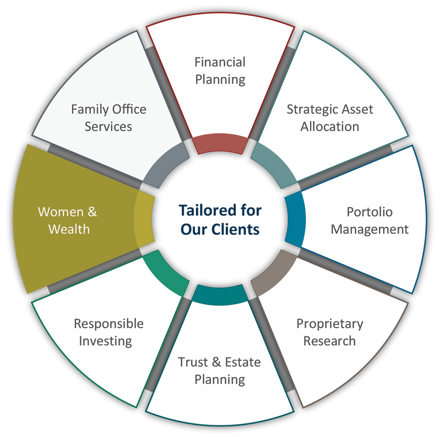

The landscape of investing is evolving with more women taking charge of their financial futures. This shift is remarkable, as women traditionally have been underrepresented in financial markets. Today, women are increasingly recognizing the importance of strategic investment for securing financial growth and independence. This positive trend is driven by increased access to educational resources, technology, and financial products specifically tailored to meet women's unique needs and goals.

Understanding the role of investment strategies is crucial for women who aim to maximize their financial potential. Investment strategies serve as the roadmap to financial success, guiding investors on how to allocate resources efficiently and build wealth over time. For women, mastering these strategies can be particularly empowering, paving the way to greater economic self-sufficiency. Investment strategies encompass a range of options, from traditional stocks and bonds to innovative approaches like algorithmic trading (algo trading), offering tools for women to mitigate risks and seize growth opportunities.



This article provides an overview of various investment strategies with a focus on those tailored for women. We aim to offer financial advice that acknowledges the unique challenges women face, such as the gender wage gap, career breaks, and longer life expectancy, which can impact financial planning. By exploring both conventional and cutting-edge investment avenues, we offer insights into how women can leverage these strategies effectively, aligning their investments with their life goals and risk tolerance.

Moreover, we explore the world of algorithmic trading, a frontier in investment that utilizes computer algorithms to enhance trading decisions' speed and accuracy. This approach, though complex, is becoming increasingly accessible through user-friendly platforms, empowering women to participate in sophisticated financial markets.

Join us as we explore how women can become more confident and informed investors, equipping them with the knowledge to navigate innovation in the financial market and seize opportunities for wealth creation. Through education and strategic investment, women can not only enhance their financial standing but also contribute to closing the gender investment gap, rewriting the narrative of financial independence.

## Table of Contents

## Why Investment Strategies Matter for Women

Financial independence remains a crucial objective for many women, and effective investment strategies are integral to realizing this goal. Historically, women have encountered various challenges within the financial industry, such as limited access to financial education and tailored investment products. This landscape, however, is undergoing significant transformations due to targeted learning initiatives and innovative investment tools, which are breaking down barriers and fostering greater inclusivity.

A diversified investment portfolio is essential for risk mitigation, and understanding the plethora of available investment options is the foundation of such diversification. By engaging with a variety of assets, women can spread risk and potentially enhance returns, a strategy that becomes critical when considering long-term financial stability. Traditional investment avenues such as stocks, bonds, and mutual funds, alongside modern options like digital assets, allow for comprehensive diversification. Women investors who take the time to explore these options are better equipped to hedge against market volatilities and safeguard their financial futures.

Statistics indicate a growing trend of women taking an active interest in financial planning and investment. Reports from entities like the Pew Research Center and Fidelity Investments highlight that women's participation in activities like retirement savings and stock market investments is rising steadily. This increasing involvement is not only reshaping financial trends but also challenging stereotypes regarding gender roles in investing. Traditionally male-dominated, the investment landscape is gradually becoming more balanced, fostering a supportive environment for women investors to thrive.

The gender investment gap, which refers to the disparities in investment behaviors and asset accumulation between men and women, underscores the importance of strategic investment planning. According to data from the World Economic Forum, women typically earn less and save less over their lifetimes compared to men, often due to wage gaps and career breaks. Strategic investment planning acts as a countermeasure to these disparities by enabling women to optimize their wealth accumulation through informed investment choices.

In conclusion, investment strategies are pivotal for women seeking financial independence. These strategies not only help navigate traditional and modern investment landscapes but also contribute to closing the gender investment gap by empowering women with the tools and knowledge necessary to make strategic decisions. By embracing these techniques and fostering a culture of financial literacy, women can elevate their financial security and autonomy.

## Traditional Investment Strategies

Traditional investment strategies lay the foundation for building a robust financial portfolio by incorporating a variety of assets, including stocks, bonds, and mutual funds. These conventional methods have withstood the test of time, owing to their potential to generate stable returns and mitigate risks through diversification.

**Stocks** represent ownership shares in a company, entitling investors to a portion of the corporation's assets and profits. Investing in stocks allows individuals to participate in the economic growth of businesses, with the potential for substantial long-term gains. However, stock prices can be volatile, thus requiring investors to assess their risk tolerance and investment horizon carefully. 

**Bonds**, on the other hand, are debt securities issued by corporations or governments. They offer regular interest payments and the return of principal at maturity, presenting a comparatively lower-risk investment option. Bonds are often used to balance the high-risk component of stocks in a diversified portfolio.

**Mutual Funds** are pooled investment vehicles managed by professional fund managers. They allow individuals to invest in a diversified portfolio of stocks, bonds, or other assets, even with limited capital. This diversification helps reduce the portfolio's overall risk. Mutual funds come with various strategies and risk levels, allowing investors to choose one that aligns with their financial goals and risk appetite.

**Asset allocation** plays a pivotal role in investment planning. It involves distributing investments across various asset classes, such as stocks, bonds, and cash, to optimize the balance between risk and return. For instance, a risk-averse investor might allocate a larger proportion of their portfolio to bonds and cash, whereas a younger investor with a longer time horizon could afford a more aggressive stance with a heavier allocation to stocks.

**Risk tolerance** is an individual's ability and willingness to endure market fluctuations. It is subjective and influenced by factors such as financial situation, investment objectives, and psychological comfort with potential losses. Assessing this helps in formulating a strategic asset allocation that adheres to one's risk capacity.

**Time horizon** is the expected duration an investor plans to maintain their investment portfolio before withdrawing funds. It significantly impacts investment strategy, as a longer time horizon typically enables investors to endure market volatility and capitalize on the benefits of long-term investing, such as compounding interest.

The benefits of long-term investing are profound, primarily owing to the compounding effect, where the returns generated on investments are reinvested to generate their own earnings. Mathematically, the formula for compound interest is given by:

$$
A = P \left(1 + \frac{r}{n}\right)^{nt}
$$

where:
- $A$ is the amount of money accumulated after n years, including interest.
- $P$ is the principal amount (initial investment).
- $r$ is the annual interest rate (decimal).
- $n$ is the number of times interest is compounded per year.
- $t$ is the number of years the money is invested.

For individuals starting with minimal capital, it's crucial to leverage platforms that facilitate micro-investing or commission-free trades. Online platforms such as Robinhood, Acorns, and Stash provide avenues for small-scale investing in stocks or ETFs, often with no minimum investment requirement. Additionally, educational resources such as Investopedia, financial blogs, and workshops are invaluable for women seeking to enhance their understanding of traditional market operations.

In summary, traditional investment strategies, through a well-balanced approach to asset allocation, risk tolerance, and time horizon, enable individuals to harness potential returns and achieve financial independence. As women increasingly engage with the financial markets, these strategies remain vital in laying the groundwork for a secure financial future.

## Modern Investments: Digital Assets and Beyond

The emergence of digital assets, particularly cryptocurrencies like Bitcoin and Ethereum, has transformed the investment landscape, offering novel opportunities for diversification and growth. Cryptocurrencies typically utilize blockchain technology, ensuring decentralized, secure transactions. This innovation appeals to risk-tolerant investors seeking significant potential returns. However, these assets exhibit high [volatility](/wiki/volatility-trading-strategies) and uncertain regulatory environments, which can lead to substantial risks.

Investors must weigh these risks and rewards carefully. Market volatility can lead to rapid price changes, while potential regulatory crackdowns may affect asset accessibility and legality. Despite these challenges, the decentralized nature and growing acceptance of digital currencies are paving the way for their integration into modern portfolios. Investors can consider allocation strategies that balance investments across traditional and digital assets to optimize their risk-reward profile.

Environmental, Social, and Governance ([ESG](/wiki/esg-investing)) investments have gained traction as a means for investors to align their financial goals with personal values. ESG investing evaluates a company's environmental impact, social responsibility, and governance practices, promoting sustainable and ethical business conduct. By considering ESG criteria, investors not only support socially responsible companies but also potentially enhance long-term portfolio performance due to growing demand for sustainable practices. Studies suggest that companies with strong ESG performance tend to exhibit lower risks and better financial stability, attracting a growing base of conscientious investors.

Peer-to-peer (P2P) lending and crowdfunding serve as alternative investment opportunities, connecting investors directly with borrowers or projects. P2P lending platforms enable individuals to lend money to others, often resulting in higher returns than traditional savings accounts. However, P2P lending carries default risks, where borrowers may fail to repay loans. Investors can mitigate this by diversifying their loans across multiple borrowers. Crowdfunding, on the other hand, allows investors to fund startups or projects, often in exchange for equity or rewards. This investment type embodies higher risk, as startups typically exhibit high failure rates, yet the potential for substantial returns exists if the venture succeeds.

Staying informed about market trends is crucial for leveraging such innovations effectively. Investors should utilize reliable financial news sources, subscribe to industry reports, and participate in online communities for the latest developments. Additionally, analyzing historical data, utilizing predictive analytics tools, and scenario analysis can aid in making data-driven decisions. Python’s libraries, such as pandas and matplotlib, can be invaluable in processing financial data and generating insights. For instance:

```python
import pandas as pd
import matplotlib.pyplot as plt

# Assume 'data.csv' contains historical pricing of a digital asset
df = pd.read_csv('data.csv')
df['date'] = pd.to_datetime(df['date'])
df.set_index('date', inplace=True)

# Plotting the historical price trend
plt.figure(figsize=(12, 6))
plt.plot(df['price'], label='Price')
plt.title('Historical Price of Digital Asset')
plt.xlabel('Date')
plt.ylabel('Price (USD)')
plt.legend()
plt.show()
```

Leveraging technological advancements and analyzing market data allows investors to remain agile and informed, capitalizing on growth opportunities in the evolving financial landscape.

 to Algorithmic Trading

Algorithmic trading, commonly referred to as algo trading, is an innovative method of executing trades using pre-programmed instructions. These instructions account for variables such as price, timing, and [volume](/wiki/volume-trading-strategy), aiming to achieve efficiency and speed far beyond human capabilities. By using complex algorithms, algo trading enables investors to automate trading decisions, thereby minimizing human intervention and emotion-driven errors. With the rise of technology-driven platforms, algo trading has gained popularity among both institutional and retail investors seeking to optimize their trading strategies.

Algo trading is based on sophisticated mathematical models and statistical analyses, which process vast amounts of market data to identify lucrative trading opportunities. These algorithms can execute orders at lightning speeds, adjusting to market changes instantly. Python, a popular programming language, is often used for developing these algorithms due to its rich library ecosystem and data processing capabilities. A simple example of an [algorithmic trading](/wiki/algorithmic-trading) script in Python might involve using historical data to predict future price movements, then executing trades based on these predictions. Here is a basic outline of what such a script might look like:

```python
import pandas as pd
from pandas_datareader import data as web

# Fetch historical data
def get_stock_data(symbol, start, end):
    return web.DataReader(symbol, 'yahoo', start, end)

# Implement a simple moving average strategy
def moving_average_strategy(data, short_window, long_window):
    signals = pd.DataFrame(index=data.index)
    signals['signal'] = 0.0
    signals['short_mavg'] = data['Close'].rolling(window=short_window, min_periods=1).mean()
    signals['long_mavg'] = data['Close'].rolling(window=long_window, min_periods=1).mean()

    # Generate signals
    signals['signal'][short_window:] = np.where(signals['short_mavg'][short_window:] > signals['long_mavg'][short_window:], 1.0, 0.0)
    signals['positions'] = signals['signal'].diff()

    return signals

# Example usage
symbol = 'AAPL'
start_date = '2023-01-01'
end_date = '2023-10-01'

data = get_stock_data(symbol, start_date, end_date)
signals = moving_average_strategy(data, 40, 100)
```

While algo trading offers numerous benefits such as reduced transaction costs, increased trading frequency, and the ability to test strategies using historical data ([backtesting](/wiki/backtesting)), it also bears risks. The reliance on algorithms means that errors in the code or data inaccuracies can lead to significant financial losses. Furthermore, in rapidly changing markets, algorithms might not be able to adapt quickly enough to avoid losses, a phenomenon known as "algorithmic market risk".

To mitigate these risks, beginner traders can leverage various platforms and tools specifically designed to educate and facilitate entry into the world of algorithmic trading. Platforms like QuantConnect and Alpaca offer paper trading environments where users can test their strategies without real financial exposure. They also provide educational resources and community forums for knowledge exchange.

Several success stories highlight the transformative impact of algorithmic trading. Notably, trading firms have used algorithms to capitalize on market inefficiencies, executing high-frequency trades to accrue significant profits. Some individual investors have also successfully enhanced their portfolios by using simpler algorithmic strategies tailored to their financial goals.

In conclusion, algorithmic trading represents a powerful tool for investors looking to capitalize on technological advancements to improve their market strategies. As the financial landscape continues to evolve, the understanding and implementation of such technologies will be instrumental in staying competitive.

## Financial Advice for Women Navigating the Market

Building confidence and gaining knowledge as a female investor requires strategic approaches, especially in an industry traditionally dominated by men. A critical first step is developing a personalized investment strategy tailored to align with one's financial goals and risk tolerance. This strategy should consider various factors, including time horizon, risk appetite, and specific financial objectives. For instance, younger investors may opt for a more aggressive approach, emphasizing equity investments to capitalize on long-term growth potentials. In contrast, those nearing retirement might prioritize stability through bonds or fixed-income securities.

In formulating an investment strategy, utilizing educational resources can be highly beneficial. Numerous platforms offer courses and materials focusing on financial planning for women. These resources often provide insight into fundamental and advanced investment concepts, empowering women to make informed decisions. Furthermore, seeking mentorship from experienced investors can provide guidance and support, helping to navigate complex financial landscapes. Financial advisors specializing in women's financial planning can also play a crucial role by offering tailored advice and strategies that consider unique circumstances and challenges women may face.

Balancing career, family, and personal financial goals is another vital aspect of successful investing. Smart money management involves creating a comprehensive budget that allocates funds for various financial goals while maintaining emergency reserves. It is essential to review and adjust this budget regularly to accommodate life changes, such as career advancements or family obligations. Diversifying investments can also ensure a balanced approach, reducing risk while taking advantage of different growth opportunities.

Inspirational stories from successful women investors often provide valuable lessons. For instance, Mellody Hobson, co-CEO of Ariel Investments, emphasizes the importance of financial literacy and awareness. Her journey highlights how thorough understanding and strategic planning enabled her to rise through the ranks in the investment world. Similarly, Sallie Krawcheck, CEO of Ellevest, advocates for personalized investment solutions that resonate with women’s unique financial needs, underscoring the impact of tailored strategies in achieving financial independence.

By fostering confidence and expanding knowledge through these strategies, women can effectively navigate the financial market, making informed decisions that align with their broader life goals.

## Conclusion

Empowering women to actively engage in their financial futures involves strategic investments and informed decision-making. Women today have access to a broad spectrum of investment opportunities, ranging from traditional assets like stocks, bonds, and mutual funds to modern options such as cryptocurrencies, ESG investments, and algorithmic trading. These diverse strategies empower women to create personalized investment plans that reflect their unique financial goals, risk tolerance, and values.

Education plays a crucial role in ensuring women remain informed about the evolving landscape of financial technology and investment strategies. As more women embrace educational resources, mentorship programs, and expert financial advice tailored to their needs, they gain the confidence and knowledge needed to navigate the financial markets effectively. Algorithmic trading, characterized by the use of complex algorithms and technological innovation, exemplifies how staying updated with technological advancements can significantly enhance investment portfolios.

Inspiring a growing community of women investors is paramount in closing the gender gap in financial literacy and independence. As more women contribute to and participate in financial activities, they challenge traditional industry norms, leveraging their unique perspectives and insights to drive change. This shift is not only beneficial for individual economic empowerment but also enriches the overall financial market by introducing diverse approaches and ideas.

Ultimately, the transformative impact of women gaining control over their financial destinies cannot be overstated. By actively managing their investments and financial planning, women not only achieve personal independence but also set a powerful example for future generations, fostering a more inclusive and equitable financial industry. Through continued education, strategic decision-making, and a supportive community, women can successfully navigate the complexities of investing, ultimately reshaping their financial futures and the broader economic landscape.

## References & Further Reading

[1]: ["Advances in Financial Machine Learning"](https://www.amazon.com/Advances-Financial-Machine-Learning-Marcos/dp/1119482089) by Marcos Lopez de Prado

[2]: ["Machine Learning for Algorithmic Trading: Predictive models to extract signals from market and alternative data for systematic trading strategies with Python, 2nd Edition"](https://github.com/stefan-jansen/machine-learning-for-trading) by Stefan Jansen

[3]: ["Quantitative Trading: How to Build Your Own Algorithmic Trading Business"](https://www.amazon.com/Quantitative-Trading-Build-Algorithmic-Business/dp/1119800064) by Ernest P. Chan

[4]: Bergstra, J., Bardenet, R., Bengio, Y., & Kégl, B. (2011). ["Algorithms for Hyper-Parameter Optimization"](https://dl.acm.org/doi/10.5555/2986459.2986743). Advances in Neural Information Processing Systems 24.

[5]: ["Evidence-Based Technical Analysis: Applying the Scientific Method and Statistical Inference to Trading Signals"](https://www.amazon.com/Evidence-Based-Technical-Analysis-Scientific-Statistical/dp/0470008741) by David Aronson