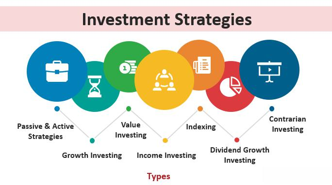

Algorithmic trading, also known as algo trading, relies on sophisticated computer programs using predefined criteria to trade securities. In recent years, this method has gained popularity due to its significant advantages in speed, efficiency, and its ability to minimize human errors. Human traders are often susceptible to emotional decision-making which can lead to suboptimal trading outcomes. Conversely, algorithmic trading systems operate without emotional influence, executing trades based purely on data and logic.

Algo trading harnesses powerful computational algorithms capable of scanning multiple financial markets simultaneously, recognizing trading opportunities and executing trades at speeds unachievable by manual trading. This process not only increases the likelihood of capturing profitable trades but also enhances the overall efficiency of the trading strategy.



Investors and traders are increasingly adopting these algorithms to optimize their portfolios and achieve better returns. The precision that algorithmic trading brings allows for the application of complex strategies that can be customized to align with an investor's risk tolerance and financial goals. By automating these strategies, investors can allocate more time to developing and refining their trading models instead of focusing on the minutiae of individual trade execution.

This article will explore various investment strategies employed within algorithmic trading, discussing both their benefits and the potential challenges investors may encounter. Understanding these strategies is essential for navigating the complex landscape of automated trading, whether one is a seasoned trader or a newcomer to the investment world. By examining these strategies, readers can better appreciate the intricate dynamics of financial markets and the pivotal role of technology in modern trading practices.

## Table of Contents

## Understanding Algorithmic Trading

Algorithmic trading involves using a set of mathematical formulas and complex software systems to automate trading decisions. These decisions are based on a variety of factors including timing, price, and [volume](/wiki/volume-trading-strategy) as well as other predetermined financial metrics. By leveraging the power of computers, [algorithmic trading](/wiki/algorithmic-trading) can execute trades at high speeds and frequencies, unreachable by human traders, allowing investors to capitalize on opportunities that arise in milliseconds.

The primary objective of algorithmic trading is to enhance trading efficiency by minimizing human errors and emotions, which often lead to suboptimal trading decisions. Automated systems follow predefined criteria, ensuring that decisions are consistently aligned with the trading strategy. This optimization of execution times allows investors to react to market changes swiftly, maximizing potential profits.

However, algorithmic trading is not without its challenges. There is a substantial reliance on technology, requiring robust and reliable software systems. These systems are susceptible to errors, such as bugs and glitches, which can lead to unintended trades and significant financial losses. Moreover, algorithmic systems depend heavily on accurate and real-time data. Any lag or inaccuracy in data can adversely affect trading decisions and outcomes.

Market [volatility](/wiki/volatility-trading-strategies) also poses a significant challenge. While algorithms are designed to operate under predefined conditions, sudden market fluctuations can lead to unexpected results. For instance, during flash crashes, algorithms may exacerbate market declines due to rapid selling triggered by predefined metrics. To mitigate such risks, developers of these algorithms must implement sophisticated risk management protocols and continuously update their systems to adapt to changing market dynamics.

In summary, algorithmic trading provides traders with the tools necessary to enhance their trading efficiency and capitalize on opportunities in today's fast-paced market environment. It requires a careful balance of sophisticated software systems, accurate data analysis, and robust risk management to navigate the associated challenges effectively.

## Trend-Following Strategies

Trend-following strategies represent a widely adopted approach in algorithmic trading, primarily due to their reliance on observable market trends rather than speculative predictions. At the core of these strategies is the analysis of price movements and the application of various technical indicators. Among these indicators, moving averages hold significant importance.

Moving averages, such as the 50-day and 200-day moving averages, are simple yet powerful tools used to smooth out price data, thereby identifying prevailing market trends. These moving averages are calculated by averaging a security's price over a specified number of periods. The 50-day moving average, for example, sums the daily closing prices of a security over the past 50 days and divides by 50. The formula for a simple moving average (SMA) is given by:

$$
\text{SMA}_n = \frac{P_1 + P_2 + \cdots + P_n}{n}
$$

where $P_i$ represents the price at each of the $n$ observations.

The interaction between short-term and long-term moving averages aids traders in generating buy or sell signals. A commonly employed technique is the moving average crossover. For instance, a buy signal is generated when the 50-day moving average crosses above the 200-day moving average, suggesting a potential upward trend. Conversely, a sell signal may occur when the 50-day moving average crosses below the 200-day moving average, indicating a possible downward trend.

The appeal of trend-following strategies lies in their simplicity and their effectiveness in capturing market [momentum](/wiki/momentum). Unlike strategies that require forecasting future price movements, trend-following strategies capitalize on existing price patterns and trends. This characteristic reduces the reliance on predicting market directions, instead leveraging current market dynamics.

In practice, traders may use trend-following strategies to benefit from prolonged price movements, whether upward or downward. These strategies are adaptable to various market conditions and asset classes, providing flexibility and broad applicability. Despite their straightforward nature, successful implementation demands rigorous analysis and a disciplined approach, emphasizing the importance of adhering to pre-defined entry and [exit](/wiki/exit-strategy) criteria to mitigate risks.

Overall, trend-following strategies offer algorithmic traders a robust framework for harnessing market momentum and achieving consistent returns over time.

## Arbitrage Opportunities

Arbitrage strategies in algorithmic trading take advantage of price discrepancies for identical or similar financial instruments across different markets. The objective is straightforward: purchase the asset at a lower price in one market and sell it at a higher price in another, thereby securing profit with minimal risk. This strategy hinges on the principle of "buy low, sell high" across markets or forms without the risk typically associated with directional market movements.

Algorithmic trading systems are particularly effective for [arbitrage](/wiki/arbitrage) due to their superior speed and precision in identifying and reacting to these price differentials. The rapid execution capabilities are essential as arbitrage opportunities are often fleeting, existing for mere seconds or milliseconds before market equilibrium is restored. Advanced algorithms can parse through large volumes of data in real time, scanning multiple exchanges or similar securities to spot and exploit these differences efficiently.

Implementing arbitrage strategies demands efficient order execution mechanisms and access to timely, accurate market data. High-frequency algorithms must swiftly execute buy and sell orders to capitalize on temporary pricing inefficiencies. The importance of latency—time delay in data transmission—cannot be overstated, as even milliseconds of delay can eliminate potential profit margins.

A successful arbitrage implementation might look like this in a simple Python pseudocode snippet:

```python
def detect_arbitrage_opportunity(market_data):
    for asset in market_data:
        price_in_market_A = market_data[asset]["market_A"]
        price_in_market_B = market_data[asset]["market_B"]

        if price_in_market_A < price_in_market_B:
            execute_trade(asset, buy_market="market_A", sell_market="market_B")
        elif price_in_market_B < price_in_market_A:
            execute_trade(asset, buy_market="market_B", sell_market="market_A")

def execute_trade(asset, buy_market, sell_market):
    # Implement precise order execution logic here
    pass
```
This pseudocode represents a basic arbitrage detection function that compares prices of an asset across two markets and executes trades when discrepancies are found. The success of such a system heavily relies on minimal latency and the fast execution capabilities of modern trading platforms.

While theoretically offering risk-free returns, arbitrage trading is not without challenges. Profitable arbitrage requires robust computational resources and infrastructure to ensure rapid data processing and trade execution. Additionally, even with the best technology, external factors like unexpected market changes, transaction costs, and regulatory constraints can affect profitability. Thus, while the allure of arbitrage lies in its potential for relatively secure profits, the practical execution demands high-speed technology and acute market vigilance.

## Index Fund Rebalancing

Index fund rebalancing strategies are implemented with the objective of realigning a fund’s holdings with its benchmark index at predetermined intervals. These strategies are essential for maintaining the index fund's objective of tracking the performance of a specific index. Rebalancing ensures that any deviations from the index's composition due to price changes or corporate actions are corrected, allowing for optimal reflection of the index's returns.

Algorithmic traders capitalize on rebalancing events because they frequently lead to incremental buying and selling opportunities. When an index undergoes rebalancing, certain securities are added or removed based on the index's rules, and their respective weightings are adjusted. This planned and predictable activity allows traders using algorithms to anticipate these changes and execute trades that may benefit from the expected price shifts.

Traders position themselves ahead of these changes, leveraging their algorithms to detect the pattern and magnitude of rebalancing flows. For instance, when a stock is set to be included in an index, it generally experiences an increase in demand as funds tracking the index purchase the stock, often resulting in a price increase. Conversely, stocks being removed from the index may see a decrease in demand and subsequent price drops. Algorithms are thus designed to preemptively engage in buying or selling to take advantage of these shifts.

The successful execution of index fund rebalancing strategies necessitates precise timing. Traders must have a comprehensive understanding of market mechanics and the behavior of specific index components at the time of rebalancing. The algorithms need to process real-time data swiftly and accurately to make quick and informed trading decisions.

Timing is crucial because market dynamics can change rapidly, especially during rebalancing periods when [liquidity](/wiki/liquidity-risk-premium) and volatility might differ from typical conditions. Understanding these factors allows traders to minimize market impact and maximize returns. The whole process requires rigorous statistical analysis and [backtesting](/wiki/backtesting) of the trading algorithms to ensure they perform effectively under various market scenarios. Robust backtesting frameworks help refine the algorithms by simulating trades based on historical data, thus identifying potential weaknesses and areas for improvement.

In conclusion, by exploiting the systematic nature of index rebalancing, algorithmic traders have the potential to generate substantial profits. However, this requires a strategic approach characterized by technical precision, comprehensive market understanding, and continual adaptation to evolving market conditions.

## Mean Reversion Strategies

Mean reversion strategies in algorithmic trading operate on the concept that asset prices oscillate around their historical average or mean. This concept is grounded in the statistical premise that extreme price movements are frequently followed by reversals, where prices return to an average level. 

Algorithms used in mean reversion aim to identify assets that exhibit deviation from their average price level. When an asset's price significantly diverges from its mean, the algorithm anticipates an eventual reversal and initiates trades based on this prediction. These mechanisms typically buy undervalued assets—those trading below the mean—and sell overvalued ones—those trading above the mean. The fundamental goal is to capitalize on the expected return of the asset's price to its historical average.

The execution of mean reversion strategies necessitates a robust statistical framework. Statistically, the identification of mean reversion can be articulated using metrics such as the Z-score, which measures the number of standard deviations a data point is from the mean. A high Z-score implies that the price is significantly away from the mean and might be due for a reversal. The Z-score can be calculated using the formula:

$$

Z = \frac{(X - \mu)}{\sigma} 
$$

where $X$ is the current price, $\mu$ is the historical mean, and $\sigma$ is the standard deviation of the asset's price.

Additionally, real-time market analysis is critical for the effectiveness of these strategies. Market conditions are dynamic, and statistical models must be updated with real-time data to accurately reflect current market states. Algorithms should also be equipped to process vast amounts of data swiftly to detect deviations and execute trades efficiently before the market self-corrects and erodes potential profits.

Implementation of mean reversion strategies involves rigorous backtesting using historical data to fine-tune the parameters of the model and assess its predictive power. Traders must also consider transaction costs and market impact, which can influence the realized gains from the strategy. Continuous monitoring and adaptation of the algorithms are necessary to align with changing market behaviors and maintain profitability.

## Mathematical Model-Based Strategies

Mathematical model-based strategies in algorithmic trading use sophisticated mathematical and statistical techniques to inform trading decisions. These strategies often involve developing and analyzing quantitative models that help traders navigate complex and dynamic financial markets with high precision and sophistication.

One prominent example of these strategies is delta-neutral trading. Delta-neutral trading is a type of options strategy that seeks to minimize the directional risk of price movements in the underlying asset. By balancing positions between the options and the underlying assets, traders attempt to maintain a delta, or price sensitivity, that nets to zero. This effectively neutralizes the effect of the price movement of the underlying asset on the overall portfolio. Delta ($\Delta$) represents the rate of change of the option's theoretical value for a one-unit change in the price of the underlying asset. In mathematical terms, this is expressed as:

$$
\Delta = \frac{\partial V}{\partial S}
$$

where $V$ is the option's value and $S$ is the price of the underlying asset. Achieving a delta-neutral position often involves frequent rebalancing of the portfolio in response to changes in the underlying asset's price, volatility, and time decay.

The complexity of model-based strategies requires extensive computational power and expertise in quantitative finance and financial engineering. These models often incorporate a wide range of variables and assumptions that need precise calibrations to reflect current market conditions accurately. Traders use tools like Monte Carlo simulations, stochastic calculus, and various optimization techniques to model and predict financial outcomes.

Moreover, the reliance on vast datasets necessitates the use of advanced computational technology to process and analyze complex data quickly. This processing power is vital for real-time trading scenarios where decisions need to be made in fractions of a second. High-performance computing infrastructure, including parallel processing, cloud computing, and advanced algorithms, plays a critical role in the successful deployment of these strategies.

Despite their potential profitability, mathematical model-based strategies face challenges such as evolving market dynamics which can render existing models obsolete. Additionally, these strategies are heavily dependent on the accuracy and timeliness of market data. Any discrepancies in data integrity can significantly impair the model's predictive power and trading efficacy. Therefore, continuous monitoring, adjustment, and validation of models are necessary to maintain their relevance and accuracy in volatile markets.

Furthermore, while these strategies can shield traders from certain types of market risk, they are not without their own inherent risks. Market conditions can fluctuate rapidly, and misestimations in model parameters or computational errors can lead to significant losses. Therefore, a robust risk management framework and thorough backtesting of strategies using historical data are crucial components of the execution process.

## Technical Requirements for Algo Trading

Algorithmic trading requires a robust technical infrastructure to effectively implement various trading strategies. The cornerstone of successful algo trading lies in access to high-quality data feeds. Reliable and accurate data is vital for generating insights that guide trading decisions. Traders often rely on real-time market data, including price quotes, trading volumes, and [order book](/wiki/order-book-trading-strategies) information, to gain a comprehensive view of market conditions and execute trades with precision.

Cutting-edge computational resources are equally critical, as they provide the necessary computing power to analyze vast datasets, execute complex mathematical models, and process trades at high speeds. Advanced hardware, including powerful CPUs and GPUs, may be utilized to reduce latency and optimize execution times. This hardware support is instrumental in ensuring that trading algorithms can perform efficiently, especially during high-frequency trading activities where milliseconds can impact profitability.

Proficiency in programming is indispensable for designing and maintaining effective trading algorithms. Languages like Python, C++, and Java are commonly used due to their ability to handle large data volumes and offer extensive libraries for statistical analysis and [machine learning](/wiki/machine-learning). Here's a simple Python code snippet illustrating a basic framework for live data acquisition using a popular library:

```python
import yfinance as yf

# Fetch historical data for a specific ticker
ticker = yf.Ticker("AAPL")
historical_data = ticker.history(period="1d", interval="1m")

print(historical_data)
```

Beyond programming skills, an in-depth understanding of financial markets enriches the development of algorithms tuned to market dynamics and risk management principles.

Backtesting plays a pivotal role in assessing the viability and associated risks of trading strategies. By simulating an algorithm's performance on historical data, traders can identify potential flaws and refine strategies without financial exposure. This process involves statistical validation to ensure that the algo trading strategies signal true predictive power rather than capitalizing on spurious correlations or historical anomalies.

Additionally, robust network connectivity is crucial to minimize disruptions and potential losses due to latency or downtime. A secure and reliable network infrastructure helps maintain high-frequency trading efficiency and protects against data breaches that could compromise strategy effectiveness.

Ensuring security measures, such as encryption and authentication protocols, mitigates risk, safeguarding sensitive trading information and financial data. Regular system audits and updates are also essential to counter emerging cyber threats and maintain system integrity.

In summary, successful algorithmic trading is underpinned by comprehensive access to high-quality data, computational power, programming expertise, effective backtesting, and secure, reliable connectivity. These technical requirements form the foundation upon which algorithmic traders can build and refine strategies to navigate the dynamic landscape of financial markets.

## Conclusion

Algorithmic trading presents significant opportunities for investors to enhance both trading efficiency and profitability. By automating the trading process, algorithms can swiftly analyze data and execute trades far faster than human capabilities, potentially leading to higher returns. However, to leverage these opportunities, traders need strong technical skills, including programming proficiency and a deep understanding of algorithmic models and financial markets. 

Moreover, the dynamic nature of financial markets necessitates continuous adaptation to rapidly changing conditions. Investors must be aware of and manage risks associated with algorithmic trading such as rapid market fluctuations and technological issues, like system crashes or software malfunctions, which could lead to significant financial losses. These technological failures stress the importance of stability and reliability in trading systems, highlighting the necessity for robust IT infrastructure and security measures.

A thoughtful selection of algorithmic strategies and careful execution can provide traders with improved value and precision in their trades. For instance, integrating strategies such as mean reversion or trend-following with cutting-edge computational tools can optimize trading outcomes. Importantly, investors must remain diligent in their strategy analysis, utilizing backtesting and real-time monitoring to refine and adjust their approaches. This balance between strategic planning and technical execution is crucial for maximizing the benefits that algorithmic trading offers while minimizing potential risks.

## References & Further Reading

[1]: Aldridge, I. (2013). ["High-Frequency Trading: A Practical Guide to Algorithmic Strategies and Trading Systems"](https://www.amazon.com/High-Frequency-Trading-Practical-Algorithmic-Strategies/dp/1118343506). Wiley.

[2]: Narang, R. P. (2009). ["Inside the Black Box: A Simple Guide to Quantitative and High Frequency Trading"](https://onlinelibrary.wiley.com/doi/book/10.1002/9781118267738). Wiley.

[3]: Kissell, R. (2013). ["The Science of Algorithmic Trading and Portfolio Management"](https://www.sciencedirect.com/book/9780124016897/the-science-of-algorithmic-trading-and-portfolio-management). Academic Press.

[4]: Chan, E. P. (2017). ["Algorithmic Trading: Winning Strategies and Their Rationale"](https://github.com/ftvision/quant_trading_echan_book). Wiley.

[5]: Cartea, A., Jaimungal, S., & Penalva, J. (2015). ["Algorithmic and High-Frequency Trading"](https://assets.cambridge.org/97811070/91146/frontmatter/9781107091146_frontmatter.pdf). Cambridge University Press.