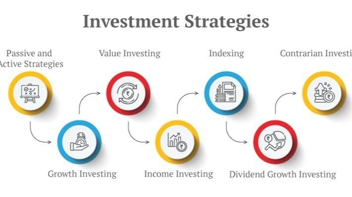

## Table of Contents

## What are the basic principles of investing for beginners?

Investing can seem scary at first, but it's really about making your money work for you over time. The first thing to know is that you should start early. The earlier you start, the more time your money has to grow. This is because of something called compound interest, which is when the money you earn from your investments starts earning money too. Another important principle is to spread out your investments. This is called diversification. It means not putting all your money in one place, like one company or one type of investment. By spreading it out, you lower the risk of losing a lot of money if one investment does badly.

Another key idea is to understand your own comfort with risk. Some investments can be risky but might give you bigger rewards, while others are safer but grow more slowly. It's important to choose investments that match how much risk you're okay with. Finally, always keep learning. The world of investing changes, and staying informed can help you make better choices. Remember, it's okay to start small and grow your investments as you learn more and feel more confident.

## How can someone start investing with a small amount of money?

Starting to invest with a small amount of money is easier than you might think. One of the best ways to begin is by using apps or websites that let you invest small amounts, sometimes as little as a few dollars. These platforms often let you buy pieces of stocks or invest in funds that spread your money across many different investments. This is a great way to start because you can learn about investing without needing a lot of money right away.

Another option is to look into a savings account that earns interest or a certificate of deposit (CD). These are safer ways to grow your money, though they usually grow more slowly than other investments. If you have a little more to start with, you might consider a robo-advisor. These are services that automatically invest your money based on your goals and how much risk you're comfortable with. They can be a good choice because they help you diversify your investments without needing to know a lot about investing yourself.

## What is the difference between stocks, bonds, and mutual funds?

Stocks are like buying a tiny piece of a company. When you buy a stock, you own a part of that company. If the company does well, the value of your stock can go up, and you might get some of the company's profits, which are called dividends. But, if the company does badly, the value of your stock can go down. Stocks can be risky, but they also have the potential to grow a lot over time.

Bonds are different. When you buy a bond, you're lending money to a company or the government. They promise to pay you back the money you lent them, plus some extra, called interest, over a certain period of time. Bonds are usually safer than stocks because you're more likely to get your money back, but they don't usually grow as much as stocks can.

Mutual funds are a way to own a bunch of different investments all at once. When you buy into a mutual fund, your money is pooled with other people's money and used to buy a mix of stocks, bonds, or other investments. This helps spread out the risk because your money isn't all in one place. Mutual funds are managed by professionals who decide what to buy and sell, and they can be a good choice if you want to invest but don't want to pick individual stocks or bonds yourself.

## How does diversification benefit an investment portfolio?

Diversification helps make your investment portfolio safer. It's like not putting all your eggs in one basket. If you invest all your money in one company or one type of investment, and that company or investment does badly, you could lose a lot of money. But if you spread your money across different companies, industries, and types of investments, a problem in one area won't hurt your whole portfolio as much. This way, you lower the chance of losing a lot of money all at once.

Another benefit of diversification is that it can help you make more money over time. Different investments do well at different times. When some of your investments are not doing so great, others might be doing better. This balance can help smooth out the ups and downs of the market. By having a mix of investments, you increase the chances that some part of your portfolio will be growing, even if other parts are not. This can lead to more stable and potentially higher returns in the long run.

## What are the risks associated with different types of investments?

Stocks are risky because their value can go up and down a lot. If a company does badly or something bad happens in the world, the price of the stock can drop fast. This means you could lose money if you need to sell your stocks when their price is low. Also, not all companies pay dividends, so you might not get any extra money while you wait for the stock price to go up. But if you hold onto your stocks for a long time, they can grow a lot and make you more money.

Bonds are usually safer than stocks, but they still have risks. If the company or government you lent money to has money problems, they might not be able to pay you back. This is called default risk. Also, if interest rates go up, the value of your bond can go down because new bonds will pay more interest. So, if you need to sell your bond before it matures, you might get less money than you expected. But overall, bonds are less risky than stocks because they are more likely to give you your money back.

Mutual funds can be a good way to spread out your risk, but they still have risks. Because mutual funds invest in many different things, if a lot of those investments do badly at the same time, the value of your mutual fund can go down. Also, mutual funds have fees that can eat into your returns. The people who manage the mutual fund get paid, and those costs come out of the money the fund makes. So, even if the investments in the fund do well, the fees can make your overall return smaller. But mutual funds can help you diversify and manage risk better than investing in just one stock or bond.

## How can one assess their risk tolerance when planning investment strategies?

Assessing your risk tolerance is about figuring out how much you can handle your investments going up and down without losing sleep. It's important because it helps you pick the right investments for you. To start, think about your goals. Are you saving for something you need soon, like a house, or is it for something far away, like retirement? If it's soon, you might not want to take big risks because you don't have time to wait for your investments to recover if they go down. But if it's far away, you might be okay with more risk because you have time to ride out the ups and downs.

Next, think about how you feel about losing money. Some people can handle seeing their investments drop in value without getting too worried. Others might feel really stressed and want to sell everything as soon as the value goes down. You can test this by imagining different scenarios. What if your investments lost 10% of their value? Would you panic, or would you be okay waiting for them to go back up? Your answers to these questions can help you understand your risk tolerance. Remember, it's okay to start with less risk and slowly take on more as you get more comfortable with investing.

## What role does time horizon play in choosing an investment strategy?

Your time horizon is how long you plan to keep your money invested before you need to use it. It's really important because it helps you decide what kind of investments to pick. If you need your money soon, like in a year or two, you should pick safer investments. That's because you don't have a lot of time for your investments to recover if they go down. Things like savings accounts or short-term bonds are good choices because they are less likely to lose value quickly.

But if you're saving for something far away, like retirement that's 30 years from now, you can take more risks. That's because you have a lot of time for your investments to grow and recover from any dips. Stocks and stock funds can be good choices because they have the potential to grow a lot over time. So, knowing your time horizon helps you match your investments to your goals and how long you can wait for them to pay off.

## What are some common investment strategies for intermediate investors?

Intermediate investors often use a strategy called asset allocation. This means they spread their money across different types of investments like stocks, bonds, and maybe even real estate or commodities. They do this based on their goals, how much risk they can handle, and how long they plan to invest. For example, if they're saving for retirement that's still a few years away, they might put more money in stocks because they can grow a lot over time. But they'll also have some money in bonds to make their portfolio more stable. By balancing these different investments, intermediate investors can aim for good growth while also keeping some safety.

Another common strategy is dollar-cost averaging. This is when an investor puts a fixed amount of money into their investments at regular times, like every month. This helps take the emotion out of investing because you're not trying to guess when the market is high or low. Over time, this can lead to buying more shares when prices are low and fewer when prices are high, which can result in a lower average cost per share. It's a good way for intermediate investors to build their portfolio steadily without worrying too much about short-term market ups and downs.

## How can advanced investors use technical analysis in their investment decisions?

Advanced investors use technical analysis to look at past price movements and trading volumes of stocks or other investments. They use charts and other tools to spot patterns that can help them guess where prices might go next. For example, they might see a pattern called a "head and shoulders" that could mean the price is about to go down. By studying these patterns, advanced investors try to make better choices about when to buy or sell their investments. Technical analysis isn't perfect, and it doesn't always work, but many advanced investors find it helpful because it gives them a way to make decisions based on data instead of just guessing.

Another way advanced investors use technical analysis is by looking at indicators like moving averages and the Relative Strength Index (RSI). Moving averages smooth out price data to show trends over time. For instance, if a short-term moving average crosses above a long-term one, it might be a sign to buy. The RSI helps investors see if a stock is overbought or oversold, which can signal if it's time to sell or buy. By combining different indicators, advanced investors can get a clearer picture of what might happen next with their investments. While technical analysis can be complex, it's a powerful tool for those who take the time to learn it well.

## What are the tax implications of various investment strategies?

When you invest, you need to think about taxes because they can affect how much money you keep at the end. If you make money from your investments, like from selling stocks at a higher price than you bought them or from getting dividends, you have to pay taxes on that money. The tax rate can be different depending on how long you held the investment. If you sell something you owned for less than a year, you pay a higher tax rate on the profit, called short-term capital gains tax. But if you held it for more than a year, you pay a lower long-term capital gains tax. Also, some investments, like municipal bonds, might not be taxed at all, which can be a good choice if you want to keep more of your money.

Another thing to think about is how often you buy and sell investments. If you do it a lot, you might end up paying more in taxes because you keep making profits that get taxed. Some people use a strategy called tax-loss harvesting to help with this. This means they sell investments that have lost value to offset the taxes they owe on their profits. For example, if you made $1,000 from one investment but lost $500 on another, you can use that $500 loss to reduce the taxes you pay on the $1,000 profit. It's smart to think about taxes when you're planning your investments, and sometimes talking to a tax advisor can help you make the best choices.

## How do global economic factors influence investment strategies?

Global economic factors can really change how you should invest your money. Things like interest rates, inflation, and what's happening in different countries' economies can make some investments better or worse. For example, if interest rates go up in the U.S., it might make borrowing money more expensive, which can slow down the economy. This could mean that stocks might not do as well, so you might want to put more money into bonds or other safer investments. Also, if one country's economy is doing really well, you might want to invest in companies from that country because their stocks could go up.

Another big thing to think about is how different countries' economies are connected. If there's a problem in one big economy, like a financial crisis, it can affect other countries too. This is called a global economic impact. For example, if there's a big problem in Europe, it might make people worried about investing in European companies, and that worry can spread to other places. So, it's smart to spread your investments around the world to lower the risk. By paying attention to what's happening in the global economy, you can make better choices about where to put your money and when to change your investment strategy.

## What advanced strategies can be used to hedge against market volatility?

One way to hedge against market [volatility](/wiki/volatility-trading-strategies) is by using options. Options are like contracts that give you the right to buy or sell an investment at a certain price before a certain time. You can use options to protect your investments. For example, if you own a stock and you're worried it might go down, you can buy a "put" option. This option lets you sell the stock at a set price, even if the market price goes lower. It's like an insurance policy for your investment. Another way is to use "call" options to bet on a stock going up without buying the stock itself, which can help balance out losses in other parts of your portfolio.

Another strategy is to invest in assets that usually move in the opposite direction of the stock market. Gold is a good example of this. When the stock market goes down, people often buy gold because it's seen as a safe place to put money. By having some of your money in gold, you can protect your portfolio from big drops in the stock market. You can also look into inverse ETFs, which are funds designed to go up when the market goes down. These can be risky, but they can help you make money or at least lose less when the market is volatile.

Diversification is also key to hedging against market volatility. Instead of putting all your money in one place, you spread it out across different types of investments, like stocks, bonds, real estate, and commodities. This way, if one part of your portfolio goes down, other parts might go up or stay the same, balancing out your overall risk. By mixing different kinds of investments, you can make your portfolio more stable and less likely to be hurt by sudden changes in the market.

## What are Trend-Following Strategies?

Trend-following strategies represent a widely adopted approach in [algorithmic trading](/wiki/algorithmic-trading), primarily due to their reliance on observable market trends rather than speculative predictions. At the core of these strategies is the analysis of price movements and the application of various technical indicators. Among these indicators, moving averages hold significant importance.

Moving averages, such as the 50-day and 200-day moving averages, are simple yet powerful tools used to smooth out price data, thereby identifying prevailing market trends. These moving averages are calculated by averaging a security's price over a specified number of periods. The 50-day moving average, for example, sums the daily closing prices of a security over the past 50 days and divides by 50. The formula for a simple moving average (SMA) is given by:

$$
\text{SMA}_n = \frac{P_1 + P_2 + \cdots + P_n}{n}
$$

where $P_i$ represents the price at each of the $n$ observations.

The interaction between short-term and long-term moving averages aids traders in generating buy or sell signals. A commonly employed technique is the moving average crossover. For instance, a buy signal is generated when the 50-day moving average crosses above the 200-day moving average, suggesting a potential upward trend. Conversely, a sell signal may occur when the 50-day moving average crosses below the 200-day moving average, indicating a possible downward trend.

The appeal of trend-following strategies lies in their simplicity and their effectiveness in capturing market [momentum](/wiki/momentum). Unlike strategies that require forecasting future price movements, trend-following strategies capitalize on existing price patterns and trends. This characteristic reduces the reliance on predicting market directions, instead leveraging current market dynamics.

In practice, traders may use trend-following strategies to benefit from prolonged price movements, whether upward or downward. These strategies are adaptable to various market conditions and asset classes, providing flexibility and broad applicability. Despite their straightforward nature, successful implementation demands rigorous analysis and a disciplined approach, emphasizing the importance of adhering to pre-defined entry and [exit](/wiki/exit-strategy) criteria to mitigate risks.

Overall, trend-following strategies offer algorithmic traders a robust framework for harnessing market momentum and achieving consistent returns over time.

## What are Mean Reversion Strategies?

Mean reversion strategies in algorithmic trading operate on the concept that asset prices oscillate around their historical average or mean. This concept is grounded in the statistical premise that extreme price movements are frequently followed by reversals, where prices return to an average level. 

Algorithms used in mean reversion aim to identify assets that exhibit deviation from their average price level. When an asset's price significantly diverges from its mean, the algorithm anticipates an eventual reversal and initiates trades based on this prediction. These mechanisms typically buy undervalued assets—those trading below the mean—and sell overvalued ones—those trading above the mean. The fundamental goal is to capitalize on the expected return of the asset's price to its historical average.

The execution of mean reversion strategies necessitates a robust statistical framework. Statistically, the identification of mean reversion can be articulated using metrics such as the Z-score, which measures the number of standard deviations a data point is from the mean. A high Z-score implies that the price is significantly away from the mean and might be due for a reversal. The Z-score can be calculated using the formula:

$$

Z = \frac{(X - \mu)}{\sigma} 
$$

where $X$ is the current price, $\mu$ is the historical mean, and $\sigma$ is the standard deviation of the asset's price.

Additionally, real-time market analysis is critical for the effectiveness of these strategies. Market conditions are dynamic, and statistical models must be updated with real-time data to accurately reflect current market states. Algorithms should also be equipped to process vast amounts of data swiftly to detect deviations and execute trades efficiently before the market self-corrects and erodes potential profits.

Implementation of mean reversion strategies involves rigorous [backtesting](/wiki/backtesting) using historical data to fine-tune the parameters of the model and assess its predictive power. Traders must also consider transaction costs and market impact, which can influence the realized gains from the strategy. Continuous monitoring and adaptation of the algorithms are necessary to align with changing market behaviors and maintain profitability.

## What are Mathematical Model-Based Strategies?

Mathematical model-based strategies in algorithmic trading use sophisticated mathematical and statistical techniques to inform trading decisions. These strategies often involve developing and analyzing quantitative models that help traders navigate complex and dynamic financial markets with high precision and sophistication.

One prominent example of these strategies is delta-neutral trading. Delta-neutral trading is a type of options strategy that seeks to minimize the directional risk of price movements in the underlying asset. By balancing positions between the options and the underlying assets, traders attempt to maintain a delta, or price sensitivity, that nets to zero. This effectively neutralizes the effect of the price movement of the underlying asset on the overall portfolio. Delta ($\Delta$) represents the rate of change of the option's theoretical value for a one-unit change in the price of the underlying asset. In mathematical terms, this is expressed as:

$$
\Delta = \frac{\partial V}{\partial S}
$$

where $V$ is the option's value and $S$ is the price of the underlying asset. Achieving a delta-neutral position often involves frequent rebalancing of the portfolio in response to changes in the underlying asset's price, volatility, and time decay.

The complexity of model-based strategies requires extensive computational power and expertise in quantitative finance and financial engineering. These models often incorporate a wide range of variables and assumptions that need precise calibrations to reflect current market conditions accurately. Traders use tools like Monte Carlo simulations, stochastic calculus, and various optimization techniques to model and predict financial outcomes.

Moreover, the reliance on vast datasets necessitates the use of advanced computational technology to process and analyze complex data quickly. This processing power is vital for real-time trading scenarios where decisions need to be made in fractions of a second. High-performance computing infrastructure, including parallel processing, cloud computing, and advanced algorithms, plays a critical role in the successful deployment of these strategies.

Despite their potential profitability, mathematical model-based strategies face challenges such as evolving market dynamics which can render existing models obsolete. Additionally, these strategies are heavily dependent on the accuracy and timeliness of market data. Any discrepancies in data integrity can significantly impair the model's predictive power and trading efficacy. Therefore, continuous monitoring, adjustment, and validation of models are necessary to maintain their relevance and accuracy in volatile markets.

Furthermore, while these strategies can shield traders from certain types of market risk, they are not without their own inherent risks. Market conditions can fluctuate rapidly, and misestimations in model parameters or computational errors can lead to significant losses. Therefore, a robust risk management framework and thorough backtesting of strategies using historical data are crucial components of the execution process.

## References & Further Reading

[1]: Aldridge, I. (2013). ["High-Frequency Trading: A Practical Guide to Algorithmic Strategies and Trading Systems"](https://www.amazon.com/High-Frequency-Trading-Practical-Algorithmic-Strategies/dp/1118343506). Wiley.

[2]: Narang, R. P. (2009). ["Inside the Black Box: A Simple Guide to Quantitative and High Frequency Trading"](https://onlinelibrary.wiley.com/doi/book/10.1002/9781118267738). Wiley.

[3]: Kissell, R. (2013). ["The Science of Algorithmic Trading and Portfolio Management"](https://www.sciencedirect.com/book/9780124016897/the-science-of-algorithmic-trading-and-portfolio-management). Academic Press.

[4]: Chan, E. P. (2017). ["Algorithmic Trading: Winning Strategies and Their Rationale"](https://github.com/ftvision/quant_trading_echan_book). Wiley.

[5]: Cartea, A., Jaimungal, S., & Penalva, J. (2015). ["Algorithmic and High-Frequency Trading"](https://assets.cambridge.org/97811070/91146/frontmatter/9781107091146_frontmatter.pdf). Cambridge University Press.