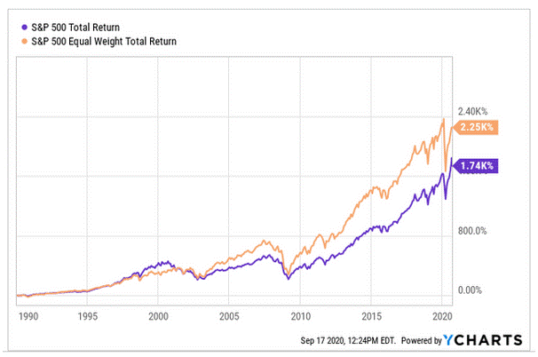

In today's fast-paced financial environment, having a long-term investment strategy is crucial for successfully navigating market volatility and achieving financial goals. A well-crafted strategy not only helps in mitigating risks but also in capitalizing on potential growth opportunities over time. Long-term investments provide a stable pathway for wealth accumulation, utilizing the principles of compounding to maximize returns. Consistent investment in well-researched funds or stocks allows investors to endure market fluctuations and emerge profitably in the future. 

One of the most popular investment vehicles for long-term strategies is the S&P 500 Exchange-Traded Fund (ETF). The S&P 500 ETF tracks the S&P 500 Index, which represents 500 of the largest companies listed on stock exchanges in the United States. Due to its broad market exposure, historical performance, and diversification benefits, the S&P 500 is considered a reliable benchmark for U.S. equity markets. Investing in S&P 500 ETFs allows individuals to gain access to a diversified portfolio that mirrors the performance of this index, often at lower costs compared to actively managed funds. This makes it an attractive option for investors aiming for steady growth over the long term.



As investment landscapes evolve, algorithmic trading has become an increasingly significant tool in managing investment portfolios. Algorithmic trading involves using computer algorithms to execute trades at high speed and efficiency, often implementing pre-defined strategies that minimize human errors. Its role is becoming more pronounced with advancements in technology and data analytics. Algorithms can process vast amounts of financial data quickly, enabling traders to identify patterns and trends that inform better decision-making. As a result, more investors are embracing algorithmic trading to enhance their portfolios' performance and manage volatility more effectively. By integrating algorithmic trading with traditional investment approaches, such as investing in S&P 500 ETFs, investors can optimize trade executions, improve liquidity, and ultimately boost the returns on their long-term investments.

## Table of Contents

## Understanding S&P 500 ETFs

Exchange-traded funds (ETFs) are investment funds traded on stock exchanges, much like stocks. They hold assets such as stocks, commodities, or bonds and generally operate with an arbitrage mechanism designed to keep trading close to its net asset value, though deviations can occasionally occur. ETFs are favored by investors due to their flexibility, ability to be traded throughout the trading day at market prices, and cost-effectiveness compared to mutual funds.

The S&P 500 Index is a stock market index that measures the stock performance of 500 large companies listed on stock exchanges in the United States. It is one of the most commonly followed equity indices and is considered a benchmark of the overall stock market and the U.S. economy. The index is weighted by market capitalization, meaning that companies with higher market values have a greater impact on the index's performance.

Investing in S&P 500 ETFs offers several advantages. One key benefit is diversification. By investing in an S&P 500 ETF, an investor gains exposure to a broad cross-section of industries and sectors within the U.S. economy, reducing the risk associated with holding individual stocks. This is particularly advantageous for investors seeking to minimize risk and achieve steady returns over the long term.

Cost-efficiency is another significant advantage. ETFs typically have lower expense ratios compared to traditional mutual funds. The passive management approach of tracking an index like the S&P 500 substantially lowers operational costs. This is especially beneficial for retail investors looking to minimize fees and maximize their overall returns.

Moreover, S&P 500 ETFs provide [liquidity](/wiki/liquidity-risk-premium), as they can be easily bought and sold on the stock exchange, allowing investors to enter and [exit](/wiki/exit-strategy) positions with ease. This flexibility makes them an attractive option for investors ranging from individuals to institutional players.

In summary, S&P 500 ETFs operate efficiently within the financial market, providing investors with diversified, cost-effective, and liquid investment options. Their alignment with the well-regarded S&P 500 Index makes them a popular choice for those seeking a reliable vehicle for long-term investment.

## The Role of Algorithmic Trading in Investments

Algorithmic trading refers to the use of computer algorithms to automatically execute trading orders. It is designed to leverage the speed and precision of computer systems to handle complex and large-[volume](/wiki/volume-trading-strategy) transactions, outperforming human capabilities. Key benefits of [algorithmic trading](/wiki/algorithmic-trading) include increased speed, enhanced efficiency, and a significant reduction in human error, which can lead to more favorable investment outcomes. 

### Explanation of Algorithmic Trading and Its Benefits

Algorithmic trading is fundamentally about using algorithms to analyze market conditions and execute buy or sell orders at optimal conditions. Its primary benefits include:

1. **Speed**: Computers can process data and execute trades much faster than humans. This is crucial in financial markets where the ability to react quickly to market changes can lead to significant gains or prevent substantial losses.

2. **Efficiency**: Algorithms can run complex data analyses continuously and consistently, optimizing trading strategies and minimizing the need for constant human supervision.

3. **Reduced Human Error**: By relying on algorithms, traders can bypass emotional biases that often lead to poor decision-making. This is particularly important in highly volatile markets where panic or overconfidence might skew judgment.

### Common Strategies Used in Algorithmic Trading

Several strategies are employed in algorithmic trading to capitalize on different market conditions:

- **Statistical Arbitrage**: This strategy involves the exploitation of price inefficiencies between related financial instruments. It employs advanced econometric and statistical techniques to predict price movements and execute trades based on those predictions.

- **Trend Following**: This strategy capitalizes on the momentum of a market trend. Algorithms identify trends in price movements and execute trades accordingly, assuming that prices will continue in their current direction, whether upward or downward.

### How Algorithmic Trading Complements S&P 500 ETF Investments

Algorithmic trading enhances S&P 500 [ETF](/wiki/etf-trading-strategies) investments chiefly through improved execution and liquidity. High-frequency trading algorithms can make fractional price improvements on large orders, leading to cost savings over time. Furthermore, by providing liquidity to the market, algorithmic trading helps make transactions more seamless and less costly for all participants.

When these algorithms are applied to the S&P 500 ETFs, they ensure that trades are executed at the best possible times and prices. This enhances the tracking efficiency of these ETFs against their benchmark index, minimizing tracking errors and potentially increasing returns for investors. As a result, investors benefit not only from the built-in diversification of S&P 500 ETFs but also from more refined execution strategies that algorithmic trading provides.

## Long-term Investment Strategies Using S&P 500 ETFs

The concept of compounding returns plays a pivotal role in long-term investment strategies, particularly when utilizing S&P 500 ETFs. Compounding refers to the process where the earnings from an investment generate additional earnings over time. This snowball effect can lead to substantial growth in the value of an investment portfolio. The mathematical representation of compound interest is given by the formula:

$$
A = P \left(1 + \frac{r}{n}\right)^{nt}
$$

where $A$ is the amount of money accumulated after n years, including interest, $P$ is the principal amount, $r$ is the annual interest rate, $n$ is the number of times that interest is compounded per year, and $t$ is the time in years.

Historically, the S&P 500 has consistently delivered a notable average annual return, making it an attractive option for long-term investors. For instance, from its inception in 1926 until recent years, the average annual return of the S&P 500 has been approximately 10%. This highlights the potential gains achievable through compounding, as reinvested dividends and price appreciation contribute to the overall increase in the ETF's value.

Using dollar-cost averaging (DCA) is a pragmatic approach for scheduling regular investments in S&P 500 ETFs. DCA involves investing a fixed dollar amount into a financial asset at regular intervals, regardless of its price. This strategy mitigates the impact of [volatility](/wiki/volatility-trading-strategies) due to purchasing more shares when prices are low and fewer shares when prices are high. By spreading out purchases, investors can reduce the risk of investing a large sum in a single time period marked by high prices, thereby achieving a lower average cost per share over time.

For example, consider an investor who decides to invest $500 monthly in an S&P 500 ETF. Over time, this systematic investment process provides the investor with varying numbers of shares based on market conditions, potentially leading to a lower average purchase price and enhanced returns in the long term.

The approach advocated by Warren Buffett for investing in the S&P 500 emphasizes patience and consistency. Buffett, a proponent of passive investing, often highlights the importance of holding a diversified portfolio for extended periods, capitalizing on the stock market's long-term upward trajectory. His investment philosophy underscores the benefits of staying the [course](/wiki/best-algorithmic-trading-courses) despite market fluctuations and avoiding the temptation to time the market.

By focusing on the fundamentals of the S&P 500 and adopting a disciplined investment approach, investors can harness the power of compounding returns and leverage strategies like dollar-cost averaging. This aligns with Buffett's methodology, encouraging investors to maintain a long-term perspective, prioritize consistent contributions, and remain steadfast through market cycles.

## Integrating Algorithmic Trading with S&P 500 ETFs

Integrating algorithmic trading with S&P 500 ETFs involves several key steps to enhance investment efficiency through automation. These steps include strategy development, platform selection, and rigorous [backtesting](/wiki/backtesting).

### Steps to Develop and Deploy Algorithmic Trading Strategies for ETFs

1. **Define the Trading Objective**: Establish clear goals, such as optimizing long-term returns or minimizing risk. The focus could be on deploying strategies that exploit inefficiencies in price movements or automate standard investment tactics like dollar-cost averaging.

2. **Select a Trading Strategy**: Choose from common algorithmic strategies such as statistical arbitrage, mean reversion, or momentum-based approaches tailored to the S&P 500 ETFs. These strategies should align with the trader's financial objectives and risk tolerance.

3. **Develop the Algorithm**: Code the chosen strategy in a programming language like Python. For example, a simple moving average crossover strategy could be implemented as follows:

   ```python
   import numpy as np

   def moving_average(data, window_size):
       return np.convolve(data, np.ones(window_size)/window_size, mode='valid')

   def crossover_strategy(data, short_window, long_window):
       short_mavg = moving_average(data, short_window)
       long_mavg = moving_average(data, long_window)

       # Generate signals
       signals = np.where(short_mavg > long_mavg, 1, 0)  # 1 for Buy, 0 for Sell
       return signals
   ```

4. **Platform Integration**: Implement the developed algorithm on a compatible trading platform. Several platforms like Interactive Brokers, MetaTrader, and QuantConnect support algorithmic trading of ETFs, offering APIs for seamless strategy execution and integration with market data.

5. **Risk Management**: Incorporate risk management protocols into the algorithm to handle unforeseen market conditions. Techniques might include stop-loss orders or dynamic asset reallocation based on volatility measures.

### Platforms that Support Algorithmic Trading

- **Interactive Brokers**: Offers a robust API supporting various programming languages and direct access to U.S. markets, including S&P 500 ETFs.
- **QuantConnect**: An open-source algorithmic trading platform enabling backtesting and deployment of strategies in Python and C#, providing historical data for several ETFs.
- **MetaTrader 5**: Provides algorithmic trading services and is known for its user-friendly interface, although mainly associated with forex and CFD markets. 

### The Importance of Backtesting Trading Strategies

Backtesting is a crucial phase that involves testing the trading algorithm against historical market data to evaluate its effectiveness. It helps in identifying the strengths and potential pitfalls of the strategy before actual deployment. Backtesting enables an assessment of performance metrics such as:

- **Sharpe Ratio**: Measures risk-adjusted returns.
$$
  \text{Sharpe Ratio} = \frac{R_p - R_f}{\sigma_p}

$$

  where $R_p$ is the portfolio return, $R_f$ is the risk-free rate, and $\sigma_p$ is the standard deviation of portfolio excess return.

- **Maximum Drawdown**: Evaluates the greatest peak-to-trough decline over a specific period, indicating risk exposure.

Effective backtesting requires a comprehensive dataset and should simulate realistic trading conditions, including transaction costs and slippage, to ensure fidelity. By fine-tuning algorithms based on backtest results, traders can confidently transition to live trading, thereby enhancing the likelihood of achieving desired investment outcomes with S&P 500 ETFs.

## Case Studies and Expert Opinions

### Case Studies and Expert Opinions

Insights from financial experts reveal that algorithmic trading has revolutionized the management of Exchange-Traded Funds (ETFs), bringing forth a paradigm shift in investment strategies. A notable advocate of ETFs is John C. Bogle, founder of Vanguard Group, who emphasized the efficiency and cost-effectiveness of index funds, including those tracking the S&P 500. Financial experts like Andrew Lo, a professor at MIT Sloan School of Management, have underscored the role of algorithmic trading in enhancing market liquidity and execution quality for ETFs.

#### Success Stories

A compelling success story in the integration of algorithmic trading with ETFs is represented by Renaissance Technologies, a pioneering [hedge fund](/wiki/hedge-fund-trading-strategies) led by Jim Simons. Renaissance's Medallion Fund leverages complex mathematical models to inform its algorithmic trading strategies, resulting in extraordinary returns. By focusing on short-term predictions and exploiting micro-level market inefficiencies, Renaissance effectively optimizes its ETF investments, underscoring the power of algorithmic trading.

Another success story involves large asset management firms, such as BlackRock, which have adopted algorithmic strategies for their ETF offerings. BlackRock's iShares brand utilizes quantitative algorithms to adjust asset allocations in response to market changes, minimizing transaction costs and optimizing portfolio performance.

#### Cautionary Tales

Despite the successes, there are cautionary tales that illustrate the risks associated with algorithmic trading. The "Flash Crash" of May 6, 2010, is a prominent example. On this day, the Dow Jones Industrial Average experienced a rapid decline and recovery within minutes, largely attributed to high-frequency trading algorithms. This incident highlighted the potential volatility and systemic risks that can arise from algorithmic trading, especially in the ETF domain where liquidity mismatches can be more pronounced.

#### Predictions on Future Trends

Looking ahead, financial experts anticipate several trends in the interplay between ETFs and algorithmic trading. First, the prevalence of Artificial Intelligence (AI) and Machine Learning (ML) in trading algorithms is expected to grow. These technologies can enhance pattern recognition and predictive accuracy, enabling more sophisticated ETF trading strategies.

Moreover, the ongoing democratization of algorithmic trading platforms is likely to empower a broader range of investors to implement algorithmic strategies with ETFs. Platforms such as QuantConnect and TradeStation are reducing the barriers to entry for retail investors, allowing them to code, backtest, and deploy trading algorithms.

Finally, as regulatory frameworks around algorithmic trading become more rigorous, there will be a focus on ensuring stability and transparency in the ETF market. Regulators are expected to implement measures to prevent market disruptions caused by errant algorithms, which will shape the future landscape of ETF investments.

In conclusion, the integration of algorithmic trading with ETFs presents both opportunities and challenges. The key to leveraging these strategies lies in a careful balance of innovation, risk management, and adherence to regulatory standards. As technology continues to evolve, investors who remain agile and informed are likely to benefit the most from these advancements.

## Conclusion

Combining S&P 500 ETFs with algorithmic trading presents a compelling opportunity for investors seeking robust long-term investment strategies. The integration of these two elements offers several potential benefits that can significantly enhance portfolio performance. S&P 500 ETFs provide a diversified, cost-effective means of gaining exposure to the market, capitalizing on the historical growth trajectory of major US companies. Their track record of delivering compounding returns makes them a solid choice for those with long-term horizons.

Algorithmic trading, with its ability to execute trades with speed and precision, complements the traditional investment approach by optimizing trade execution and enhancing liquidity. Algorithms can reduce human error and emotional bias while enabling the application of advanced strategies such as statistical [arbitrage](/wiki/arbitrage) and [trend following](/wiki/trend-following). These strategies can be automated to respond to market volatility, ensuring positions are adjusted promptly according to predetermined criteria.

Investors are encouraged to continuously learn and adapt to ever-evolving market dynamics. Emphasis should be placed on staying updated with technological advancements and regulatory changes in the financial sector, as these can influence both algorithmic trading efficiency and ETF performance. The investment landscape is continuously evolving; hence, an informed and flexible approach is crucial for sustained success.

In conclusion, by leveraging the foundational stability of S&P 500 ETFs and the technical advantages of algorithmic trading, investors are well-positioned to optimize their portfolios. This combination not only aims to enhance returns but also manages risks effectively in an increasingly complex financial environment. Adopting these strategies could lead to improved financial outcomes and more resilient investment portfolios over the long term.

## References & Further Reading

### Academic Papers, Articles, and Books

1. **"Exchange-Traded Funds in Corporate Bond Markets"** by Ekkehart Boehmer and Xiaoxia Lou. This paper explores the effects of ETFs on market liquidity and volatility, providing insights into how ETFs influence the broader financial markets. It can be found in the Journal of Financial Economics.

2. **"Algorithmic Trading and Information"** by Terrence Hendershott, Charles M. Jones, and Albert J. Menkveld. This paper discusses how algorithmic trading impacts financial markets, specifically addressing the implications for market efficiency and price discovery. Available in the Journal of Financial and Quantitative Analysis.

3. **"A Random Walk Down Wall Street"** by Burton G. Malkiel. This book is a classic reference for understanding various investment strategies, including the use of index funds such as ETFs. Malkiel provides a compelling case for long-term, passive investing.

4. **"The Man Who Solved the Market"** by Gregory Zuckerman. By detailing the career of Jim Simons and Renaissance Technologies, this book provides a narrative on the development and success of algorithmic trading strategies.

5. **"Quantitative Finance: A Simulation-Based Introduction Using Excel"** by Matt Davison. This text offers an introduction to quantitative trading and finance through simulations, providing practical examples and exercises. Particularly helpful for understanding the modeling of financial instruments like ETFs.

### Online Resources for Beginners in Algorithmic Trading

- **QuantInsti [quantinsti.com]**: An educational platform offering courses on algorithmic trading strategies and the use of various tools to implement these strategies efficiently.

- **Kaggle [kaggle.com]**: A platform to engage in practical machine learning problems related to finance and algorithmic trading. It provides datasets and kernels for experimentation.

- **AlgoTrading101 [algotrading101.com]**: This site provides tutorials and blog posts about the fundamental concepts and strategies in algorithmic trading, tailored for beginners.

### Financial Blogs and Podcasts for Long-Term Investment

- **The Reformed Broker [thereformedbroker.com]**: Run by Josh Brown, the blog provides thoughtful commentary on investment strategies, including the use of ETFs.

- **A Wealth of Common Sense [awealthofcommonsense.com]**: Ben Carlson offers insights into practical investment strategies, emphasizing long-term wealth-building using tools like ETFs.

- **Animal Spirits Podcast [animalspiritspod.libsyn.com]**: Hosted by Michael Batnick and Ben Carlson, this podcast covers various investment topics and includes discussions on ETFs and algorithmic trading's role in investment management.

These resources offer valuable knowledge and practical insights for those interested in incorporating ETFs and algorithmic trading into their long-term investment strategies.

