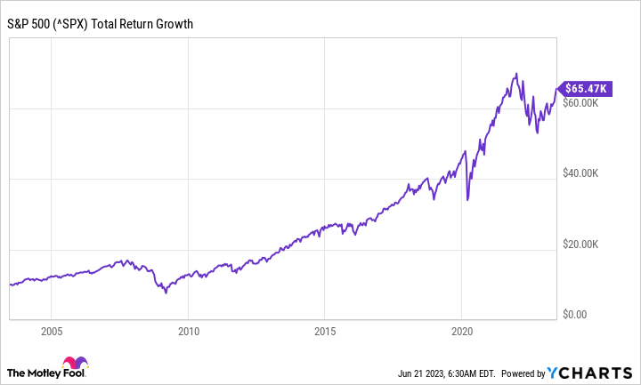

## Table of Contents

## What is an S&P 500 ETF?

An S&P 500 ETF is a type of investment fund that tracks the performance of the S&P 500 index. The S&P 500 is a collection of 500 of the largest companies in the United States, and it is often used as a benchmark to measure the overall health of the stock market. When you invest in an S&P 500 ETF, you are essentially buying a small piece of each of these 500 companies, which helps spread out your risk compared to investing in just one or a few stocks.

ETFs, or exchange-traded funds, are popular because they are easy to buy and sell, just like stocks. They also have lower fees than many other types of funds. By investing in an S&P 500 ETF, you can get a diversified investment that reflects the overall performance of the U.S. economy without having to pick individual stocks yourself. This makes it a good option for both new and experienced investors looking for a simple way to grow their money over time.

## Why should someone consider investing in an S&P 500 ETF?

Someone should consider investing in an S&P 500 ETF because it offers a simple and effective way to grow their money. By investing in an S&P 500 ETF, you get to own a small part of 500 of the biggest companies in the U.S. This means your money is spread out across many different businesses, which can help reduce risk. Instead of trying to pick which individual stocks might do well, you can invest in the overall performance of the U.S. economy, which has historically grown over time.

Another reason to consider an S&P 500 [ETF](/wiki/etf-trading-strategies) is that it's easy to buy and sell, just like a regular stock. Plus, these funds usually have lower fees than other types of investments, which means more of your money stays invested and working for you. Over many years, the lower costs can make a big difference in how much your investment grows. So, if you're looking for a straightforward way to invest without spending a lot of time or money, an S&P 500 ETF could be a great choice.

## How does the S&P 500 perform historically?

The S&P 500 has a long history of going up over time. If you look at the past 50 years or so, the S&P 500 has given investors an average return of about 10% per year. This means if you had put $100 into the S&P 500 50 years ago, it would be worth a lot more today. But, it's important to know that the S&P 500 can go up and down a lot in shorter periods. There have been times, like during the financial crisis in 2008, when it lost a lot of value quickly. But over many years, it has always come back and kept growing.

Even though the S&P 500 has done well over the long run, it doesn't mean it will always go up. There are times when the market can be scary, and it might make you want to sell your investments. But if you can wait and not sell when things are bad, history shows that the S&P 500 usually recovers and continues to grow. This is why many people say that investing in the S&P 500 is a good idea if you're planning to keep your money invested for a long time, like 10 or 20 years or more.

## What is the impact of investing $10,000 in an S&P 500 ETF for 20 years?

If you invest $10,000 in an S&P 500 ETF and keep it there for 20 years, you could see a big growth in your money. The S&P 500 has given an average return of about 10% per year over the long term. This means that after 20 years, your $10,000 could grow to around $67,275. This is because of the power of compound interest, where your money earns money on the money it has already earned.

However, it's important to remember that the stock market can be up and down. There might be times during those 20 years when the value of your investment goes down a lot. But if you can stay patient and not sell during the tough times, history shows that the S&P 500 usually recovers and continues to grow. So, investing in an S&P 500 ETF for the long term can be a smart way to grow your money if you are willing to wait it out.

## What are the risks associated with investing in the S&P 500?

Investing in the S&P 500, like any investment, comes with risks. One big risk is that the value of your investment can go down. Sometimes, the stock market can drop a lot, and it might take a while for it to come back up. This can be scary, especially if you need to take your money out when the market is down. Another risk is that even though the S&P 500 has done well over many years, there's no guarantee it will keep doing well in the future. Things like a bad economy, wars, or big changes in the world can affect the market and make your investment lose value.

Another thing to think about is inflation. Inflation means that over time, the value of money goes down. If the S&P 500 doesn't grow faster than inflation, your money won't be worth as much in the future. Also, even though an S&P 500 ETF is a good way to spread out your risk by owning many different companies, it's still tied to how the U.S. economy does. If the U.S. economy has a hard time, your investment could go down too. So, it's important to understand these risks and think about how long you can keep your money invested before you might need it.

## How does dollar-cost averaging apply to an S&P 500 ETF investment?

Dollar-cost averaging is a way to invest in an S&P 500 ETF by putting in a set amount of money at regular times, like every month or every paycheck. Instead of trying to guess when the market is at its lowest to buy, you just keep buying the same amount no matter what the price is. This means sometimes you'll buy when the price is high, and sometimes when it's low. Over time, this can help you pay a lower average price for your shares because you're not trying to time the market.

This strategy can be really helpful because it takes away the stress of trying to figure out the best time to invest. It also helps you keep investing even when the market is going down, which can be hard to do. By sticking to a plan of putting in a little money regularly, you can build up a big investment in the S&P 500 over time without worrying about short-term ups and downs.

## What are the tax implications of holding an S&P 500 ETF for 20 years?

When you hold an S&P 500 ETF for a long time like 20 years, you need to think about taxes. If you sell your ETF shares after holding them for more than a year, you'll pay a long-term capital gains tax. This tax rate is usually lower than the tax you pay on money you earn from working. The exact rate depends on your income and how much you made from selling the ETF. If your income is low, you might not have to pay any tax on your gains.

There's another tax to think about if your S&P 500 ETF pays dividends. Dividends are payments the ETF makes to you from the profits of the companies it holds. These dividends are usually taxed as regular income, but if they are qualified dividends, they might be taxed at the lower long-term capital gains rate. Over 20 years, these taxes can add up, so it's good to think about them when you're planning your investment. Talking to a tax advisor can help you understand how these taxes will affect your money.

## How does inflation affect the real returns of an S&P 500 ETF investment?

Inflation can lower the real value of your money over time. When you invest in an S&P 500 ETF, you want your money to grow faster than inflation so you can buy the same things or more in the future. If the S&P 500 only grows at the same rate as inflation, your investment's real value stays the same. But if it grows slower than inflation, your money will be worth less in the future.

Over the past few decades, the S&P 500 has usually grown faster than inflation. This means if you hold an S&P 500 ETF for a long time, like 20 years, your money is likely to keep up with or beat inflation. But it's important to remember that inflation can change a lot, and there might be times when it's higher than usual. So, even though the S&P 500 has a good track record, you should always keep an eye on inflation to make sure your investment is still doing well.

## What are the fees associated with S&P 500 ETFs and how do they impact long-term returns?

S&P 500 ETFs come with fees that can affect how much money you make over time. These fees are called expense ratios, and they are a small percentage of your investment that the fund takes each year to cover its costs. The expense ratio for S&P 500 ETFs can be very low, often around 0.03% to 0.10%. This means if you have $10,000 invested, you might pay between $3 and $10 in fees each year. Even though these fees seem small, they can add up over many years.

Over a long time, like 20 years, these fees can make a big difference in your returns. If you invest $10,000 in an S&P 500 ETF with a 10% annual return, a 0.03% fee might seem tiny. But over 20 years, that fee could take away about $1,000 from your total earnings. A higher fee, like 0.10%, could take away even more, around $3,000. So, it's a good idea to look for ETFs with the lowest fees to keep more of your money growing over time.

## How does the choice of S&P 500 ETF (e.g., VOO, SPY, IVV) affect investment outcomes?

The choice of S&P 500 ETF, like VOO, SPY, or IVV, can affect your investment outcomes mainly because of their different fees and how easy they are to buy and sell. VOO, which is from Vanguard, has a very low expense ratio of about 0.03%. This means you pay less in fees, so more of your money can grow over time. SPY, from State Street, is one of the oldest and most traded ETFs, making it easy to buy and sell. But it has a higher expense ratio of around 0.09%. IVV, from BlackRock's iShares, has a fee of about 0.03%, similar to VOO, but it might be traded less often than SPY.

Over many years, the difference in fees can add up. If you invest $10,000 for 20 years, the lower fees of VOO and IVV can help you keep more of your money compared to SPY. But if you like to buy and sell often, SPY might be better for you because it's very liquid, meaning it's easy to trade without affecting the price much. So, if you're planning to hold your investment for a long time and want to save on fees, VOO or IVV might be a better choice. If you need to trade often, SPY's [liquidity](/wiki/liquidity-risk-premium) could be more important to you.

## What are the considerations for rebalancing a portfolio that includes an S&P 500 ETF?

Rebalancing a portfolio that includes an S&P 500 ETF means making sure your investments stay in line with your plan. Over time, the value of different parts of your portfolio can change. If the S&P 500 ETF grows a lot, it might become a bigger part of your portfolio than you wanted. To fix this, you might sell some of the ETF and buy other investments to get back to your original plan. This helps keep your risk level the same and makes sure your money is spread out the way you want.

When you're thinking about rebalancing, you should look at how often you want to do it. Some people rebalance every year, while others do it every few years. It depends on how much time you want to spend on your investments and how much you want to pay in fees. Every time you buy or sell, you might have to pay some money, so you want to make sure rebalancing is worth it. Also, think about your goals and how the market is doing. If the market goes up or down a lot, you might want to rebalance more often to keep your portfolio balanced.

## How can advanced investors use options strategies to enhance returns on an S&P 500 ETF investment?

Advanced investors can use options strategies to try to make more money from their S&P 500 ETF investments. One way to do this is by selling covered calls. This means you own the S&P 500 ETF and then sell someone else the right to buy it from you at a certain price by a certain date. You get money for selling this right, which can add to your income. But if the ETF's price goes up a lot, you might have to sell it at the lower price you agreed on. So, it's a way to make extra money, but it can limit how much you can make if the market goes up a lot.

Another strategy is buying protective puts. This is like buying insurance for your S&P 500 ETF. You pay money to have the right to sell your ETF at a certain price, even if the market goes down a lot. This can help you not lose as much money if the market drops. But, you have to pay for this insurance, which can lower your overall returns if the market stays the same or goes up. Using options can be tricky and comes with more risk, so it's important for advanced investors to really understand what they're doing before they start.

## What are Long-term Investment Strategies Using S&P 500 ETFs?

The concept of compounding returns plays a pivotal role in long-term investment strategies, particularly when utilizing S&P 500 ETFs. Compounding refers to the process where the earnings from an investment generate additional earnings over time. This snowball effect can lead to substantial growth in the value of an investment portfolio. The mathematical representation of compound interest is given by the formula:

$$
A = P \left(1 + \frac{r}{n}\right)^{nt}
$$

where $A$ is the amount of money accumulated after n years, including interest, $P$ is the principal amount, $r$ is the annual interest rate, $n$ is the number of times that interest is compounded per year, and $t$ is the time in years.

Historically, the S&P 500 has consistently delivered a notable average annual return, making it an attractive option for long-term investors. For instance, from its inception in 1926 until recent years, the average annual return of the S&P 500 has been approximately 10%. This highlights the potential gains achievable through compounding, as reinvested dividends and price appreciation contribute to the overall increase in the ETF's value.

Using dollar-cost averaging (DCA) is a pragmatic approach for scheduling regular investments in S&P 500 ETFs. DCA involves investing a fixed dollar amount into a financial asset at regular intervals, regardless of its price. This strategy mitigates the impact of [volatility](/wiki/volatility-trading-strategies) due to purchasing more shares when prices are low and fewer shares when prices are high. By spreading out purchases, investors can reduce the risk of investing a large sum in a single time period marked by high prices, thereby achieving a lower average cost per share over time.

For example, consider an investor who decides to invest $500 monthly in an S&P 500 ETF. Over time, this systematic investment process provides the investor with varying numbers of shares based on market conditions, potentially leading to a lower average purchase price and enhanced returns in the long term.

The approach advocated by Warren Buffett for investing in the S&P 500 emphasizes patience and consistency. Buffett, a proponent of passive investing, often highlights the importance of holding a diversified portfolio for extended periods, capitalizing on the stock market's long-term upward trajectory. His investment philosophy underscores the benefits of staying the [course](/wiki/best-algorithmic-trading-courses) despite market fluctuations and avoiding the temptation to time the market.

By focusing on the fundamentals of the S&P 500 and adopting a disciplined investment approach, investors can harness the power of compounding returns and leverage strategies like dollar-cost averaging. This aligns with Buffett's methodology, encouraging investors to maintain a long-term perspective, prioritize consistent contributions, and remain steadfast through market cycles.

## How can one integrate algorithmic trading with S&P 500 ETFs?

Integrating [algorithmic trading](/wiki/algorithmic-trading) with S&P 500 ETFs involves several key steps to enhance investment efficiency through automation. These steps include strategy development, platform selection, and rigorous [backtesting](/wiki/backtesting).

### Steps to Develop and Deploy Algorithmic Trading Strategies for ETFs

1. **Define the Trading Objective**: Establish clear goals, such as optimizing long-term returns or minimizing risk. The focus could be on deploying strategies that exploit inefficiencies in price movements or automate standard investment tactics like dollar-cost averaging.

2. **Select a Trading Strategy**: Choose from common algorithmic strategies such as statistical arbitrage, mean reversion, or momentum-based approaches tailored to the S&P 500 ETFs. These strategies should align with the trader's financial objectives and risk tolerance.

3. **Develop the Algorithm**: Code the chosen strategy in a programming language like Python. For example, a simple moving average crossover strategy could be implemented as follows:

   ```python
   import numpy as np

   def moving_average(data, window_size):
       return np.convolve(data, np.ones(window_size)/window_size, mode='valid')

   def crossover_strategy(data, short_window, long_window):
       short_mavg = moving_average(data, short_window)
       long_mavg = moving_average(data, long_window)

       # Generate signals
       signals = np.where(short_mavg > long_mavg, 1, 0)  # 1 for Buy, 0 for Sell
       return signals
   ```

4. **Platform Integration**: Implement the developed algorithm on a compatible trading platform. Several platforms like Interactive Brokers, MetaTrader, and QuantConnect support algorithmic trading of ETFs, offering APIs for seamless strategy execution and integration with market data.

5. **Risk Management**: Incorporate risk management protocols into the algorithm to handle unforeseen market conditions. Techniques might include stop-loss orders or dynamic asset reallocation based on volatility measures.

### Platforms that Support Algorithmic Trading

- **Interactive Brokers**: Offers a robust API supporting various programming languages and direct access to U.S. markets, including S&P 500 ETFs.
- **QuantConnect**: An open-source algorithmic trading platform enabling backtesting and deployment of strategies in Python and C#, providing historical data for several ETFs.
- **MetaTrader 5**: Provides algorithmic trading services and is known for its user-friendly interface, although mainly associated with forex and CFD markets. 

### The Importance of Backtesting Trading Strategies

Backtesting is a crucial phase that involves testing the trading algorithm against historical market data to evaluate its effectiveness. It helps in identifying the strengths and potential pitfalls of the strategy before actual deployment. Backtesting enables an assessment of performance metrics such as:

- **Sharpe Ratio**: Measures risk-adjusted returns.
$$
  \text{Sharpe Ratio} = \frac{R_p - R_f}{\sigma_p}

$$

  where $R_p$ is the portfolio return, $R_f$ is the risk-free rate, and $\sigma_p$ is the standard deviation of portfolio excess return.

- **Maximum Drawdown**: Evaluates the greatest peak-to-trough decline over a specific period, indicating risk exposure.

Effective backtesting requires a comprehensive dataset and should simulate realistic trading conditions, including transaction costs and slippage, to ensure fidelity. By fine-tuning algorithms based on backtest results, traders can confidently transition to live trading, thereby enhancing the likelihood of achieving desired investment outcomes with S&P 500 ETFs.

## References & Further Reading

### Academic Papers, Articles, and Books

1. **"Exchange-Traded Funds in Corporate Bond Markets"** by Ekkehart Boehmer and Xiaoxia Lou. This paper explores the effects of ETFs on market liquidity and volatility, providing insights into how ETFs influence the broader financial markets. It can be found in the Journal of Financial Economics.

2. **"Algorithmic Trading and Information"** by Terrence Hendershott, Charles M. Jones, and Albert J. Menkveld. This paper discusses how algorithmic trading impacts financial markets, specifically addressing the implications for market efficiency and price discovery. Available in the Journal of Financial and Quantitative Analysis.

3. **"A Random Walk Down Wall Street"** by Burton G. Malkiel. This book is a classic reference for understanding various investment strategies, including the use of index funds such as ETFs. Malkiel provides a compelling case for long-term, passive investing.

4. **"The Man Who Solved the Market"** by Gregory Zuckerman. By detailing the career of Jim Simons and Renaissance Technologies, this book provides a narrative on the development and success of algorithmic trading strategies.

5. **"Quantitative Finance: A Simulation-Based Introduction Using Excel"** by Matt Davison. This text offers an introduction to quantitative trading and finance through simulations, providing practical examples and exercises. Particularly helpful for understanding the modeling of financial instruments like ETFs.

### Online Resources for Beginners in Algorithmic Trading

- **QuantInsti [quantinsti.com]**: An educational platform offering courses on algorithmic trading strategies and the use of various tools to implement these strategies efficiently.

- **Kaggle [kaggle.com]**: A platform to engage in practical machine learning problems related to finance and algorithmic trading. It provides datasets and kernels for experimentation.

- **AlgoTrading101 [algotrading101.com]**: This site provides tutorials and blog posts about the fundamental concepts and strategies in algorithmic trading, tailored for beginners.

### Financial Blogs and Podcasts for Long-Term Investment

- **The Reformed Broker [thereformedbroker.com]**: Run by Josh Brown, the blog provides thoughtful commentary on investment strategies, including the use of ETFs.

- **A Wealth of Common Sense [awealthofcommonsense.com]**: Ben Carlson offers insights into practical investment strategies, emphasizing long-term wealth-building using tools like ETFs.

- **Animal Spirits Podcast [animalspiritspod.libsyn.com]**: Hosted by Michael Batnick and Ben Carlson, this podcast covers various investment topics and includes discussions on ETFs and algorithmic trading's role in investment management.

These resources offer valuable knowledge and practical insights for those interested in incorporating ETFs and algorithmic trading into their long-term investment strategies.

