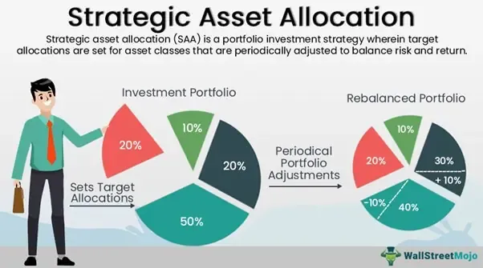

In today's rapidly evolving financial markets, the process of investing in stocks and constructing a robust investment portfolio transcends mere intuition; it necessitates strategic planning and a keen integration of technology. This article centers on the synthesis of investment strategy, portfolio allocation, and algorithmic trading, aiming to optimize stock investments effectively.

Investment strategies play a pivotal role in guiding investors toward achieving their financial objectives within different timeframes. From fundamental and technical analysis to varied stock-picking methodologies, understanding these strategies is essential for making sound investment decisions. Portfolio allocation complements these strategies, focusing on diversification to balance risk and reward. By diversifying across asset classes, sectors, and geographies, investors can protect against market volatility and potentially enhance returns over time.



Algorithmic trading, a significant innovation in the financial industry, offers the capability to execute trades with increased speed and precision. It leverages automated systems based on pre-set strategies and real-time data analysis, offering a considerable advantage in optimizing portfolio performance and mitigating risk. The integration of technology through algorithmic trading empowers investors to enhance their decision-making processes and adapt to market changes more efficiently.

The objective of this article is to provide insights and strategies that cater to both novice and seasoned investors seeking to maximize their investment potential. By understanding the interplay between investment strategies, portfolio allocation, and algorithmic trading, investors can make informed decisions and leverage technology for improved returns. Ultimately, a well-rounded approach combining these elements is instrumental in achieving sustainable investment success in today's dynamic markets.

## Table of Contents

## Understanding Stock Investment Strategies

Stock investment strategies are foundational for investors aiming to meet specific financial objectives over various time horizons. These strategies are primarily built upon two key analytical approaches: [fundamental analysis](/wiki/fundamental-analysis) and technical analysis.

Fundamental analysis involves evaluating a company's financial statements and health, management effectiveness, competitive advantages, and market conditions. This analysis helps investors determine a stock's intrinsic value, which can guide decisions on whether a stock is undervalued or overvalued relative to its market price. Key indicators include earnings per share (EPS), the price-to-earnings ratio (P/E), and return on equity (ROE).

Technical analysis, on the other hand, focuses on statistical trends gathered from trading activity such as price movement and [volume](/wiki/volume-trading-strategy). Technical analysts use charts and other tools to identify patterns that suggest future movement. Common techniques include moving averages, the relative strength index (RSI), and candlestick patterns.

Several popular stock-[picking](/wiki/asset-class-picking) strategies stem from these analytical methods:

1. **Value Investing**: This strategy involves selecting stocks that appear to be trading for less than their intrinsic or book value. Value investors look for companies that the market has overlooked or underestimated. The goal is to buy at a lower price and benefit when the market corrects itself. Risks include the possibility that the stock remains undervalued for extended periods or that the market's assessment is correct, reflecting wider issues within the company.

2. **Growth Investing**: Focused on capital appreciation, growth investors target companies that exhibit signs of above-average growth, even if the stocks appear expensive in terms of metrics like P/E ratio. The primary risk is that anticipated growth doesn't materialize, leading to significant stock price corrections.

3. **Dividend Investing**: Investors prioritize stocks that provide regular dividends over those that might offer rapid appreciation. The strategy appeals to those seeking a steady income stream, typically involving companies with stable earnings. Risks include changes in dividend policy, which might reduce income.

An often overlooked [factor](/wiki/factor-investing) in stock investment is the psychological component. Cognitive biases such as overconfidence, herd behavior, and loss aversion can heavily influence investor decisions, sometimes leading to suboptimal outcomes. To mitigate these, investors can adhere to disciplined strategies that involve setting clear objectives, maintaining a long-term perspective, and regularly reviewing and adjusting holdings based on pre-defined criteria rather than emotional responses.

By understanding and applying these strategies judiciously, investors can tailor their portfolios to match their risk tolerance and investment goals effectively.

## Importance of Portfolio Allocation

Portfolio allocation is a critical component in constructing a resilient and effective investment strategy, fundamentally aimed at diversification and the equilibrium of risk and reward. An appropriately allocated portfolio can mitigate the impacts of market [volatility](/wiki/volatility-trading-strategies), providing a more stable pathway for returns across differing market scenarios. By distributing investments across various asset classes, sectors, and geographic regions, investors can shield their portfolios from the adverse effects of market downturns while ensuring exposure to growth opportunities.

**Asset Allocation and Risk Tolerance**

At the heart of portfolio allocation is asset allocation, which involves distributing investments among various asset categories, such as stocks, bonds, and cash. The proportion of allocation to each asset class depends on the investor's risk tolerance, financial goals, and investment horizon. Risk tolerance is a personalized metric, indicating the degree of variability in investment returns an investor is willing to withstand. 

For example, a conservative investor with low risk tolerance might favor a portfolio composed of 70% bonds and 30% stocks, prioritizing income preservation and stability. Conversely, an aggressive investor with a high-risk tolerance might prefer a portfolio leaning heavily toward stocks, say 80% stocks and 20% bonds, to capitalize on potential growth.

**Diversification Across Asset Classes**

Diversifying across asset classes is essential to minimize unsystematic risks—those specific to a single asset or sector. By holding a mix of asset classes, investors can offset losses in one area with gains in another. Stocks tend to offer higher growth potential but come with increased volatility, whereas bonds generally provide lower, steadier returns. Balancing these can create a synergistic effect that stabilizes the overall portfolio.

In Python, diversification can be modeled using libraries like NumPy for linear algebra calculations and pandas for data manipulation:

```python
import numpy as np
import pandas as pd

# Example portfolio returns data
data = {'Stocks': np.random.normal(0.08, 0.15, 1000),
        'Bonds': np.random.normal(0.04, 0.05, 1000)}

df = pd.DataFrame(data)

# Portfolio weights
weights = np.array([0.6, 0.4])

# Calculate portfolio return
portfolio_return = df.mean().dot(weights)

# Calculate portfolio risk
portfolio_risk = np.sqrt(np.dot(weights.T, np.dot(df.cov(), weights)))

print(f"Expected Portfolio Return: {portfolio_return:.2%}")
print(f"Expected Portfolio Risk: {portfolio_risk:.2%}")
```

**Sector and Geographic Diversification**

Sector diversification spreads investments across various industries, aiming to reduce exposure to sector-specific risks. For instance, a portfolio containing equities from technology, healthcare, and consumer goods mitigates losses if one sector faces a downturn.

Geographic diversification introduces international assets into the portfolio, providing exposure to growth in emerging markets or hedging against economic fluctuations in one's home country. By investing globally, investors can leverage the different economic cycles of various countries, gaining from growth phases while mitigating localized economic downturns.

**Strategic Asset Allocation Models**

Strategic asset allocation is a long-term approach that defines a base asset allocation, proportionate to an investor's risk-return profile. This model involves periodic rebalancing to adhere to the original asset allocation plan. A simple example is the "60/40" model—a portfolio of 60% equities and 40% bonds. This model aims to achieve a balance between growth and income preservation.

Dynamic approaches such as Tactical Asset Allocation (TAA) allow investors to capitalize on short-term market opportunities by adjusting asset allocation. This strategy requires more frequent re-evaluation of market conditions and may involve reallocating capital to asset classes expected to outperform in the near term.

**Conclusion**

Portfolio allocation is an indispensable tool for investors aiming to achieve a balance between risk and reward. By understanding and implementing asset, sector, and geographic diversification, alongside strategic and dynamic allocation strategies, investors can enhance portfolio resilience, optimize returns, and navigate the complexities of financial markets effectively.

## Algorithmic Trading: The Game Changer

Algorithmic trading utilizes automated systems to execute trades based on predefined strategies and real-time data analysis, fundamentally transforming how financial markets operate. This approach leverages the power of computers to execute orders with unparalleled speed and precision, enabling traders to process and analyze vast datasets more efficiently than traditional manual trading methods.

One of the primary benefits of [algorithmic trading](/wiki/algorithmic-trading) is its capability to increase the velocity and accuracy of trade execution. Automated systems can monitor market conditions in real-time and execute trades instantly when specific criteria are met, reducing the lag between decision-making and trade execution. This speed is particularly advantageous in markets where prices can change rapidly within fractions of a second. Furthermore, algorithmic trading minimizes human intervention, which can lead to errors associated with emotional decision-making.

Backtesting is another crucial component of algorithmic trading, allowing traders to test their strategies using historical data before implementing them in live markets. This process involves simulating a trading strategy on relevant historical data to evaluate its effectiveness. By identifying patterns and refining strategies based on past performance, traders can enhance their models and reduce potential risks. For example, a Python code snippet for [backtesting](/wiki/backtesting) a simple moving average crossover strategy might look like this:

```python
import pandas as pd

# Load historical data (e.g., a CSV file with Date, Open, High, Low, Close columns)
data = pd.read_csv('historical_data.csv', index_col='Date', parse_dates=True)

# Calculate moving averages
data['SMA_50'] = data['Close'].rolling(window=50).mean()
data['SMA_200'] = data['Close'].rolling(window=200).mean()

# Define buy/sell signals
data['Signal'] = 0
data['Signal'][50:] = np.where(data['SMA_50'][50:] > data['SMA_200'][50:], 1, 0)

# Generate trade actions
data['Position'] = data['Signal'].diff()

# Print the first few rows to verify signals
print(data[['Close', 'SMA_50', 'SMA_200', 'Signal', 'Position']].head())
```

Despite its advantages, several misconceptions about algorithmic trading persist. One such misconception is that it guarantees profits; however, market conditions can be unpredictable, and even well-crafted algorithms can incur losses. Another misconception is that algorithmic trading contributes to market instability. While high-frequency trading ([HFT](/wiki/high-frequency-trading-strategies)) can increase market volatility during times of stress, many studies suggest that algorithmic trading generally enhances market efficiency by improving [liquidity](/wiki/liquidity-risk-premium) and narrowing bid-ask spreads.

Key strategies in algorithmic trading include high-frequency trading, [arbitrage](/wiki/arbitrage), and [trend following](/wiki/trend-following). High-frequency trading involves executing a large number of orders at extremely high speeds, often capitalizing on small price discrepancies. Arbitrage takes advantage of price differences between markets or financial instruments by simultaneously buying and selling to exploit inefficiencies. Trend-following strategies aim to capture gains through the analysis of an asset's [momentum](/wiki/momentum) in a particular direction, which can be executed with tools like moving averages and [breakout](/wiki/breakout-trading) indicators.

In summary, algorithmic trading offers significant advantages in speed, precision, and the ability to execute complex strategies. By embracing rigorous backtesting and addressing its misconceptions, algorithmic trading continues to evolve as a critical tool in modern finance, offering opportunities to optimize trading performance and market efficiency.

## Integrating Algo Trading with Portfolio Management

Combining portfolio management with algorithmic trading brings about the opportunity for achieving superior risk-adjusted returns by leveraging technology to enhance decision-making processes. At the core of this integration are tools and technologies such as trading platforms and application programming interfaces (APIs), which facilitate seamless communication between trading systems and various financial data sources.

Trading platforms like MetaTrader, [Interactive Brokers](/wiki/interactive-brokers-api), and QuantConnect provide robust environments for developing, backtesting, and deploying algorithmic strategies. These platforms often offer APIs that enable automated systems to execute trades based on pre-defined criteria. APIs serve as conduits for real-time data transmission, ensuring that trading algorithms respond promptly to market shifts.

Continuous monitoring of market conditions, enabled by real-time data feeds, is crucial for informed decision-making and timely execution of trades. Algorithms ingest this data to detect patterns, make predictions, and enact changes as needed. This dynamic feedback loop ensures that investment strategies remain aligned with current market conditions.

In the context of portfolio management, algorithms play a pivotal role in rebalancing and optimizing asset allocation. Rebalancing involves adjusting the weights of different assets in a portfolio to maintain a desired level of diversification and risk. An algorithm can automatically trigger rebalancing when asset weights deviate from predefined thresholds, ensuring that portfolios remain optimized for performance.

For example, a simple rebalancing algorithm in Python might look like this:

```python
def rebalance_portfolio(portfolio, target_allocation, tolerance):
    for asset, target_percent in target_allocation.items():
        current_value = portfolio[asset]['value']
        current_percent = current_value / portfolio['total_value']

        if abs(current_percent - target_percent) > tolerance:
            adjustment = target_percent - current_percent
            # Execute trade to adjust the asset's weight
            execute_trade(asset, adjustment * portfolio['total_value'])

def execute_trade(asset, value_change):
    # Logic for executing trades
    pass
```

Regular performance evaluation is vital to refining algorithmic strategies and portfolio management techniques. As market conditions evolve, so too must the strategies deployed to navigate them. Investors must periodically assess the effectiveness of their algorithms and make necessary adjustments to maintain performance metrics.

Ultimately, integrating algorithmic trading with portfolio management empowers investors with tools to enhance return profiles while managing risk with precision. This synergy of technology and strategy creates a pathway for investors to achieve consistent and sustainable investment success.

## Risk Management and Regulatory Considerations

Effective risk management forms the cornerstone of investment protection and aligns with regulatory standards, particularly in the context of algorithmic trading and diversified portfolios. Understanding and employing specific techniques can significantly mitigate potential risks.

### Risk Management Techniques for Algorithmic Trading

Algorithmic trading, characterized by its reliance on automated systems and real-time data, requires robust risk management strategies. Key techniques include:

1. **Position Sizing**: This determines the amount of capital allocated to a specific trade. A common rule is the 1% rule, suggesting that no more than 1% of capital should be at risk on any single trade. Mathematically, this can be expressed as:
$$
   \text{Position Size} = \frac{\text{Total Capital} \times 0.01}{\text{Trade Risk}}

$$
   where Trade Risk is the difference between the entry and stop-loss prices.

2. **Stop-Loss Orders**: Automated stop-loss orders can minimize losses by triggering a sale when a stock price hits a predetermined level, thus preventing further loss.

3. **Diversification**: Spreading investments across various assets reduces the impact of any single asset's poor performance.

### Regulatory Environment

The regulatory landscape for algorithmic trading is complex, involving multiple jurisdictions and frameworks designed to ensure market stability and protect investors. Key points include:

1. **Market Surveillance and Compliance**: Regulators like the U.S. Securities and Exchange Commission (SEC) and the European Securities and Markets Authority (ESMA) mandate continual market surveillance to detect and prevent market abuse.

2. **Algorithm Approval and Testing**: Algorithms must be rigorously tested and approved before deployment, ensuring they adhere to risk management and compliance standards.

3. **Reporting and Auditing**: Regular reporting and audits are necessary to demonstrate compliance with trading regulations and maintain transparency.

### Ethical Considerations and Best Practices

Ethical trading is essential for maintaining market integrity. Best practices include:

1. **Transparency**: Clear disclosure of trading strategies and intentions to regulatory bodies ensures fair market practices.

2. **Fair Access to Market Data**: Ensuring that algorithms do not exploit privileged access or superior processing speeds to the detriment of other investors.

3. **Conflict of Interest Management**: Identifying and mitigating conflicts that could unfairly impact market outcomes.

### Market Microstructure and Liquidity

Understanding market microstructure is crucial for minimizing slippage and trading costs:

1. **Liquidity Analysis**: High liquidity ensures better execution of trades with minimal price impact. Traders often assess bid-ask spreads and order book depth to gauge liquidity.

2. **Order Execution Strategies**: Strategies like iceberg orders (splitting large orders into smaller, more manageable pieces) can help avoid substantial slippage in low liquidity environments.

3. **Latency Considerations**: Reducing latency—the delay between data release and order execution—enhances the likelihood of executing trades at desired prices.

In conclusion, effective risk management combined with a thorough understanding of regulations, ethical standards, and market microstructure is essential in enhancing the success and stability of algorithmic trading and diversified investment portfolios.

## Conclusion

Investing in stocks today requires a harmonious integration of strategy, diversification, and technology. Algorithmic trading emerges as a pivotal tool, enabling the swift and precise execution of investment strategies. It empowers investors by processing vast amounts of data in real time and automating trades based on sophisticated models, thereby reducing human error and improving efficiency.

The synthesis of strategic planning, astute portfolio allocation, and advanced technological tools facilitates robust portfolio performance. By leveraging these elements, investors can optimize their risk-adjusted returns and enhance their ability to navigate complex financial markets.

A well-considered mix of strategy, diversification across asset classes, and the incorporation of technology not only mitigates risk but also sets the stage for sustainable investment success. This approach aligns with the objective of consistently achieving financial goals despite the inherent volatility of stock markets.

For both novice and seasoned investors, understanding and applying these components fosters a proactive and informed investment journey. This synergy of strategic insight and technological capability serves as a pathway to achieve desired financial outcomes and capitalize on opportunities presented by modern financial markets.

## References & Further Reading

[1]: Bergstra, J., Bardenet, R., Bengio, Y., & Kégl, B. (2011). ["Algorithms for Hyper-Parameter Optimization."](https://papers.nips.cc/paper/4443-algorithms-for-hyper-parameter-optimization) Advances in Neural Information Processing Systems 24.

[2]: ["Advances in Financial Machine Learning"](https://www.amazon.com/Advances-Financial-Machine-Learning-Marcos/dp/1119482089) by Marcos Lopez de Prado

[3]: ["Evidence-Based Technical Analysis: Applying the Scientific Method and Statistical Inference to Trading Signals"](https://www.amazon.com/Evidence-Based-Technical-Analysis-Scientific-Statistical/dp/0470008741) by David Aronson

[4]: ["Machine Learning for Algorithmic Trading"](https://github.com/stefan-jansen/machine-learning-for-trading) by Stefan Jansen

[5]: ["Quantitative Trading: How to Build Your Own Algorithmic Trading Business"](https://www.amazon.com/Quantitative-Trading-Build-Algorithmic-Business/dp/1119800064) by Ernest P. Chan