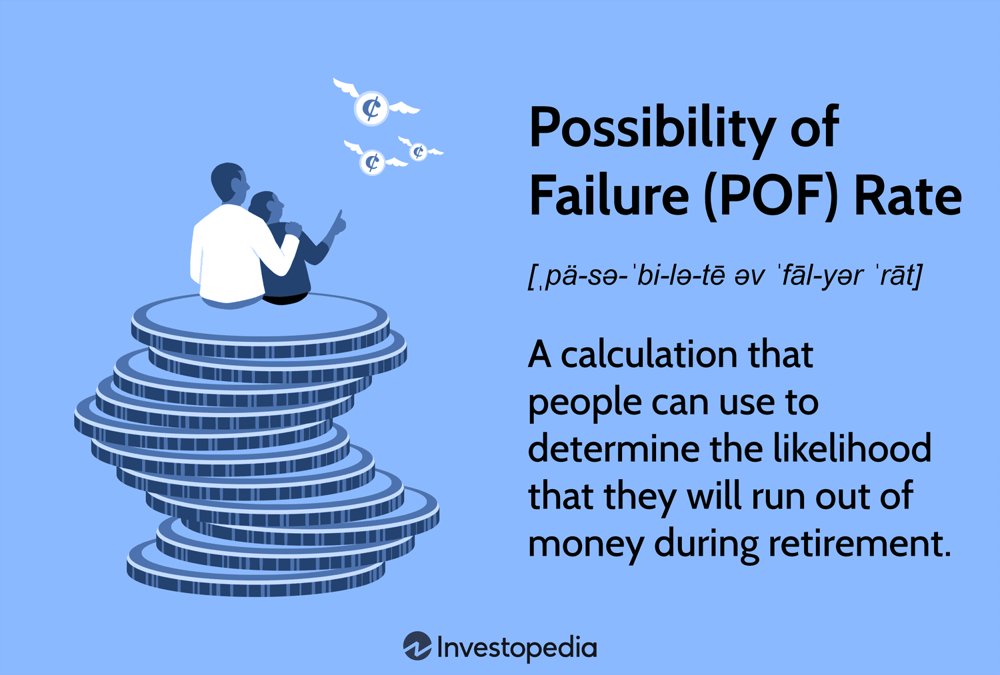

## Table of Contents

## What is investment strategy failure probability?

Investment strategy failure probability is the chance that a plan for investing money won't work out as expected. It's like guessing how likely it is that you might lose money or not make as much money as you hoped. This probability depends on many things, like the types of investments you choose, how the economy is doing, and even how well you stick to your plan. Understanding this probability helps investors make smarter choices and prepare for possible problems.

To figure out the failure probability, people often look at past data and use math models. They might check how similar strategies did in the past or use computer programs to predict what might happen. But, it's important to remember that these predictions are not perfect. The future can be unpredictable, and things can change in ways we don't expect. So, while it's useful to know the failure probability, it's also smart to keep learning and adjusting your strategy as things change.

## Why is it important to understand the failure probability of an investment strategy?

Understanding the failure probability of an investment strategy is important because it helps you know the risks involved. When you know how likely it is that your plan might not work out, you can make better choices about where to put your money. It's like knowing the weather forecast before you go on a trip; if there's a high chance of rain, you might pack an umbrella or choose a different day to travel. Similarly, if an investment strategy has a high failure probability, you might decide to invest less money in it or look for other options.

Moreover, knowing the failure probability can help you prepare for the worst-case scenarios. If you understand that there's a chance your strategy could fail, you can set aside some money or have a backup plan ready. This way, if things don't go as planned, you won't be caught off guard. It's like having a safety net that can catch you if you fall, making your investment journey less stressful and more secure.

## How can beginners assess the risk of their investment strategy failing?

For beginners, assessing the risk of an investment strategy failing starts with understanding what you're getting into. Think of it like trying a new sport. You wouldn't jump into a game without knowing the rules and how to play, right? The same goes for investing. Start by learning about the different types of investments, like stocks, bonds, and mutual funds. Each has its own level of risk. Stocks can be riskier but offer higher rewards, while bonds are usually safer but give less return. Look at how these investments have done in the past. This can give you a rough idea of how risky they might be, but remember, past results don't guarantee future success.

Next, consider using tools and resources to help you out. Websites, apps, and even books can explain how to measure risk. Some tools let you see how your investments might do in different situations, like if the economy gets worse or better. It's also smart to talk to people who know more about investing, like financial advisors. They can help you understand what might go wrong with your plan and how to fix it. Remember, the more you learn and the more you prepare, the better you'll be at handling the ups and downs of investing.

## What are common reasons for investment strategy failures?

Investment strategies can fail for many reasons. One common reason is not understanding the risks involved. People might think an investment is safe when it's actually quite risky. They might put all their money into one thing, like a single stock, without knowing that if that stock does badly, they could lose a lot. Another reason is not having a plan or sticking to it. Sometimes, people get scared when the market goes down and sell their investments too soon. Or they might see others making quick money and change their plan to follow the crowd, which can lead to bad choices.

Another big reason for failure is not keeping up with changes in the economy or the world. Things like new laws, big events, or even changes in what people buy can affect investments. If you don't pay attention to these changes and adjust your strategy, you might end up losing money. Finally, not diversifying, or spreading out your investments, can be a huge mistake. If all your money is in one type of investment and it fails, you're in trouble. But if you have different kinds of investments, a problem with one won't hurt you as much.

## How does diversification affect the failure probability of an investment strategy?

Diversification means spreading your money across different kinds of investments. It's like not putting all your eggs in one basket. When you diversify, you lower the chance that your whole investment strategy will fail. If one investment does badly, the others might do well and balance things out. This way, even if one part of your plan goes wrong, you won't lose everything.

For example, if you only invest in tech stocks and the tech industry has a bad year, your whole investment could be in trouble. But if you also have money in other things, like real estate or bonds, those might do okay even if tech stocks fall. Diversification doesn't make investing risk-free, but it helps reduce the risk that your entire strategy will fail. It's like having a safety net that catches you if one part of your plan doesn't work out.

## What role does historical data play in predicting investment strategy failure?

Historical data is like a roadmap that shows how investments have done in the past. It helps you see patterns and understand what might happen next. For example, if you look at how stocks did during past recessions, you can get an idea of how they might do if another recession happens. This information can help you guess the chances of your investment strategy failing. But remember, just because something happened before doesn't mean it will happen again. The world changes, and new things can affect investments in ways we can't predict.

Using historical data is a good starting point, but it's not perfect. It's like using weather reports from last year to plan your summer vacation this year. It can give you a hint, but it won't tell you everything. You also need to think about what's happening right now in the economy and the world. By combining historical data with what's going on today, you can make a better guess about the risk of your investment strategy failing. It's all about using the past to help you make smarter choices in the present.

## How can advanced statistical models be used to estimate failure probability?

Advanced statistical models can help estimate the failure probability of an investment strategy by crunching numbers and looking at lots of data. These models use math to find patterns and predict what might happen. For example, they can look at how different investments have done in the past and use that to guess how they might do in the future. They can also think about things like how the economy is doing or what's happening in the world. By putting all this information together, these models can give you a better idea of the chances that your investment strategy might not work out.

But remember, these models are not perfect. They're like weather forecasts for your money—they can help you prepare, but they can't tell you exactly what will happen. Sometimes, things change in ways that no one can predict. That's why it's important to keep checking your investments and be ready to change your plan if you need to. Using advanced statistical models is a smart way to understand risk, but it's just one part of making good investment choices.

## What are the differences between short-term and long-term failure probabilities in investment strategies?

Short-term failure probability in an investment strategy looks at the chances of things going wrong in a short time, like a few months or a year. This can be affected by quick changes in the market, like a sudden drop in stock prices or a big news event. For example, if you invest in a stock that goes down a lot in a short time, your strategy might fail in the short term. Short-term risks can be higher because the market can be unpredictable and can change fast. It's like trying to guess the weather for tomorrow; it can be hard to get it right.

Long-term failure probability, on the other hand, looks at the chances of your strategy not working out over many years. This can be influenced by bigger trends, like how the economy grows or changes in technology. For example, if you invest in a company that does well over time, your strategy might succeed in the long run. Long-term risks are usually lower because the market tends to even out over time, and you have more time to adjust your plan if things go wrong. It's like planning for the weather over a whole season; it's easier to make good guesses and prepare for different possibilities.

## How do market conditions influence the failure probability of an investment strategy?

Market conditions play a big role in how likely it is that your investment strategy might fail. If the market is doing well, like when the economy is growing and people are buying a lot, your investments might do better too. But if the market is not doing well, like during a recession when people are losing jobs and spending less, your investments could lose value. Things like interest rates, inflation, and even big news events can change the market quickly. So, understanding what's happening in the market can help you guess how risky your strategy might be.

For example, if interest rates go up, borrowing money becomes more expensive, which can slow down the economy and make stocks less attractive. This might increase the chance that your stock investments will fail in the short term. On the other hand, if inflation is low and the economy is stable, your investments might be safer. Keeping an eye on these market conditions and how they might change can help you adjust your strategy to lower the risk of failure. It's all about staying informed and being ready to make changes when needed.

## What are some advanced techniques for mitigating the risk of investment strategy failure?

One advanced technique for lowering the risk of your investment strategy failing is called hedging. Hedging is like buying insurance for your investments. You can use things like options or futures to protect yourself if the market goes down. For example, if you own a stock, you can buy an option that lets you sell it at a certain price even if the stock's value drops. This way, you won't lose as much money if things go wrong. Hedging can be tricky and might cost you some money, but it can help you sleep better at night knowing you have a backup plan.

Another technique is using advanced portfolio optimization models. These models use math to figure out the best way to spread your money across different investments. They look at things like how much risk you're okay with and how much money you want to make. By using these models, you can create a mix of investments that balances risk and reward better. It's like having a smart computer that helps you pick the right ingredients for a recipe, so your investment meal turns out tasty and not too risky. These models can change as the market changes, helping you keep your strategy on track and lowering the chances of failure.

## How can an investor adjust their strategy based on changing failure probabilities?

An investor can adjust their strategy based on changing failure probabilities by keeping an eye on the market and understanding what's happening. If they see that the risk of their strategy failing is going up, like if the economy is getting worse or if their investments aren't doing well, they might decide to change things. They could move some of their money into safer investments, like bonds, or they might sell some stocks that are doing badly and buy others that seem more promising. It's important to stay flexible and be ready to make changes when the situation changes.

Another way to adjust is by using tools like advanced statistical models to help predict what might happen next. These models can show how the failure probability might change and help the investor make smarter choices. For example, if the models show that the risk of failure is going up, the investor might decide to hedge their investments or use portfolio optimization to spread their money around more safely. By staying informed and using these tools, an investor can keep their strategy strong and lower the chances of it failing.

## What are the latest research findings on predicting and managing investment strategy failure probability?

Recent research has focused on using machine learning and artificial intelligence to predict and manage investment strategy failure probability. These advanced techniques can look at huge amounts of data, like past market trends, economic indicators, and even social media sentiment, to guess how likely it is that an investment strategy might fail. Researchers have found that these methods can be more accurate than traditional models, giving investors better warnings about when to adjust their strategies. For example, machine learning models can spot patterns that humans might miss, helping investors make smarter choices and lower their risks.

Another important finding is the role of behavioral finance in managing failure probability. Studies show that investors' emotions and behaviors can greatly affect how well their strategies work. For instance, people might be too confident and take big risks, or they might panic and sell their investments at the wrong time. New research suggests using tools like automated trading systems and robo-advisors to help investors stick to their plans and avoid emotional decisions. By understanding and managing these behavioral risks, investors can make their strategies more stable and reduce the chances of failure.

## What is the Probability of Failure: A Quantitative Analysis?

Algorithmic trading strategies, although efficient, are susceptible to failures. Quantitative analysis plays a crucial role in assessing the probability of such failures. Various methods and statistical tools are employed to evaluate the risk levels and failure rates of these trading strategies.

### Methods to Assess Failure Probability

1. **Value at Risk (VaR):** This widely used risk management tool estimates the potential loss in value of a trading portfolio over a defined period for a given confidence interval. For example, a daily VaR at 95% confidence level of $1 million signifies that there is a 5% chance that the portfolio will lose more than $1 million in a day.
$$
    VaR = P \times Z \times \sigma

$$

    Where $P$ is the position size, $Z$ is the Z-score corresponding to the confidence level, and $\sigma$ is the portfolio's volatility.

2. **Stress Testing:** This involves simulating extreme market conditions to evaluate how the trading strategy performs under adverse scenarios. Stress testing helps identify vulnerabilities by testing the algorithm against historical crisis periods or hypothetical adverse events.

3. **Monte Carlo Simulations:** By generating a vast number of random price paths, Monte Carlo simulations estimate the probability of different outcomes that might lead to strategy failure. This method accounts for the randomness and variability in market behavior.

    ```python
    import numpy as np

    def monte_carlo_simulation(S0, T, mu, sigma, num_simulations, num_steps):
        dt = T/num_steps
        paths = np.zeros((num_steps, num_simulations))
        paths[0] = S0

        for i in range(1, num_steps):
            z = np.random.standard_normal(num_simulations)
            paths[i] = paths[i - 1] * np.exp((mu - 0.5 * sigma**2) * dt + sigma * np.sqrt(dt) * z)
        return paths
    ```

4. **Backtesting with Statistical Indicators:** Using historical data, backtesting evaluates how a strategy would have performed in the past. The Sharpe Ratio, Sortino Ratio, and Maximum Drawdown are some indicators used to quantify risk-adjusted returns and identify potential failure points.

5. **Machine Learning Techniques:** Model predictive control and reinforcement learning models are increasingly used to predict strategy failures by identifying patterns and anomalies that precede such events.

### Statistical Tools Used for Evaluating Risk Levels

- **Standard Deviation and Variance:** These measure the dispersion of returns and capture the volatility inherent in the strategy.

- **Beta:** This measures the sensitivity of the algorithm to market movements, indicating how market changes can impact strategy performance.

- **Conditional Value at Risk (CVaR):** This measure assesses the risk of extreme losses in the tail end of the loss distribution, offering insights beyond VaR.

### Case Studies of High-Profile Algo Trading Failures

1. **Knight Capital Group (2012):** A software glitch in Knight Capital’s algorithm led to unintentional buying and selling of stocks, causing a $440 million loss in less than an hour. The incident underscored the necessity for rigorous testing and robust fail-safes.

2. **Flash Crash (2010):** On May 6, 2010, the U.S. financial markets experienced a rapid and severe downturn, primarily attributed to algorithmic trading strategies exacerbating market volatility. This event highlighted the potential systemic risks posed by algorithms interacting unpredictably.

By leveraging statistical tools and rigorous quantitative analysis, traders and firms can better predict and mitigate the failure probabilities of algorithmic trading strategies, safeguarding investments against unforeseen losses.

## References & Further Reading

[1]: Bergstra, J., Bardenet, R., Bengio, Y., & Kégl, B. (2011). ["Algorithms for Hyper-Parameter Optimization."](https://papers.nips.cc/paper/4443-algorithms-for-hyper-parameter-optimization) Advances in Neural Information Processing Systems 24.

[2]: ["Advances in Financial Machine Learning"](https://www.amazon.com/Advances-Financial-Machine-Learning-Marcos/dp/1119482089) by Marcos Lopez de Prado

[3]: ["Evidence-Based Technical Analysis: Applying the Scientific Method and Statistical Inference to Trading Signals"](https://www.amazon.com/Evidence-Based-Technical-Analysis-Scientific-Statistical/dp/0470008741) by David Aronson

[4]: ["Machine Learning for Algorithmic Trading"](https://github.com/stefan-jansen/machine-learning-for-trading) by Stefan Jansen

[5]: ["Quantitative Trading: How to Build Your Own Algorithmic Trading Business"](https://books.google.com/books/about/Quantitative_Trading.html?id=j70yEAAAQBAJ) by Ernest P. Chan