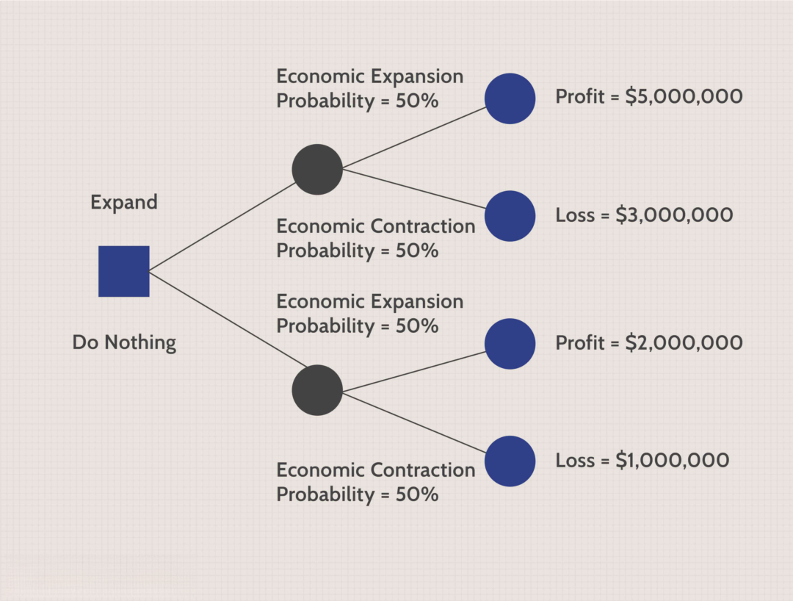

Algorithmic trading has revolutionized modern financial markets by leveraging computer algorithms to facilitate trading decisions and executions. This technology-driven method offers distinct advantages over traditional trading practices, primarily through increased speed, efficiency, and the reduction of human emotional biases. Algorithms can analyze vast datasets within seconds, identifying trends and executing trades at speeds unattainable by human traders. These improvements have resulted in enhanced market liquidity and tighter bid-ask spreads, benefitting both institutional and retail investors.

However, alongside these advantages, algorithmic trading carries inherent risks that can lead to strategy failure. These risks are multifaceted and stem from various sources, including technical failures such as software bugs or hardware malfunctions, market risks associated with unprecedented volatility, and regulatory challenges due to frequent updates in trading rules. The complexity of algorithmic models, often based on historical data, means that unexpected market scenarios can lead to significant losses if the model fails to adapt.



Understanding the probability of investment strategy failure in algorithmic trading is crucial for both traders and financial institutions. This article explores the underlying factors that contribute to such failures, examining how outdated or rigid algorithms, insufficient backtesting, and over-reliance on historical data can impair performance. By shining a light on these issues, stakeholders can better assess and mitigate the risks, allowing for a more balanced approach that harnesses the potential of algorithmic trading while safeguarding against its pitfalls.

## Table of Contents

## Understanding Algo Trading

Algorithmic trading, often abbreviated as "algo trading," involves the use of computer programs to execute trades in financial markets based on predetermined criteria and instructions. These instructions can include timing, price, [volume](/wiki/volume-trading-strategy), or any mathematical model, aiming to perform trades at speeds and frequencies that are impossible for human traders. Typically, such algorithms analyze market data to identify trading opportunities and execute orders, all without human intervention.

### Comparison with Traditional Trading

In contrast to traditional trading, where a human trader conducts market research, decides on a trade, and manually executes the order, [algorithmic trading](/wiki/algorithmic-trading) primarily relies on automated systems. Traditional trading often requires substantial time to analyze data and execute trades, and is subject to human emotion and error. In comparison, algo trading is inherently faster and aims to optimize the trading process by minimizing manual input and the psychological factors that can skew decision-making.

While human intuition can be a strength in traditional trading, it is also a liability due to biases and emotional responses to market changes. Algorithmic trading mitigates these risks by adhering strictly to logical rules and data-driven strategies. This allows for consistency and precision in executing trades.

### Benefits of Algorithmic Trading

Several advantages make algorithmic trading appealing in the financial sector:

- **Efficiency**: Algorithms can process vast amounts of data in real-time and execute trades within milliseconds. This is crucial in modern markets, where the speed of execution can determine the profitability of a trade.

- **Accuracy**: With predefined instructions, algo trading significantly reduces the risk of human errors that can occur due to miscalculation or mistyping.

- **Reduced Emotional Bias**: Algorithms eliminate the emotional aspect of trading. Traders might react negatively to losses or overly optimistically to gains, leading to poor decision-making. Algorithms, in contrast, operate purely based on objective data.

- **Backtesting Capabilities**: Algo trading allows for the backtesting of strategies under historical market conditions, which helps in validating a strategy's potential before live deployment.

- **Cost Reduction**: Because algo trading involves minimal human intervention, firms can reduce the costs associated with salary and benefits for a large team of traders.

In summary, while traditional trading relies heavily on human decision-making, algorithmic trading leverages the power of technology to enhance speed, accuracy, and consistency. Given these advantages, it's no surprise that a significant portion of the global trading volume today is conducted via algorithmic systems.

## Common Risks Associated with Algo Trading

Algorithmic trading, while offering significant advantages in efficiency and execution speed, is also fraught with a variety of risks. These risks can broadly be categorized into technical, market, and regulatory risks, each posing potential pitfalls that could lead to investment strategy failure.

### Technical Risks

1. **Software Bugs**: Software used in algorithmic trading is complex, requiring precise coding to interact seamlessly with market data feeds and execution platforms. However, any flaws or bugs in the code can cause significant errors. For example, a small coding mistake can lead to incorrect trade execution, erroneous order quantities, or even failure to execute trades altogether. Debugging and thorough testing are essential to minimize these risks.

2. **Hardware Failures**: The infrastructure supporting algorithmic trading comprises high-performance servers and sophisticated networks designed for speed and reliability. Hardware failures, such as server crashes or data storage malfunctions, can hinder a trading operation by causing delays or data losses, thereby impacting the ability to execute trades quickly and accurately.

3. **Network Issues**: Latency and connectivity issues can severely impact the performance of an algorithmic trading system. High-frequency trading (HFT) strategies, which rely on executing a large number of trades in milliseconds, are particularly susceptible to network disruptions. Ensuring high-speed, low-latency network connections is crucial to reduce the risk of missed opportunities and potential financial losses.

### Market Risks

1. **Volatility**: Market conditions can change rapidly, leading to high levels of volatility. Algorithms that are not designed to adjust to sudden price swings may perform sub-optimally. Volatility can increase the risk of executing trades at unfavorable prices, which can skew the expected returns of a strategy.

2. **Liquidity Crises**: This risk arises when a trading algorithm requires buying or selling large quantities of a security, but the market lacks sufficient liquidity. During such crises, trading large volumes can significantly impact market prices, leading to slippage and increased transaction costs, thereby adversely affecting profitability.

3. **Black Swan Events**: These are rare, unexpected events that cause significant disruptions in financial markets. Algorithms trained on historical data may not adequately predict or respond to such occurrences. As a result, black swan events can lead to significant financial losses, illustrating the limitations of relying solely on historical data in algorithmic strategies.

### Regulatory Risks

1. **Compliance Challenges**: Algorithmic trading is subject to a host of regulatory requirements intended to ensure fair and equitable market practices. Ensuring compliance with these regulations requires continuous monitoring and adaptation of trading algorithms to meet legal standards, failing which they can face significant penalties.

2. **Updates in Trading Rules**: Regulatory bodies frequently update rules to address market changes and emerging risks. Algorithmic traders must be vigilant and ready to modify their strategies and systems to accommodate these changes. Failure to do so can lead to non-compliance and consequential operational disruptions.

In conclusion, understanding and mitigating these risks are essential for the successful deployment of algorithmic trading strategies. By addressing these technical, market, and regulatory challenges, traders can better safeguard their investments and enhance the robustness of their trading operations.

## Factors Contributing to Strategy Failure

Algorithmic trading strategies are sophisticated tools but they are not impervious to failure. One of the primary contributors to strategy failure is the use of outdated algorithms that do not adapt to changing market conditions. Financial markets are continually evolving due to technological innovations, macroeconomic factors, and shifting investor behavior. An algorithm designed to capitalize on patterns prevalent in past market conditions may become obsolete if it does not adapt to these changes. For example, a strategy that performs well in a bull market could underperform or fail completely in a bear market unless it is adjusted to account for different types of [volatility](/wiki/volatility-trading-strategies) and trading volumes.

Another crucial [factor](/wiki/factor-investing) is insufficient [backtesting](/wiki/backtesting) and model overfitting. Backtesting is the process of simulating a trading strategy using historical market data to evaluate its effectiveness. If performed inadequately, backtesting can lead to overfitting, a phenomenon where the algorithm is excessively tailored to historical data, capturing noise rather than actual market signals. An overfitted model may appear highly profitable in backtesting but fails in live trading due to its lack of robustness.

The problem of overfitting can be conceptualized mathematically. Consider a trading model as a function $f(x)$ that maps input features $x$ (e.g., historical prices and indicators) to output trading decisions. Overfitting occurs when $f(x)$ is excessively complex, fitting the training data too closely, and capturing random fluctuations as if they were meaningful patterns. To mitigate this, techniques such as cross-validation and regularization are employed to ensure that the model generalizes well to unseen data.

Additionally, an inherent reliance on historical data is a double-edged sword for algorithmic trading. While past data provides a foundation for identifying patterns and testing strategies, it may not always be indicative of future conditions. Events such as financial crises, regulatory changes, or geopolitical disruptions can render historical models ineffective. This is often summarized by the adage “past performance is not indicative of future results,” emphasizing the unpredictability and dynamic nature of markets.

To enhance predictive power and adaptability, some algorithmic traders are incorporating [machine learning](/wiki/machine-learning) techniques that continually learn from new data, adjusting strategies in response to evolving market dynamics. Despite these advancements, the dependence on historical data remains a fundamental challenge, necessitating a forward-looking approach supplemented by real-time data analysis.

In summary, addressing strategy failure in algorithmic trading requires vigilance in updating algorithms, thorough backtesting to avoid overfitting, and a cautious approach to the reliance on historical data, incorporating adaptive techniques to maintain relevance in ever-changing markets.

## Probability of Failure: Quantitative Analysis

Algorithmic trading strategies, although efficient, are susceptible to failures. Quantitative analysis plays a crucial role in assessing the probability of such failures. Various methods and statistical tools are employed to evaluate the risk levels and failure rates of these trading strategies.

### Methods to Assess Failure Probability

1. **Value at Risk (VaR):** This widely used risk management tool estimates the potential loss in value of a trading portfolio over a defined period for a given confidence interval. For example, a daily VaR at 95% confidence level of $1 million signifies that there is a 5% chance that the portfolio will lose more than $1 million in a day.
$$
    VaR = P \times Z \times \sigma

$$

    Where $P$ is the position size, $Z$ is the Z-score corresponding to the confidence level, and $\sigma$ is the portfolio's volatility.

2. **Stress Testing:** This involves simulating extreme market conditions to evaluate how the trading strategy performs under adverse scenarios. Stress testing helps identify vulnerabilities by testing the algorithm against historical crisis periods or hypothetical adverse events.

3. **Monte Carlo Simulations:** By generating a vast number of random price paths, Monte Carlo simulations estimate the probability of different outcomes that might lead to strategy failure. This method accounts for the randomness and variability in market behavior.

    ```python
    import numpy as np

    def monte_carlo_simulation(S0, T, mu, sigma, num_simulations, num_steps):
        dt = T/num_steps
        paths = np.zeros((num_steps, num_simulations))
        paths[0] = S0

        for i in range(1, num_steps):
            z = np.random.standard_normal(num_simulations)
            paths[i] = paths[i - 1] * np.exp((mu - 0.5 * sigma**2) * dt + sigma * np.sqrt(dt) * z)
        return paths
    ```

4. **Backtesting with Statistical Indicators:** Using historical data, backtesting evaluates how a strategy would have performed in the past. The Sharpe Ratio, Sortino Ratio, and Maximum Drawdown are some indicators used to quantify risk-adjusted returns and identify potential failure points.

5. **Machine Learning Techniques:** Model predictive control and reinforcement learning models are increasingly used to predict strategy failures by identifying patterns and anomalies that precede such events.

### Statistical Tools Used for Evaluating Risk Levels

- **Standard Deviation and Variance:** These measure the dispersion of returns and capture the volatility inherent in the strategy.

- **Beta:** This measures the sensitivity of the algorithm to market movements, indicating how market changes can impact strategy performance.

- **Conditional Value at Risk (CVaR):** This measure assesses the risk of extreme losses in the tail end of the loss distribution, offering insights beyond VaR.

### Case Studies of High-Profile Algo Trading Failures

1. **Knight Capital Group (2012):** A software glitch in Knight Capital’s algorithm led to unintentional buying and selling of stocks, causing a $440 million loss in less than an hour. The incident underscored the necessity for rigorous testing and robust fail-safes.

2. **Flash Crash (2010):** On May 6, 2010, the U.S. financial markets experienced a rapid and severe downturn, primarily attributed to algorithmic trading strategies exacerbating market volatility. This event highlighted the potential systemic risks posed by algorithms interacting unpredictably.

By leveraging statistical tools and rigorous quantitative analysis, traders and firms can better predict and mitigate the failure probabilities of algorithmic trading strategies, safeguarding investments against unforeseen losses.

## Mitigation Strategies to Reduce Failure Probability

Algorithmic trading, while offering significant efficiencies and opportunities, also presents certain risks that necessitate the implementation of robust mitigation strategies to reduce the probability of strategy failure. A key aspect of mitigating these risks involves adopting comprehensive risk management frameworks. These frameworks often consist of risk identification, assessment, monitoring, and control protocols that enable traders to systematically address potential issues before they lead to significant losses.

One fundamental approach in risk management is the regular updating and maintenance of trading algorithms. Financial markets are dynamic, with continuous shifts influenced by economic factors, regulatory changes, and technological advancements. As such, trading algorithms need to be periodically revised to ensure they remain relevant and effective. This involves not only keeping the algorithms updated with the latest market data but also ensuring that any identified weaknesses or vulnerabilities are swiftly addressed. Routine audits and performance assessments can help in identifying areas needing improvement, thereby maintaining the integrity and effectiveness of the trading strategy.

Diversification and [liquidity](/wiki/liquidity-risk-premium) management are also crucial in reducing failure probability. Diversification involves spreading investments across different assets, sectors, or markets to reduce exposure to any single source of risk. This can significantly lower the impact of adverse price movements in specific securities on the overall portfolio. The principle of diversification is well-captured in the mathematical concept of variance, where reducing correlation between investment returns can lead to a decrease in the portfolio's overall risk.

Liquidity management involves ensuring that there is sufficient market liquidity to execute trades as needed without causing large price swings. A highly liquid market allows traders to enter or [exit](/wiki/exit-strategy) positions without significantly affecting the price of the security. Conversely, low liquidity can exacerbate losses, especially during periods of market stress. Traders can manage liquidity risk by incorporating liquidity forecasts and limitations into their algorithms, using predictive models to anticipate periods of low liquidity, and adjusting strategies accordingly to avoid large transactions that could disrupt the market.

Implementing these strategies requires systematic planning and the use of advanced analytical tools. By continuously assessing and adapting to the evolving market landscape, traders can not only protect their investments but also capitalize on new opportunities while keeping failure risks to a minimum.

## Emerging Trends in Algo Trading Risk Management

The landscape of algorithmic trading is continually evolving, with emerging trends significantly shaping risk management strategies. Recent advancements have notably highlighted the increasing role of [artificial intelligence](/wiki/ai-artificial-intelligence) (AI) and machine learning (ML) in risk assessment. These technologies enable traders to process vast amounts of data, identify patterns, and make predictions with greater accuracy. AI-driven algorithms can learn from historical data and adapt to new information, enhancing their ability to predict market movements and mitigate risks associated with unforeseen events.

Advancements in real-time monitoring tools and predictive analytics have revolutionized the way risks are managed in algorithmic trading. These tools provide traders with instantaneous data processing capabilities, allowing them to monitor market conditions and the performance of their strategies continuously. Real-time data analytics facilitate quick decision-making, helping traders to adjust their positions in response to rapid market fluctuations.

Moreover, predictive analytics enable the anticipation of risk events before they occur, utilizing sophisticated models to gauge the probability of adverse market conditions. This proactive approach allows traders to implement preemptive measures, thus reducing the potential impact of negative outcomes on their trading strategies.

Collaborative approaches that blend human insight with algorithmic precision are gaining traction as a means to enhance risk management in algorithmic trading. While algorithms excel at processing data and executing trades at high speeds, human judgment remains invaluable in interpreting complex market signals and strategic decision-making. By integrating human expertise with algorithmic processes, traders can achieve a more comprehensive risk management strategy. This collaboration ensures that intuitive and qualitative insights complement quantitative analysis, leading to more robust decision-making frameworks.

In conclusion, the incorporation of AI and ML, alongside advancements in real-time monitoring and collaborative strategies, represents a transformative shift in managing risks within algorithmic trading. As these technologies continue to develop, they promise to further refine risk assessment methodologies, making algorithmic trading more efficient and resilient against market uncertainties.

## Conclusion

Algorithmic trading provides significant benefits, including enhanced speed, precision, and the potential for greater profitability. By leveraging mathematical models and computational power, it facilitates executing trading strategies otherwise challenging for human traders. Despite these advantages, the success of algorithmic trading heavily relies on understanding its associated risks and actively working to mitigate them.

Recognizing and addressing the risks inherent in algorithmic trading are paramount to reducing the chance of strategy failure. These risks encompass technical issues like software bugs, market fluctuations, and evolving regulatory landscapes, each capable of impacting trading outcomes severely. A critical component of managing these risks is the continuous evaluation and adaptation of algorithms to align them with current market conditions.

A balanced approach is essential for fully capitalizing on algorithmic trading's potential while minimizing its vulnerabilities. This requires implementing robust risk management practices that incorporate both diversification strategies and regular updates to trading algorithms. Additionally, integrating advanced tools such as artificial intelligence for real-time monitoring and predictive analytics can offer superior insights and risk mitigation capabilities.

By conscientiously addressing these challenges, traders and institutions can effectively minimize the probability of failure and enhance the overall success rate of their trading strategies. This approach not only optimizes algorithmic trading's vast opportunities but also solidifies its role as a reliable component of modern financial markets.

## References & Further Reading

[1]: Bergstra, J., Bardenet, R., Bengio, Y., & Kégl, B. (2011). ["Algorithms for Hyper-Parameter Optimization."](https://papers.nips.cc/paper/4443-algorithms-for-hyper-parameter-optimization) Advances in Neural Information Processing Systems 24.

[2]: ["Advances in Financial Machine Learning"](https://www.amazon.com/Advances-Financial-Machine-Learning-Marcos/dp/1119482089) by Marcos Lopez de Prado

[3]: ["Evidence-Based Technical Analysis: Applying the Scientific Method and Statistical Inference to Trading Signals"](https://www.amazon.com/Evidence-Based-Technical-Analysis-Scientific-Statistical/dp/0470008741) by David Aronson

[4]: ["Machine Learning for Algorithmic Trading"](https://github.com/stefan-jansen/machine-learning-for-trading) by Stefan Jansen

[5]: ["Quantitative Trading: How to Build Your Own Algorithmic Trading Business"](https://books.google.com/books/about/Quantitative_Trading.html?id=j70yEAAAQBAJ) by Ernest P. Chan