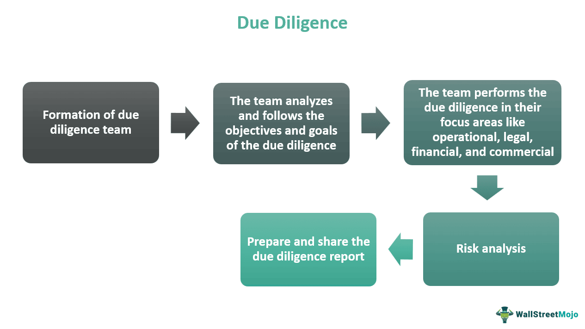

## Table of Contents

## What is an investment style?

An investment style is a way that people choose to invest their money. It's like a plan or a strategy that helps them decide what to buy and sell. Some people might like to invest in big, well-known companies, while others might prefer smaller, newer companies. There are also people who focus on certain industries, like technology or healthcare, or those who look for companies that are good for the environment.

Different investment styles can be based on how much risk someone is willing to take. For example, some people might choose safer investments that grow slowly but steadily, like bonds. Others might be okay with more risk and invest in stocks that can go up and down a lot but might give bigger returns. Knowing your investment style helps you pick the right investments that match your goals and how comfortable you are with risk.

## What are the main types of investment styles?

There are a few main types of investment styles that people use when they want to grow their money. One style is called growth investing. People who do this look for companies that are growing fast and might keep growing in the future. They hope these companies will make their stock prices go up a lot. Another style is value investing. This is when people look for companies that they think are a good deal, like buying something on sale. They believe these companies are worth more than what the stock price says, and they wait for the price to go up to what they think it should be.

Another type is income investing. People who do this want to get regular payments from their investments, like dividends from stocks or interest from bonds. They usually care more about getting money regularly than about their investments growing a lot over time. There's also a style called [momentum](/wiki/momentum) investing, where people buy stocks that have been going up in price and hope they keep going up. They think that if a stock is doing well, it will keep doing well for a while.

Lastly, there's socially responsible investing, where people choose investments based on their values. They might pick companies that are good for the environment or treat their workers well. This style is about making money and also making a positive impact on the world. Each of these styles has its own way of trying to make money, and people often mix them together to fit what they want and how much risk they can handle.

## Can you explain the difference between growth and value investing?

Growth investing is when people look for companies that are growing fast and might keep growing in the future. They want to buy stocks in these companies because they think the stock prices will go up a lot. These companies often don't pay big dividends because they use their money to grow even more. People who do growth investing are okay with taking more risk because they hope to get bigger rewards. They focus on things like how fast a company's earnings are growing and how much of the market they can take over.

Value investing is different. People who do value investing look for companies that they think are a good deal, like finding a bargain at a store. They believe these companies are worth more than what the stock price says right now. They buy these stocks and wait for other people to realize the company's true value, which should make the stock price go up. Value investors often look at things like the price-to-earnings ratio to see if a stock is cheap. They are usually more patient and might be okay with waiting longer for their investments to pay off, and they often see less risk because they're buying at a lower price.

Both styles have their own ways of trying to make money, and people often mix them together to fit what they want and how much risk they can handle. Growth investing can be exciting but riskier, while value investing can be safer but might take longer to see big gains.

## What is momentum investing and how does it work?

Momentum investing is when people buy stocks that have been going up in price and hope they keep going up. They think that if a stock is doing well, it will keep doing well for a while. It's like jumping on a moving train because they believe it will keep moving forward. People who do momentum investing look at how much a stock's price has changed over a certain time, like the past three to twelve months, and they buy the ones that have gone up the most.

The idea behind momentum investing is that stocks that are going up will keep going up because more and more people want to buy them. It's like a trend that everyone wants to follow. But, it can be risky because if the trend changes and the stock starts going down, it can go down fast. So, people who do momentum investing need to watch their stocks closely and be ready to sell if things start to change. It's all about timing and trying to ride the wave of a stock's price movement.

## How does income investing differ from other styles?

Income investing is different from other styles because it focuses on getting regular payments from investments. People who do income investing look for things like stocks that pay dividends or bonds that pay interest. They want to get money every month or every quarter, which they can use to live on or reinvest. Unlike growth investing, where people hope the stock price will go up a lot, or value investing, where people look for bargains, income investing is all about the steady income that comes in. It's like having a job where you get a paycheck regularly, but from your investments.

The main difference between income investing and other styles is the focus on safety and stability. People who do income investing often choose safer investments that might not grow as fast as others but give them a regular income. They might be okay with slower growth because they care more about having money coming in all the time. This is different from momentum investing, where people try to ride the wave of a stock's price going up, or socially responsible investing, where people pick investments based on their values. Income investing is about making sure you have money coming in regularly, no matter what else is happening in the market.

## What are the key characteristics of a contrarian investment approach?

A contrarian investment approach is when people go against what everyone else is doing. They look for stocks or investments that other people don't like or think are bad. They believe that if everyone is selling a stock, it might be a good time to buy it because it could be undervalued. They think that the market can be wrong sometimes, and they want to take advantage of that.

Contrarian investors are patient and willing to wait for the market to realize the true value of their investments. They often look for companies that are out of favor but have strong fundamentals. They might buy stocks when they are low and hold onto them until other investors start to see the value and the price goes up. This approach can be risky because it goes against the crowd, but it can also lead to big rewards if they are right about the investment's true value.

## How can an investor determine which investment style suits them best?

To figure out which investment style is best for you, start by thinking about what you want from your investments. Are you looking to grow your money fast, or do you want a steady income? How much risk are you okay with? If you like the thrill of big gains and don't mind if your investments go up and down a lot, growth investing might be good for you. But if you want to buy things on sale and wait for them to go up in value, value investing could be better. Think about your goals and how much risk you can handle, and that will help you pick the right style.

Another thing to consider is how much time you want to spend on your investments. If you like to keep an eye on the market and make quick moves, momentum investing might be exciting for you. But if you want to set it and forget it, income investing could be a better fit because it focuses on steady payments. Also, think about if you want your investments to match your values. If you care about the environment or social issues, socially responsible investing might be the way to go. By understanding what you want and how you like to invest, you can choose the style that suits you best.

## What role does risk tolerance play in choosing an investment style?

Risk tolerance is how much risk you are okay with when you invest your money. It's really important when [picking](/wiki/asset-class-picking) an investment style because different styles have different levels of risk. If you don't like taking big risks, you might not want to do growth investing or momentum investing. These styles can make your money grow fast, but they can also go down a lot. On the other hand, if you're okay with taking more risk, these styles might be exciting for you because you could get big rewards.

If you want to be safe and steady, income investing or value investing might be better for you. Income investing focuses on getting regular payments, which is less risky because you know money is coming in. Value investing looks for bargains, which can be safer because you're buying at a lower price. Knowing your risk tolerance helps you pick an investment style that you feel good about and that matches how much risk you can handle.

## What are some common metrics used to evaluate the performance of different investment styles?

When people want to see how well their investment style is doing, they often look at things like the total return, which is how much their money has grown over time. They also look at the risk-adjusted return, which shows how much they've made compared to the risk they took. For example, the Sharpe ratio is a common way to see if the returns are good for the amount of risk. Another important metric is the alpha, which shows if an investment has done better than what you would expect from the market. If you're doing growth investing, you might also look at the price-to-earnings growth (PEG) ratio to see if the stock's price is growing as fast as its earnings.

For value investing, people often use the price-to-earnings (P/E) ratio and the price-to-book (P/B) ratio to see if a stock is cheap compared to what it's worth. If you're into income investing, the dividend yield is a big one because it tells you how much money you're getting back from your investment. Momentum investors might look at the relative strength index (RSI) to see if a stock is overbought or oversold. All these metrics help investors understand if their chosen style is working well and if they're making the right choices for their goals and how much risk they can handle.

## How should an investor conduct due diligence when selecting an investment style?

When an investor wants to pick an investment style, they should start by learning about the different styles like growth, value, income, momentum, and socially responsible investing. They need to understand what each style is all about and how it might help them reach their goals. They should think about what they want from their investments, like if they want their money to grow fast or if they want steady income. They also need to know how much risk they can handle because some styles, like growth and momentum, can be riskier than others, like value and income investing.

Next, they should look at their own situation. This means thinking about their age, how long they plan to keep their money invested, and what they need the money for. For example, if they're saving for retirement that's far away, they might be okay with taking more risks. But if they need the money soon, they might want to be safer. They should also talk to a financial advisor if they can, because advisors can give good advice based on what they know about the investor. By doing all this, an investor can pick an investment style that fits them best and helps them reach their goals without taking too much risk.

## What are some advanced strategies for combining multiple investment styles?

Combining different investment styles can help investors spread out their risk and maybe make more money. One way to do this is by using a core-satellite approach. This means having a big part of your money, the core, in safer investments like index funds or bonds that give you steady growth and income. Then, you can use the smaller parts, the satellites, to try out riskier styles like growth or momentum investing. This way, you have a solid base but still get to try for bigger gains with part of your money.

Another strategy is called tactical asset allocation. This is when you change how much money you have in different styles based on what's happening in the market. For example, if you think the market is going to do well, you might put more money into [growth stocks](/wiki/growth-stocks). But if you think things are going to get risky, you might move more money into value or income investments. This takes a lot of watching the market and knowing when to make changes, but it can help you do better if you get it right. By mixing styles like this, investors can balance their risk and rewards to fit what they want and how the market is doing.

## How do global economic conditions affect the effectiveness of different investment styles?

Global economic conditions can really change how well different investment styles work. When the economy is doing well, like when there are lots of jobs and people are spending money, growth investing can be a good choice. Companies might be growing fast, so their stock prices go up a lot. But, if the economy is not doing so well, like during a recession, value investing might be better. People look for good deals on stocks that might be undervalued because of the tough times, hoping they'll go up when things get better.

On the other hand, income investing can be a safe choice no matter what's happening in the economy. People who want steady money coming in might like this style because it focuses on getting regular payments from dividends or interest. But, even income investing can be affected by big economic changes, like if companies cut their dividends during hard times. Momentum investing can be risky in any economy because it relies on trends, and if the market suddenly changes direction, those trends can stop quickly. So, understanding what's happening in the world can help investors pick the right style at the right time.

## References & Further Reading

[1]: Benjamin Graham. ["The Intelligent Investor: The Definitive Book on Value Investing."](https://www.amazon.com/Intelligent-Investor-Definitive-Investing-Essentials/dp/0060555661) Harper Business.

[2]: [Peter Lynch](https://en.wikipedia.org/wiki/Peter_Lynch). "One Up On Wall Street: How to Use What You Already Know to Make Money in the Market." Simon & Schuster.

[3]: ["A Random Walk Down Wall Street: The Time-tested Strategy for Successful Investing"](https://www.amazon.com/Random-Walk-Down-Wall-Street/dp/0393358380) by Burton G. Malkiel.

[4]: Asness, C., Frazzini, A., & Pedersen, L. H. (2012). ["Leverage Aversion and Risk Parity."](https://pages.stern.nyu.edu/~lpederse/papers/LeverageAversionRP.pdf) Financial Analysts Journal, 68(1), 47-59.

[5]: ["Python for Finance: Mastering Data-Driven Finance"](https://www.amazon.com/Python-Finance-Mastering-Data-Driven/dp/1492024333) by Yves Hilpisch.

[6]: ["Quantitative Momentum: A Practitioner's Guide to Building a Momentum-Based Stock Selection System"](https://www.amazon.com/Quantitative-Momentum-Practitioners-Momentum-Based-Selection/dp/111923719X) by Wesley R. Gray and Jack Vogel.

[7]: ["The Little Book of Common Sense Investing: The Only Way to Guarantee Your Fair Share of Stock Market Returns"](https://www.amazon.com/Little-Book-Common-Sense-Investing/dp/1119404509) by John C. Bogle.

[8]: Farrell, J. L. (1997). ["Portfolio Management: Theory and Application"](https://archive.org/details/portfoliomanagem0000farr). McGraw-Hill.