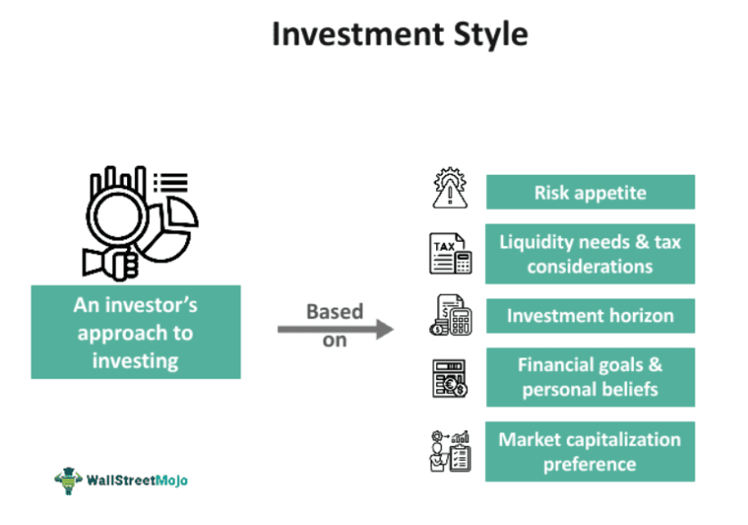

Investment strategies have undergone significant transformations with the advent of sophisticated technologies. Traditional methods have been supplemented by data-driven approaches, and the introduction of algorithms has brought automation and precision to financial planning. The fusion of technology and finance not only enhances decision-making but also allows for personalized and adaptive investment strategies that cater to individual needs and goals.

Understanding the core elements of investment, such as factors, styles, and the mechanics of algorithmic trading, is vital for today's investors. A robust strategy takes into account various economic indicators, market trends, and individual risk tolerance to optimize performance and mitigate potential risks. This comprehensive grasp aids in designing diversified portfolios that can withstand market volatility and capitalize on growth opportunities.



Algorithmic trading represents a major technological leap, allowing for rapid processing and execution of trades based on rules and models derived from historical data and statistical analysis. This minimizes human error and emotional decision-making, leading to more consistent investment outcomes.

This article will provide an in-depth exploration of these components to arm investors with the necessary insights and tools to refine their investment plans. By integrating the traditional fundamentals of investing with modern technological advancements, investors can better navigate the complexities of today's financial markets and work towards achieving their financial objectives.

## Table of Contents

## Understanding Investment Strategies

Investment strategies are essential components of financial planning, employed to achieve specific financial goals. These strategies require careful deliberation and customization, considering various factors, including risk tolerance and market conditions.

Investment approaches span a broad spectrum, ranging from conservative, risk-averse strategies to aggressive, high-risk ones. Conservative strategies typically focus on preserving capital and generating steady income. They often include investments in bonds, blue-chip stocks, and dividend-paying stocks, offering lower [volatility](/wiki/volatility-trading-strategies) and predictable returns. On the other hand, aggressive strategies seek higher returns by taking on more risk, typically involving investments in growth stocks, small-cap stocks, or sector-specific investments that have the potential for substantial appreciation.

The selection of an appropriate investment strategy necessitates a thorough analysis of an individual's financial situation, goals, and risk tolerance. Risk tolerance is a pivotal [factor](/wiki/factor-investing); it can be quantified through various methods, including risk assessment questionnaires and financial modeling. Investors with a high tolerance for risk may opt for strategies with significant exposure to equities or alternative assets, whereas those with a lower risk threshold may prefer fixed-income securities or balanced portfolios.

Market analysis plays a crucial role in shaping investment strategies to meet individual needs. Fundamental analysis involves examining economic indicators, corporate financial statements, and industry trends to evaluate an asset's intrinsic value. Technical analysis, on the other hand, relies on historical price and [volume](/wiki/volume-trading-strategy) data to forecast future price movements. Both forms of analysis can guide investors in identifying optimal entry and [exit](/wiki/exit-strategy) points, informing strategy adjustments based on market dynamics.

Investor objectives can vary widely, from wealth accumulation and capital preservation to income generation and tax efficiency. A young investor with a long investment horizon might prioritize growth-oriented strategies, while a retiree could focus on income generation and capital preservation. Thus, tailoring strategies to specific needs involves aligning investment decisions with the investor’s time horizon, tax situation, and unique financial goals. 

Ultimately, a successful investment strategy involves continuous monitoring and periodic reassessment to ensure alignment with changing financial conditions and objectives. This adaptability enables investors to navigate market fluctuations and capitalize on emerging opportunities, thus enhancing the likelihood of achieving their financial goals.

## Key Investment Factors

Investment decisions are shaped by a multitude of factors, each carrying significant weight in determining financial outcomes. Economic indicators, market trends, and risk tolerance are some of the core elements influencing these decisions.

Economic indicators, such as GDP growth rates, unemployment rates, inflation, and interest rates, provide insights into the overall health and direction of an economy. For instance, higher GDP growth rates may signal economic expansion, potentially leading to increased corporate profits and stock market gains. Conversely, high inflation rates can erode purchasing power, influencing central banks to adjust interest rates, which can affect investment returns.

Market trends, including bull and bear market cycles, sector performance, and technological innovations, also guide investment strategies. Investors often rely on trend analysis to forecast potential market movements and align their strategies accordingly. For example, during a bull market, investors might lean towards equities, anticipating continued growth, while in a bear market, they may seek safe-haven assets like bonds or gold.

Risk tolerance, a pivotal personal factor, dictates an investor's appetite for risk and subsequently their investment approach. This can range from conservative strategies focusing on capital preservation to aggressive strategies seeking high returns, albeit with greater risk. A high-risk tolerance might lead an investor to allocate a larger portion of their portfolio to high-[growth stocks](/wiki/growth-stocks), whereas a risk-averse individual might prefer bonds or dividend-paying stocks.

Diversification plays a crucial role in mitigating risks associated with investment decisions. By spreading investments across various asset classes, sectors, and geographic regions, investors can reduce the impact of any single asset's poor performance on their overall portfolio. For example, a diversified portfolio might include stocks, bonds, real estate, and commodities to balance risk and return.

Evaluating investment performance is essential for understanding whether financial goals are being met and for making informed future decisions. This involves tracking performance through benchmarks, such as stock indices or bond yields, and utilizing assessment frameworks. Techniques such as the Sharpe Ratio can be used to measure risk-adjusted returns, helping investors evaluate the effectiveness of their strategies. Python libraries such as pandas and NumPy can assist in analyzing large datasets and calculating key performance metrics.

```python
import pandas as pd
import numpy as np

# Example of calculating Sharpe Ratio
returns = np.array([0.05, 0.1, 0.02, -0.02, 0.04])  # Example portfolio returns
risk_free_rate = 0.01  # Example risk-free rate
excess_returns = returns - risk_free_rate
sharpe_ratio = np.mean(excess_returns) / np.std(excess_returns)

print(f"Sharpe Ratio: {sharpe_ratio:.2f}")
```

By understanding these key investment factors and leveraging technologies for performance evaluation, investors can better navigate the complex landscape of financial markets and optimize their investment outcomes.

## Investment Styles: Growth vs. Value

In the field of investments, two predominant styles are growth and value investing. These styles reflect different philosophies and criteria for selecting stocks, driven by diverse market conditions and investor objectives.

### Differentiating Between Growth and Value Investment Styles

Growth investing focuses on identifying companies that are anticipated to grow at an above-average rate compared to their industry or the overall market. Investors in this category prioritize companies expected to deliver significant future earnings, often reinvesting profits to boost innovation and expansion. Indicators typically assessed include revenue growth rates, profit margins, and earnings per share. The premise is that the stock price will rise as the company continues to grow, allowing investors to realize capital gains. Growth stocks, however, can be more volatile and present a higher risk if the company fails to meet growth expectations.

Value investing, conversely, involves seeking stocks that appear undervalued based on [fundamental analysis](/wiki/fundamental-analysis). Investors using this strategy look for price anomalies where the current stock price does not fully reflect the true intrinsic value, often due to market overreactions or temporary setbacks. Key metrics for value investing include the price-to-earnings ratio (P/E), price-to-book ratio (P/B), and dividend yield. Investors with a value approach aim to purchase these stocks at a discounted price and wait for the market to adjust, thereby profiting from the price correction.

### How Market Conditions Influence an Investor's Choice

Market conditions substantially impact whether investors favor growth or value investing. In bullish markets, characterized by economic expansion and investor optimism, growth stocks often outperform as investors are willing to pay more for prospective earnings. Low-interest rates and high [liquidity](/wiki/liquidity-risk-premium) levels further nurture the appetite for growth stocks by reducing the cost of borrowing, enabling companies to finance new ventures at lower costs.

During bearish markets or periods of economic uncertainty, investors may gravitate towards value investing. The rationale is that value stocks often represent more stable, established companies with a higher probability of weathering economic slowdowns. Additionally, these stocks may offer dividends, providing investors with a steady income stream regardless of market fluctuations.

### Real-World Applications and Examples

An example of growth investing is an investor purchasing stock in a tech company that is on the brink of releasing innovative products or entering new markets, anticipating substantial growth fuelled by advancements and market expansion.

In contrast, value investing can be exemplified by investing in a mature manufacturing company experiencing temporary setbacks such as supply chain issues. The investor believes the company is fundamentally sound, and once challenges are resolved, stock prices should realign with intrinsic value.

Notable historical figures, such as Warren Buffett, have famously advocated for value investing, whereas aggressive funds like the ARK Innovation [ETF](/wiki/etf-trading-strategies) often reflect growth investment principles by focusing on technology and innovation-driven companies.

In summary, while growth and value investing are distinct in their evaluation criteria and risk profiles, both styles offer unique opportunities tailored to specific market conditions and investor objectives. A strategic blend of both can optimize portfolio performance, adapting to evolving market dynamics.

## Algorithmic Trading: An Overview

Algorithmic trading, also known as algo trading, refers to the use of computer algorithms to execute trading orders in financial markets. These algorithms are pre-programmed with specific instructions which can account for variables such as timing, price, and volume to make trading decisions at a speed and frequency that is often impossible for a human trader.

A critical advantage of [algorithmic trading](/wiki/algorithmic-trading) is its ability to minimize human error and emotional responses. Traditional trading can be significantly affected by traders' emotional biases, leading to suboptimal decision-making. By utilizing algorithmic systems, trading can be executed based on data-driven decisions devoid of emotional interference, leading to more consistent and potentially profitable outcomes.

Moreover, algorithmic trading offers several benefits, including speed, accuracy, and cost reduction. Since algorithms scan various market indicators in real-time, they are capable of executing trades within milliseconds of favorable market conditions arising. This speed reduces the impact of market movement on trades, increasing the likelihood of executing at desired prices. Increased accuracy in trading is achieved as algorithms precisely follow defined criteria, ensuring trades align closely with the investor's strategic goals.

However, algorithmic trading is not without its challenges. The complexity of developing a robust algorithm poses a significant barrier. Algorithms must be meticulously designed to ensure they perform effectively across a variety of market conditions. Bugs or errors in the code may lead to substantial financial losses, as seen in infamous trading incidents such as the "Flash Crash" of 2010 [1]. Additionally, algo trading systems require high-level technical infrastructure, involving advanced hardware and software that can handle high-frequency trading demands.

In conclusion, while algorithmic trading presents significant advantages in speed, precision, and emotion-free trading, it also introduces challenges that require careful consideration and sophisticated technical solutions.

**References:**

[1] Kirilenko, Andrei A., et al. "The flash crash: The impact of high frequency trading on an electronic market." *SSRN Electronic Journal* (2014).

## Popular Algorithmic Trading Strategies

Algorithmic trading strategies have redefined how financial markets operate by leveraging technology to make precise and rapid trading decisions. Among the myriad of strategies employed, two of the most widely utilized are trend-following and mean reversion. Both strategies capitalize on different market conditions and rely heavily on algorithmic processes to enhance trading efficacy.

### Trend-Following Strategies

Trend-following strategies aim to capitalize on established market trends. The fundamental principle is that assets exhibiting a particular trend are likely to continue moving in the same direction. Traders use various indicators, such as moving averages and the relative strength index (RSI), to identify and confirm these trends. The algorithms are designed to generate buy or sell signals based on predefined criteria, such as when a short-term moving average crosses above a long-term moving average, indicating a bullish trend.

For example, a simple moving average crossover strategy in Python might look like this:

```python
def moving_average(data, window):
    return data.rolling(window=window).mean()

def trend_following(data, short_window, long_window):
    short_ma = moving_average(data['Close'], short_window)
    long_ma = moving_average(data['Close'], long_window)
    signals = pd.DataFrame(index=data.index)
    signals['signal'] = 0.0
    signals['signal'][short_window:] = np.where(short_ma[short_window:] > long_ma[short_window:], 1.0, 0.0)
    signals['positions'] = signals['signal'].diff()
    return signals
```

### Mean Reversion Strategies

In contrast, mean reversion strategies operate on the premise that prices will revert to their historical mean over time. This approach is based on the statistical analysis of a security’s pricing history. Algorithms for mean reversion might use Bollinger Bands or the Z-score to identify securities that have deviated significantly from their average value, suggesting a forthcoming correction.

A basic mean reversion strategy might involve calculating the Z-score of a stock’s price to decide when it is overbought or oversold:

```python
def z_score(price, window):
    mean = price.rolling(window=window).mean()
    std_dev = price.rolling(window=window).std()
    z = (price - mean) / std_dev
    return z

def mean_reversion_strategy(data, window, threshold):
    z = z_score(data['Close'], window)
    signals = pd.DataFrame(index=data.index)
    signals['signal'] = 0.0
    signals['signal'] = np.where(z < -threshold, 1.0, 0.0)
    signals['signal'] = np.where(z > threshold, -1.0, signals['signal'])
    signals['positions'] = signals['signal'].diff()
    return signals
```

### Statistical Arbitrage and Sentiment Analysis

Statistical [arbitrage](/wiki/arbitrage) involves taking advantage of price differentials between related financial instruments, leveraging complex statistical models to forecast these opportunities. Often, this involves pairs trading, where algorithms identify and exploit discrepancies in the movements of two correlated securities.

Sentiment analysis, on the other hand, utilizes natural language processing (NLP) to gauge market sentiment by analyzing news articles, social media, and other textual sources. The insights derived from sentiment analysis can inform trading strategies, suggesting potential future price movements based on the perceived mood of the market.

### Technological Leverage in Algorithmic Trading

The efficiency and speed of these strategies are greatly enhanced by advanced technology. High-frequency trading ([HFT](/wiki/high-frequency-trading-strategies)) systems, for example, execute thousands of transactions in fractions of a second. This computational power not only allows for quick execution but also for the processing of vast amounts of data to identify patterns that would be indiscernible at human speed.

In conclusion, the integration of technology in trading has opened avenues for precision and rapid decision-making in financial markets. Trend-following and mean reversion strategies, alongside [statistical arbitrage](/wiki/statistical-arbitrage) and sentiment analysis, showcase the diverse capabilities of algorithmic trading systems. As technology continues to evolve, these strategies are likely to become even more refined, offering traders sophisticated tools to navigate market complexities.

## Algorithmic Trading: Technical Considerations

Setting up an algorithmic trading system requires a comprehensive understanding of the technical architecture involved. The implementation of such systems is founded on several critical elements that ensure precision, speed, and reliability in executing trades.

### Technical Requirements for Setting up an Algorithmic Trading System

#### Infrastructure and Hardware Considerations

A robust algorithmic trading setup mandates efficient hardware to handle data acquisition, processing, and execution promptly. High-frequency trading strategies demand low-latency connectivity to execute trades within milliseconds. This necessitates powerful servers with high processing speeds, low latency network connections, preferably co-located with exchange servers, and redundant systems to ensure continuity and reduce downtime.

#### Software and Database Management

The software structure encompasses trading platforms, integrated development environments (IDEs), and database management systems (DBMS). Trading platforms facilitate market data acquisition, strategy execution, and trade reporting. Commonly used platforms include MetaTrader, QuantConnect, and Trading Technologies. Databases like MySQL, PostgreSQL, and MongoDB are employed for storing vast datasets and ensuring real-time data retrieval for strategy analysis and execution.

### Programming Languages Commonly Used for Developing Trading Algorithms

Programmers use various languages when developing trading algorithms, each with distinct advantages:

1. **Python**: Known for its simplicity and flexibility, Python offers extensive libraries like NumPy, pandas, and SciPy for numerical and data analysis tasks. Libraries such as TensorFlow and PyTorch further assist in developing machine learning models for more sophisticated trading strategies. Below is a basic example illustrating a moving average crossover strategy using Python:

```python
import pandas as pd

# Load market data
data = pd.read_csv('market_data.csv')

# Calculate moving averages
data['MA50'] = data['Close'].rolling(window=50).mean()
data['MA200'] = data['Close'].rolling(window=200).mean()

# Generate signals
data['Signal'] = 0
data['Signal'][data['MA50'] > data['MA200']] = 1  # Buy signal
data['Signal'][data['MA50'] < data['MA200']] = -1 # Sell signal

# Backtest strategy
data['Position'] = data['Signal'].shift()
data['Returns'] = data['Close'].pct_change()
data['Strategy_Returns'] = data['Returns'] * data['Position']

# Calculate cumulative returns
cumulative_returns = (data['Strategy_Returns'] + 1).cumprod()
```

2. **C++**: Preferred for its execution speed and performance, C++ is ideal for latency-sensitive applications. It provides the efficiency required for high-frequency trading systems where every millisecond counts.

3. **Java**: Valued for its portability and robustness, Java is commonly used for developing complex trading systems that require a high degree of scalability and integration across diverse IT environments.

### Backtesting and Implementing Algorithms in Live Market Scenarios

Backtesting is a crucial stage in the development of trading algorithms. It involves evaluating a strategy using historical data to ascertain its effectiveness before deploying it in live markets. Accurate [backtesting](/wiki/backtesting) requires access to clean and comprehensive historical data, reliable metrics for performance evaluation, and tools to simulate trading as realistically as possible.

Key metrics to monitor during backtesting include:

- **Sharpe Ratio**: \[ \text{Sharpe Ratio} = \frac{R_p - R_f}{\sigma_p}
$$

  where $R_p$ is the expected portfolio return, $R_f$ is the risk-free rate, and $\sigma_p$ is the portfolio standard deviation.

- **Maximum Drawdown**: Assesses the largest drop from a peak to a trough in the value of the portfolio, offering insights into risk management.

Once a strategy is backtested and optimized, deploying it in live market environments requires continuous monitoring to ensure performance aligns with expectations. Real-time adjustments may be necessary due to changes in market conditions, requiring flexible and adaptive algorithmic strategies.

In conclusion, developing an algorithmic trading system is a multi-faceted process that blends hardware and software proficiency with programming acumen and rigorous testing, setting the foundation for precise and effective trading operations.

## Conclusion

Integrating traditional investment strategies with modern trading technologies represents a crucial evolution in the financial sector, enabling investors to harness the strengths of both approaches. While traditional strategies provide a solid foundation rooted in long-standing financial principles, modern technologies offer enhanced capabilities in data analysis, processing speed, and precision. By embracing both, investors can mitigate risks while taking advantage of novel opportunities in increasingly complex markets.

Adapting to changing market dynamics necessitates a mixed approach that combines the stability of conventional investment strategies with the agility and speed of algorithmic trading. Traditional strategies, such as value and growth investing, allow for a detailed analysis of an asset’s underlying economic fundamentals. When supplemented with algorithmic trading, which can quickly respond to market signals and inefficiencies, an investor's toolkit is significantly strengthened. Algorithmic trading reduces human error and emotional biases, providing a level of discipline and consistency that is difficult to achieve manually.

For optimizing investment outcomes, integrating strategies across a broad spectrum can offer enhanced flexibility and resilience. An investor might follow a core investment principle such as diversification, while employing algorithmic systems to execute trades that capitalize on short-term market volatilities. This synergy not only improves the chances of achieving favorable returns but also prepares the portfolio for unforeseen market shifts. Backtesting and real-time data analysis become critical components here, allowing investors to refine their algorithms and strategies continually.

Ultimately, the successful combination of traditional and modern approaches requires a balance—leveraging the analytical insights from both worlds. An informed and adaptive stance can help investors navigate the ever-evolving landscape of financial markets, better optimizing their strategies to meet individual goals and preferences. By remaining open to innovation while maintaining a strong grounding in established financial theories, investors can enhance their ability to achieve consistent, long-term success.

## References & Further Reading

[1]: Kirilenko, Andrei A., et al. "The flash crash: The impact of high frequency trading on an electronic market." *SSRN Electronic Journal* (2014).

[2]: Bergstra, J., Bardenet, R., Bengio, Y., & Kégl, B. (2011). ["Algorithms for Hyper-Parameter Optimization."](https://dl.acm.org/doi/10.5555/2986459.2986743) Advances in Neural Information Processing Systems 24.

[3]: ["Advances in Financial Machine Learning"](https://www.amazon.com/Advances-Financial-Machine-Learning-Marcos/dp/1119482089) by Marcos Lopez de Prado

[4]: ["Evidence-Based Technical Analysis: Applying the Scientific Method and Statistical Inference to Trading Signals"](https://www.amazon.com/Evidence-Based-Technical-Analysis-Scientific-Statistical/dp/0470008741) by David Aronson

[5]: ["Machine Learning for Algorithmic Trading"](https://github.com/stefan-jansen/machine-learning-for-trading) by Stefan Jansen

[6]: ["Quantitative Trading: How to Build Your Own Algorithmic Trading Business"](https://www.amazon.com/Quantitative-Trading-Build-Algorithmic-Business/dp/1119800064) by Ernest P. Chan