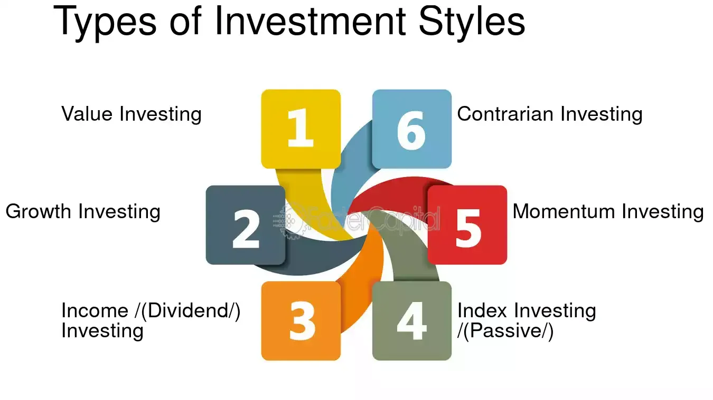

## Table of Contents

## What is an investment style?

An investment style is a way that people choose to invest their money. It's like a plan or a method that investors use to decide where to put their money. There are many different styles, and each one depends on things like how much risk someone is willing to take, how long they want to keep their money invested, and what they hope to achieve with their investments.

Some common investment styles include growth investing, where people look for companies that are expected to grow quickly, and value investing, where people look for companies that they think are underpriced. Other styles might focus on income, trying to get regular payments from investments, or on socially responsible investing, where people choose investments based on their personal values and ethics. Each style has its own set of rules and strategies, and what works best can depend a lot on an individual's goals and situation.

## What are the main types of investment styles?

Investment styles are different ways people choose to invest their money. Some common styles include growth investing, value investing, and income investing. Growth investing is when people look for companies that are expected to grow fast. They want their money to grow quickly too. Value investing is different. Here, people look for companies that they think are a good deal, like buying something on sale. They believe these companies are worth more than their current price. Income investing is about getting regular payments, like dividends from stocks or interest from bonds. People who use this style want a steady flow of money from their investments.

Another style is socially responsible investing, where people choose investments based on their personal values and ethics. They might avoid companies that harm the environment or that don't treat workers well. Instead, they look for companies that do good things, like using clean energy or supporting fair labor practices. Lastly, there's also passive investing, where people put their money in funds that track a market index, like the S&P 500. This style is about keeping things simple and not trying to beat the market, just keeping up with it. Each style has its own way of working, and what's best depends on what someone wants to achieve with their money.

## How does a value investing style work?

Value investing is a style where people look for companies that they think are a good deal. They believe these companies are worth more than what they are currently selling for. It's like finding a bargain at a store. Investors using this style look at things like the price of a stock compared to the company's earnings, or the price compared to the company's book value. If these numbers show that a stock is cheaper than it should be, a value investor might decide to buy it.

The goal of value investing is to buy these underpriced stocks and hold onto them until their true value is recognized by the market. This can take time, sometimes years, so value investors need to be patient. They believe that eventually, the market will see the real worth of these companies, and the stock price will go up. When that happens, they can sell their shares for a profit. This style can be less risky than others because it focuses on finding solid companies at a lower price, but it still needs careful research and a long-term approach.

## What is growth investing and who should consider it?

Growth investing is when people look for companies that are expected to grow fast. They want their money to grow quickly too. These investors focus on companies that are doing well and are likely to keep doing well. They might look at things like how fast a company's earnings are growing or how much the company is expanding. Stocks of these companies often have high prices compared to their current earnings, but growth investors believe the future growth will make up for it.

People who should consider growth investing are those who are okay with taking more risk. This style can lead to big gains, but it can also lead to big losses if the companies don't grow as expected. It's good for people who can handle ups and downs in the market and who are looking to invest for the long term. If you're someone who wants to see your money grow quickly and you're willing to wait for it, growth investing might be right for you.

## Can you explain the concept of income investing?

Income investing is when people put their money into things that give them regular payments. These payments can come from dividends on stocks or interest from bonds. People who use this style want to get a steady flow of money from their investments. It's like getting a paycheck from your investments, which can be really helpful if you need money regularly, like when you're retired.

This style is good for people who want to make their money last a long time. They might not be looking to grow their money quickly, but they want to make sure they have enough coming in to cover their costs. Income investing can be less risky than other styles because it focuses on getting regular payments instead of hoping for big gains. But, it's still important to choose the right investments to make sure the income keeps coming in.

## What are the risks associated with momentum investing?

Momentum investing is when people buy stocks that have been going up in price and hope they keep going up. The main risk is that the price might suddenly stop going up and start going down instead. This can happen fast, and if it does, people who bought the stock at a high price can lose a lot of money. It's like trying to catch a falling knife; it can be dangerous if you're not careful.

Another risk is that [momentum](/wiki/momentum) investing can lead to buying stocks that are overpriced. Just because a stock has been going up doesn't mean it's a good deal. If the price is too high compared to what the company is really worth, it might fall back down to a more normal level. This can hurt investors who bought in at the peak. It's important to do research and not just follow the crowd, because sometimes the crowd can be wrong.

## How does a contrarian investment style differ from others?

A contrarian investment style is different because it goes against what most people are doing. While other investors might be buying stocks that are popular and going up in price, contrarians look for stocks that are unpopular and going down. They believe that these stocks are being ignored or misunderstood by the market, and that they will eventually go back up in value. It's like finding a hidden gem that others have overlooked.

Contrarians need to be patient and willing to take risks. They might have to wait a long time for their investments to pay off, and there's a chance that the stocks they pick never recover. This style can be risky because it goes against the crowd, but it can also lead to big rewards if the contrarian is right about a stock's true value. It's not for everyone, but for those who are willing to think differently, it can be a way to find great opportunities that others miss.

## What role does a socially responsible investing style play in portfolio management?

Socially responsible investing, or SRI, is a style where people choose investments based on their personal values and ethics. In portfolio management, this means [picking](/wiki/asset-class-picking) stocks, bonds, or funds that match what the investor cares about. For example, someone might avoid companies that harm the environment or that don't treat workers well. Instead, they might look for companies that do good things, like using clean energy or supporting fair labor practices. This way, the investor can feel good about where their money is going and still try to make a profit.

Adding SRI to a portfolio can also help spread out risk. By focusing on companies that are doing good things, investors might find opportunities in growing industries like renewable energy or sustainable products. This can make the portfolio stronger because it's not just about making money, but also about supporting positive changes in the world. However, it's important to remember that SRI still needs careful research and planning to make sure it fits with the investor's overall goals and risk level.

## How can one assess the suitability of different investment styles for their portfolio?

To figure out which investment style is right for your portfolio, you need to think about what you want to achieve with your money. Are you looking to grow your money quickly, or do you need a steady income? How much risk are you willing to take? For example, if you want your money to grow fast and you're okay with taking more risk, growth investing might be a good fit. But if you need regular payments to live on, income investing could be better. It's also important to think about how long you plan to keep your money invested. Some styles, like value investing, need a lot of patience because it can take years for the market to recognize a company's true value.

Another thing to consider is your personal values and how they fit with your investments. If you care a lot about the environment or social issues, socially responsible investing might be the way to go. This style lets you put your money into companies that match your beliefs. Also, think about how much time and effort you want to put into managing your investments. If you don't want to spend a lot of time researching, passive investing, where you just follow a market index, might be easier. The key is to match your investment style with your goals, risk tolerance, and personal values to build a portfolio that works for you.

## What advanced metrics should be considered when evaluating the performance of different investment styles?

When you want to see how well different investment styles are doing, you need to look at some advanced numbers. One important number is the Sharpe Ratio. It tells you how much extra return you're getting for the risk you're taking. A higher Sharpe Ratio means the investment is doing a good job of balancing risk and reward. Another number to look at is the Sortino Ratio, which is similar to the Sharpe Ratio but focuses only on the bad kind of risk, the risk of losing money. This can be really helpful because it shows how well an investment protects you from big drops in value.

You should also consider the Alpha and Beta of an investment. Alpha shows how much better or worse an investment is doing compared to a benchmark, like the S&P 500. A positive Alpha means the investment is beating the market, while a negative Alpha means it's not doing as well. Beta tells you how much the investment moves with the market. A Beta higher than 1 means the investment goes up and down more than the market, which can be riskier. A Beta lower than 1 means it's less risky because it doesn't move as much. By looking at these numbers, you can get a better idea of how different investment styles are performing and which ones might be right for you.

## How do macroeconomic factors influence the choice of investment styles?

Macroeconomic factors, like how the economy is doing or what interest rates are, can really change which investment style you might want to use. If the economy is growing fast, growth investing might be a good choice because companies are likely to do well and their stock prices might go up a lot. But if the economy is slowing down or in a recession, value investing could be better because you might find good companies at lower prices that will do well when the economy gets better. Also, if interest rates are low, income investing might not give you as much money as you need, so you might look at other styles to grow your money faster.

Another important thing to think about is inflation. If prices are going up a lot, you need to make sure your investments are growing faster than inflation so your money doesn't lose value. In times of high inflation, growth investing might be good because companies that can raise their prices can keep up with inflation. But if inflation is low, income investing might be more attractive because the regular payments you get can be more valuable. So, keeping an eye on these big economic changes can help you pick the right investment style for your money.

## What are the latest trends in investment styles and how are they impacting traditional approaches?

Lately, more people are getting into something called [ESG](/wiki/esg-investing) investing, which stands for Environmental, Social, and Governance. This means they pick investments based on how good a company is for the planet, how it treats people, and how well it's run. This trend is changing how people invest because it's not just about making money anymore. It's also about making the world a better place. Because of this, even big investors like pension funds are starting to care more about ESG factors, which is making traditional investment styles like value or growth investing pay more attention to these things too.

Another big trend is the rise of technology in investing, like using robots to pick stocks or using big data to find the best investments. This is called quantitative investing or "quant" investing. It's making things faster and more based on numbers than on people's guesses. This is shaking up traditional ways of investing because now, even people who used to pick stocks by hand are starting to use computers to help them. It's making investing more scientific and less about gut feelings, which is changing how everyone from big banks to small investors think about their money.

## References & Further Reading

[1]: Bergstra, J., Bardenet, R., Bengio, Y., & Kégl, B. (2011). ["Algorithms for Hyper-Parameter Optimization."](https://papers.nips.cc/paper/4443-algorithms-for-hyper-parameter-optimization) Advances in Neural Information Processing Systems 24.

[2]: ["Advances in Financial Machine Learning"](https://www.amazon.com/Advances-Financial-Machine-Learning-Marcos/dp/1119482089) by Marcos Lopez de Prado

[3]: ["Evidence-Based Technical Analysis: Applying the Scientific Method and Statistical Inference to Trading Signals"](https://www.amazon.com/Evidence-Based-Technical-Analysis-Scientific-Statistical/dp/0470008741) by David Aronson

[4]: ["Machine Learning for Algorithmic Trading"](https://github.com/stefan-jansen/machine-learning-for-trading) by Stefan Jansen

[5]: ["Quantitative Trading: How to Build Your Own Algorithmic Trading Business"](https://www.amazon.com/Quantitative-Trading-Build-Algorithmic-Business/dp/1119800064) by Ernest P. Chan